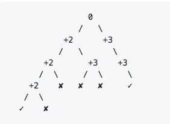

---
toc:
  depth_from: 1
  depth_to: 3
  ordered: false
---

# 数据结构和算法基础 part1 {ignore=true}

[TOC]

## 基础数据结构和算法

### 指针

#### 排序数组和为 0

从一个已经排序的数组中查找出两个数，使它们的和为 0

`leetcode 167`

```java
public int[] twoSum(int[] numbers, int target) {
    int i = 0, j = numbers.length - 1;
    while (i < j) {
        int sum = numbers[i] + numbers[j];
        if (sum == target) return new int[]{i + 1, j + 1};
        else if (sum < target) i++;
        else j--;
    }
    return null;
}
```

### 链表

链表的增，删，改，查，链表反转，复杂链表的复制，检测环

<h3 style="color: inherit;line-height: inherit;margin-top: 1.6em;margin-bottom: 1.6em;font-weight: bold;border-bottom: 2px solid rgb(239, 112, 96);font-size: 1.3em;"><span style="font-size: inherit;line-height: inherit;display: inline-block;font-weight: normal;background: rgb(239, 112, 96);color: rgb(255, 255, 255);padding: 3px 10px 1px;border-top-right-radius: 3px;border-top-left-radius: 3px;margin-right: 3px;">题目描述</span>
</h3>

#### 单链表反转

`leetcode 206`

```java
public ListNode reverseList(ListNode head) {
    if(null == head || null == head.next ) return head;
    ListNode newHead = head;
    while(head != null){
        ListNode next = head.next;
        head.next = newHead;
        newHead = head;
        head = nextNode;
    }
    return

```

**递归版本**

#### 判断链表是否存在环

`leetcode 141`
这个比较熟悉了

```java
public boolean hasCycle(ListNode head){
    if(null == head) return false;
    ListNode l1 = head, l2 = head.next;
    while(null != l1 && null != l2){
        if(l1 == l2) return true;
        l1 = l1.next;
        if(l2.next == null) break;
        l2 = l2.next.next;
    }
    return false;
}
```

#### 求两个链表的交点

`leetcode 160`

要求：时间复杂度为 O(n) 空间复杂度为 O(1)

设 A 的长度为 a + c，B 的长度为 b + c，其中 c 为尾部公共部分长度，可知 a + c + b = b + c + a。

当访问 A 链表的指针访问到链表尾部时，令它从链表 B 的头部开始访问链表 B；同样地，当访问 B 链表的指针访问到链表尾部时，令它从链表 A 的头部开始访问链表 A。这样就能控制访问 A 和 B 两个链表的指针能同时访问到交点。

```java
public ListNode getIntersectionNode(ListNode headA, ListNode headB) {
    if(headA == null || headB == null) return null;
    ListNode l1 = headA, l2 = headB;
    while(l1 != l2){
        l1 = (l1 == null) ? headB : l1.next;
        l2 = (l2 == null) ? headA : l2.next;
    }
    return l1;
}
```

#### 判断两个链表是否有交点

有两种解法：把第一个链表的结尾连接到第二个链表的开头，看第二个链表是否存在环；或者直接比较第一个链表最后一个节点和第二个链表最后一个节点是否相同。

#### 归并两个有序的链表

`leetcode 21`

```java
public ListNode mergeTwoLists(ListNode l1, ListNode l2){
    if(null == l1) return l2;
    if(null == l2) return l1;
    ListNode newHead = null;
    if(l1.val < l2.val){
        newHead = l1;
        newHead.next = mergeTwoLists(l1.next, l2);
    }else{
        newHead = l2;
        newHead.next = mergeTwoLists(l1. l2.next);
    }
    return newHead;
}
```

#### 从有序链表中删除重复节点

#### 逆序打印链表

```java
public ArrayList<Integer> printListFromTailToHead(ListNode listNode) {
    ArrayList<Integer> ret = new ArrayList<>();
    if (listNode != null) {
        ret.addAll(printListFromTailToHead(listNode.next));
        ret.add(listNode.val);
    }
    return ret;
}
```

#### 链表排序

给定一个乱序的链表，现在有一个操作：可以把链表任意位置的值移动到链表的最后。求链表排序所需要的最少操作次数。 样例： 假如链表的值为：5 1 2 3 那么最少的操作次数为 1，直接把 5 移到最后即可，输出为 1. 再比如 链表值为 5 2 1 3 ，那么应该先把 2 移到最后，再把 3 移到最后，再把 5 移到最后，这样输出的结果为 3.

### 搜索

度优先搜索和广度优先搜索广泛运用于树和图中，但是它们的应用远远不止如此。

从一个节点出发，使用 DFS 对一个图进行遍历时，能够遍历到的节点都是从初始节点可达的，DFS 常用来求解这种 **可达性** 问题。

**Backtracking**
回溯是 DFS 的一种，它不是用在遍历图的节点上，而是用于求解 _排列组合_ 问题，例如有 { 'a','b','c' } 三个字符，求解所有由这三个字符排列得到的字符串。

#### 查找最大岛屿面积

`leetcode 695`

思路比较简单: 对每个格点，递归计算出该点能得到的最大岛屿面积，记录最大值

```java
class Solution {
    public int maxAreaOfIsland(int[][] grid) {
        int m = grid.length, n = grid[0].length;
        int ret = 0;
        for (int i = 0; i < m; i++) {
            for (int j = 0; j < n; j++) {
                ret = Math.max(ret, maxAreaOfGrid(grid, i, j));
            }
        }
        return ret;
    }

    private int maxAreaOfGrid(int[][] grid, int i, int j) {
        int m = grid.length, n = grid[0].length;
        if (i < 0 || i >= m || j < 0 || j >= n)
            return 0;
        if (grid[i][j] == 0)
            return 0;
        grid[i][j] = 0;
        int ret = 0;
        ret = 1 + maxAreaOfGrid(grid, i - 1, j) + maxAreaOfGrid(grid, i + 1, j) + maxAreaOfGrid(grid, i, j - 1)
                + maxAreaOfGrid(grid, i, j + 1);
        return ret;
    }
}
```

注意：当前点访问过之后置位 0，因为已经计算过了。

#### 岛屿数量

`leetcode 200`
矩阵中的连通区域数量

和上面的最大岛屿面积比较相似

```java
class Solution {

    private int m, n;

    public int numIslands(char[][] grid) {
        if (null == grid || grid.length == 0)
            return 0;
        m = grid.length;
        n = grid[0].length;
        int ret = 0;
        for (int i = 0; i < m; i++) {
            for (int j = 0; j < n; j++) {
                if (grid[i][j] == '1') {
                    markTheIslands(grid, i, j);
                    ret++;
                }
            }
        }
        return ret;

    }

    private void markTheIslands(char[][] grid, int i, int j) {
        if (i < 0 || i >= m || j < 0 || j >= n || grid[i][j] == '0')
            return;
        grid[i][j] = '0';
        markTheIslands(grid, i, j - 1);
        markTheIslands(grid, i, j + 1);
        markTheIslands(grid, i - 1, j);
        markTheIslands(grid, i + 1, j);
    }
}
```

#### 填充封闭区域

`leetcode 130`


被围绕的区间不会存在于边界上，换句话说，任何边界上的 'O' 都不会被填充为 'X'。 任何不在边界上，或不与边界上的 'O' 相连的 'O' 最终都会被填充为 'X'

```java
class Solution {
    private int m, n;

    public void solve(char[][] board) {
        if (null == board || board.length == 0)
            return;
        m = board.length;
        n = board[0].length;
        for (int i = 0; i < m; i++) {
            dfs(board, i, 0);
            dfs(board, i, n - 1);
        }

        for (int j = 0; j < n; j++) {
            dfs(board, 0, j);
            dfs(board, m - 1, j);
        }

        for (int i = 0; i < m; i++) {
            for (int j = 0; j < n; j++) {
                if (board[i][j] == 'T')
                    board[i][j] = 'O';
                else if (board[i][j] == 'O')
                    board[i][j] = 'X';
            }

        }

    }

    private void dfs(char[][] board, int i, int j) {
        if (i < 0 || i >= m || j < 0 || j >= n || board[i][j] != 'O')
            return;
        board[i][j] = 'T';
        dfs(board, i - 1, j);
        dfs(board, i + 1, j);
        dfs(board, i, j - 1);
        dfs(board, i, j + 1);
    }
}
```

#### 太平洋大西洋水流问题

`leetcode 417`


```java
private int m, n;
private int[][] matrix;
private int[][] direction = {{0, 1}, {0, -1}, {1, 0}, {-1, 0}};

public List<int[]> pacificAtlantic(int[][] matrix) {
    List<int[]> ret = new ArrayList<>();
    if (matrix == null || matrix.length == 0) return ret;
    this.m = matrix.length;
    this.n = matrix[0].length;
    this.matrix = matrix;
    boolean[][] canReachP = new boolean[m][n];
    boolean[][] canReachA = new boolean[m][n];
    for (int i = 0; i < m; i++) {
        dfs(i, 0, canReachP);
        dfs(i, n - 1, canReachA);
    }
    for (int i = 0; i < n; i++) {
        dfs(0, i, canReachP);
        dfs(m - 1, i, canReachA);
    }
    for (int i = 0; i < m; i++) {
        for (int j = 0; j < n; j++) {
            if (canReachP[i][j] && canReachA[i][j]) {
                ret.add(new int[]{i, j});
            }
        }
    }
    return ret;
}

private void dfs(int r, int c, boolean[][] canReach) {
    if(canReach[r][c]) return;
    canReach[r][c] = true;
    for (int i = 0; i < direction.length; i++) {
        int nextR = direction[i][0] + r;
        int nextC = direction[i][1] + c;
        if (nextR < 0 || nextR >= m || nextC < 0 || nextC >= n
                || matrix[r][c] > matrix[nextR][nextC]) continue;
        dfs(nextR, nextC, canReach);
    }
}
```

#### N 皇后

`leetcode 51`

在 $n*n$ 的矩阵中摆放 $n$ 个皇后，并且每个皇后不能在同一行，同一列，同一对角线上，要求解所有的 $n$ 皇后解。

```java
private List<List<String>> ret;
private char[][] nQueens;
private boolean[] colUsed;
private boolean[] diagonals45Used;
private boolean[] diagonals135Used;
private int n;

public List<List<String>> solveNQueens(int n) {
    ret = new ArrayList<>();
    nQueens = new char[n][n];
    Arrays.fill(nQueens, '.');
    colUsed = new boolean[n];
    diagonals45Used = new boolean[2 * n - 1];
    diagonals135Used = new boolean[2 * n - 1];
    this.n = n;
    backstracking(0);
    return ret;
}

private void backstracking(int row) {
    if (row == n) {
        List<String> list = new ArrayList<>();
        for (char[] chars : nQueens) {
            list.add(new String(chars));
        }
        ret.add(list);
        return;
    }

    for (int col = 0; col < n; col++) {
        int diagonals45Idx = row + col;
        int diagonals135Idx = n - 1 - (row - col);
        if (colUsed[col] || diagonals45Used[diagonals45Idx] || diagonals135Used[diagonals135Idx]) {
            continue;
        }
        nQueens[row][col] = 'Q';
        colUsed[col] = diagonals45Used[diagonals45Idx] = diagonals135Used[diagonals135Idx] = true;
        backstracking(row + 1);
        colUsed[col] = diagonals45Used[diagonals45Idx] = diagonals135Used[diagonals135Idx] = false;
        nQueens[row][col] = '.';
    }
}
```

#### 电话号码的字母组合

`leetcode 17`

```java
private static final String[] KEYS = {"", "", "abc", "def", "ghi", "jkl", "mno", "pqrs", "tuv", "wxyz"};

public List<String> letterCombinations(String digits) {
    List<String> ret = new ArrayList<>();
    if (digits != null && digits.length() != 0) {
        combination("", digits, 0, ret);
    }
    return ret;
}

private void combination(String prefix, String digits, int offset, List<String> ret) {
    if (offset == digits.length()) {
        ret.add(prefix);
        return;
    }
    String letters = KEYS[digits.charAt(offset) - '0'];
    for (char c : letters.toCharArray()) {
        combination(prefix + c, digits, offset + 1, ret);
    }
}
```

#### 矩阵中搜索字符串

`leetcode 79`

```java
private static int[][] shift = {{1, 0}, {-1, 0}, {0, 1}, {0, -1}};
private static boolean[][] visited;
private int m;
private int n;

public boolean exist(char[][] board, String word) {
    if (word == null || word.length() == 0) return true;
    if (board == null || board.length == 0 || board[0].length == 0) return false;
    m = board.length;
    n = board[0].length;
    visited = new boolean[m][n];
    for (int i = 0; i < m; i++) {
        for (int j = 0; j < n; j++) {
            if (dfs(board, word, 0, i, j)) return true;
        }
    }
    return false;
}

private boolean dfs(char[][] board, String word, int start, int r, int c) {
    if (start == word.length()) {
        return true;
    }
    if (r < 0 || r >= m || c < 0 || c >= n || board[r][c] != word.charAt(start) ||  visited[r][c] ) {
        return false;
    }
    visited[r][c] = true;
    for (int i = 0; i < shift.length; i++) {
        int nextR = r + shift[i][0];
        int nextC = c + shift[i][1];
        if (dfs(board, word, start + 1, nextR, nextC)) return true;
    }
    visited[r][c] = false;
    return false;
}
```

#### IP 地址划分

`leetcode 93`

    Given "25525511135",
    return ["255.255.11.135", "255.255.111.35"].

```java
private List<String> ret;

public List<String> restoreIpAddresses(String s) {
    ret = new ArrayList<>();
    doRestore(0, "", s);
    return ret;
}

private void doRestore(int k, String path, String s) {
    if (k == 4 || s.length() == 0) {
        if (k == 4 && s.length() == 0) {
            ret.add(path);
        }
        return;
    }
    for (int i = 0; i < s.length() && i <= 2; i++) {
        if (i != 0 && s.charAt(0) == '0') break;
        String part = s.substring(0, i + 1);
        if (Integer.valueOf(part) <= 255) {
            doRestore(k + 1, path.length() != 0 ? path + "." + part : part, s.substring(i + 1));
        }
    }
}
```

#### 全排列

`leetcode 46`

```java
public List<List<Integer>> permute(int[] nums) {
    List<List<Integer>> ret = new ArrayList<>();
    List<Integer> permuteList = new ArrayList<>();
    boolean[] visited = new boolean[nums.length];
    backtracking(permuteList, visited, nums, ret);
    return ret;
}

private void backtracking(List<Integer> permuteList, boolean[] visited, int[] nums, List<List<Integer>> ret){
    if(permuteList.size() == nums.length){
        ret.add(new ArrayList(permuteList));
        return;
    }

    for(int i = 0; i < visited.length; i++){
        if(visited[i]) continue;
        visited[i] = true;
        permuteList.add(nums[i]);
        backtracking(permuteList, visited, nums, ret);
        permuteList.remove(permuteList.size() - 1);
        visited[i] = false;
    }
}
```

#### 含有相同元素的排列

`leetcode 47`

    [1,1,2] have the following unique permutations:
    [[1,1,2], [1,2,1], [2,1,1]]

题目描述：数组元素可能含有相同的元素，进行排列时就有可能出先重复的排列，要求重复的排列只返回一个。

在实现上，和 Permutations 不同的是要先排序，然后在添加一个元素时，判断这个元素是否等于前一个元素，如果等于，并且前一个元素还未访问，那么就跳过这个元素。

```java
public List<List<Integer>> permuteUnique(int[] nums) {
    List<List<Integer>> ret = new ArrayList<>();
    List<Integer> permuteList = new ArrayList<>();
    Arrays.sort(nums);
    boolean[] visited = new boolean[nums.length];
    backtracking(permuteList, visited, nums, ret);
    return ret;
}

private void backtracking(List<Integer> permuteList, boolean[] visited, int[] nums, List<List<Integer>> ret) {
    if (permuteList.size() == nums.length) {
        ret.add(new ArrayList(permuteList));
        return;
    }

    for (int i = 0; i < visited.length; i++) {
        if (i != 0 && nums[i] == nums[i - 1] && !visited[i - 1]) continue;
        if (visited[i]) continue;
        visited[i] = true;
        permuteList.add(nums[i]);
        backtracking(permuteList, visited, nums, ret);
        permuteList.remove(permuteList.size() - 1);
        visited[i] = false;
    }
}
```

#### 组合

`leetcode 77`

    If n = 4 and k = 2, a solution is:
    [
        [2,4],
        [3,4],
        [2,3],
        [1,2],
        [1,3],
        [1,4],
    ]

```java
public List<List<Integer>> combine(int n, int k) {
    List<List<Integer>> ret = new ArrayList<>();
    List<Integer> combineList = new ArrayList<>();
    backtracking(1, n, k, combineList, ret);
    return ret;
}

private void backtracking(int start, int n, int k, List<Integer> combineList, List<List<Integer>> ret){
    if(k == 0){
        ret.add(new ArrayList(combineList)); // 这里要重新构造一个 List
        return;
    }

    for(int i = start; i <= n - k + 1; i++){ // 剪枝

        combineList.add(i);                        // 把 i 标记为已访问
        backtracking(i + 1, n, k - 1, combineList, ret);
        combineList.remove(combineList.size() - 1); // 把 i 标记为未访问
    }
}
```

#### 组合求和

`leetcode 39`

    given candidate set [2, 3, 6, 7] and target 7,
    A solution set is:
    [[7],[2, 2, 3]]

```java
private List<List<Integer>> ret;

 public List<List<Integer>> combinationSum(int[] candidates, int target) {
     ret = new ArrayList<>();
     doCombination(candidates, target, 0, new ArrayList<>());
     return ret;
 }

 private void doCombination(int[] candidates, int target, int start, List<Integer> list) {
     if (target == 0) {
         ret.add(new ArrayList<>(list));
         return;
     }
     for (int i = start; i < candidates.length; i++) {
         if (candidates[i] <= target) {
             list.add(candidates[i]);
             doCombination(candidates, target - candidates[i], i, list);
             list.remove(list.size() - 1);
         }
     }
 }
```

#### 子集

`leetcode 78`

    找出集合的所有子集，子集不能重复，[1, 2] 和 [2, 1] 这种子集算重复

```java
private List<List<Integer>> ret;
private List<Integer> subsetList;

public List<List<Integer>> subsets(int[] nums) {
    ret = new ArrayList<>();
    subsetList = new ArrayList<>();
    for (int i = 0; i <= nums.length; i++) {
        backtracking(0, i, nums);
    }
    return ret;
}

private void backtracking(int startIdx, int size, int[] nums) {
    if (subsetList.size() == size) {
        ret.add(new ArrayList(subsetList));
        return;
    }

    for (int i = startIdx; i < nums.length; i++) {
        subsetList.add(nums[i]);
        backtracking(i + 1, size, nums); // startIdx 设为下一个元素，使 subset 中的元素都递增排序
        subsetList.remove(subsetList.size() - 1);
    }
}
```

#### 数独

`leetcode 37`

```java
private boolean[][] rowsUsed = new boolean[9][10];
private boolean[][] colsUsed = new boolean[9][10];
private boolean[][] cubesUsed = new boolean[9][10];
private char[][] board;

public void solveSudoku(char[][] board) {
    this.board = board;
    for (int i = 0; i < 9; i++) {
        for (int j = 0; j < 9; j++) {
            if (board[i][j] == '.') continue;
            int num = board[i][j] - '0';
            rowsUsed[i][num] = true;
            colsUsed[j][num] = true;
            cubesUsed[cubeNum(i, j)][num] = true;
        }
    }
    for (int i = 0; i < 9; i++) {
        for (int j = 0; j < 9; j++) {
            backtracking(i, j);
        }
    }
}

private boolean backtracking(int row, int col) {
    while (row < 9 && board[row][col] != '.') {
        row = col == 8 ? row + 1 : row;
        col = col == 8 ? 0 : col + 1;
    }
    if (row == 9) {
        return true;
    }
    for (int num = 1; num <= 9; num++) {
        if (rowsUsed[row][num] || colsUsed[col][num] || cubesUsed[cubeNum(row, col)][num]) continue;
        rowsUsed[row][num] = colsUsed[col][num] = cubesUsed[cubeNum(row, col)][num] = true;
        board[row][col] = (char) (num + '0');
        if (backtracking(row, col)) return true;
        board[row][col] = '.';
        rowsUsed[row][num] = colsUsed[col][num] = cubesUsed[cubeNum(row, col)][num] = false;
    }
    return false;
}

private int cubeNum(int i, int j) {
    int r = i / 3;
    int c = j / 3;
    return r * 3 + c;
}
```

### 矩阵

#### 有序矩阵搜索

     在一个二维数组中（每个一维数组的长度相同），每一行都按照从左到右递增的顺序排序，每一列都按照从上到下递增的顺序排序。
     请完成一个函数，输入这样的一个二维数组和一个整数，判断数组中是否含有该整数

由于二分查找需要在大小之间做出选择，因此需要参考数两侧大小分明，显然，从右上或者左下开始遍历查找是很快的。

```java
public boolean searchMatrix(int[][] matrix, int target) {
    if (matrix == null || matrix.length == 0 || matrix[0].length == 0) return false;
    int m = matrix.length, n = matrix[0].length;
    int row = 0, col = n - 1;
    while (row < m && col >= 0) {
        if (target == matrix[row][col]) return true;
        else if (target < matrix[row][col]) col--;
        else row++;
    }
    return false;
}
```

#### 有序矩阵的 Kth Element

二分查找解法

```java
public int kthSmallest(int[][] matrix, int k) {
    int m = matrix.length, n = matrix[0].length;
    int lo = matrix[0][0], hi = matrix[m - 1][n - 1];
    while(lo <= hi) {
        int mid = lo + (hi - lo) / 2;
        int cnt = 0;
        for(int i = 0; i < m; i++) {
            for(int j = 0; j < n && matrix[i][j] <= mid; j++) {
                cnt++;
            }
        }
        if(cnt < k) lo = mid + 1;
        else hi = mid - 1;
    }
    return lo;
}
```

### 树

> 树是一种递归结构，很多树的问题可以使用递归来处理

二叉查找树的缺点： 在极端情况下可能近似退化为一条链表，查找时间复杂度顿时变成了 O(n)。由此引入了平衡二叉树（AVL 树，每个节点的左子树和右子树的高度差至多等于 1），使得对于有 n 个节点的平衡树，最坏的查找时间复杂度也为 O(logn)。
然而，因为平衡树要求每个节点的左子树和右子树的高度差至多等于 1，这个要求实在是太严了，导致每次进行插入/删除节点的时候，几乎都会破坏平衡树的第二个规则，进而我们都需要通过左旋和右旋来进行调整，使之再次成为一颗符合要求的平衡树。

显然，如果在那种插入、删除很频繁的场景中，平衡树需要频繁着进行调整，这会使平衡树的性能大打折扣，为了解决这个问题，于是有了红黑树。

单单在查找方面的效率的话，平衡树比红黑树快。

红黑树是一种不大严格的平衡树。也可以说是一个折中方案。


#### AVL 树的调整

调整口诀

> 左左右旋，右右左旋。
> 左右先左变左左，然后右旋
> 右左先右变右右，然后左旋

#### 树的深度

```java

public int maxDepth(TreeNode root){
    if(null == root) return 0;
    return 1 + Math.max(maxDepth(root.left), maxDepth(root.right));
}
```

#### 树的翻转

```java
public TreeNode invertTree(TreeNode root){
    if(null == root) return null;
    TreeNode left = root.left; // 后面的操作会改变 left 指针，因此先保存下来
    root.left = invertTree(root.right);
    root.right = invertTree(left);
    return root;
}

```

#### 合并二叉树

`leetcode 617`
给定两个二叉树，想象当你将它们中的一个覆盖到另一个上时，两个二叉树的一些节点便会重叠。

你需要将他们合并为一个新的二叉树。合并的规则是如果两个节点重叠，那么将他们的值相加作为节点合并后的新值，否则不为  NULL 的节点将直接作为新二叉树的节点。

```java
public TreeNode mergeTrees(TreeNode t1, TreeNode t2) {
    if(t1 == null && t2 == null) return null;
    if(t1 == null) return t2;
    if(t2 == null) return t1;
    TreeNode root = new TreeNode(t1.val + t2.val);
    root.left = mergeTrees(t1.left, t2.left);
    root.right = mergeTrees(t1.right, t2.right);
    return root;
}
```

#### path sum

路径和定义为从 root 到 leaf 的所有节点的和

```java
public boolean hasPathSum(TreeNode root, int sum) {
    if(root == null) return false;
    if(root.left == null && root.right == null && root.val == sum) return true;
    return hasPathSum(root.left, sum - root.val) || hasPathSum(root.right, sum - root.val);
}
```

如果路径不一定以 root 开头并以 leaf 结尾，但是必须连续，如何求这样的路径的条数呢？

```java
public int pathSum(TreeNode root, int sum) {
    if(root == null) return 0;
    int ret = pathSumStartWithRoot(root, sum) + pathSum(root.left, sum) + pathSum(root.right, sum);
    return ret;
}

private int pathSumStartWithRoot(TreeNode root, int sum){
    if(root == null) return 0;
    int ret = 0;
    if(root.val == sum) ret++;
    ret += pathSumStartWithRoot(root.left, sum - root.val) + pathSumStartWithRoot(root.right, sum - root.val);
    return ret;
}
```

#### 判断树是否对称

```java
public boolean isSymmetric(TreeNode root) {
    if(root == null) return true;
    return isSymmetric(root.left, root.right);
}

private boolean isSymmetric(TreeNode t1, TreeNode t2){
    if(t1 == null && t2 == null) return true;
    if(t1 == null || t2 == null) return false;
    if(t1.val != t2.val) return false;
    return isSymmetric(t1.left, t2.right) && isSymmetric(t1.right, t2.left);
}
```

#### 树的遍历

1. 先序： 根-左-右
2. 中序： 左-根-右 （对搜索树，保序）
3. 后序： 左-右-根
4. 层次遍历: 宽度优先遍历

可见： **前中后序主要看的是 root！ 左右从来不颠倒**

前中后序都是用 DFS 实现，而层次遍历是用 BFS

对二叉树，仅有前序和后序遍历，不能确定一个二叉树，必须有中序遍历的结果!

例如，由后序和中序如下确定二叉树结构： 后序遍历的最后一个节点，必是根节点，由该根节点将中序序列分成两个子树，继续递归下去就能重建二叉树的结构

**DFS**

<div align="center">
    <figure align='center'>
        
        <figcaption>深度优先遍历</figcaption>
    </figure>
</div>

**BFS**

#### 非递归实现二叉树的前序遍历

栈

```java
public List<Integer> preorderTraversal(TreeNode root) {
    List<Integer> ret = new ArrayList<>();
    if (root == null) return ret;
    Stack<TreeNode> stack = new Stack<>();
    stack.push(root);
    while (!stack.isEmpty()) {
        TreeNode node = stack.pop();
        ret.add(node.val);
        if (node.right != null) stack.push(node.right);
        if (node.left != null) stack.push(node.left); // 先添加右子树再添加左子树，这样是为了让左子树在栈顶
    }
    return ret;
}
```

#### 非递归实现二叉树的后序遍历

后序遍历虽然不直接是前序遍历的反，不过也差不过了，因为

前序遍历为 root -> left -> right，后序遍历为 left -> right -> root，可以修改前序遍历成为 root -> right -> left，那么这个顺序就和后序遍历正好相反。

```java
public List<Integer> postorderTraversal(TreeNode root) {
    List<Integer> ret = new ArrayList<>();
    if (root == null) return ret;
    Stack<TreeNode> stack = new Stack<>();
    stack.push(root);
    while (!stack.isEmpty()) {
        TreeNode node = stack.pop();
        ret.add(node.val);
        if (node.left != null) stack.push(node.left);
        if (node.right != null) stack.push(node.right);
    }
    Collections.reverse(ret);
    return ret;
}
```

#### 二叉树的递归中序遍历

```java
void InOrderTraversal(BinTree BT)
{
    if(BT)
    {
        InOrderTraversal(BT->Left);
        printf("%d\n", BT->Data);
        InOrderTraversal(BT->Right);
    }
}
```

#### <font color=red>非递归实现二叉树的中序遍历</font>

```java
public List<Integer> inorderTraversal(TreeNode root) {
    List<Integer> ret = new ArrayList<>();
    Stack<TreeNode> stack = new Stack<>();
    TreeNode cur = root;
    while(cur != null || !stack.isEmpty()) {
        while(cur != null) { // 模拟递归栈的不断深入
            stack.add(cur);
            cur = cur.left;
        }
        TreeNode node = stack.pop();
        ret.add(node.val);
        cur = node.right;
    }
    return ret;
}
```

#### 二叉树的层平均值

```java
public List<Double> averageOfLevels(TreeNode root) {
    List<Double> ret = new ArrayList<>();
    if(root == null) return ret;
    Queue<TreeNode> queue = new LinkedList<>();
    queue.add(root);
    while(!queue.isEmpty()){
        int cnt = queue.size();
        double sum = 0;
        for(int i = 0; i < cnt; i++){
            TreeNode node = queue.poll();
            sum += node.val;
            if(node.left != null) queue.add(node.left);
            if(node.right != null) queue.add(node.right);
        }
        ret.add(sum / cnt);
    }
    return ret;
}
```

#### 找树左下角的值

最后一行最左边的值

层次遍历的时候，现将右侧的放进来，这样最后一个即为所求。

```java
public int findBottomLeftValue(TreeNode root) {
    Queue<TreeNode> queue = new LinkedList<>();
    queue.add(root);
    while(!queue.isEmpty()){
        root = queue.poll();
        if(root.right != null) queue.add(root.right);
        if(root.left != null) queue.add(root.left);
    }
    return root.val;
}
```

#### 二叉树中两节点的最近公共祖先

```java
public class Solution {
    public TreeNode lowestCommonAncestor(TreeNode root, TreeNode p, TreeNode q) {
        if(root == null || root == p || root == q)  return root;
        TreeNode left = lowestCommonAncestor(root.left, p, q);
        TreeNode right = lowestCommonAncestor(root.right, p, q);
        if(left != null && right != null)   return root;
        return left != null ? left : right;
    }
}

```

#### 二叉查找树 BST 中两节点的最近公共祖先

按照递归，只需判断这两个节点在哪一侧

```java
public TreeNode lowestCommonAncestor(TreeNode root, TreeNode p, TreeNode q) {
    if(root.val > p.val && root.val > q.val) return lowestCommonAncestor(root.left, p, q);
    if(root.val < p.val && root.val < q.val) return lowestCommonAncestor(root.right, p, q);
    return root;
}
```

#### 间隔遍历

`leetcode 337`

```java
public int rob(TreeNode root) {
    if (root == null) return 0;
    int val1 = root.val;
    if (root.left != null) {
        val1 += rob(root.left.left) + rob(root.left.right);
    }
    if (root.right != null) {
        val1 += rob(root.right.left) + rob(root.right.right);
    }
    int val2 = rob(root.left) + rob(root.right);
    return Math.max(val1, val2);
}

```

#### BST 的第 k 个元素

这个 k 如果比左边的元素数小，那第 k 小的元素必须在左边！

**递归解法**

```java
public int kthSmallest(TreeNode root, int k) {
    int leftCnt = count(root.left);
    if(leftCnt == k - 1) return root.val;
    if(leftCnt > k - 1) return kthSmallest(root.left, k);
    return kthSmallest(root.right, k - leftCnt - 1);
}

private int count(TreeNode node) {
    if(node == null) return 0;
    return 1 + count(node.left) + count(node.right);
}

```

#### 输出二叉树中所有从根到叶子的路径

`leetcode 257`


递归思路： 当遇到叶子节点的时候，就该写入这条路径了。非叶子节点，就是新增前缀，继续往下遍历。

```java
public List<String> binaryTreePaths(TreeNode root) {
    List<String> ret = new ArrayList();
    if(root == null) return ret;
    dfs(root, "", ret);
    return ret;
}

private void dfs(TreeNode root, String prefix, List<String> ret){
    if(root == null) return;
    if(root.left == null && root.right == null){
        ret.add(prefix + root.val);
        return;
    }
    prefix += (root.val + "->");
    dfs(root.left, prefix, ret);
    dfs(root.right, prefix, ret);
}
```

#### 二叉树中节点间的最大距离

定义"距离"为两节点之间边的个数

最大的距离有两种可能


情况 A: 路径经过左子树的最深节点，通过根节点，再到右子树的最深节点。
情况 B: 路径不穿过根节点，而是左子树或右子树的最大距离路径，取其大者。

```python
class Solution(object):
    def diameterOfBinaryTree(self, root):
        """
        :type root: TreeNode
        :rtype: int
        """
        if not root:
            return 0
        max_dia_left = self.diameterOfBinaryTree(root.left)
        max_dia_right = self.diameterOfBinaryTree(root.right)
        max_dia = max(self.get_depth(root.left)+self.get_depth(root.right),max_dia_left,max_dia_right)  # max: 1.当前结点最大距离；2.左、右子结点的最大距离
        return max_dia

    def get_depth(self,root):  #计算以当前结点为根时，树的最大深度；
        if not root:
            return 0
        else:
            return max(1+self.get_depth(root.left),1+self.get_depth(root.right))
```

#### 任意两个节点之间的距离

#### 二叉树的重建

给定前序和中序，重建二叉树


PreOrder: GDAFEMHZ
InOrder: ADEFGHMZ
PostOrder: AEFDHZMG

前序遍历的第一个节点为树的根节点。 在中序中找到根节点，则根节点的左侧为左子树节点，右侧为右子树节点。

如此继续递归

```java
public TreeNode rebuildBinaryTree(int preorder[], int inorder[]) {
	if (preorder == null || inorder == null) { //如果前序或者中序有一个是空直接返回
		return null;
	}
               // 定义构建二叉树的核心算法
	TreeNode root = rebuildBinaryTreeCore(preorder, 0, preorder.length - 1,
			inorder, 0, inorder.length - 1);
	return root;
}
// 构建二叉树的核心算法
public TreeNode rebuildBinaryTreeCore(int preorder[], int startPreorder,
		int endPreorder, int inorder[], int startInorder, int endInorder) {
	if (startPreorder > endPreorder || startInorder > endInorder) { //停止递归的条件
		return null;
	}
	TreeNode root = new TreeNode(preorder[startPreorder]);
	for (int i = startInorder; i <= endInorder; i++) {
		if (preorder[startPreorder] == inorder[i]) {
			// 其中（i - startInorder）为中序排序中左子树结点的个数
			//左子树
			root.left = rebuildBinaryTreeCore(preorder, startPreorder + 1,
					startPreorder + (i - startInorder), inorder,
					startInorder, i - 1);
			//右子树
			root.right = rebuildBinaryTreeCore(preorder, (i - startInorder)
					+ startPreorder + 1, endPreorder, inorder, i + 1,
					endInorder);

		}
	}
	return root;
}
```

#### 树状数组

[树状数组](http://blog.jobbole.com/96430/)

#### Trie 树

前缀树或字典树


存在的标红

最原始的 trie 树每个节点会留 26 个子节点纪录下一个节点的位置，这显然是太庞大了。

- double array trie

* mmtrie

##### 实现一个 trie

功能： 插入，查询，startwith 判断

##### 给 n 个数字，求所有两两组合中异或最大值

xor 最长路径，经典的 trie 树 的应用

要求的复杂度需要达到$O(N * log(N))$
显然暴力搜索的复杂度为 $O(n^2)$

异或运算有一个性质，就是对应位不一样为 1，我们要让结果最大化，就要让越高的位置为 1

扩展题目： n 个正整数，你可以从中选择若干个，选取出来的数字，异或和最大是多少？
这个的暴力解法的复杂度为 $O(2^n)$

##### 前缀是否出现过

给你 100000 个长度不超过 10 的单词。对于每一个单词，我们要判断他出没出现过，如果出现了，求第一次出现在第几个位置。
分析：这题当然可以用 hash 来解决，但是本文重点介绍的是 trie 树，因为在某些方面它的用途更大。比如说对于某一个单词，我们要询问它的前缀是否出现过。这样 hash 就不好搞了，而用 trie 还是很简单。

#### Segment Tree

- [ ] 区间树

#### 线段树

- [ ]

### 自动机

非确定性有限自动机(NFA)

AC 自动机
AC 主要解决多模式串的匹配问题。其名称取自发明者 Alfred V. Aho 和 Margaret J. Corasick

参考　[AC 自动机](http://www.cppblog.com/menjitianya/archive/2014/07/10/207604.html)

Levenshtein 自动机
参考　[超酷算法：Levenshtein 自动机 ](http://blog.jobbole.com/80659/)

### 哈希表

解决哈希冲突的开放地址法

1. 线性探测法
2. 线性补偿探测法
3. 随机探测法

- 布谷鸟哈希(cuckoo hash)

- Spatial Hashing

  所谓空间哈希，就是，两个相近的地方，在哈希之后，得到的哈希值也很相近。这在地理位置脱敏中会用到。

### 状态机

### 栈和队列

#### 用栈实现队列

**一个栈实现**
重点在每次插入的时候，先把已经入栈的元素用一个临时栈存储，将新元素压到栈低，再降临时栈中的元素拿回来。
所以严格来说还是两个栈实现的。

```java
class  MyQueue {
    private Stack<Integer> st = new Stack();

    public void push(int x) {
        Stack<Integer> temp = new Stack();
        while(!st.isEmpty()){
            temp.push(st.pop());
        }
        st.push(x);
        while(!temp.isEmpty()){
            st.push(temp.pop());
        }
    }

    public int pop() {
        return st.pop();
    }

    public int peek() {
        return st.peek();
    }

    public boolean empty() {
        return st.isEmpty();
    }
}
```

**两个栈实现**
维护一个入栈，一个出栈，出的时候或者需要 peek 的时候直接从 out 中拿，因为 out 中的必然是最先加入的，所以如果 out 中的不空就不急着倒腾了。

```java
class  MyQueue {
    private Stack<Integer> in = new Stack();
    private Stack<Integer> out = new Stack();

    public void push(int x) {
        in.push(x);
    }

    public int pop() {
        in2out();
        return out.pop();
    }

    public int peek() {
        in2out();
        return out.peek();
    }

    private void in2out(){
        if(out.isEmpty()){
            while(!in.isEmpty()){
                out.push(in.pop());
            }
        }
    }

    public boolean empty() {
        return in.isEmpty() && out.isEmpty();
    }
}
```

#### 用队列实现栈

队列必须强制循环翻转才行

```java
class MyStack {

    private Queue<Integer> queue;

    public MyStack() {
        queue = new LinkedList<>();
    }

    public void push(int x) {
        queue.add(x);
        for(int i = 1; i < queue.size(); i++){ // 翻转
            queue.add(queue.remove());
        }
    }

    public int pop() {
        return queue.remove();
    }

    public int top() {
        return queue.peek();
    }

    public boolean empty() {
        return queue.isEmpty();
    }
}
```

#### 最小值栈

#### 单调栈和单调队列

单调栈是指一个栈内部的元素具有**严格单调性**的一种数据结构，分为单调递增栈和单调递减栈

3，4，2，6，4，5，2，3。转为 6 5 3

单调栈的应用

给你 n 个数，让你在这 n 个数中选出连续的 m 个数（m≤n），使这 m 个数的极差最小，若存在多个区间使得极差均最小，输出最靠前的区间。

再如，找到数组中每个数左边比它小的最远元素的索引。枚举的复杂度显然为 $O(n^2)$
可以利用单调递增栈在 O(n)的复杂度下实现

#### 检查符号是否成对出现

创建一个栈。遍历字符串，如果字符是左括号就直接加入 stack 中，否则将 stack 的栈顶元素与这个括号做比较，如果不相等就直接返回 false。遍历结束，如果 stack 为空，返回 true

```java
public boolean isValid(String s){
    // 括号之间的对应规则
    HashMap<Character, Character> mappings = new HashMap<Character, Character>();
    mappings.put(')', '(');
    mappings.put('}', '{');
    mappings.put(']', '[');
    Stack<Character> stack = new Stack<Character>();
    char[] chars = s.toCharArray();
    for (int i = 0; i < chars.length; i++) {
        if (mappings.containsKey(chars[i])) {
            char topElement = stack.empty() ? '#' : stack.pop();
            if (topElement != mappings.get(chars[i])) {
                return false;
            }
        } else {
            stack.push(chars[i]);
        }
    }
    return stack.isEmpty();
}
```

### 排序

首先得有一些基本概念，比如 _稳定_、_原地排序_，知道基于比较的排序，其时间复杂度的下界为 O(nlgn)等基本事实。

常见的排序算法，如选择排序， 插入排序， 冒泡排序（以及其改进版本）， 快速排序， 堆排序， 归并排序，都应该了解。O(n) 复杂度的排序算法，如计数排序和基数排序也要了解。

#### 根据身高和序号重组队列

`leetcode 406`

一个学生用两个分量 (h, k) 描述，h 表示身高，k 表示排在前面的有 k 个学生的身高比他高或者和他一样高。

```
Input:
[[7,0], [4,4], [7,1], [5,0], [6,1], [5,2]]

Output:
[[5,0], [7,0], [5,2], [6,1], [4,4], [7,1]]
```

????

#### 第 k 大元素

**法一**： 排序
时间复杂度 O(nlgn)，空间复杂度 O(1) 解法

```java
public int findKthLargest(int[] nums, int k) {
        int N = nums.length;
        Arrays.sort(nums);
        return nums[N - k];
}
```

**法二**：堆排序
时间复杂度 O(nlgk)，空间复杂度 O(k)

```java
public int findKthLargest(int[] nums, int k) {
    PriorityQueue<Integer> pq = new PriorityQueue<>();
    for(int val : nums) {
        pq.offer(val);
        if(pq.size() > k) {
            pq.poll();
        }
    }
    return pq.peek();
}
```

**法三**: 快速选择 ：时间复杂度 O(n)，空间复杂度 O(1)

<aside class='caution'>
这个方法我还不熟悉！！！
</aside>

```java
public int findKthLargest(int[] nums, int k) {
        k = nums.length - k;
        int lo = 0;
        int hi = nums.length - 1;
        while (lo < hi) {
            final int j = partition(nums, lo, hi);
            if(j < k) {
                lo = j + 1;
            } else if (j > k) {
                hi = j - 1;
            } else {
                break;
            }
        }
        return nums[k];
    }

    private int partition(int[] a, int lo, int hi) {
        int i = lo;
        int j = hi + 1;
        while(true) {
            while(i < hi && less(a[++i], a[lo]));
            while(j > lo && less(a[lo], a[--j]));
            if(i >= j) {
                break;
            }
            exch(a, i, j);
        }
        exch(a, lo, j);
        return j;
    }

    private void exch(int[] a, int i, int j) {
        final int tmp = a[i];
        a[i] = a[j];
        a[j] = tmp;
    }

    private boolean less(int v, int w) {
        return v < w;
    }
}
```

#### TOPK 最频繁元素

桶排序

```java
public List<Integer> topKFrequent(int[] nums, int k) {
    List<Integer> ret = new ArrayList<>();
    Map<Integer, Integer> map = new HashMap<>();
    for(int num : nums) {
        map.put(num, map.getOrDefault(num, 0) + 1);
    }
    List<Integer>[] bucket = new List[nums.length + 1];
    for(int key : map.keySet()) {
        int frequency = map.get(key);
        if(bucket[frequency] == null) {
            bucket[frequency] = new ArrayList<>();
        }
        bucket[frequency].add(key);
    }

    for(int i = bucket.length - 1; i >= 0 && ret.size() < k; i--) {
        // 这里似乎有问题： 可能加入的元素比k多
        if(bucket[i] != null) {
            ret.addAll(bucket[i]);
        }
    }
    return ret;
}
```

### 贪心法

    leetcode 455: 孩子们和蛋糕

贪心法: 优先用最小的蛋糕满足食量最小的孩子。

```java
public int findContentChildren(int[] g, int[] s) {
    Arrays.sort(g);
    Arrays.sort(s);
    int i = 0, j = 0;
    while(i < g.length && j < s.length){
        if(g[i] <= s[j]) i++;
        j++;
    }
    return i;
}
```

    leetcode 122 股票的最大收益

对于 [a, b, c, d]，如果有 a <= b <= c <= d ，那么最大收益为 d - a。而 d - a = (d - c) + (c - b) + (b - a) ，因此当访问到一个 prices[i] 且 prices[i] - prices[i-1] > 0，那么就把 prices[i] - prices[i-1] 添加加到收益中，从而在局部最优的情况下也保证全局最优。

```java
public int maxProfit(int[] prices) {
    int profit = 0;
    for(int i = 1; i < prices.length; i++){
        if(prices[i] > prices[i-1]) profit += (prices[i] - prices[i-1]);
    }
    return profit;
}
```

     leetcode 605: 间隔种花

```java
public boolean canPlaceFlowers(int[] flowerbed, int n) {
    int cnt = 0;
    for(int i = 0; i < flowerbed.length; i++){
        if(flowerbed[i] == 1) continue;
        int pre = i == 0 ? 0 : flowerbed[i - 1];
        int next = i == flowerbed.length - 1 ? 0 : flowerbed[i + 1];
        if(pre == 0 && next == 0) {
            cnt++;
            flowerbed[i] = 1;
        }
    }
    return cnt >= n;
}
```

    leetcode 665: 修改一个数成为非递减数组

```java
public boolean checkPossibility(int[] nums) {
    int cnt = 0;
    for(int i = 1; i < nums.length; i++){
        if(nums[i] < nums[i - 1]){
            cnt++;
            if(i - 2 >= 0 && nums[i - 2] > nums[i]) nums[i] = nums[i-1];
            else nums[i - 1] = nums[i];
        }
    }
    return cnt <= 1;
}
```

贪心法的典型例题还有： `leetcode 452` 投飞镖扎气球

### 分治法

#### 给表达式加括号

`leetcoe 241`

    Input: "2-1-1".
    ((2-1)-1) = 0
    (2-(1-1)) = 2
    Output : [0, 2]

```java

public List<Integer> diffWaysToCompute(String input) {
    int n = input.length();
    List<Integer> ret = new ArrayList<>();
    for (int i = 0; i < n; i++) {
        char c = input.charAt(i);
        if (c == '+' || c == '-' || c == '*') {
            List<Integer> left = diffWaysToCompute(input.substring(0, i));
            List<Integer> right = diffWaysToCompute(input.substring(i + 1));
            for (int l : left) {
                for (int r : right) {
                    switch (c) {
                        case '+': ret.add(l + r); break;
                        case '-': ret.add(l - r); break;
                        case '*': ret.add(l * r); break;
                    }
                }
            }
        }
    }
    if (ret.size() == 0) ret.add(Integer.valueOf(input));
    return ret;
}
```

### 动态规划

适用于动态规划的问题，需要满足**最优子结构**和**无后效性**，动态规划的求解过程，在于找到**状态转移**方程，进行自底向上的求解。

核心： 分解，找出递归表达式

具体实现的话，一般都有下面两种实现方式

1.**直接自顶向下实现递归式，并将中间结果保存，这叫备忘录法** 2.**按照递归式自底向上地迭代，将结果保存在某个数据结构中求解**

带备忘录的递归方式的优点就是易于理解，易于实现，代码简洁干净，运行速度也不错，直接从需要求解的问题出发，而且只计算需要求解的子问题，没有多余的计算。但是，它也有自己的缺点，因为是递归形式，所以有限的栈深度是它的硬伤，有些问题难免会出现栈溢出。

迭代实现方式有 2 个好处：1.运行速度快，因为没有用栈去实现，也避免了栈溢出的情况；2.迭代实现的话可以不使用 dict 来进行缓存，而是使用其他的特殊 cache 结构，例如多维数组等更为高效的数据结构。

#### 最长递增子序列

LIS：longest increasing subsequence

<aside class='caution'>
子序列不一定是连续的！和字符串子串不是一个概念
</aside>

$$
dp[m] = max\\{1, dp[i] + 1 | a_i < a_n \quad and \quad i < n\\}
$$

```java
class Solution {
    public int lengthOfLIS(int[] nums) {
        int n = nums.length;
        if (null == nums || n == 0)
            return 0;
        int[] memo = new int[n + 1];
        memo[0] = 0;
        memo[1] = 1;
        int ret = 1;

        for (int i = 2; i <= n; i++) {
            memo[i] = 1;
            for (int j = 1; j < i; j++) {
                if (nums[j - 1] < nums[i - 1]) {
                    memo[i] = Math.max(memo[i], memo[j] + 1);
                    if (memo[i] > ret) {
                        ret = memo[i];
                    }
                }
            }
        }
        return ret;

    }
}
```

上面这种方法的复杂度为 $O(n^2)$, 可以使用二分查找使得时间复杂度降低为 $O(nlogn)$

```java
public int lengthOfLIS(int[] nums) {
    int n = nums.length;
    int[] tails = new int[n];
    int size = 0;
    for(int i = 0; i < n; i++){
        int idx = binarySearch(tails, 0, size, nums[i]);
        tails[idx] = nums[i];
        if(idx == size) size++;
    }
    return size;
}

private int binarySearch(int[] nums, int sIdx, int eIdx, int key){
    while(sIdx < eIdx){
        int mIdx = sIdx + (eIdx - sIdx) / 2;
        if(nums[mIdx] == key) return mIdx;
        else if(nums[mIdx] > key) eIdx = mIdx;
        else sIdx = mIdx + 1;
    }
    return sIdx;
}
```

#### 最长摆动子序列

`leetcode 376`

```java
public int wiggleMaxLength(int[] nums) {
    int len = nums.length;
    if (len == 0) return 0;
    int up = 1, down = 1;
    for (int i = 1; i < len; i++) {
        if (nums[i] > nums[i - 1]) up = down + 1;
        else if (nums[i] < nums[i - 1]) down = up + 1;
    }
    return Math.max(up, down);
}
```

#### 一个整数数组中的元素有正有负，求连续子数组的最大和

令 sum[i] 为以 num[i] 为结尾的子数组最大的和，可以由 sum[i-1] 得到 sum[i] 的值，如果 sum[i-1] 小于 0，那么以 num[i] 为结尾的子数组不能包含前面的内容，因为加上前面的部分，那么和一定会比 num[i] 还小。

```java
public int maxSubArray(int[] nums) {
    int n = nums.length;
    int[] sum = new int[n];
    sum[0] = nums[0];
    int max = sum[0];
    for(int i = 1; i < n; i++){
        sum[i] = (sum[i-1] > 0 ? sum[i-1] : 0) + nums[i];
        max = Math.max(max, sum[i]);
    }
    return max;
}
```

空间复杂度可以优化成 O(1) 空间复杂度

```java
public int maxSubArray(int[] nums) {
    int max = nums[0];
    int oldsum = nums[0];
    for (int i = 1; i < nums.length; i++) {
        oldsum = (oldsum > 0 ? oldsum: 0) + nums[i];
        max = Math.max(max, oldsum);
    }
    return max;
}
```

#### 入室抢劫，不能连续抢，如何最大化价值？

$$
dp[i+1] = max(dp[i-1] + nums[i], dp[i])
$$

#### 青蛙爬楼问题： 每步可上 1 或 2 级台阶，问 N 级台阶的上法有多少种？

错误的想法： 先上到 N-2，然后有两种选择，所以 $f(n) = f(n) + 2$
错误之处在于： N-2 未必一定是到达的，也有可能是跳过的。
正确的想法： 最后一步，要么跳一下，要么跳两下，因此 $f(n) = f(n-1) + f(n-2)$
其实就是斐波那契数列

```python
from functools import wraps
# functools.wraps 是包装器的装饰器，不加也不会影响装饰器工作，但加上之后，函数的名称和help函数不会失效
def memo(func):
    cache={}
    @wraps(func)
    def wrap(*args):
        if args not in cache:
            cache[args]=func(*args)
        return cache[args]
    return wrap

@memo
def fib(i):
    if i<2: return 1
    return fib(i-1)+fib(i-2)
```

迭代形式

```python
def fib(n):
    if n <= 2: return 1
    a, b = 1,1
    i = 2
    while n >= 2:
        a, b = b, a+b
        n = n - 1
    return b

```

#### 变态青蛙：每次可以跳 1 到 n

跳最后一步前，青蛙在哪儿？

$f ( n ) = f ( n - 1 ) + f ( n - 2 ) + \ldots + f (1)$
$f ( n - 1 ) = f ( n - 2 ) + f ( n - 3 ) + \ldots + f (1)$
两式相减得： $f ( n ) = 2 ^ { * } f ( n - 1 )$

#### 母牛生产

题目描述：假设农场中成熟的母牛每年都会生 1 头小母牛，并且永远不会死。第一年有 1 只小母牛，从第二年开始，母牛开始生小母牛。每只小母牛 3 年之后成熟又可以生小母牛。给定整数 N，求 N 年后牛的数量。

分析： 第 i 年的母牛数来自两部分，一部分是 i-1 年的所有母牛，另一部分是新生育的母牛，新生育的母牛必须是 i-3 年前就成熟的，因此， 第 i 年成熟的牛的数量为：

$$
dp[i] = dp[i-1] + dp[i-3]
$$

#### 二项式系数 C(n,k)

假设我们现在处理 n 个中的第 1 个，考虑是否选择它。如果选择它的话，那么我们还需要从剩下的 n-1 个中选 k-1 个，即 C(n-1,k-1)；如果不选择它的话，我们需要从剩下的 n-1 中选 k 个，即 C(n-1,k)。所以，C(n,k)=C(n-1,k-1)+C(n-1,k)。

这也就是说，下一行的值完全由上一行的两个值决定。

#### 最长回文子串（可以假定字符串最大长度为 1000）

暴力法的复杂度为 $O(n^3)$
对于字符串 str，假设 $dp[i,j]=1$ 表示 $str[i...j]$是回文子串，那个有 $dp[i+1,j-1]=1$。

$$
d p [ i , j ] = \left\\{ \begin{array} { c } { d p [ i + 1 , j - 1 ] , \operatorname { str } [ i ] = \operatorname { str } [ j ] } \\\ { 0 , \operatorname { str } [ i ] \neq \operatorname { str } [ j ] } \end{array} \right.
$$

复杂度为 $O(n^2)$
最后还有一种马拉车( Manacher )算法，可以在线性时间复杂度内求出一个字符串的最长回文子串，达到理论的下界

Manacher 算法
首先通过在每个字符的两边都插入一个特殊的符号（未在字符串中出现过），将所有可能的回文子串都转换成奇数。例如"aba"的两边都插入字符'#'就变成了"#a#b#a#"。为了更好处理越界问题，可以在字符串的开始和结尾加入另一个特殊字符，例如在"#a#b#a#"的开始和结尾插入字符'%'变成"%#a#b#a#%"。

#### 最小编辑距离

A

#### 0-1 背包问题


有一个容量为 N 的背包，要用这个背包装下物品的价值最大，这些物品有两个属性：体积 w 和价值 v。

定义一个二维数组 dp 存储最大价值，其中 dp[i][j] 表示体积不超过 j 的情况下，前 i 件物品能达到的最大价值

$$
d p [ i ] [ j ] = \max ( d p [ i - 1 ] [ j ] , d p [ i - 1 ] [ j - w ] + v )
$$

```java
public int knapsack(int W, int N, int[] weights, int[] values) {
    int[][] dp = new int[N][W];
    for (int i = W - 1; i >= 0; i--) {
        dp[0][i] = i > weights[0] ? values[0] : 0;
    }
    for (int i = 1; i < N; i++) {
        for (int j = W - 1; j >= weights[i]; j--) {
            dp[i][j] = Math.max(dp[i - 1][j], dp[i - 1][j - weights[i]] + values[i]);
        }
        for (int j = weights[i - 1] - 1; j >= 0; j--) {
            dp[i][j] = dp[i - 1][j];
        }
    }
    return dp[N - 1][W - 1];
}
```

时间复杂度和空间复杂度都为 $O(W*N)$

时间复杂度已经到头了，空间复杂度其实可以优化为 $W$ 即和容量相当。因为，观察递归式可以发现，前 i 件物品的状态仅由前 i-1 件物品的状态有关， 因此可以将 dp 定义为一位数组。

$$
d p [ j ] = \max ( d p [ j ] , d p [ j - w ] + v )
$$

因为 dp[j-w] 表示 dp[i-1][j-w]，因此不能先求 dp[i][j-w] 防止将 dp[i-1][j-w] 覆盖。也就是说要先计算 dp[i][j] 再计算 dp[i][j-w]，在程序实现时需要按倒序来循环求解。

#### 完全背包

和 0-1 背包的区别： 每种物品有无数件可用。

完全背包问题可以转化为 0-1 背包：考虑到第 i 件物品最多选 $\frac V C_i$ 件。

一个更高效的转化方法：二进制的思路： 把第 $i$ 件物品拆成 费用为 $C_i 2^k$ 和价值为 $W_i 2^k$ 的若干物品，其中 k 取遍满足 $C_i 2^k <= V$ 的非负整数。

完全背包的一个优化点： 如果一个物品价值比另一个高，同时体积比另一个小，则另一个物品是可以被丢弃的。

完全背包问题和 0-1 背包问题在实现上唯一的不同是，第二层循环是从 0 开始的，而不是从尾部开始。

    找零钱问题

`leetcpde 322`

有纸币（或者硬币）若干，用最少的张数凑出给定的数（N）

$dp[i]$ 表示凑成 i 需要的张数，则有 $dp[i] = min(1 + dp[i-v])$ for $v$ in coins

```java
class Solution {
    public int coinChange(int[] coins, int amount) {
        int[] ret = new int[amount + 1];
        int n = coins.length;

        for (int i = 1; i <= amount; i++) {
            ret[i] = Integer.MAX_VALUE;
            for (int j = 0; j < n; j++) {
                if (i >= coins[j] && (ret[i - coins[j]] != Integer.MAX_VALUE)) {
                    ret[i] = Math.min(1 + ret[i - coins[j]], ret[i]);
                }

            }
        }
        if (ret[amount] == Integer.MAX_VALUE) {
            return -1;
        }
        return ret[amount];

    }
}
```

#### 多重背包

第 $i$ 种物品最多有 $M_i$ 件可用。

#### 多维费用背包

物品不仅有重量，还有体积，同时考虑这两种限制。

#### 双核 CPU 任务分配

    一种双核CPU的两个核能够同时的处理任务，现在有n个已知数据量的任务需要交给CPU处理，假设已知CPU的每个核1秒可以处理1kb，
    每个核同时只能处理一项任务。n个任务可以按照任意顺序放入CPU进行处理，
    现在需要设计一个方案让CPU处理完这批任务所需的时间最少，
    求这个最小的时间。

显然，这个问题可以转化成：如何将数组分成两部分使得两部分的和的差最小

#### 网格穿越

有一个 X\*Y 的网格，小团要在此网格上从左上角到右下角，只能走格点且只能向右或向下走。请设计一个算法，计算小团有多少种走法。给定两个正整数 int x,int y，请返回小团的走法数目。

A

#### 有向无环图的单源最短路径

A

#### 分隔等和子集

`leetcode 416` 划分数组为和相等的两部分

     给定一个只包含正整数的非空数组，是否可以将这个数组分隔成两个等和子集？

可以看成一个背包大小为 sum/2 的 0-1 背包问题，但是也有不同的地方，这里没有价值属性，并且背包必须被填满。

```java
class Solution {
    public boolean canPartition(int[] nums) {
        int length = nums.length;
        if (null == nums || length <= 0)
            return true;

        int sum = 0;
        for (int i = 0; i < length; i++) {
            sum += nums[i];
        }
        if (sum % 2 != 0)
            return false;

        int halfsum = sum / 2;
        boolean dp[] = new boolean[halfsum];

        for (int j = 0; j < halfsum; j++) {
            if (nums[0] == (j + 1)) {
                dp[j] = true;
            } else {
                dp[j] = false;
            }
        }

        for (int i = 1; i < length; i++) {
            for (int j = (halfsum - 1); j >= nums[i]; j--) {
                dp[j] = dp[j] || dp[j - nums[i]];
            }
        }
        return dp[halfsum - 1];

    }
}
```

#### 矩阵链乘

确定一个完全加括号的形式使得矩阵链乘需要进行的标量计算数目最少

所谓完全加括号，就是全都加上，最外面的也加。

首先，加括号的方式有多少种呢？

$$
\begin{align}
P ( n ) &= \sum \_ { k = 1 } ^ { n - 1 } P ( k ) P ( n - k ) \\\
& = \frac { 1 } { n + 1 } \left( \begin{array} { c } { n } \\\ { 2 n } \end{array} \right)
\end{align}
$$

<h3 style="color: inherit;line-height: inherit;margin-top: 1.6em;margin-bottom: 1.6em;font-weight: bold;border-bottom: 2px solid rgb(239, 112, 96);font-size: 1.3em;"><span style="font-size: inherit;line-height: inherit;display: inline-block;font-weight: normal;background: rgb(239, 112, 96);color: rgb(255, 255, 255);padding: 3px 10px 1px;border-top-right-radius: 3px;border-top-left-radius: 3px;margin-right: 3px;">题目描述</span>
</h3>

#### 整数划分的方式

$f(n,m)$ 为最大值不超过 $m$ 的划分
则，按照是否有一个 m 分为两种情形，可得

$$
f ( n , m ) = f ( n-m , m ) + f(n, m-1)
$$

#### 分割整数的最大乘积

`leetcode 343`

    For example, given n = 2, return 1 (2 = 1 + 1); given n = 10, return 36 (10 = 3 + 3 + 4).

注意： 拆分成至少两个正整数

```java
public int integerBreak(int n) {
    int[] dp = new int[n + 1];
    dp[1] = 1;
    for(int i = 2; i <= n; i++) {
        for(int j = 1; j <= i - 1; j++) {
            dp[i] = Math.max(dp[i], Math.max(j * dp[i - j], j * (i - j)));
        }
    }
    return dp[n];
}
```

注意到，因为 i-1 的拆分不包含 i-1，因此，i 的拆分必须在 `Math.max(j * dp[i - j], j * (i - j))` 中选取!

#### 将整数拆分成完全平方数的和所需的最少完全平方数

`leetcode 279`

注意到，先找到最接近的完全平方数的做法并非最优，例如，对 12， 若先找到 9，则 12 = 9+3， 而 3 = 1+1+1， 因此个数为 4，但实际上，12 = 4+4+4

思路： 先找到小于 n 的所有完全平方数，然后就看最优解的最后一个完全平方数是啥，比如是 s， 则个数为 `1 + df[n-s]`

```java
public int numSquares(int n) {
        List<Integer> squares = new ArrayList<>(); // 存储小于 n 的平方数
        int diff = 3, square = 1;
        while (square <= n) {
            squares.add(square);
            square += diff;
            diff += 2;
        }
        int[] dp = new int[n + 1];
        for (int i = 1; i <= n; i++) {
            int max = Integer.MAX_VALUE;
            for (int s : squares) {
                if (s > i)
                    break;
                max = Math.min(max, dp[i - s] + 1);
            }
            dp[i] = max;
        }
        return dp[n];

    }
```

#### 解码方法

`leetcode 91`
输出解码方法总数
就看最后的划分是一位还是两位。

如果是一位，则，最后一位不等于 0，则最后一位是可以单独解码的，因此，这时为 `dp[n-1]`; 如果最后一位等于 0，则划分的最后一个必须是两位，且，必须判断这两位是小于等于 26 的；另外，如果最后两位都是 0，这种情况其实是不合法的，此时返回 0

```java
public int numDecodings(String s) {
    if(s == null || s.length() == 0) return 0;
    int n = s.length();
    int[] dp = new int[n + 1];
    dp[0] = 1;
    dp[1] = s.charAt(0) == '0' ? 0 : 1;
    for(int i = 2; i <= n; i++) {
        int one = Integer.valueOf(s.substring(i - 1, i));
        if(one != 0) dp[i] += dp[i - 1];
        if(s.charAt(i - 2) == '0') continue;
        int two = Integer.valueOf(s.substring(i - 2, i));
        if(two <= 26) dp[i] += dp[i - 2];
    }
    return dp[n];
}
```

#### 矩阵的总路径数

`leetcode 62`
统计从矩阵左上角到右下角的路径总数，每次只能向右和向下移动。

这个其实直接可以写出来 $ {n+m-2} \choose {n-1}  $

#### 信件错排

题目描述：有 N 个 信 和 信封，它们被打乱，求错误装信的方式数量。

又比如四人各写一张贺年卡互相赠送，有多少种赠送方法？自己写的贺年卡不能送给自己，所以也是典型的错排问题。

假设前 i-1 个都错排好了，那第 i 个信如何错排呢？
任意从 i-1 个中选取一个（共有 i-1 种选法），例如第 j 个，将这俩互换，其余 i-2 个的错排不动；

但是 **前 i-1 个没有完全排错的情况下，加入新的一个后也是有可能排错的**！ 那就是： 如果前 i-1 个中有一个没有排错（i-1 种情况），其余 i-2 个是排错的，那么这个元素可以和新加入的互换从而让整体都错排

综上， 排错方式个数为

$$
f(i) = (i-1)(f(n-1) + f(n-2))
$$

#### 矩形覆盖

    矩形覆盖：用2*1的小矩形横着或者竖着去覆盖更大的矩形。
    请问用n个2*1的小矩形无重叠地覆盖一个2*n的大矩形，总共有多少种方法？

思路： 第一块如何摆放？

$$
f(n) = f(n-1) + f(n-2) \\\
f(1) = 1\\\
f(2) = 2
$$

### 数组

#### 归并两个有序数组

要求把归并结果存到第一个数组上。

为了不覆盖元素，只能从尾部开始遍历。

```java
public void merge(int[] nums1, int m, int[] nums2, int n) {
    int i = m - 1, j = n - 1; // 需要从尾开始遍历，否则在 nums1 上归并得到的值会覆盖还未进行归并比较的值
    int idx = m + n - 1;
    while(i >= 0 || j >= 0){
        if(i < 0) nums1[idx] = nums2[j--];
        else if(j < 0) nums1[idx] = nums1[i--];
        else if(nums1[i] > nums2[j]) nums1[idx] = nums1[i--];
        else nums1[idx] = nums2[j--];
        idx--;
    }
}
```

#### 数组中的第 k 大元素

`leetcode 215`

以示例中的数组 `[3,2,1,5,6,4]` 为例，k=2

借助于快排，取 3 作为中轴，将数组分为 `[5,4,6,3,1,2]`
因为中轴的下标为 3 > k-1=1
因此，第 k 大的元素必然在左边区域，即 `[5,4,6]` 中。

#### 两个有序数组中第 k 大的元素

可以先归并，再求第 k 大。复杂度为 $O(n)$

注意是第 k 大，k=1 即最大。只是排序第 k 大，不是去重后第 k 大

但还有更优的解法：

第一次取 K 个元素出来，nums1 中取 K/2 个(不够就全都取出)， nums2 中取 K - K/2(或 nums1.size()),

判断取出的两个数组元素中的末位谁大谁小；
设第一个数组中末尾元素为 a，第二个数组中末尾元素为 b，则有两种情况：
若 a <= b ，则 第 k 位元素肯定不在 a 之前，因为 a 之前的都太小了；但是第 k 位元素有可能在 a 的后半段，不能直接说就在 b

#### 找到和为零的子数组

#### two sum

`leetcdod 1`

```java
public int[] twoSum(int[] nums, int target) {
    HashMap<Integer, Integer> map = new HashMap<>();
    for(int i = 0; i < nums.length; i++){
        if(map.containsKey(target - nums[i])) return new int[]{map.get(target - nums[i]), i};
        else map.put(nums[i], i);
    }
    return null;
}
```

#### 把数组中的 0 移到末尾

`leetcode 283`

    For example, given nums = [0, 1, 0, 3, 12], after calling your function, nums should be [1, 3, 12, 0, 0].

```java
public void moveZeroes(int[] nums) {
    int n = nums.length;
    int idx = 0;
    for(int i = 0; i < n; i++){
        if(nums[i] != 0) nums[idx++] = nums[i];
    }
    while(idx < n){
        nums[idx++] = 0;
    }
}
```

#### 数组中重复的数字

在一个长度为 n 的数组里的所有数字都在 0 到 n-1 的范围内。数组中某些数字是重复的，但不知道有几个数字是重复的，也不知道每个数字重复几次。请找出数组中任意一个重复的数字。

要求时间复杂度 O(N)，空间复杂度 O(1)
对于这种数组元素在 [0, n-1] 范围内的问题，可以将值为 i 的元素调整到第 i 个位置上进行求解。

```java
public boolean duplicate(int[] nums, int length, int[] duplication) {
    if (nums == null || length <= 0)
        return false;
    for (int i = 0; i < length; i++) {
        while (num[i] != i) { // 注意这里是while
            if (num[i] == nums[num[i]]) {
                duplication[0] = nums[i];
                return true;
            }
            swap(nums, i, num[i]);
        }
    }
    return false;
}


private void swap(int[] nums, int i, int j) {
    int t = nums[i];
    nums[i] = nums[j];
    nums[j] = t;
}
```

例如， [1,2,2,0]
第 0 个位置上并不是 0，而是 1，因此，打算把第 1 位的和第 0 位的互换，先看第一位的是不是 1，是 1 的话找到重复，不是，因此互换的 [2,1,2,0]
此时第 0 位置的是 2，仍然不是 0，因此打算互换 a[0]和 a[2]，但二者重复，完毕。

#### 最长和谐序列

`leetcode 594`

和谐序列中最大数和最小数只差正好为 1。

```java
public int findLHS(int[] nums) {
    Map<Long, Integer> map = new HashMap<>();
    for (long num : nums) {
        map.put(num, map.getOrDefault(num, 0) + 1);
    }
    int result = 0;
    for (long key : map.keySet()) {
        if (map.containsKey(key + 1)) {
            result = Math.max(result, map.get(key + 1) + map.get(key));
        }
    }
    return result;
}
```

### 字符串相关算法

主要的搜索算法包括 KMP 和 Boyer-Moore, 以及 [Z algoithm](http://ivanyu.me/blog/2013/10/15/z-algorithm/). KMP 的核心在于 next 数组

#### 两个字符串包含的字符是否完全相同

`leetcode 242`

```java
public boolean isAnagram(String s, String t) {
    int[] cnts = new int[26];
    for(int i  = 0; i < s.length(); i++) cnts[s.charAt(i) - 'a'] ++;
    for(int i  = 0; i < t.length(); i++) cnts[t.charAt(i) - 'a'] --;
    for(int i  = 0; i < 26; i++) if(cnts[i] != 0) return false;
    return true;
}
```

#### 编辑距离

#### 变位词

#### 字符串替换

请实现一个函数，将一个字符串中的每个空格替换成“%20”

一个字符替换为 3 个字符。覆盖式替换。
从前往后遍历，为了方式覆盖，必须从尾部开始挪动。
对每个空格字符，都需要移动后面 $O(n)$ 个字符，因此对含有 $O(n)$ 个空格字符的字符串而言，总复杂度为 $O(n^2)$

优化： 可以先遍历一遍，计算出总长度，然后从后往前遍历，这样就不会有重复工作。

注意循环的条件： 因为是原地替换，当新的下标和旧的下标相同的时候，就没有必要再移动了！

```c++
void ReplaceBlank(char string[], int length)
{
    if(string == NULL || length <= 0) return;
    int originalLength = 0;
    int numberOfBlanks = 0;
    while(string[originalLength] != '\0')
    {
        if(string[originalLength] == ' ') ++ numberOfBlanks;

        ++ originalLength;
    }

    int newLength = originalLength + numberOfBlanks * 2;
    if(newLength > length) return;

    int indexOfOriginal = originalLength;
    int indexOfNew = newLength;

    while(indexOfOriginal >= 0 && indexOfNew > indexOfOriginal)
    {
        if(string[indexOfOriginal] != ' ')
        {
            string[indexOfNew --] = string[indexOfOriginal];
        }
        else{
            string[indexOfNew --] = '0';
            string[indexOfNew --] = '2';
            string[indexOfNew --] = '%';
        }
        -- indexOfOriginal;

    }
}
```

```java
public String replaceSpace(StringBuffer str) {
    int P1 = str.length() - 1;
    for (int i = 0; i <= P1; i++)
        if (str.charAt(i) == ' ')
            str.append("  ");

    int P2 = str.length() - 1;
    while (P1 >= 0 && P2 > P1) {
        char c = str.charAt(P1--);
        if (c == ' ') {
            str.setCharAt(P2--, '0');
            str.setCharAt(P2--, '2');
            str.setCharAt(P2--, '%');
        } else {
            str.setCharAt(P2--, c);
        }
    }
    return str.toString();
}
```

#### 无重复字符的最长子串

`leetcode 3`

#### 字符串加法

```java
public String addStrings(String num1, String num2) {
    StringBuilder sb = new StringBuilder();
    int carry = 0;
    for(int i = num1.length() - 1, j = num2.length() - 1; i >= 0 || j >= 0 || carry == 1; i--, j--){
        int x = i < 0 ? 0 : num1.charAt(i) - '0';
        int y = j < 0 ? 0 : num2.charAt(j) - '0';
        sb.append((x + y + carry) % 10);
        carry = (x + y + carry) / 10;
    }
    return sb.reverse().toString();
}

```

#### 删除一个字符后是否是回文子串

```java
public boolean validPalindrome(String s) {
    int i = 0, j = s.length() -1;
    while(i < j){
        if(s.charAt(i) != s.charAt(j)){
            return isPalindrome(s, i, j - 1) || isPalindrome(s, i + 1, j);
        }
        i++;
        j--;
    }
    return true;
}

private boolean isPalindrome(String s, int l, int r){
    while(l < r){
        if(s.charAt(l) != s.charAt(r))
            return false;
        l++;
        r--;
    }
    return true;
}

```

#### 通过删除能够命中的字典中最长单词

`leetcode 524`
可以删除 s 中的一些字符，使得它成为字符串列表 d 中的一个字符串。要求在 d 中找到满足条件的最长字符串。

```java
public String findLongestWord(String s, List<String> d) {
    String ret = "";
    for (String str : d) {
        for (int i = 0, j = 0; i < s.length() && j < str.length(); i++) {
            if (s.charAt(i) == str.charAt(j)) j++;
            if (j == str.length()) { // 命中，需进一步判断是否是最长
                if (ret.length() < str.length()
                        || ( ret.length() == str.length() && ret.compareTo(str) > 0) ) {
                    ret = str;
                }
            }
        }
    }
    return ret;
}
```

#### 接龙

判断所给的一组单词能否手尾相接
如果我们将 26 个字母当作 26 个图节点，那么这些单词的定义其实就是一组边关系

当输入单词集后，我们要证明生成的图是一个欧拉图，那么就要证明这个图是满足两个条件的：

图是连通的，即是一个连通图；

对于有向欧拉图来说，需要统计每个点的入度和出度满足：最多有两个点满足出度和入度数量不等，且其中一点出度比入度大 1，另一点入度比出度大 1；

#### 字符串中所有字母异位词

`leetcode 438`

#### 最小覆盖子串

`leetcode 76`
给你一个字符串 S、一个字符串 T，请在字符串 S 里面找出：包含 T 所有字母的最小子串。

### 位运算

```
x ^ 0s = x      x & 0s = 0      x | 0s = x
x ^ 1s = ~x     x & 1s = x      x | 1s = 1s
x ^ x = 0       x & x = x       x | x = x
```

#### 已知一个数组中除了一个异常元素外，其他元素都出现了两次，找出这个只出现了 1 次的异常元素。

联想到异或运算的特点：

1. **任何一个数字和自己做异或运算的结果都是 0**
2. **任何数字和 0 运算的结果都是本身**
   因此可以遍历一遍取异或，得到的数值即为出现一次的数。

但是注意： 如果题目中说数组还是有序的，则还可以用二分查找，这样时间复杂度可以从 $O(n)$ 降低到 $O(n\log n)$. (当然，也别忘了最 Naive 的解法： 遍历一遍存为 HashMap，值为出现的次数)

关键点： 确保没有引入新的独一元素下，在一个奇数段的数组中，如果我们确保没有引入新的单元素，则必包含一个单元素，因此，我们设法将每次判断的数组长度定为奇数个。
以中心点分隔为两段（中心点分别作为左端的终点和右端的起点，中心点算了两次），则两段的元素和为偶数。一个偶数总是可以分为两个奇数的和，因此划分为两个奇数段是可行的。

```java
class Solution {
    public int singleNonDuplicate(int[] nums) {
        int l = 0, h = nums.length - 1;
        while (l < h) {
            int m = l + (h - l) / 2;
            if (m % 2 == 1)
                m--; // 保证 l/h/m 都在偶数位，使得查找区间大小一直都是奇数
            if (nums[m] == nums[m + 1]) // 确认右端奇数数组中没有引入新的单点，则必有单点
                l = m + 2;
            else
                h = m;
        }
        return nums[l];

    }
}
```

另外，本题可以扩展为 `leetcode 260`：

     只有两个数出现了一次，其余都出现两次，找到这两个只出现一次的数。

思路： 依然从头到位对数组做异或运算，得到的最终结果应该是两个不同数字做异或运算后的值。因为两个数字不相同，最终的结果也肯定不是 0，因此结果对应的二进制位中至少有一个为 1，我们找到二进制位中第一个是 1 的位置，即为 n，然后根据 n 是 1 还是 0 把数组分为两个子数组，第一个子数组中的每个数的二进制位的第 n 位都是 1，另外一个是 0，这样分完后，相同的数字肯定会被分到同一个子数组中，并且每个子数组中只包含一个只出现一次的数， 这样就转化为了只有一个数字出现一次的情况了。

#### 判断奇偶性

和 1 取&，结果为 0 则为偶数，否则为奇数

#### 判断是否是 2 的幂次

只要看 `x&(x-1)` 是否等于 0，是的话，就是 2 的幂
当然，0 例外，因此用 `x&& !(x&(x-1))` 即可

#### 判断是否是 4 的幂

4 的幂次方的特点：开头 1，后面跟的必须是偶数个 0。 因此，可以每次把 1 向左移动 2 位，就能构造出这种数字，然后比较构造出来的数与要判断的数是否相同。

```java
public boolean isPowerOfFour(int num) {
    int i = 1;
    while(i > 0){
        if(i == num) return true;
        i = i << 2;
    }
    return false;
}
```

或者，先判断是 2 的幂，再看 1 是不是在奇数位上。 判断奇数位的方法：和 1010101010101010101010101010101（奇数 1，偶数 0） 做与运算看是否还是自身。

#### 求一个整数的二进制表示中的 1 的个数

看能做多少次 `x&(x-1)`，每做一次就少一个 1

#### 实现整数的加法

a ^ b 表示没有考虑进位的情况下两数的和，(a & b) << 1 就是进位。递归会终止的原因是 (a & b) << 1 最右边会多一个 0，那么继续递归，进位最右边的 0 会慢慢增多，最后进位会变为 0，递归终止。

```java
public int getSum(int a, int b) {
    return b == 0 ? a : getSum((a ^ b), (a & b) << 1);
}
```

#### 不用额外变量交换两个整数

```java
a = a ^ b;
b = a ^ b;
a = a ^ b;
```

#### hamming 距离

对两个数进行异或操作，不同的那一位结果为 1 ，统计有多少个 1 即可。

```java
public int hammingDistance(int x, int y) {
    int z = x ^ y;
    int cnt = 0;
    while(z != 0){
        if((z & 1) == 1) cnt++;
        z = z >> 1;
    }
    return cnt;
}

```

#### 求补码

`leetcode 476`

显然 <font color=red>补码等价于原数和掩码异或</font>
例如 010 的补码为 101，等价于 010 和掩码 111 做异或得到 101
那怎么求掩码呢？
可以从 `1 << 30` 开始，逐个往有移，直到和原数取且不为 0，说明找到了原数的最高位的 1 了，然后左移一位再减去 1，即得掩码

```java
public int findComplete(int num){
    if(num == 0) return 1;
    int mask = 1 << 30;
    while((num & mask) == 0) mask >>= 1;
    mask = (mask << 1) - 1
    return num ^ mask
}
```

#### 判断是否是交替位二进制数

`leetcode 693`
对于 10101 这种位级表示的数，把它向右移动 1 位得到 1010 ，这两个数每个位都不同，因此异或得到的结果为 11111。

```java
public boolean hasAlternatingBits(int n) {
    int a = (n ^ (n >> 1));
    return (a & (a + 1)) == 0;
}
```

### 图

#### 图的联通分量

`leetcode 547 多少个朋友圈`

```java
public int findCircleNum(int[][] M) {
    int n = M.length;
    int ret = 0;
    boolean[] hasFind = new boolean[n];
    for(int i = 0; i < n; i++) {
        if(!hasFind[i]) {
            dfs(M, i, hasFind);
            ret++;
        }
    }
    return ret;
}

private void dfs(int[][] M, int i, boolean[] hasFind) {
    hasFind[i] = true;
    int n = M.length;
    for(int k = 0; k < n; k++) {
        if(M[i][k] == 1 && !hasFind[k]) {
            dfs(M, k, hasFind);
        }
    }
}

```

#### 判断是否为二分图

### 加密算法

- 对称加密： 加密和解密用同一个密钥
- RSA 加密
  非对称加密

### 空间地理算法

涉及空间和地理位置的一些算法
[待看这份资料](http://www.cnblogs.com/LBSer/category/575692.html)

### 海量数据算法

- 蓄水池采样 用数学归纳法证明
- Bloom Filter

- 寻找热门查询，300 万个查询字符串中统计最热门的 10 个查询， 要求内存不超过 1G

参考 [海量数据处理总结](https://forzfu.github.io/2017/06/25/%E6%B5%B7%E9%87%8F%E6%95%B0%E6%8D%AE%E5%A4%84%E7%90%86%E6%80%BB%E7%BB%93/)

### 滑动窗口方法

## 一些经典题目

### TopK

显然全排序的复杂度为 $O(n*lg(n))$, 而冒泡的话是可以做到 $O(n*k)$ 的，但其实冒泡的话，k 个元素也是排序的，这并不必要 ，因此，可以继续优化为堆。具体的，维护一个小顶堆。
接着，从第 k+1 个元素开始扫描，和堆顶（堆中最小的元素）比较，如果被扫描的元素大于堆顶，则替换堆顶的元素，并调整堆，以保证堆内的 k 个元素，总是当前最大的 k 个元素。复杂度 $O(n*lg(k))$

另外，可以用二分法找到第 k 大的数，然后做一次划分。这种方法也称随机选择算法。 它的时间复杂度是 O(n)。

    m 块大小不一的蛋糕要分给 n 个饭量不同的人，计算出可以满足的最大人数？（要求：蛋糕可分不可合）

之所以要求可分不可合，是因为，如果可分可合，那么，可以将所有的蛋糕分成大小是 1 的小块，然后组合起来。

为了使能够满足的人数较多，贪心法的思路：优先满足食量小的食客。


贪心法只能满足 5 个食客，显然这不是最优的，例如


由于满足一个食量小的顾客和满足一个食量大的顾客都算满足，因此，优先满足食量小的顾客这个策略是没问题的。问题在于，蛋糕并不一定要按照从小到大的顺序来切分。

注意到：最终能满足的顾客，一定可以是连续的。因此问题变成：寻找顾客饭量有序数组中的最大满足临界点。
有序数组中宣召临界元素，这可以用二分查找法。

    递增二维数组的查找和打印

递增二维数组指的是每行从左到右递增，每列从上往下递增的二维数组。

查找的技巧： 从左下或者右上开始查找，没有岔路。

    求一个局部最小值

A
约瑟夫问题
A
sawp 函数的三种写法
A

最大的二维子矩阵
A
循环移位
类比线性代数中的转置算子特性： $$ {(AB)}^{T} = {({A}^{T}{B}^{T})}^{T} $$

    最小周期串

    计数压缩

    最长公共子串

    最长回文子串 -->

A

    买卖股票的最佳时机

A

    LRU cache

A

    组合求和，例如硬币凑数，给出所有的组合数

例如，对 $[2,3]$, 想要凑到 6



    有一个整形数组，包含正数和负数，然后要求把数组内的所有负数移至正数的左边，
    且保证相对位置不变，要求时间复杂度为O(n), 空间复杂度为O(1)。
    例如，{10, -2, 5, 8, -4, 2, -3, 7, 12, -88, -23, 35}
    变化后是 {-2, -4，-3, -88, -23,5, 8 ,10, 2, 7, 12, 35}。

A

    给定一个有序整数数组，数组中的数可以是正数、负数、零，请实现一个函数，
    这个函数返回这个数组所有数的平方值中有多少种不同的取值

注意题目中给的是有序的
完全相同的数字需要跳过

    荷兰国旗问题

A

<h3 style="color: inherit;line-height: inherit;margin-top: 1.6em;margin-bottom: 1.6em;font-weight: bold;border-bottom: 2px solid rgb(239, 112, 96);font-size: 1.3em;"><span style="font-size: inherit;line-height: inherit;display: inline-block;font-weight: normal;background: rgb(239, 112, 96);color: rgb(255, 255, 255);padding: 3px 10px 1px;border-top-right-radius: 3px;border-top-left-radius: 3px;margin-right: 3px;">
题目描述
</span>
</h3>

    给定一个无序数组，求数组中任意两个数的差的的绝对值的向下取整的和

A

<h3 style="color: inherit;line-height: inherit;margin-top: 1.6em;margin-bottom: 1.6em;font-weight: bold;border-bottom: 2px solid rgb(239, 112, 96);font-size: 1.3em;"><span style="font-size: inherit;line-height: inherit;display: inline-block;font-weight: normal;background: rgb(239, 112, 96);color: rgb(255, 255, 255);padding: 3px 10px 1px;border-top-right-radius: 3px;border-top-left-radius: 3px;margin-right: 3px;">题目描述</span>
</h3>

    给定一个偶数长度的数组，其中不同的数字代表着不同种类的糖果，每一个数字代表一个糖果。
    你需要把这些糖果平均分给一个弟弟和一个妹妹。返回妹妹可以获得的最大糖果的种类数。

每个人能拿到 $\frac n 2 $块糖，因此，种类上限为 $\frac n 2$
如果糖的种类小于 $\frac n 2$， 那妹妹显然可以分到全部种类的糖果。
因此，妹妹能分到的最大种类为数量的一半和所有种类中的较小值。

<h3 style="color: inherit;line-height: inherit;margin-top: 1.6em;margin-bottom: 1.6em;font-weight: bold;border-bottom: 2px solid rgb(239, 112, 96);font-size: 1.3em;"><span style="font-size: inherit;line-height: inherit;display: inline-block;font-weight: normal;background: rgb(239, 112, 96);color: rgb(255, 255, 255);padding: 3px 10px 1px;border-top-right-radius: 3px;border-top-left-radius: 3px;margin-right: 3px;">题目描述</span>
</h3>

    给定一个数组 nums，有一个大小为 k 的滑动窗口从数组的最左侧移动到数组的最右侧。
    你只可以看到在滑动窗口 k 内的数字。滑动窗口每次只向右移动一位.
    返回滑动窗口最大值。

A

<h3 style="color: inherit;line-height: inherit;margin-top: 1.6em;margin-bottom: 1.6em;font-weight: bold;border-bottom: 2px solid rgb(239, 112, 96);font-size: 1.3em;"><span style="font-size: inherit;line-height: inherit;display: inline-block;font-weight: normal;background: rgb(239, 112, 96);color: rgb(255, 255, 255);padding: 3px 10px 1px;border-top-right-radius: 3px;border-top-left-radius: 3px;margin-right: 3px;">题目描述</span>
</h3>

    subarray sums:
    A subarray of an array is a consecutive sequence of zero or more values taken out of that array.
    For example, the array [1, 3, 7] has seven subarrays:
    [ ]    [1]   [3]   [7]   [1, 3]   [3, 7]   [1, 3, 7]
    Notice that [1, 7] is not a subarray of [1, 3, 7],
    because even though the values 1 and 7 ap­ pear in the array,
    they're not consecutive in the array.
    Similarly, the array [7, 3] isn't a subarray of the original array, because these values are in the wrong order.
    The  sum  of an array is the sum of all the values in that array.
    Your task is to write a function that takes as input an array and
    outputs the sum of all of its subarrays.
    For ex­ ample, given [1, 3, 7], you'd output 36,
    because [ ] + [1] + [3] + [7] + [1, 3] + [3, 7] + [1, 3, 7]
    = 0 + 1 + 3 + 7 + 4 + 10 + 11 = 36

A

<h3 style="color: inherit;line-height: inherit;margin-top: 1.6em;margin-bottom: 1.6em;font-weight: bold;border-bottom: 2px solid rgb(239, 112, 96);font-size: 1.3em;"><span style="font-size: inherit;line-height: inherit;display: inline-block;font-weight: normal;background: rgb(239, 112, 96);color: rgb(255, 255, 255);padding: 3px 10px 1px;border-top-right-radius: 3px;border-top-left-radius: 3px;margin-right: 3px;">题目描述</span>
</h3>

    男生 A，B，C 对女生 x,y,z 的喜好程度分别为 x>y>z, x>y>z, y>x>z;
    女生的偏好分别为 a>b>c, b>c>a, b>c>a
    如何匹配？

(题目不好)

立即接受算法： 一开始男生们都去追求自己 最 心仪的女生，而女生们面对追求者们立刻做出决定确定对象（如果有多个追求者则选择他们之前心仪程度更高的那个，只有一个的话那就只能选他）。

然后，被拒绝的男生们马上再去追求第二心仪的女生，以此类推，直到配对完毕。

“盖尔-沙普利算法”（the Gale-Shapley algorithm），也被称为“延迟接受算法”（deferred-acceptance algorithm），简称“GS 算法”。

<h3 style="color: inherit;line-height: inherit;margin-top: 1.6em;margin-bottom: 1.6em;font-weight: bold;border-bottom: 2px solid rgb(239, 112, 96);font-size: 1.3em;"><span style="font-size: inherit;line-height: inherit;display: inline-block;font-weight: normal;background: rgb(239, 112, 96);color: rgb(255, 255, 255);padding: 3px 10px 1px;border-top-right-radius: 3px;border-top-left-radius: 3px;margin-right: 3px;">题目描述</span>
</h3>

    旋转有序数据（未知旋转点）查找


旋转点
: 最小元素。

因为这种旋转只有一次跳跃，所以通过判断中位数和起始元素（或末尾元素）的大小，就可以判断出旋转点在中位数的左侧还是右侧！

如果旋转点在左侧，则右侧的部分是有序的，因此，可以通过判断中位数和元素的大小关系，就可以确定接下来查找左侧还是右侧。

```java
public static int rotateBinarySearch(int[] array, int target){
    int start = 0, end = array.length - 1;
    while(start <= end){
        int mid = start + (end - start)/2;
        if(array[mid] == target){
            return mid;
        }
        // 旋转点在中位数右侧
        if(array[mid] >= array[start]){
            if(target < array[mid]  && atarget >= rray[start] ){
                end = mid -1;
            }
            else{
                start = mid + 1;
            }
        }else{
            if(target > array[mid] && target <= array[end]){
                start = mid + 1;
            }
            else{
                end = mid -1;
            }
        }
    }
    return -1
}

public static void main(string[] args){
    int[] array = new int[]{7,1,2,3,4,5,6}
    System.out.println(rotateBinarySearch(array, 3))
}
```

另外，关于二分查找的一些经典题目： 求 `sqrt(int x)` , 按 1-m 行数摆硬币
当然了，摆硬币也可以不用二分查找：

```c++
public int arrangeCoins(int n) {
    int level = 1;
    while (n > 0) {
        n -= level;
        level++;
    }
    return n == 0 ? level - 1 : level - 2;
}
```

<h3 style="color: inherit;line-height: inherit;margin-top: 1.6em;margin-bottom: 1.6em;font-weight: bold;border-bottom: 2px solid rgb(239, 112, 96);font-size: 1.3em;"><span style="font-size: inherit;line-height: inherit;display: inline-block;font-weight: normal;background: rgb(239, 112, 96);color: rgb(255, 255, 255);padding: 3px 10px 1px;border-top-right-radius: 3px;border-top-left-radius: 3px;margin-right: 3px;">题目描述</span>
</h3>

    Leetcode 239: 滑动窗口最大值。 给定一个数组 nums，有一个大小为 k 的滑动窗口从数组的最左侧移动到数组的最右侧。
    你只可以看到在滑动窗口 k 内的数字。滑动窗口每次只向右移动一位。
    返回滑动窗口最大值。

Leetcode 219

    给定一个整数数组和一个整数 k，判断数组中是否存在两个不同的索引 i 和 j，使得 nums [i] = nums [j]，并且 i 和 j 的差的绝对值最大为 k。

这道题相对比较简单
粗暴法： 直接遍历比较。
优化点： 比较的部分可以改为查找。维护一个 k 个元素的查找表。


Leetcode 209 长度最小的子数组

    给定一个含有 n 个正整数的数组和一个正整数 s ，找出该数组中满足其和 ≥ s 的长度最小的连续子数组。如果不存在符合条件的连续子数组，返回 0。

容易看到是线性时间复杂度，因为右侧用不着回退。

    奇偶分隔（有序分隔）

有序的话，先排序再分隔

    找出某个范围内的所有相亲数（AB互为各自因子（不要求质因子，除自身外的都算，包括1）的和）

A

    [[a,b], [c,d], [b,c], [e,f]] 划分： [[a,b,c,d], [e,f]]

A

    sqrt( int x)

A

### 交换和最小

两个皆为整数且长度为 n 的无序序列，通过交换，使得 a 中元素的和与 b 中元素的和最小

### 打印目录树

另一种形式： 给你品类父子关系，打印品类树。不过也有点区别： 这种情况下，不知道哪个一定是父节点。而在遍历目录时，已经知道哪些是最高父子节点了。

思路： 递归遍历，子递归的前缀增长

### 柱状图中最大的矩形

`leetcode84` 难度为 hard
宽度恒定为 1

如果已知 height 数组是升序的，应该怎么做？

比如 1,2,5,7,8

那么就是$(1*5) vs. (2*4) vs. (5*3) vs. (7*2) vs. (8\*1)$

也就是 `max(height[i]\*(size-i))`

如何构造递增子数组呢，用栈

比如 2,1,5,6,2,3

（1）2 进栈。s={2}, result = 0

（2）1 比 2 小，不满足升序条件，因此将 2 弹出，并记录当前结果为 2\*1=2。

将 2 替换为 1 重新进栈。s={1,1}, result = 2

（3）5 比 1 大，满足升序条件，进栈。s={1,1,5},result = 2

（4）6 比 5 大，满足升序条件，进栈。s={1,1,5,6},result = 2

（5）2 比 6 小，不满足升序条件，因此将 6 弹出，并记录当前结果为 6\*1=6。s={1,1,5},result = 6

2 比 5 小，不满足升序条件，因此将 5 弹出，并记录当前结果为 5\*2=10（因为已经弹出的 5,6 是升序的）。s={1,1},result = 10

2 比 1 大，将弹出的 5,6 替换为 2 重新进栈。s={1,1,2,2,2},result = 10

（6）3 比 2 大，满足升序条件，进栈。s={1,1,2,2,2,3},result = 10

栈构建完成，满足升序条件，因此按照升序处理办法得到上述的 max(height[i]*(size-i))=max{3*1, 2*2, 2*3, 2*4, 1*5, 1\*6}=8<10

综上所述，result=10

**延伸问题：**
一个二维的 0/1 矩阵，即矩阵里所有的元素或 0 或 1，找出里面最大的一个全为 1 的正方形

这个题让人想起那个岛屿的问题，但是也有不同的地方： 这里的岛屿要求是正方形。

再延伸一下： 如果是全为 1 的矩形呢（仍然和岛屿问题有区别： 岛屿问题不限制是矩形，只要联通即可）

## 数学

### 简单数学

#### 最大公约数

```java
int gcd(int a, int b) {
    if (b == 0) return a;
    return gcd(b, a % b);
}
```

#### 最大公倍数

```java
int lcm(int a, int b){
    return a * b / gcd(a, b);
}
```

#### 7 进制

```java
public String convertToBase7(int num) {
    if (num < 0) {
        return '-' + convertToBase7(-num);
    }
    if (num < 7) {
        return num + "";
    }
    return convertToBase7(num / 7) + num % 7;
}
```

#### 16 进制

每次取当前 num 的第四位，将其转换为十六进制位，然后将 num 右移四位，直到 num 为零停止循环。

```java
public String toHex(int num) {
    char[] map = {'0','1','2','3','4','5','6','7','8','9','a','b','c','d','e','f'};
    if(num == 0) return "0";
    String ret = "";
    while(num != 0){
        ret = map[(num & 0b1111)] + ret;
        num >>>= 4;
    }
    return ret;
}
```

#### 统计阶乘尾部有多少个 0

尾部的 0 由 2 \* 5 得来，2 的数量明显多于 5 的数量，因此只要统计有多少个 5 即可。

```java
public int trailingZeroes(int n) {
    return n == 0 ? 0 : n / 5 + trailingZeroes(n / 5);
}
```

#### 二进制加法

```java
public String addBinary(String a, String b) {
    int i = a.length() - 1, j = b.length() - 1, carry = 0;
    String str = "";
    while(i >= 0 || j >= 0){
        if(i >= 0 && a.charAt(i--) == '1') carry++;
        if(j >= 0 && b.charAt(j--) == '1') carry++;
        str = (carry % 2) + str;
        carry /= 2;
    }
    if(carry == 1) str = "1" + str;
    return str;
}
```

#### 相遇问题

`leetcode 426`

#### 多数投票问题

##### 数组中出现次数多于 n / 2 的元素

思路一： 先对数组排序，最中间那个数出现次数一定多于 n / 2

```java
public int majorityElement(int[] nums) {
    Arrays.sort(nums);
    return nums[nums.length / 2];
}
```

思路二： 可以利用 `Boyer-Moore Majority Vote Algorithm` 来解决这个问题，使得时间复杂度为 $O(n)$。可以这么理解该算法：使用 cnt 来统计一个元素出现的次数，当遍历到的元素和统计元素不想等时，令 cnt--。如果前面查找了 i 个元素，且 cnt == 0 ，说明前 i 个元素没有 majority，或者有 majority，但是出现的次数少于 i / 2 ，因为如果多于 i / 2 的话 cnt 就一定不会为 0 。此时剩下的 n - i 个元素中，majority 的数目依然多于 (n - i) / 2，因此继续查找就能找出 majority。

```java
public int majorityElement(int[] nums) {
    int cnt = 0, majority = 0;
    for(int i = 0; i < nums.length; i++){
        if(cnt == 0) {
            majority = nums[i];
            cnt++;
        }
        else if(majority == nums[i]) cnt++;
        else cnt--;
    }
    return majority;
}

```

#### 有效的完全平方数

`leetcode 367`
不能使用现成的函数例如 `sqrt`
显然可以用二分查找

另外一种方法：注意到，完全平方数之间的间隔为等差数列，使用这个特性可以得到从 1 开始的平方序列。

```java
public boolean isPerfectSquare(int num) {
    int subNum = 1;
    while (num > 0) {
        num -= subNum;
        subNum += 2;
    }
    return num == 0;
}
```

#### 判断是否是 3 的幂

`leetcode` 不能使用循环或递归

因为 3 的幂是 $3^n$, 必然是一个已知最大的 $3^m$ 的因子，因此，只要看是否能被这个最大的幂整除即可。

```java
public boolean isPowerOfThree(int n) {
    return n > 0 && (1162261467 % n == 0);
}
```

#### 合并并两个有序数组为一个有序的大数组

注意考虑两个数组长度不一致的情形。

#### 找出数组中的乘积最大的三个数

有可能有负数， 因此，最大要么是三个最大整数， 要么是最大整数乘以两个最小值

```java
public int maximumProduct(int[] nums) {
    int max1 = Integer.MIN_VALUE, max2 = Integer.MIN_VALUE, max3 = Integer.MIN_VALUE, min1 = Integer.MAX_VALUE, min2 = Integer.MAX_VALUE;
    for (int n : nums) {
        if (n > max1) {
            max3 = max2;
            max2 = max1;
            max1 = n;
        } else if (n > max2) {
            max3 = max2;
            max2 = n;
        } else if (n > max3) {
            max3 = n;
        }

        if (n < min1) {
            min2 = min1;
            min1 = n;
        } else if (n < min2) {
            min2 = n;
        }
    }
    return Math.max(max1*max2*max3, max1*min1*min2);
}
```

#### 空心积

`leetcode 238`: 给定长度为  n  的整数数组  nums，其中  n > 1，返回输出数组  output ，其中 output[i]  等于  nums  中除  nums[i]  之外其余各元素的乘积。
要求不能使用除法, 且时间复杂度为 $O(n)$

思路： 遍历两遍，第一遍从前往后，将每个元素之前的累积求出来，第二遍从后往前遍历，把每个元素之后的乘积求出来，两项相乘即为所求。

```java
public int[] productExceptSelf(int[] nums) {
        int n = nums.length;
        int[] ret = new int[n];
        int h = 1;
        ret[0] = 1;
        for (int i = 1; i < n; i++) {
            ret[i] = ret[i - 1] * nums[i - 1];
        }

        for (int j = n - 1; j >= 0; j--) {
            ret[j] *= h;
            h *= nums[j];
        }
        return ret;
    }
```

### 如何判断点是否在三角形内部

1. 内角和
   内角和为 180 度，则在内部。
2. 面积法
3. 向量定位法
4. 同向法
5.

### 如何判断点是否在凸边形内部

1. 叉积法

叉积的一个非常重要性质是可以通过它的符号判断两矢量相互之间的顺逆时针关系：

若 P × Q > 0 , 则 P 在 Q 的顺时针方向。

若 P × Q < 0 , 则 P 在 Q 的逆时针方向。

若 P × Q = 0 , 则 P 与 Q 共线，但可能同向也可能反向。

所以，假设该凸四边形为 ABCD，且 ABCD 顺时针，待判断的点为 M，则需要满足：

AB × AM <0

BC × BM<0

CD × CM<0

DA × DM<0

即可证明点 M 在凸四边形内部。

2. 射线法
   过点 M 任做一条射线 L，判断交点个数，奇数个则 M 点在内部，反之在外部。这个适用于多边形以及凹多边形。
3. 面积法
   点 M 若在 ABCD 内部，则 M 与 ABCD 任意二点构成的三角形面积之和等于 ABCD 的面积，否则大于 ABCD 的面积。计算 AMB、BMC、CMD、DMA 的面积和，并与 ABCD 的面积相比较。

多个点需要判断，可以用二分法
已知构成凸多边形 A 的 n 个点的坐标，和点集 B 的 m 个点的坐标，求这 B 的 m 个点是否都在凸多边形 A 内（严格内部，就是点不能在多边形边上

### Fibonacci 数列

1. 递归。 时间复杂度 $O(2^n)$， 空间复杂度 \$O(n)
2. 迭代。 时间复杂度只有 $n$，空间复杂度为 $1$
3. 尾递归： 函数有 3 个输入值
4. 矩阵形式:
5. 母函数求解通项公式

$$
G ( x ) = F ( 1 ) x + F ( 2 ) x ^ { 2 } + F ( 3 ) x ^ { 3 } + \ldots \cdots
$$

注意：母函数是无限的

$$
\begin{array} { l } { \mathrm { F } ( 3 ) x ^ { 3 } = \mathrm { F } ( 2 ) x ^ { 3 } + F ( 1 ) x ^ { 3 } } \\\ { \mathrm { F } ( 4 ) x ^ { 4 } = \mathrm { F } ( 3 ) x ^ { 4 } + F ( 1 ) x ^ { 4 } } \\\ { \ldots \cdots }
\end{array}
$$

由此

$$
\mathrm { G } ( \mathrm { x } ) - \mathrm { x } - x ^ { 2 } = x ( G ( x ) - x ) + x ^ { 2 } G ( x )
$$

解得

$$
\therefore \mathrm { G } ( \mathrm { x } ) = \frac { x } { 1 - x - x ^ { 2 } } = \frac { 1 } { \sqrt { 5 } } \left( \frac { 1 } { 1 - \frac { 1 + \sqrt { 5 } } { 2 } x } + \frac { - 1 } { 1 - \frac { 1 - \sqrt { 5 } } { 2 } x } \right)
$$

又

$$
\frac { 1 } { 1 - x } = \sum _ { j = 0 } ^ { \infty } x ^ { j } , \therefore \frac { 1 } { 1 - p x } = \sum _ { j = 0 } ^ { \alpha } ( p x ) ^ { j }
$$

$$
\therefore \mathrm { G } ( \mathrm { x } ) = \sum _ { j = 0 } ^ { \infty } \frac { 1 } { \sqrt { 5 } } \left[ \left( \frac { 1 + \sqrt { 5 } } { 2 } \right) ^ { j } - \left( \frac { 1 - \sqrt { 5 } } { 2 } \right) ^ { j } \right] x ^ { j }
$$

再根据母函数的定义，得到

$$
\mathrm { F } ( \mathrm { n } ) = \frac { 1 } { \sqrt { \mathrm { 5 } } } \left[ \left( \frac { 1 + \sqrt { 5 } } { 2 } \right) ^ { n } - \left( \frac { 1 - \sqrt { 5 } } { 2 } \right) ^ { n } \right]
$$

#### 快速幂

注意一下边界条件： 当幂次为负数的时候，相当于底 $x$ 要换成 $\frac 1 x$

### 洗牌

```cpp
for(int i = n-1; i>= 0, i--){
    swap(arr[i], arr[rand(0, i)])
}
```

### 概率问题

参见 [概率](../section4/probability.md)

## 资源

- [gitbook: leetcode 题解](https://www.gitbook.com/book/siddontang/leetcode-solution/details)

- [Craking the Code Interview 问题与解答](http://www.hawstein.com/posts/ctci-solutions-contents.html)

  《Cracking the coding interview》是一本被许多人极力推荐的程序员面试书籍， 详情可见：http://www.careercup.com/book。 里面有 150 道程序员面试题目及相应的解答。书中大部分是编程题目， 并且配有相应的 java 程序(有些地方有错误或是有更优的方案)。Hawstein 把书中的题目做了一遍， 并且记录下来，包含他对问题的一些思路及看法，许多问题给出了两种以上的解答方案。 所有的代码都托管在 Github 上。

- [Awesome Interviews](https://github.com/MaximAbramchuck/awesome-interviews)

  面试题大全，涵盖各种语言。

- [JavaScript 算法与数据结构](https://github.com/trekhleb/javascript-algorithms/blob/master/README.zh-CN.md)
