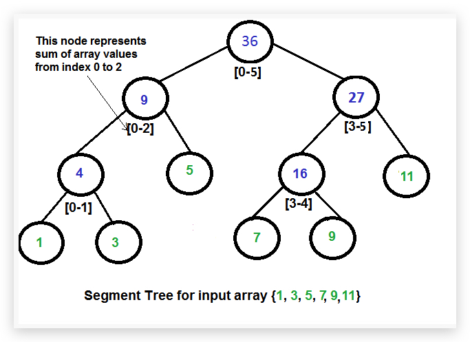

# 数据结构和算法 {ignore=ture}

[TOC]

## 数据结构

### 查找表

_静态查找表_

_动态查找表_
在查询之后，还需要将查询结果为不在查找表中的数据元素插入到查找表中；或者，从查找表中删除其查询结果为在查找表中的数据元素

### 树

#### Segment Tree

Segment Tree 是一棵二叉树，其特点为叶子节点个数与数组的长度相同 从左到右依次为数组中下标从小到大的元素的值，父节点的值为其左右的叶子节点的值的和。如下图是一个简单的例子

## 时间复杂度

主方法

$$
T(n) = aT(\frac n b) + f(n)
$$

显然，这里要看 $f(n)$ 给不给力了。而且，$f(n)$ 主要和 $n^{\log_ba}$ 比较即可。
