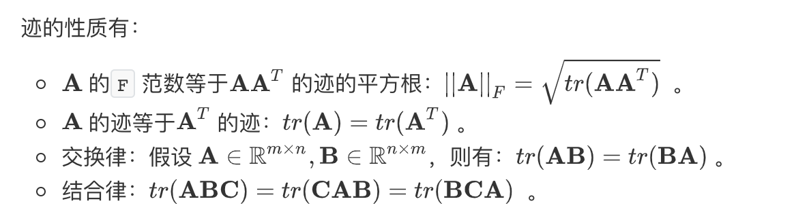
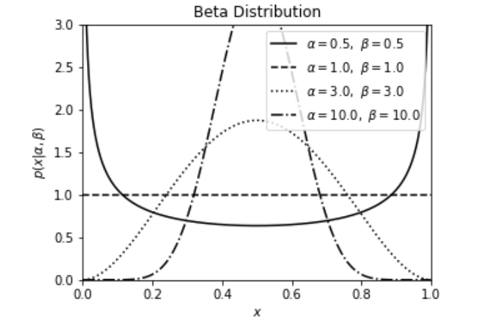

# 数学基础知识 {ignore=true}

[TOC]

## 线性代数

一个变换矩阵的所有特征向量组成了这个变换矩阵的一组基

矩阵的迹：设矩阵$\mathbf { A } = \left( a _ { i , j } \right) _ { m \times n }$, 则 A 的 迹为 $\operatorname { tr } ( \mathbf { A } ) = \sum _ { i } a _ { i , i }$



@import "calculus.md"

## 概率

$\beta$ 分布

$$
B ( x | a , b ) = \frac { 1 } { B ( a , b ) } x ^ { a - 1 } ( 1 - x ) ^ { b - 1 }
$$

```python
import numpy as np
from scipy.stats import beta
from matplotlib import pyplot as plt
#------------------------------------------------------------
# Define the distribution parameters to be plotted
alpha_values = [0.5, 1,  3.0,10]
beta_values = [0.5, 1, 3.0,10]
linestyles = ['-', '--', ':', '-.']
x = np.linspace(0, 1, 1002)[1:-1]

#------------------------------------------------------------
# plot the distributions
fig, ax = plt.subplots(figsize=(5, 3.75))

for a, b, ls in zip(alpha_values, beta_values, linestyles):
    dist = beta(a, b)

    plt.plot(x, dist.pdf(x), ls=ls, c='black',
             label=r'$\alpha=%.1f,\ \beta=%.1f$' % (a, b))

plt.xlim(0, 1)
plt.ylim(0, 3)

plt.xlabel('$x$')
plt.ylabel(r'$p(x|\alpha,\beta)$')
plt.title('Beta Distribution')

plt.legend(loc=0)
plt.show()
```



$$
\mu = \mathrm { E } ( X ) = \frac { \alpha } { \alpha + \beta }
$$

参数矩估计

$$
\begin{array} { l } { \widehat { \alpha } = \overline { \mu } \left( \frac { \overline { \mu } ( 1 - \overline { \mu } ) } { \sigma } - 1 \right) } \\\
{ \widehat { b } = ( 1 - \overline { \mu } ) \left( \frac { \overline { \mu } ( 1 - \overline { \mu } ) } { \sigma } - 1 \right) } \end{array}
$$

##### 期望

对两个相互独立的随机变量，有

$$
\mathbb { E } [ X Y ] = \mathbb { E } [ X ] \mathbb { E } [ Y ]
$$

##### 切比雪夫不等式

$$
P \{ | X - \mu | \geq \varepsilon \} \leq \frac { \sigma ^ { 2 } } { \varepsilon ^ { 2 } }
$$

中心极限定理表明，多个独立随机变量的和近似正态分布。

在具有相同方差的所有可能的概率分布中，正态分布的熵最大（即不确定性最大）

@import "./statistics.md"

## 抽象代数

## 复变函数

## 初等数论

### partition function

组合拆分问题

尚无闭式解

渐进估计： 大概和平方根

$$
\left\\{ \begin{array} { l l } { L ( n , m ) = } & { L ( n - m , m ) + L ( n , m - 1 ) \quad ( n > = m ) } \\\ { L ( n , m ) } & { = \quad L ( n , n ) \quad ( n < m ) } \end{array} \right.
$$

$L(n, m)$ 代表拆分数字 $n$ 的各项中最大数不超过 $m$ 的组合方式数

@import "numerical_computation.md"
