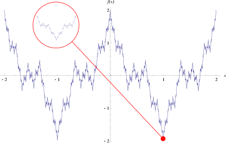
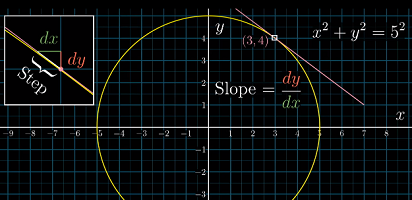
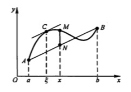
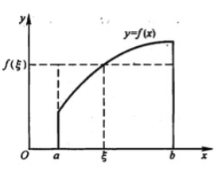
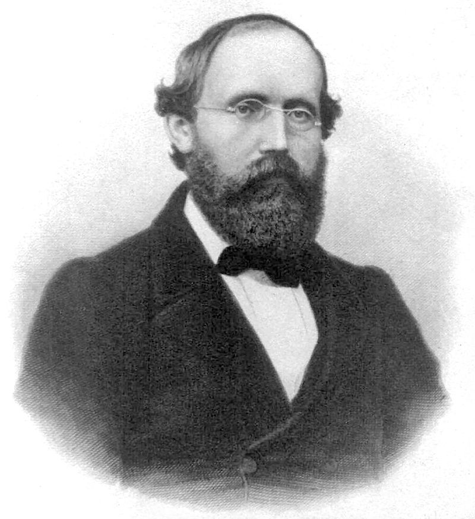

# 数学分析 {ignore=ture}

[[TOC]]

## 微分

可微函数
: 是指那些在定义域中所有点都存在导数的函数。可微函数的图像在定义域内的每一点上必存在非垂直切线。因此，可微函数的图像是相对光滑的，没有间断点、尖点或任何有垂直切线的点。

对于一元函数，可导等价于可微分

多元函数可导可以推出可微

实践中运用的函数大多在所有点可微，或几乎处处可微

巴拿赫定理： 可微函数在所有函数构成的集合中却是少数，可微函数在连续函数中不具代表性.
在拓扑学意义上：在从$[0,1]$ 区间射到实数上的连续函数空间 $C([0, 1]; R)$ 中，处处不可导的函数的集合是稠密的（关于一致范数的拓扑）。

魏尔斯特拉斯函数： 处处连续，处处不可微

连续可微
: 导数 $f'(x)$ 存在且是连续函数。

连续可微函数被称作 $C^1$ 函数。一个函数称作 $C^2$ 函数如果函数的一阶、二阶导数存在且连续。更一般的，一个函数称作 $C^{k}$ 函数如果前 k 阶导数 $f′(x), f″(x), ..., f(k)(x)$ 都存在且连续。如果对于所有正整数 $n$，$f(n)$存在，这个函数被称为光滑函数或称 $C^{\infty }$ 函数。

$$ \begin{aligned} \frac { \mathrm { d } } { \mathrm { d } x } [ C f ( x ) ] & = C \frac { \mathrm { d } } { \mathrm { d } x } f ( x ) \\\ \frac { \mathrm { d } } { \mathrm { d } x } [ f ( x ) + g ( x ) ] & = \frac { \mathrm { d } } { \mathrm { d } x } f ( x ) + \frac { \mathrm { d } } { \mathrm { d } x } g ( x ) \\\ \frac { \mathrm { d } } { \mathrm { d } x } [ f ( x ) g ( x ) ] & = f ( x ) \frac { \mathrm { d } } { \mathrm { d } x } [ g ( x ) ] + g ( x ) \frac { \mathrm { d } } { \mathrm { d } x } [ f ( x ) ] \\\ \frac { \mathrm { d } } { \mathrm { d } x } \left[ \frac { f ( x ) } { g ( x ) } \right] & = \frac { g ( x ) \frac { \mathrm { d } } { \mathrm { d } x } [ f ( x ) ] - f ( x ) \frac { \mathrm { d } } { \mathrm { d } x } [ g ( x ) ] } { [ g ( x ) ] ^ { 2 } } \end{aligned} $$

#### 链式法则

$$ \frac { \mathrm { d } y } { \mathrm { d } x } = \frac { \mathrm { d } y } { \mathrm { d } u } \frac { \mathrm { d } u } { \mathrm { d } x }$$

#### 梯度

对于函数：$f : \mathbb { R } ^ { n } \rightarrow \mathbb { R }$ ，假设输入 $\overrightarrow { \mathbf { x } } = \left( x _ { 1 } , x _ { 2 } , \cdots , x _ { n } \right) ^ { T }$，则定义梯度：

$$ \nabla _ { \overrightarrow { \mathbf { x } } } f ( \overrightarrow { \mathbf { x } } ) = \left( \frac { \partial } { \partial x _ { 1 } } f ( \overrightarrow { \mathbf { x } } ) , \frac { \partial } { \partial x _ { 2 } } f ( \overrightarrow { \mathbf { x } } ) , \cdots , \frac { \partial } { \partial x _ { n } } f ( \overrightarrow { \mathbf { x } } ) \right) ^ { T }$$

函数的驻点满足 $\nabla _ { \overrightarrow { \mathbf { x } } } f ( \overrightarrow { \mathbf { x } } ) = \overrightarrow { \mathbf { 0 } }$

方向梯度

当二阶偏导是连续时，海森矩阵是对称阵，即有：$\mathbf { H } = \mathbf { H } ^ { T }$

#### 拉普拉斯平滑

（Laplace Smoothing）又被称为加 1 平滑

$L_p$范数

$$ \| x \| _ { p } = \left( \sum _ { i = 1 } ^ { n } \left| x \_ { i } \right| ^ { p } \right) ^ { 1 / p }$$

#### 常见的梯度演算

$$
\begin{aligned} \nabla _ { x } A ^ { \top } x & = A \\\
\nabla _ { x } x ^ { \top } A & = A \\\
\nabla _ { x } x ^ { \top } A x & = \left( A + A ^ { \top } \right) x \\\
\nabla _ { x } \| x \| ^ { 2 } & = \nabla \_ { x } x ^ { \top } x = 2 x \end{aligned}
$$

假设 $X$ 是一个矩阵，那么

向量对向量求导

$$
\frac { \partial \mathbf { y } } { \partial \mathbf { x } } = \left[ \begin{array} { c c c c } { \frac { \partial y _ { 1 } } { \partial x _ { 1 } } } & { \frac { \partial y _ { 2 } } { \partial x _ { 1 } } } & { \cdots } & { \frac { \partial y _ { m } } { \partial x _ { 1 } } } \\\ { \frac { \partial y _ { 1 } } { \partial x _ { 2 } } } & { \frac { \partial y _ { 2 } } { \partial x _ { 2 } } } & { \cdots } & { \frac { \partial y _ { m } } { \partial x _ { 2 } } } \\\ { \vdots } & { \vdots } & { \ddots } & { \vdots } \\\ { \frac { \partial y _ { 1 } } { \partial x _ { n } } } & { \frac { \partial y _ { 2 } } { \partial x _ { n } } } & { \cdots } & { \frac { \partial y _ { m } } { \partial x _ { n } } } \end{array} \right]
$$

标量对矩阵求导

$$
\frac{\partial y}{\partial\mathbf{X}}=\begin{bmatrix}\frac{\partial y}{\partial x*{11}} & \frac{\partial y}{\partial x*{12}} & \cdots & \frac{\partial y}{\partial x*{1q}}\\\
\frac{\partial y}{\partial x*{21}} & \frac{\partial y}{\partial x*{22}} & \cdots & \frac{\partial y}{\partial x*{2q}}\\\
\vdots & \vdots & \ddots & \vdots\\\
\frac{\partial y}{\partial x*{p1}} & \frac{\partial y}{\partial x*{p2}} & \cdots & \frac{\partial y}{\partial x\_{pq}}
\end{bmatrix}
$$

凡是对标量求导，结果的形式都要转置

矩阵对标量求导

$$
\frac{\partial\mathbf{y}}{\partial x}=\begin{bmatrix}\frac{\partial y*{11}}{\partial x} & \frac{\partial y*{21}}{\partial x} & \cdots & \frac{\partial y*{m1}}{\partial x}\\\
\frac{\partial y*{12}}{\partial x} & \frac{\partial y*{22}}{\partial x} & \cdots & \frac{\partial y*{m2}}{\partial x}\\\
\vdots & \vdots & \ddots & \vdots\\\
\frac{\partial y*{1n}}{\partial x} & \frac{\partial y*{2n}}{\partial x} & \cdots & \frac{\partial y\_{mn}}{\partial x}
\end{bmatrix}
$$

#### 隐函数求导

圆的方程就是一个隐函数

$$
x^2 + y^2 = a^2
$$

对其求导

$$
\begin{aligned} & d \left( x ^ { 2 } + y ^ { 2 } \right) = d \left( 5 ^ { 2 } \right) \\\ \Rightarrow & 2 x d x + 2 y d y = 0 \\\ \Rightarrow & \frac { d y } { d x } = \frac { - x } { y } \end{aligned}
$$

    <figure align='center'>
        
    </figure>

在隐函数的导数中，原来的变量看做常数

#### 一些重要的极限

$$
\lim _ { x \rightarrow 0 } \frac { \sin x } { x } = 1 \\\ \lim _ { x \rightarrow + \infty } \left( 1 + \frac { 1 } { x } \right) ^ { x } = e
$$

#### 常见函数的导数

#### 微分中值定理

罗尔中值定理只不过是拉格朗日中值定理的一个特殊情况

##### 拉格朗日中值定理

拉格朗日中值定理就是说对于在区间 上的连续可导函数 f(x)，区间内至少有一个点满足

$$
f ^ { \prime } ( \varepsilon ) = \frac { f ( a ) - f ( b ) } { a - b } , \varepsilon \in ( a , b )
$$

拉格朗日中值定理的几何意义如下，曲线在 C 点处的切线平行于弦 AB

    <figure align='center'>
        
    </figure>

##### 柯西中值定理

柯西中值定理就扩展到区间 上的两个连续可导函数 f(x)和 F(x)，区间内至少有一个点满足

$$
\frac { f ^ { \prime } ( \varepsilon ) } { F ^ { \prime } ( \varepsilon ) } = \frac { f ( a ) - f ( b ) } { F ( a ) - F ( b ) } , \varepsilon \in ( a , b )
$$

### 洛必达法则

$$
\lim _ { x \rightarrow x _ { 0 } } \frac { f ( x ) } { g ( x ) } = \lim _ { x \rightarrow x _ { 0 } } \frac { f ^ { \prime } ( x ) } { g ^ { \prime } ( x ) }
$$

也就是说，可以先对分子分母求导再求极限

### 单调性、凹凸性和极值

极值点
: 函数从递增变换到递减，或者从递减变换到递增的点；

驻点
: 函数的一阶导数为 0 的点(驻点也称为稳定点，临界点)。对于多元函数，驻点是所有一阶偏导数都为零的点。

设函数 $f(x)$ 在 $x_0$ 附近有定义，如果对 $x_0$ 的去心邻域 $(x_0−ϵ,x_0+ϵ)$，都有
$f(x)<f(x_0)$，则 $f(x_0)$ 是函数 $f(x)$ 的一个极大值

极值点不一定是驻点，驻点要求一阶导数必须存在，而极值点对导数没有要求

比如，$y=|x|$ 在 $x=0$ 处，是极小值点，但不是驻点，没有导数；
相应的，驻点也不一定是极值点，比如 $y=x^3$ 在 $x=0$ 处；

一个给定驻点，判断其是否为鞍点的一个简单的准则即是，对于一个二元实值函数，$F(x,y)$，计算在该点的 Hessian 矩阵，如果其是不定的，则该驻点为鞍点。

如二元函数 $z=x2−y2$ 在驻点 $(0,0)$ 处的 Hessian 矩阵形式为：

$$
显然是不定矩阵，因此驻点 $(0, 0)$ 点也为鞍点。但判断一个点是否是鞍点，这仅仅是一个充分条件。
Hessian 矩阵不为正定的也未必不是鞍点，比如 $z=x4−y4$ 在 点 $(0,0)$ 处的 Hessian 矩阵是一个 0 矩阵（zero matrix 或者 null matrix）。

拐点
: 曲线凹凸性发生改变的点。

**可导函数的极值点必定是它的驻点**

## 不定积分和定积分

不定积分是微分的逆运算，它是函数 f(x)的原函数，是由无穷多个函数组成的函数族；而定积分 是一个确定的数值，是一种特殊的和的极限

### 定积分中值定理
$$

\int \_ { a } ^ { b } f ( x ) d x = f ( \varepsilon ) ( b - a ) , a \leq \varepsilon \leq b

$$

    <figure align='center'>
        
    </figure>

### 牛顿-莱布尼茨公式
$$

\int \_ { a } ^ { b } f ( x ) d x = F ( b ) - F ( a )

$$
## 级数

调和级数发散的证明
$$

s _ { 2 n } - s _ { n } = \frac { 1 } { n + 1 } + \frac { 1 } { n + 2 } + \dots + \frac { 1 } { 2 n } > \frac { 1 } { 2 n } + \frac { 1 } { 2 n } + \dots + \frac { 1 } { 2 n } = \frac { 1 } { 2 }

$$
### 幂级数
$$

\Sigma _ { n = 0 } ^ { \infty } a _ { n } x ^ { n } = a _ { 0 } x ^ { 0 } + a _ { 1 } x ^ { 1 } + \cdots + a \_ { n } x ^ { n } + \cdots

$$
幂级数的收敛半径

#### 泰勒级数（泰勒公式）
$$

f ( x ) = \sum _ { n = 0 } ^ { \infty } \frac { f ^ { ( n ) } \left( x _ { 0 } \right) } { n ! } \left( x - x \_ { 0 } \right) ^ { n }

$$
- 一阶泰勒展开
$$

f ( x ) = \sum _ { n = 0 } ^ { \infty } \frac { f ^ { ( n ) } \left( x _ { 0 } \right) } { n ! } \left( x - x \_ { 0 } \right) ^ { n }

$$
- 二阶泰勒展开
$$

f ( x ) \approx f \left( x _ { 0 } \right) + f ^ { \prime } \left( x _ { 0 } \right) \left( x - x _ { 0 } \right) + f ^ { \prime \prime } \left( x _ { 0 } \right) \frac { {\left( x - x \_ { 0 } \right)} ^ {2} } 2

$$
- 迭代形式
  $x ^ { t } = x ^ { t - 1 } + \Delta x$
$$

\begin{align}
f \left( x ^ { t } \right) & = f \left( x ^ { t - 1 } + \Delta x \right) \\\
 & \approx f \left( x ^ { t - 1 } \right) + f ^ { \prime } \left( x ^ { t - 1 } \right) \Delta x + f ^ { \prime \prime } \left( x ^ { t - 1 } \right) \frac { \Delta x ^ { 2 } } { 2 }
\end{align}

$$
##### 常见函数的泰勒级数
$$

e ^ { x } = 1 + x + \frac { x ^ { 2 } } { 2 ! } + \dots + \frac { x ^ { \* } } { n ! } + \cdots \quad ( - \infty < x < + \infty )

$$
## 重积分

## gamma 函数
$$

\Gamma ( x ) = \int \_ { 0 } ^ { \infty } t ^ { x - 1 } e ^ { - t } d t

$$
1. $\Gamma(x+1) = x\Gamma(x)$
2. 阶乘的推广， 特别的，$\Gamma(1) = 1$
3. $\Gamma(\frac 1 2) = \sqrt { \pi }$

## Beta 函数
$$

B ( a, b ) = \int \_ { 0 } ^ { 1 } t ^ { \alpha - 1 } ( 1 - t ) ^ { \beta - 1 } d t

$$
性质

1. 对称
2. $B (a,b) = \frac {\Gamma (a) \Gamma(b)} {\Gamma (a+b)}$

## 实变函数

> 实变函数学十遍，泛函分析心泛寒

<table>
    <tr>
        <td >
黎曼 
</td>
        <td >
勒贝格
</td>
    </tr>
</table>

有限分割 vs 可数分隔

<aside class='key-point'>
以一维为例，一个实数集的子集，如果它能被可数个区间覆盖，那么这些区间的总长度就是它的测度上界，如果它能覆盖可数个区间，那么这些区间的总长度就是它的测度下界，如果上界和下界的极限都相等，那么这就是一个可测集
</aside>

### 格林公式
$$

\int _ { \partial D } P d x + Q d y = \int _ { D } \left( \frac { \partial Q } { \partial x } - \frac { \partial P } { \partial y } \right) d x d y

$$
## 微分方程

### 常微分方程

## 参考

- [齐民友「重温微积分」]()
-
$$

$$
$$

$$
$$

$$
$$

$$
$$

$$
$$
