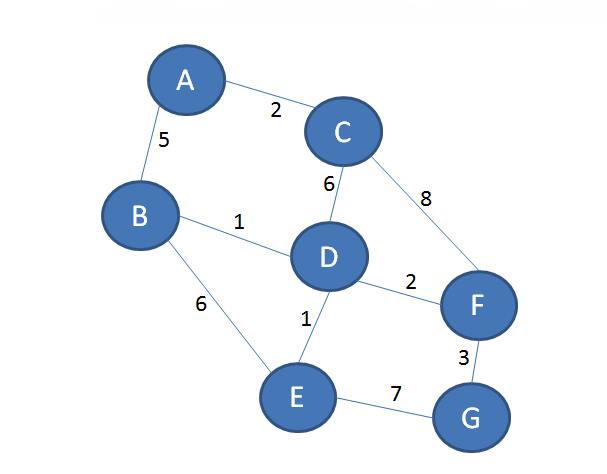
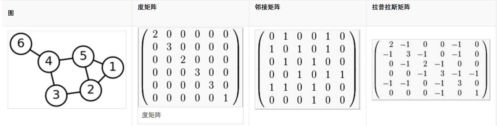

---
toc:
  depth_from: 1
  depth_to: 3
  ordered: false
---

# 图论 {ignore=true}

[TOC]

## 基础理论

## 常见问题和算法

### 最小生成树

因为是最小，因此肯定是针对带权图。
所谓最小生成树，即图的极小连通子图，它包含图的所有顶点，并且所有边权之和达到最小。
显然，最小生成树可能不是唯一的。

按照定义，最小生成树不可能有环（这也是为什么叫树的原因）

最小生成树的用处： 用最低成本在多个城市之间修建铁路。

#### Prims Algorithm

以图的顶点为基础，从一个初始顶点开始，寻找触达其他顶点权值最小的边，并把该顶点加入到已触达顶点的集合中。当全部顶点都加入到集合时，算法的工作就完成了。Prim 算法的本质，是基于贪心算法。

### 最短路径

#### 单源最短路径

##### Dijkstra 算法

#### 多源最短路径

可以先用 Dijkstra 算法，求出单个顶点到其他所有顶点的最短路径长度（$O(n^2)$），遍历顶点，即可至所有顶点到其他顶点的最短路径。整体复杂度为 $O(n^3)$

##### Floyd 算法

1. 先构建邻接矩阵
   每一个元素代表从某个顶点到另一个顶点的直接距离

### PageRank

### SimRank

参考 [SimRank++算法原理解析](http://xudongyang.coding.me/simrank-plus-plus/)

**利用已有个体的相似度来推算其他与之有关联个体的相似度**

其基本思想是：如果两个对象 a 和 b 分别与另外两个对象 c 和 d 关联，且已知 c 与 d 是相似的，则 a 与 b 也是相似的；并且任意节点与其自身拥有最大的相似度值为 1。

把对象和对象之间的关系建模为一个有向图 $\mathrm { G } = ( \mathrm { V } , \mathrm { E } )$. 在推荐系统中，假设用户和物品在空间中形成了一个二部图。
对于图中的一个节点 𝑎，与其所有入边关联的邻节点集合(in-neighbors)记为 𝐼(𝑎)
同时，其出边对应的邻节点集合(out-neighbors)集合记为 𝑂(𝑎)。

$$
s ( a , b ) = \left\\{ \begin{array} { l l } { 1 , } & { a = b } \\\ { \frac { c } { | I ( a ) | I ( b ) | } \sum _ { i } ^ { I ( a ) | } \sum _ { j } ^ { | I ( b ) | } s \left( I _ { i } ( a ) , I _ { j } ( b ) \right) , } & { a \neq b \wedge I ( a ) , I ( b ) \neq \emptyset } \\\ { 0 , } & { \text { otherwise } } \end{array} \right.
$$

式中 𝑐 是一个常量衰减因子.

用上式直接计算两个物品或者两个用户之间的相似度是比较困难的，一般需要通过迭代方式.

令 P 表示 G 的连接矩阵，其中 𝑃(𝑖,𝑗)表示从顶点 𝑖 到顶点 𝑗 的边数，则

$$
\begin{align}
s ^ { k + 1 } ( a , b ) & = \frac { c } { | I ( a ) | | I ( b ) | } \sum _ { i } ^ { n } \sum _ { j } ^ { n } p _ { i , a } \cdot s ^ { k } ( a , b ) \cdot p _ { j , b } \\\
 &=  c \cdot \sum _ { i } ^ { n } \sum _ { j } ^ { n } \left( \frac { p _ { i , a } } { \sum _ { i } ^ { n } p _ { i , a } } \right)   \cdot s ^ { k } ( a , b ) \cdot \left( \frac { p _ { j , b } } { \sum _ { j } ^ { n } p _ { j , b } } \right)
\end{align}
$$

用矩阵的形式可以写为

$$
S ^ { k } = \left\\{ \begin{array} { l l } { c W ^ { T } S ^ { k - 1 } W + I _ { n } - \operatorname { Diag } \left( \operatorname { diag } \left( c W ^ { T } S ^ { k - 1 } W \right) \right) , } & { k > 0 } \\\ { I _ { n } , } & { k = 0 } \end{array} \right.
$$

其中，矩阵 𝑊 表示按列归一化的 𝑃 矩阵， 𝐼 是 𝑛×𝑛 的单位矩阵。对于一个矩阵 𝑋，𝑑𝑖𝑎𝑔(𝑋)表示获得由所有 𝑋 的主对角线上的元素构成的向量；对于一个向量 𝑥，𝐷𝑖𝑎𝑔(𝑥)操作得到相应的对角矩阵，即 𝑥=𝑑𝑖𝑎𝑔(𝐷𝑖𝑎𝑔(𝑥))。由于任意对象和自己的相似度值为 1，所以加上项 𝐼𝑛−𝐷𝑖𝑎𝑔(𝑑𝑖𝑎𝑔(𝑐𝑊𝑇𝑆𝑘−1𝑊))，其作用是把矩阵 的主对角线元素设为 1。

#### SimRank++

SimRank++算法对 SimRank 算法主要做了两点改进。第一点是考虑了边的权值，第二点是考虑了子集节点相似度的证据。

原始 SimRank 的一个问题是， 认为只要有边相连，则为相似，却没有考虑到如果共同相连的边越多，则意味着两个节点的相似度会越高。

例如： 京东和淘宝平台上都有卖手机和平板，另外，在淘宝上还有手机和相机，并假设衰减系数为 0.8。则，手机和相机的相似度为 0.8，而手机和平板的相似度依次迭代为 0.4， 0.56， 0.624 ... ，但依然小于手机和相机的相似度。

但直观上，手机和相似度只有在淘宝上有，而手机和平板在淘宝和京东上都有，手机和平板的相似度应该更高才对。

一个可行的校正方法是对原始的 SimRank 算法的迭代公式进行修改，添加一个证据(evidence)因子：

$$
\text {evidence} \left( q , q ^ { \prime } \right) = \sum _ { i = 1 } ^ { \left| E ( q ) \cap E \left( q ^ { \prime } \right) \right| } \frac { 1 } { 2 ^ { i } }
$$

相应地，新的计算公式变为

$$
s _ { \text {evidence} } \left( q , q ^ { \prime } \right) = \text {evidence} \left( q , q ^ { \prime } \right) \cdot s \left( q , q ^ { \prime } \right)
$$

按照此公式，上面的例子计算出的手机和相机的相似度为 0.4， 而手机和平板之间的相似度依次迭代为 0.3, 0.42,... 0.499

另一方面，原始的 SimRank 算法没有考虑边的权值。或者说，对于边的归一化权重，用的是比较笼统的关联的边数分之一来度量， 并没有考虑不同的边可能有不同的权重度量

### 最大流问题

### 中国邮路问题

## Spectral graph theory

**谱图论**，即图的谱理论，旨在用代数与几何的方法来表示“图”这个数据结构并探究图的内在特征

> “Just as astronomers use stellar spectra to determine the make-up of distant stars… [we aim] to deduce the properties and structure of [networks] from its spectrum.”
> -Chapter 1, Spectral Graph Theory by F.R.K. Chung

我们知道，在天体观测中，由于许多天体离我们实在是太过遥远，因此不便直接观察，因此我们往往通过观察光谱来进行天体观测，其中最著名的例子就是由观察到谱线红移而推测出宇宙正在不断扩张。
同样的，一个图的谱也是用于描述图的重要工具。谱图理论就是研究如何通过几个容易计算的定量来描述图的性质。
通常的方法是将图编码为一个矩阵然后计算矩阵的特征值（也就是谱 spectrum） 。

拉普拉斯矩阵(Laplacian matrix): $L = D - A$

## DeepWalk

## 工具

[Graph BLAS](http://istc-bigdata.org/GraphBlas/)
以线性代数的眼光看图算法，并试图构建一个像 BLAS 那样基础的运算库来支持图算法的设计。

## 参考

- Graph Algorithms in the Language of Linear Algebra, Edited by J. Kepner and J. Gilbert, SIAM, 2011.
