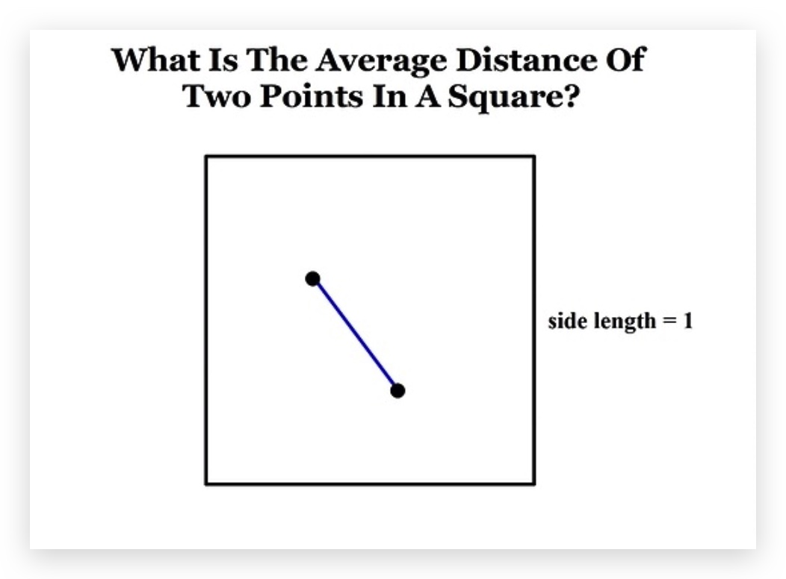
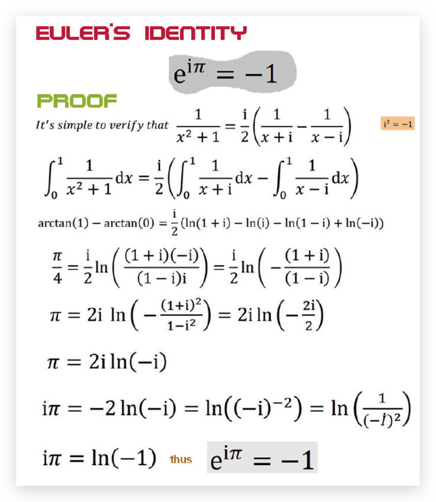
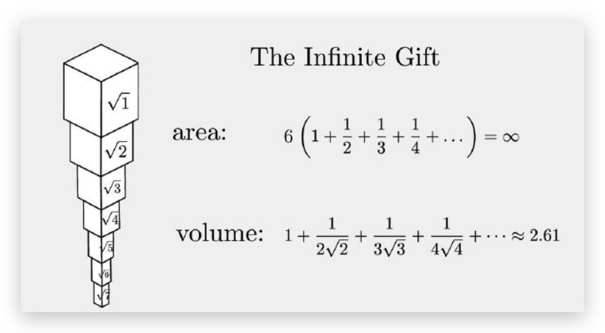
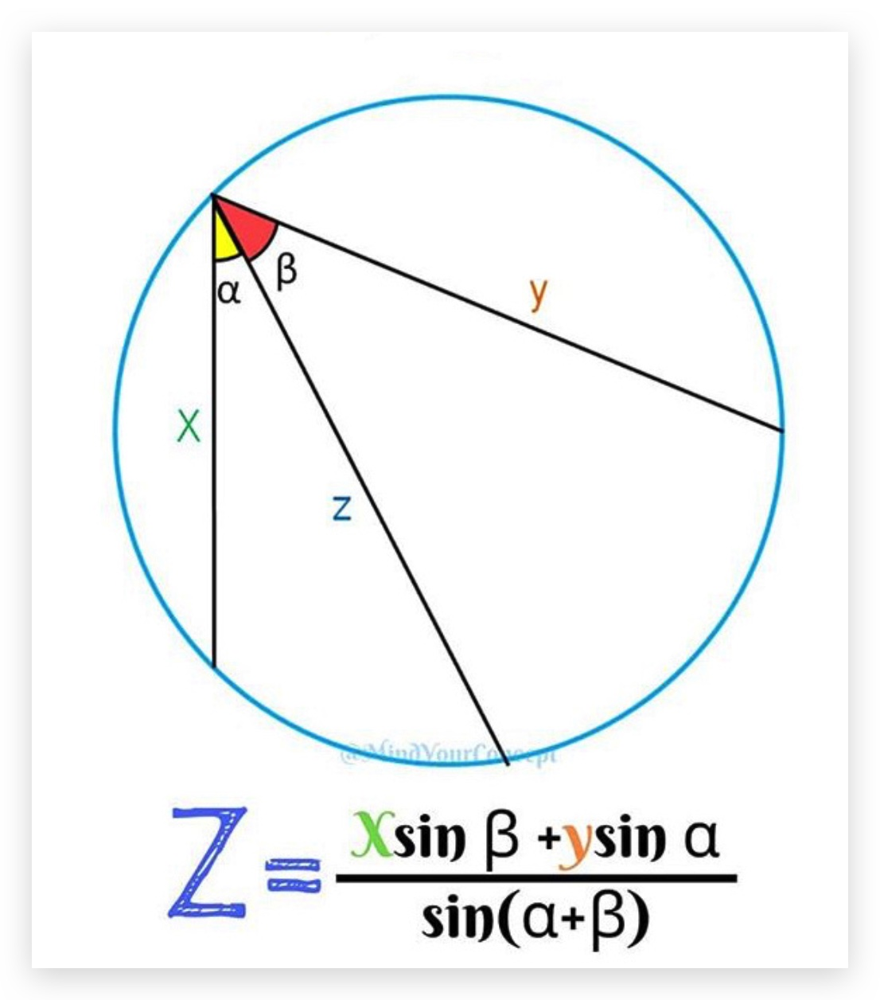
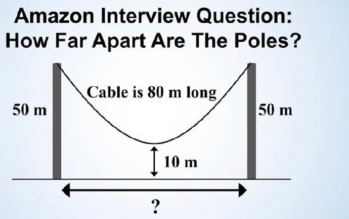
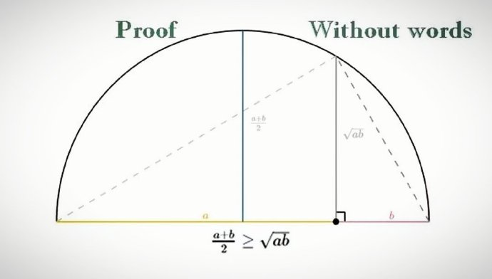
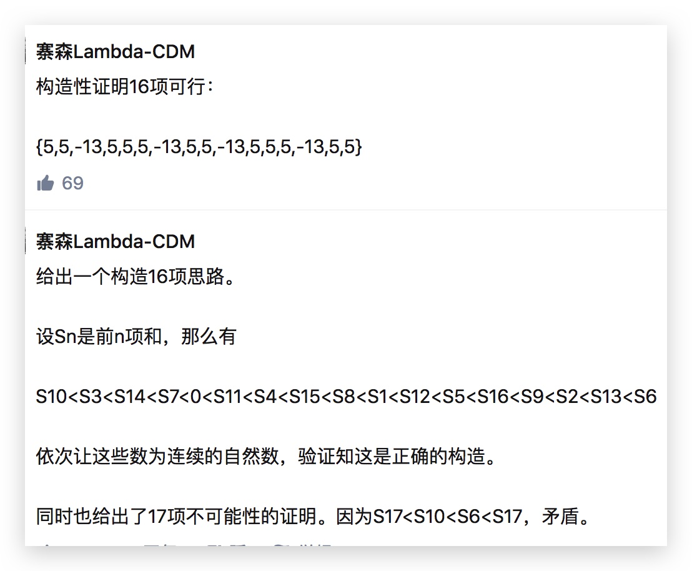

# 数学题

1. [看似容易但却非常难的一道题](https://zhuanlan.zhihu.com/p/33853851?utm_medium=social&utm_source=weibo)

题目简单都可以刷遍朋友圈，但是难度高到普通的数学研究生都未必能够解，因此算是数学之力量的一种体现了。

丢番图方程在不同次数难度完全不一样，宽泛地说：

一次的非常简单。

二次的也被理解得非常透彻，一般能用相对初等的方法解决。

三次的就是满山满海的深奥理论和数不胜数的开放问题。

四次的，嗯，真的真的很难。

要点一 把椭圆曲线化成魏尔斯特拉斯形式，方便找到后者的解
要点二 利用弦切技巧进行加法，生成其他有理数点。

迭代到第 9 次，得到一组全为 80 位的正整数解。

定义在有理数上的椭圆曲线存在一个阶（rank），它表示我们最开始至少需要知道多少个有理点才能通过弦切方法找到曲线上所有的有理数点。我们这条椭圆曲线的阶等于 1，这意味着：虽然它上面有无穷多个有理点，但它们都是由一个有理点生成的

上述的丢番图方程就是一个系数很小但整数解位数巨大的骇人案例。它不仅仅是令人生畏的符号，还是一项意义深远的研究。希尔伯特第十大问题的否证陈述意味着，随着系数逐渐增大，解的增长将变为一个不可计算的方程——因为如果它是可计算的，那我们就能得到一个解开丢番图方程的简单算法——而事实上并没有，无论是简单的还是复杂的（注：也就是不存在经有限步骤解决丢番图方程的方法）。这项研究暗合否定陈述：4->80 位，178->数亿位，896->数万亿位，让我们瞥见那个怪异的、不可计算的函数的一貌。稍稍把我们的方程改动一下，解就会迅速增长到盖过我们这个“可怜的”、“渺小的”宇宙的任何事物。

何其美妙、何其揶揄的小小方程！

[An unusual cubic representation problem](http://ami.ektf.hu/uploads/papers/finalpdf/AMI_43_from29to41.pdf)
当 N 为奇数的时候，不会有正整数解。
For example, when N = 896, the smallest positive solution has a, b, c with several trillion digits

回顾一下群论相关的知识点
对于有限域，其元素的数目必然是素数的幂
椭圆曲线上的点全体构成一个加法群。正因为椭圆曲线存在加法结构，所以它包含了很多重要的数论信息。
Mordell-Weil 定理：即莫代尔定理，椭圆曲线上有理点构成的群是有限生成的。
另一方面，椭圆曲线上的整点只有有限多个，这个定理被称为 Siegel 定理。

- 图证 1 到 n-1 的和为 n 选 2

这个图证真心厉害了。

> 有四只小黄鸭，在一个圆形的大池塘里，各自随机游来游去。现在沿池塘任意直径拉一根绳子，能把四只鸭子都隔在一侧的概率是多少？

看似复杂，其实简单，不要想多了。

> 给你一个无限长度的空白的尺子，问最少在上面画多少个刻度，使得可以量出 1 到 10 每一个整数长度？

6 个点的方案： 0,4,7,8,9,10, 或者 0，1，3，7，8，10
不会有 5 个点的方案的证明：

由于 55 个点两两配对一共 1010 对，所以所有点对之间的距离刚好是 11 到 1010，即不存在两个不同的点对之间的距离相同。由此可以推出，最远的两个点之间的距离为 1010，所以我们可以先钦定刻度 00 和刻度 1010 上有两个点。
剩下还有 33 个点，它们将长度为 1010 的线段分为 44 段，这四段的长度总和要为 1010，而 1010 的四拆分只有 10 = 1 + 2 + 3 + 410=1+2+3+4，所以这四段的长度构成 11 至 44 的一个排列。
根据第一点，我们知道 11 不能与 22 或 33 相邻，因为那样相邻的两段的长度之和就会与单独的长度为 33 或 44 的一段冲突，因此 11 只能与 44 相邻，并且 11 只能在第一位或者最后一位。这样 22 和 33 必须相邻。又因为 1+4 = 2+31+4=2+3，所以我们推出矛盾，故不存在 55 个点的方案。

<h3 style="color: inherit;line-height: inherit;margin-top: 1.6em;margin-bottom: 1.6em;font-weight: bold;border-bottom: 2px solid rgb(239, 112, 96);font-size: 1.3em;">题目描述
</h3>

     证明基本不等式

对 $n$ 个非负实数有

$$
x _ { 1 } x _ { 2 } \cdots x _ { n } \leqslant \left( \frac { x _ { 1 } + x _ { 2 } + \cdots x _ { n } } { n } \right) ^ { n }
$$

显然对 1 和 2 成立
假设对 n 成立，则我们首先说明对 2n 也成立
令

$$
x _ { i + ( j - 1 ) n } = y _ { i } z _ { j } \quad ( 1 \leqslant i \leqslant n , j = 1,2 )
$$

则有

$$
\begin{align}
x _ { 1 } x _ { 2 } \cdots x _ { 2 n }  = & \left( y _ { 1 } y _ { 2 } \cdots y _ { n } \right) ^ { 2 } \left( z _ { 1 } z _ { 2 } \right) ^ { n } \\\
\leqslant & \left( \frac { y _ { 1 } + y _ { 2 } + \cdots y _ { n } } { n } \right) ^ { 2 n } \left( \frac { z _ { 1 } + z _ { 2 } } { 2 } \right) ^ { 2 n }  \\\
= & \left( \frac { x _ { 1 } + x _ { 2 } + \cdots x _ { 2 n } } { 2 n } \right) ^ { 2 n }
\end{align}
$$

所以对 2n 成立。

接下来就可以反向数学归纳法了

假设现在 $n$ 是成立的，那么需要证明 $n - 1$ 也是成立的。这个证明非常简单，令

$$
E = \left( \sum _ { k = 1 } ^ { n - 1 } x _ { k } \right) / ( n - 1 )
$$

则有

$$
\begin{aligned} x _ { 1 } x _ { 2 } \cdots x _ { n - 1 } E & \leqslant \left( \frac { x _ { 1 } + x _ { 2 } + \cdots + x _ { n - 1 } + E } { n } \right) ^ { n } \\\ x _ { 1 } x _ { 2 } \cdots x _ { n - 1 } E & \leqslant \left( \frac { ( n - 1 ) E + E } { n } \right) ^ { n } \\\ x _ { 1 } x _ { 2 } \cdots x _ { n - 1 } E & \leqslant E ^ { n } \\\ x _ { 1 } x _ { 2 } \cdots x _ { n - 1 } & \leqslant E ^ { n - 1 } \\\ x _ { 1 } x _ { 2 } \cdots x _ { n - 1 } & \leqslant \left( \frac { x _ { 1 } + x _ { 2 } + \cdots + x _ { n - 1 } } { n - 1 } \right) ^ { n - 1 } \end{aligned}
$$

这种证明真心巧妙！

<h3 style="color: inherit;line-height: inherit;margin-top: 1.6em;margin-bottom: 1.6em;font-weight: bold;border-bottom: 2px solid rgb(239, 112, 96);font-size: 1.3em;">题目描述
</h3>

证明

$$
\sum _ { j = 2 } ^ { \infty } \sum _ { k = 2 } ^ { \infty } \frac { 1 } { j ^ { k } } = 1
$$

容易发现最后是一个可消去加和

> 相亲问题

无法回头的最大值。

$\frac n e$ 放弃，后面取第一个更好的。

例如，想在 100 个人中找出最合适的，就先拒绝前 37 个，后面第一个超过 37 水平的，就是你对象！

> 互不透漏具体数字的情况下算平均工资

1. 混在一起。但这种还是会泄露工资，虽然无法和具体的人对应。
2. 第一个人加上一个随机数，最后减掉。
   比较脆弱，容易泄露。
3. 每个人拆分自己的工资并发给其他人。

> 兰彻斯特方程

> 五个囚犯抓 100 个绿豆，最多最少者死

原则： 先报名，再杀人。

ball-line picking 问题

首先想一下： 在 0-1 的线段上随机取两个点，期望长度是多少？
结合之前是否过原点的讨论，可以知道，概率为 $\frac 1 3$
那线段的期望值就是 $ \frac {\sqrt 2} 3$ ?
不是，因为，斜边长度的期望不等于两边长度的期望+勾股定理。

无限礼物悖论

角元形式的托勒密定理

四点共圆定理

按照三角形三边的关系，感觉绳子的长度不应该只有 80 米。

**万有覆盖问题**

**得癌症的概率**

    患病率千分之一的癌症，机器检测方法的准确率：患癌症检测呈阳性（+）的准确率是 99%，健康体检测呈阴性（-）的准确率也是 99%，此时，如果一个人被检测为患癌症，则其真真患癌的概率为多少？

这个概率不到 10%！！
为什么，其实本质在于，贝叶斯定理其实是对先验概率的一种调整，没有先验信息的前提下，患病的概率是千分之一，检测出来之后，这个概率被修正为大约 9%，虽然还是较低，但其实已经修正了 90 倍之多，从相对调整量的角度看，还是合理的。
一个这么罕见的病和一个不怎么可靠的仪器综合起来，只能推断出一个不怎么可靠的结果。

如果仪器的精度提高到 99.99%呢，此时，概率为 91%左右！
可以看出，对于一个疾病来说，仪器的误诊率必须小于人群中得发病率，那我们检测出来的结果才是相对可靠的。

另外，还可以再进行一次独立的检测。此时，即使只有 99%的精度，概率也能提高到 90 左右。

    喝醉的酒鬼总能找到回家的路，喝醉的小鸟则可能永远也回不了家

拿一张中国地图平摊在中国的大地上，则存在唯一一个地点，其真实地点和在地图上的地点完全重合。——压缩映像原理。

    Hairy ball theorem

地球表面永远存在静风点，也就是完全没有风的点。这是所谓的毛球定理，用数学语言来说，2 维球面上的连续切向量场一定存在零点。

当欧氏空间的维数很大时，单位球体的质量（假设密度均匀）主要集中在单位球表面附近的薄层，而不是球体内部。也就是说，单位球表面厚度不到 1/10 的一个薄层可以占 90%以上的体积，而且维数越高这种现象越明显

    整数和实数可以一一对应，只要把前面的“小数点”去掉就行了。

这种想法为什么错？
因为不是单射，因此更不是双射。而等势必须要求双射。

    一个圆去掉一点后，可以旋转圆的一个子集，来把这个点补上

怎么补是关键。

    去掉圆上不可数个点后，可以旋转圆的一个子集，把所有的点都补上

    Banach-Tarski佯谬

你可以将一个球切成五份，然后不做任何变形/拉伸/放大，仅仅旋转其中三个部分，就可以将它们重新组合成两个跟原来完全相同的球

    椭圆，抛物线和双曲线为何都被称为 圆锥曲线 ？

都和圆锥有关

    Arrow's impossibility theorem

A

    现有一有限实数列，任意连续7项之和为负，任意连续11项之和为正。问这序列最多可含有多少项

最多 16，不能超过 16
首先证明不能超过 16： 每 7 个一行，行列求和，如果有 17 项，行求和负而列求和正，矛盾。

事实上，如果可以有 17 个，也可以推出来一直到 A7 的 连续四个为正。因此也可以将 A1-A10 写成 7\*4 的矩阵，也可以推出来。

注意到： $S_{n+7} < S_{n} < S_{n+11}$ 且 $S_7 < 0, S_{11} > 0$

Q: 证明 $2^{\frac 1 3}$ 是无理数
A: 费马大定理。这里的 3 可以推广到任意大于 2 的正整数都是可以的

