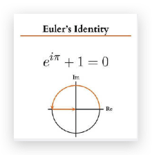

# 数学问题

从无理数，到超越数，到合取数

- 两个数的最大值可以表示成两个数的和与差的函数

$$
\max ( x , y ) = \frac { 1 } { 2 } ( | x + y | + | x - y | ) \\\
x \gt 0 , y \gt 0
$$

- 矬子里的将军依然比将军里的矬子矬
  $$
  \max _ { x } \min _ { y } f ( x , y ) \leq \min _ { y } \max _ { x } f ( x , y )
  $$

#### 如何证明 π 是超越数

如果 π 是代数数，那么 πi 也是代数数（两个代数数的积仍然是代数数，i 是 $x^2 + 1$ 的根，所以是代数数）。下面实际上将证明 πi 是超越数，于是 π 也必然是超越数。

反证法，标准起手式，先假设 πi 是某个 n 次整系数多项式 $g(x)$ 的根

$$
g(x) = a_0 + a_1x + a_2x^2 + \cdots + a_n x^n
$$

根据代数学基本定理，它在复数域上将有包括 πi 在内的 n 个根，把这些根记做 $\alpha _1, \alpha_2, \cdots, \alpha_n$

则有

$$
\left( e ^ { \alpha _ { 1 } } + 1 \right) \left( e ^ { \alpha _ { 2 } } + 1 \right) \ldots \left( e ^ { \alpha _ { n } } + 1 \right) = 0
$$

因为某个 $\alpha_i$ 为 $\pi i$, 而根据欧拉公式有 $e^{\pi i} + 1 = 0$

[剩余证明参见](https://zhuanlan.zhihu.com/p/56607777)

#### $\pi$ 是合取数吗

合取数： 包含全部数字组合可能的数

> 圆周长与直径之比，无穷无尽，永不重复。在这串数字中，包含每种可能的组合。你的生日、储物柜密码、社保号码，都在其中某处。如果把这些数字转换为字母，就能得到所有的单词，无数种组合。你婴儿时发出的第一个音节，你心上人的名字，你一辈子从始至终的故事，我们做过或说过的每件事，宇宙中所有无限的可能，都在这个简单的圆中。

#### 傅里叶变换-拉普拉斯变换-Z 变换

连续时间傅里叶变换的公式是：

$$
\int _ { - \infty } ^ { \infty } x ( t ) e ^ { - j \omega t } d t
$$

这里的 $\omega$ 是实数。

傅里叶变换要求时域信号绝对可积，即

$$
\int _ { - \infty } ^ { \infty } | x ( t ) | d t < \infty
$$

如果不满足呢，这个时候，给时域信号乘以一个指数衰减，就能保证绝对可积！

于是这个新函数的傅立叶变换就是

$$
\int _ { - \infty } ^ { \infty } x ( t ) e ^ { - \sigma t } e ^ { - j \omega t } d t
$$

化简得

$$
\int _ { - \infty } ^ { \infty } x ( t ) e ^ { - ( \sigma + j \omega ) t }
$$

显然 $( \sigma + j \omega ) $ 是一个复数，我们把这个复数定义为一个新的变量——复频率，记为 s

于是便得到了拉普拉斯变换的公式:

$$
\int _ { - \infty } ^ { \infty } x ( t ) e ^ { - s t } d t
$$

拉普拉斯变换解决了不满足绝对可积条件的连续信号，变换到频率域的问题，同时也对“频率”的定义进行了扩充, 将频率从实数推广为复数!

同样，离散傅里叶变换

$$
\sum _ { n = - \infty } ^ { \infty } x [ n ] e ^ { - j \omega n }
$$

需要满足绝对可和的条件，即

$$
\sum _ { n = - \infty } ^ { \infty } | x [ n ] | < \infty
$$

为了让不满足绝对可和条件的函数 $x[n]$，也能变换到频率域，我们乘一个指数函数$a^{-n}$，$a$为（满足收敛域的）任意实数。

新函数的 DTFT 为

$$
\sum _ { n = - \infty } ^ { \infty } x [ n ] a ^ { - n } e ^ { - j \omega m }
$$

化简得

$$
\sum _ { n = - \infty } ^ { \infty } x [ n ] \left( a \cdot e ^ { j \omega } \right) ^ { - n } = \sum _ { n = - \infty } ^ { \infty } x [ n ] z ^ { - n }
$$

其中，$z = a \cdot e ^ { j \omega }$ 显然是一个复频率。

### 无理数的无理数次方不一定是无理数

证明： 考虑根号 2 的根号 2 次方，记为 A。若 A 是有理数，则得证。若 A 不是有理数，则 A 是无理数，易知 A 的根号 2 次方是 2，所以 2 可以表示为一个无理数的无理数次方。原假设得证。

不过这个证明并没有告诉我们 A 到底是不是无理数！

另外，这个证明貌似是反证法，其实和反证法还不太一样，因为反证法里，我们是会推翻原假设的，而这里其实是说，基于两个对立假设，都能得到结果，则无论原假设是啥，都是对的。

### 任何一个有理数都能写成 3 个有理数的立方和。

$$
a = \left( \frac { a ^ { 3 } - 3 ^ { 6 } } { 3 ^ { 2 } a ^ { 2 } + 3 ^ { 4 } a + 3 ^ { 6 } } \right) ^ { 3 } + \left( \frac { - a ^ { 3 } + 3 ^ { 5 } a + 3 ^ { 6 } } { 3 ^ { 2 } a ^ { 2 } + 3 ^ { 4 } a + 3 ^ { 6 } } \right) ^ { 3 } + \left( \frac { 3 ^ { 3 } a ^ { 2 } + 3 ^ { 5 } a } { 3 ^ { 2 } a ^ { 2 } + 3 ^ { 4 } a + 3 ^ { 6 } } \right) ^ { 3 }
$$

### $e$ 的展开

$$
e = \sum _ { n = 0 } ^ { \infty } \frac { 1 } { n ! } = \frac { 1 } { 0 ! } + \frac { 1 } { 1 ! } + \frac { 1 } { 2 ! } + \frac { 1 } { 3 ! } + \frac { 1 } { 4 ! } + \cdots
$$

### 可视化证明

$\frac 1 2 + \frac 1 4 + \frac 1 8  + \cdots  = 1$

画一个边长为 1 的正方形。

### 直角三角形的高和两边的倒数勾股定理

$$
\frac { 1 } { h ^ { 2 } } = \frac { 1 } { b ^ { 2 } } + \frac { 1 } { a ^ { 2 } }
$$

### 巴塞尔问题

[巴塞尔问题：著名公式背后的惊人几何学](https://www.bilibili.com/video/av20400157)
这种解法真的是天才！

奇数和为 $\frac {\pi^2} 8$, 占了 $\frac 3 4$, 因此，全部和为 $\frac {\pi^2} 6$

## Polya 计数

如果一个手串是由 n 颗珠子串成的，那么用 m 种颜色的珠子能够串成多少种不同的手串呢？

### 双线性插值

针对二元函数。
先按一个方向插值，再按另一个方向。

### 欧拉公式

