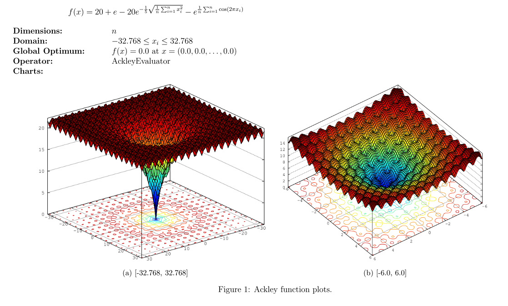

# 最优化 {ignore=true}

[TOC]

关于优化，有一点是极其重要的：**永远没有一劳永逸、放之四海而皆准的最优化方法**，虽然有一些通用的框架来做优化，但针对不同的函数还是有不同的特殊优化方法，所以，独特的观察和设计永远是必需的。

## 基础优化算法

可行集 D 的性质显然对优化问题的解影响巨大。一般情况下，我们至少假设 D 是连续的。
当 D 是一个凸多面体的时候，最优化问题就一定是线性规划的，这主要依赖了凸集中的任何一点都可以由顶点线性表出这个特征性质。对于线性规划问题，单纯形法----被认为是二十世纪最为重要的十个算法之一---提供了几乎完美的解决。

当 f 不连续的时候，我们能做的也很有限，所以我们一般也至少假设 f 为连续函数。(有时甚至假设 f 可微)

我们主要考虑三个问题：是否有最优解，解是否唯一以及怎样计算解

### 梯度下降法

梯度下降法是求解无约束最优化问题的一种常见方法，优点是实现简单。

$$
\theta ^ { t } = \theta ^ { t - 1 } + \Delta \theta \\\
\begin{align}
L \left( \theta ^ { t } \right) &= L \left( \theta ^ { t - 1 } + \Delta \theta \right) \\\
& \approx L \left( \theta ^ { t - 1 } \right) + L ^ { \prime } \left( \theta ^ { t - 1 } \right) \Delta \theta
\end{align}
$$

#### 参数更新方法

##### BGD

批量梯度下降: 算法在读取整个数据集后累加来计算损失函数的的梯度

$$
w - = \eta \nabla _ { w } L ( w )
$$

##### SGD

随机梯度下降: 每读入一个数据都会立刻计算损失函数的梯度来更新参数．

$$
w - = \eta \nabla _ { w _ { i } } L \left( w _ { i } \right)
$$

##### Mini-BGD

选择小批量数据进行梯度下降

<aside class='caution'>
很多深度学习文献资料中说的 SGD，通常都是指 mini-batch 梯度下降
</aside>

##### weight decay

$$
\boldsymbol { \theta } _ { t + 1 } = ( 1 - \lambda ) \boldsymbol { \theta } _ { t } - \alpha \nabla f _ { t } \left( \boldsymbol { \theta } _ { t } \right)
$$

##### Momentum

动量法

[Why Momentum really works](https://distill.pub/2017/momentum/) by Distill, 写的像一篇优美的散文。

> A lower bound, courtesy of Nesterov [5], states that momentum is, in a certain very narrow and technical sense, optimal. Now, this doesn’t mean it is the best algorithm for all functions in all circumstances. But it does satisfy some curiously beautiful mathematical properties which scratch a very human itch for perfection and closure. But more on that later. Let’s say this for now — momentum is an algorithm for the book.

SGDM： SGD with Momentum

##### NAG

NAG（Nesterov accelerated gradient）: SGD with Nesterov Acceleration ， 基于 Nesterov 动量的算法

##### AdaGrad

对于经常更新的参数，我们已经积累了大量关于它的知识，不希望被单个样本影响太大，希望学习速率慢一些；对于偶尔更新的参数，我们了解的信息太少，希望能从每个偶然出现的样本身上多学一些，即学习速率大一些。

AdaGrad 算法能够在训练中自动的对学习速率 α 进行调整，对于出现频率较低参数采用较大的 α 更新；相反，对于出现频率较高的参数采用较小的 α 更新。Adagrad 非常适合处理稀疏数据。很明显，AdaGrad 算法利用的是一阶导数。

##### RMSprop

root mean square propagation

$$
V _ { t } = \beta _ { 2 } * V _ { t - 1 } + \left( 1 - \beta _ { 2 } \right) g _ { t } ^ { 2 }
$$

##### AdaDelta

##### Adam

名字派生自短语 `adaptive moments`
是对 RMSProp 优化器的更新

把一阶动量和二阶动量都用起来

无脑用 Adam 可不行！

`The Marginal Value of Adaptive Gradient Methods in Machine Learning`

> Despite the fact that our experimental evidence demonstrates that adaptive methods are not advantageous for machine learning, the Adam algorithm remains incredibly popular. We are not sure exactly as to why ……

`On the Convergence of Adam and Beyond` 探讨了 Adam 算法的收敛性，通过反例证明了 Adam 在某些情况下可能会不收敛。

##### Nadam

`Nesterov + Adam = Nadam`

##### ND-Adam

Normalized Direction-preserving Adam

#### 更新方法总结

几乎每个参数优化更新方法，都是在优化这几步。

对 SGD

$$
m _ { t } = g _ { t } ; V _ { t } = I ^ { 2 }
$$

对 SGDM

$$
m _ { t } = \beta _ { 1 } \cdot m _ { t - 1 } + \left( 1 - \beta _ { 1 } \right) \cdot g _ { t }
$$

一阶动量是各个时刻梯度方向的指数移动平均值，约等于最近$1 / \left( 1 - \beta _ { 1 } \right)$ 个时刻的梯度向量和的平均值。

也就是说，t 时刻的下降方向，不仅由当前点的梯度方向决定，而且由此前累积的下降方向决定。 \beta_1 的经验值为 0.9，这就意味着下降方向主要是此前累积的下降方向，并略微偏向当前时刻的下降方向。想象高速公路上汽车转弯，在高速向前的同时略微偏向，急转弯可是要出事的。

NAG 在步骤 1，不计算当前位置的梯度方向，而是计算如果按照累积动量走了一步，那个时候的下降方向：

$$
g _ { t } = \nabla f \left( w _ { t } - \alpha \cdot m _ { t - 1 } / \sqrt { V _ { t - 1 } } \right)
$$

| 算法     | 优点 | 缺点                                                           |
| -------- | ---- | -------------------------------------------------------------- |
| BGD      |      | 数据处理量大，导致梯度下降慢，不能在线更新；占内存             |
| SGD      |      | 降速度慢，而且可能会在沟壑的两边持续震荡，停留在一个局部最优点 |
| mini-BGD |      |                                                                |

<table>
    <tr>
        <td >
animation
</td>
        <td >
animation 
</td>
    </tr>
</table>

### 牛顿法

二阶泰勒展开

$$
L \left( \theta ^ { t } \right) \approx L \left( \theta ^ { t - 1 } \right) + g \Delta \theta + h \frac { \Delta \theta ^ { 2 } } { 2 } \\\
可取 \Delta \theta = - \frac { g } { h } \\\
则 \theta ^ { t } = \theta ^ { t - 1 } + \Delta \theta = \theta ^ { t - 1 } - \frac { g } { h } \\\
推广到高维，则有  \theta ^ { t } = \theta ^ { t - 1 } - H ^ { - 1 } g
$$

### 拟牛顿法

Quasi-Newton Methods

海森矩阵的逆矩阵求解麻烦，近似之

### 共轭梯度法

Conjugate Gradient

### 拉格朗日乘子法

针对有等式约束的

### KKT 条件

针对不等式约束的情形

$$
\begin{array} { c } { X = \operatorname { argmin } f ( X ) } \\\ { h _ { k } ( X ) = 0 ; k = 1,2 \ldots , n } \\\ { g _ { l } ( X ) \leq 0 ; l = 1,2 \ldots , m } \end{array}
$$

### 启发式优化方法

包括经典的模拟退火方法、遗传算法、蚁群算法以及粒子群算法等等。

还有一种特殊的优化算法被称之多目标优化算法，它主要针对同时优化多个目标（两个及两个以上）的优化问题，这方面比较经典的算法有 NSGAII 算法、MOEA/D 算法以及人工免疫算法等。

## 凸优化方法

[An overview of gradient descent optimization algorithms](http://ruder.io/optimizing-gradient-descent/)

### 常用迭代方法

#### L-BFGS

L-BFGS 是基于牛顿优化算法的，牛顿优化算法使用的是二阶导数。

### 约束优化

### 子模

submodular functions/亚模/次模函数

参考 Jeffrey A. Bilmes 教授的 [教程](http://j.ee.washington.edu/~bilmes/classes/ee596b_spring_2014/)

[Fast large-scale optimization by unifying stochastic gradient and quasi-Newton methods](http://arxiv.org/pdf/1311.2115v7.pdf)

[Numerical Optimization: Understanding L-BFGS](http://aria42.com/blog/2014/12/understanding-lbfgs/)

### ADMM(alternating derection method of multipliers)

### Proximal Algorithms

## 组合优化

所谓组合优化，指的是在**参数域为离散但是取值空间巨大的问题中搜索最值的过程**。

典型的组合优化问题包括：

- TSP(旅行商问题)
  给定 N 个城市的坐标，找到遍历这些城市的最短可行路径
-

Neural Combinatorial Optimization with Reinforcement Learning.
参见[这个 notebook](https://github.com/higgsfield/np-hard-deep-reinforcement-learning/blob/master/Neural%20Combinatorial%20Optimization.ipynb)

那么问题来了，什么是神经组合优化？

Nestrov

## 在线优化 (Online Optimization)

### OGD

online gradient descent

### 截断梯度法 （TG, Truncated Gradie )

### 前向后向切分（FOBOS, Forward-Backward Splitting）

### 正则对偶平均（RDA, Regularized Dual Averagin

### FTRL

## 非凸优化

经常出现的一个假设条件 Lipschitz Condition.

$$
\| f ( x ) - f ( y ) \| \leqslant L \| x - y \|
$$

## 常用的一些检验函数

e.g.
[Ackley Function ](https://dev.heuristiclab.com/trac.fcgi/wiki/Documentation/Reference/Test%20Functions)

## 参考

- [Online Learning and Online Convex Optimization](http://www.cs.huji.ac.il/~shais/papers/OLsurvey.pdf) Foundations and Trends in
  Machine Learning 系列之一本
- [ ] OPTutorial ，本地已下载，待读
