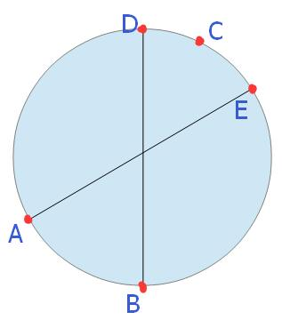
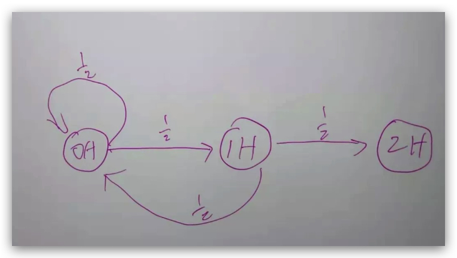
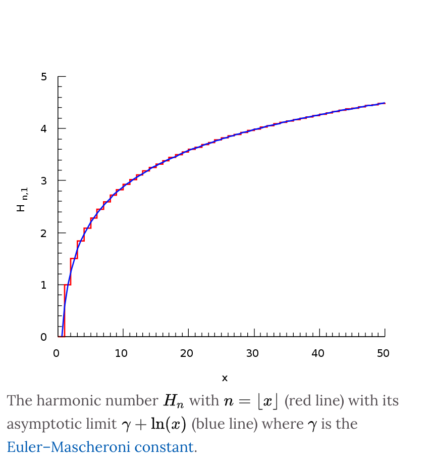
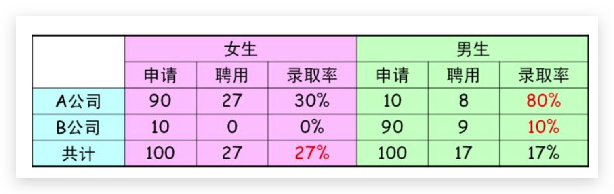
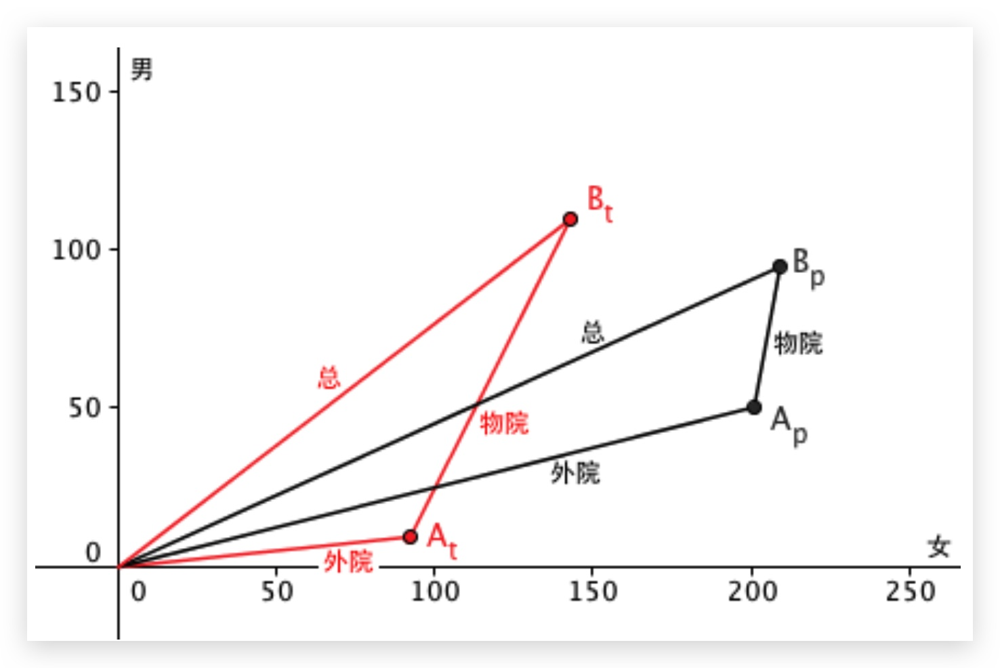

# 概率 {ignore=true}

[TOC]

## 基本理论

矩母函数

### 大数定律

设 X1,X2,...,Xn 是**独立同分布**的随机变量，记它们的公共均值为 μ。又设它们的方差存在并记为 σ2。则对任意给定的 ε>0，有

$$
\lim _ { n \rightarrow \infty } P \left( \left| \overline { X } _ { n } - \mu \right| \geq \varepsilon \right) = 0 \quad \ldots ( 1 - 1 )
$$

### 中心极限定理

独立同分布下

$$
Y _ { n } = \frac { \sum _ { i = 1 } ^ { n } X _ { i } - n \mu } { \sqrt { n } \sigma }
$$

服从正态分布。

对二项分布

$$
\lim _ { n \rightarrow \infty } P \left\\{ a < \frac { x _ { n } - n p } { \sqrt { n p ( 1 - p ) } } \leq b \right\\} = \int _ { a } ^ { b } \frac { 1 } { \sqrt { 2 } \pi } e ^ { - \frac { t ^ { 2 } } { 2 } d t }
$$

不是 iid 的情况下也是可以的，只要所研究的随机变量如果是有大量独立的而且均匀的随机变量相加而成，那么它的分布将近似于正态分布

## 常见概率题

### 桶中取黑白球

黑白球各 100，每次取出 2 个，如是两个同色球则放入一个黑球，不同则放入一个白球，最后桶中只剩一个黑球的概率？

显然每次减少一个球，因此，最终剩余的球不是白球就是黑球。

一黑一白再放白，白不变
两百再放黑，白的数量减去 2，
因此，白的数要么不变，要么减去 2，不可能变为 1
因此，黑球的概率为 1

把白球想象成 1，黑球想象成 0，从 100 个 0 和 100 个 1 中取出两个数，做异或运算，将结果再放进去。相当于这些数不断做异或，最后的结果为 0，即黑球。

### 吃苹果

有一苹果，两个人抛硬币来决定谁吃这个苹果，先抛到正面者吃。问先抛这吃到苹果的概率是多少？

$sum_n{\frac 1 {2^n}}$ 对 $n$ 为奇数，求得 $\frac 2 3 $

    如果从自然数中随机选一个数，那么选到 1 的概率是多少？

这个概率不是 0，因为，如果是 0，则选出 2 的概率也是 0， 选出任意一个自然数的概率都是 0，根据概率的公理化定义中的可数可加性（即 **可数个互不相容事件的并集的概率为各事件概率之和**），从自然数中选自然数出来的概率为 0，而不是 1！这显然是不对的。

### 平均要取多少个(0,1)中的随机数才能让和超过 1。

答案： e 次， 其中 e 是自然对数的底

### 概率计算

    54 张牌，平均分成 6 份，求大小王在一起的概率？

暴力法： 分母全排列 $54!$, 分子的话，先选哪一堆有 6 种选择，然后优先安排大王有 9 种选择，然后小王有 8 种选择，剩下的 52 张全排列 $52!$
简单法： 无论如何，大王会在一个堆中(概率为 1)，这一堆还剩 8 个位置，剩余 53 张牌来分，那概率就是 $\frac 8 {53}$

<h3 style="color: inherit;line-height: inherit;margin-top: 1.6em;margin-bottom: 1.6em;font-weight: bold;border-bottom: 2px solid rgb(239, 112, 96);font-size: 1.3em;">题目描述
</h3>

> 长度为 1 的线段，随机选 2 点将其分为 3 段，求这 3 段可以构成三角形的概率

注意分母为 $\frac 1 2$ ， 分子为 $\frac 1 8$， 因此为 $\frac 1 4$

> 在圆环上随机选取 3 个点，这 3 个点组成锐角三角形的概率

易知，当 A、B、C 三点都在同一个半圆内时，三角形 ABC 必是直角或钝角三角形；只有当三点不在同一个半圆内，才可以组成锐角三角形。于是问题等价于“在圆周上任取三个不同的点，求它们不在同一半圆内的概率”。

    <figure align='center'>
        
    </figure>

如上图，假设应选定了 AB 两点，则第三点 C 的范围必须在 DE 之间

假设 AB 的夹角为 $\theta$， 则 $\theta$ 服从 $[0,\pi]$ 上的均匀分布（概率密度为 $\frac 1 \pi$）,此时组成锐角三角形的概率为 $\frac \theta {2\pi}$， 因此有

$$
\int _ { 0 } ^ { \pi } \frac { \theta } { 2 \pi } \cdot \frac { 1 } { \pi } d \theta = \left. \frac { \theta ^ { 2 } } { 4 \pi ^ { 2 } } \right| _ { 0 } ^ { \pi } = \frac { 1 } { 4 }
$$

另外，注意到，任取三角形，圆心落在三角形内、外、边上正好对应着锐角，钝角和直角三角形，因此，也可以说，任取三角形，圆心落在三角形内的概率为 $\frac 1 4$, 落在三角形外的概率为 $\frac 3 4$, 落在三角形边上的概率为 0

更进一步思考： 这里的 4 是怎么来的呢？
可以这么想： 这个过程可以描述为，先随机选择两条直径，随机选择第三个点，然后两条直径各自可以选择一个点，总共 4 中情况，其中只有一种可以覆盖圆心，隐私概率是 $\frac 1 4$

这种思考方式可以扩展到球面上的情况！

> 从球面上选择四个点，以他们为顶点组成的四面体，球心落在四面体内部的概率是多少？

随机选 3 条直径和一个点，每条直径选一个点，总共有 8 种情况，其中能覆盖球心的只有一种，因此答案为 $\frac 1 8$

更一般地，在 $R^n$ 空间选择 $n+1$ 个点，能够覆盖圆心的概率是多少？ 答案是 $\frac 1 {2^n}$
(从而也可以看到，对一维空间即一条线，随机选择两个点能够包含原点的概率为 $\frac 1 2$, 而从 0 维空间即单点选择一个点，能够覆盖原点的概率为 1)

参见 [如何优雅地解答最难数学竞赛的压轴题？](https://www.bilibili.com/video/av17275211/) by 3Blue1Brown

> 圆上任选三点组成三角形，求三角形的面积的数学期望。

不妨假设是单位圆。

知乎上有个解法如下
分别连接圆心到三角形的三个顶点，夹角分别为 $\alpha, \beta, 2\pi - \alpha - \beta$
根据三角形的面积公式 $S = \frac 1 2 ab \sin c$，有

$$
\int _ { 0 } ^ { 2 \pi } \int _ { 0 } ^ { 2 \pi - \alpha } \frac { 1 } { 2 } [ \sin \alpha + \sin \beta + \sin ( 2 \pi - \alpha - \beta ) ] \cdot \frac { 1 } { 2 \pi ^ { 2 } } d \alpha d \beta = \frac { 3 } { 2 \pi }
$$

> 在单位圆内随机取三个点组成三角形，面积的期望是多少？

$\frac {35} {48\pi}$

> 在边长为 1 的正方形中随机取三个点，构成三角形的面积期望是多少？

$\frac {11} {144}$

> 求球面上随机均匀分布的三点所围的球面三角形的面积的期望？

把三角形的三条边延长变成大圆，这样我们就是三刀把一个球面切成了八部分，这八部分是对称的，我们的球面三角形只是八部分中的一个，因为八部分加起来是球面总面积 $\pi r^2$， 因此
球面三角形面积的期望是 $\frac {\pi r^2} 2$

> 三角形中线组成的三角形面积等于这个三角形面积的多少？

首先把三角形的面积公式写成叉乘的形式

$$
S = \frac { 1 } { 2 } | \vec { a } | | \vec { b } | \sin \theta = = \frac { 1 } { 2 } | \vec { a } \times \vec { b } |
$$

三条中线的向量为

$$
\vec { u } = \frac { 1 } { 2 } \vec { a } + \frac { 1 } { 2 } \vec { b } \\\
\vec { v } = - \frac { 1 } { 2 } \vec { a } + \frac { 1 } { 2 } ( \vec { b } - \vec { a } ) = \frac { 1 } { 2 } \vec { b } - \vec { a } \\\
\vec { w } = - \frac { 1 } { 2 } \vec { b } + \frac { 1 } { 2 } ( \vec { a } - \vec { b } ) = \frac { 1 } { 2 } \vec { a } - \vec { b }
$$

$\vec { u } + \vec { v } + \vec { w } = \overrightarrow { 0 }$， 因此这三条中线仅需通过平移即可构成三角形。

$$
\begin{aligned} S ^ { \prime } & = \frac { 1 } { 2 } | \vec { u } \times \vec { v } | \\\ & = \frac { 1 } { 2 } \left| \left( \frac { 1 } { 2 } \vec { a } + \frac { 1 } { 2 } \vec { b } \right) \times \left( \frac { 1 } { 2 } \vec { b } - \vec { a } \right) \right| \\\ & = \frac { 1 } { 4 } \cdot \frac { 1 } { 2 } | ( \vec { a } + \vec { b } ) \times ( \vec { b } - 2 \vec { a } ) | \\\ & = \frac { 1 } { 4 } \cdot \frac { 1 } { 2 } | \vec { a } \times \vec { b } + \vec { b } \times \vec { b } - 2 ( \vec { a } \times \vec { a } ) - 2 ( \vec { b } \times \vec { a } ) | \\\ & = \frac { 1 } { 4 } \cdot \frac { 1 } { 2 } | \vec { a } \times \vec { b } + \vec { b } - \vec { b } - 2 ( \vec { a } \times \vec { b } ) | \\\ & = \frac { 3 } { 4 } \cdot \frac { 1 } { 2 } | \vec { a } \times \vec { b } | \\\ & = \frac { 3 } { 4 } S \end{aligned}
$$

<h3 style="color: inherit;line-height: inherit;margin-top: 1.6em;margin-bottom: 1.6em;font-weight: bold;border-bottom: 2px solid rgb(239, 112, 96);font-size: 1.3em;">题目描述
</h3>

> 8 个学生环状坐，随机抄袭邻座卷，没被抄袭人数的期望是多少？（8 个人玩三国杀，每个人都有杀，贾诩发动乱舞，没被砍到的人数的期望是多少？）

> 6 个人 a,b,c,d,e,f 坐成环形，从 a 开始传递帽子，向左向右传递的可能性分别是 1/2，一旦所有人都有传递到过这个帽子，传递停止，问最后一个被传递到帽子的人最可能是谁？

圆环内随机游走 遍历所有节点需要的步数的期望

cover time

<h3 style="color: inherit;line-height: inherit;margin-top: 1.6em;margin-bottom: 1.6em;font-weight: bold;border-bottom: 2px solid rgb(239, 112, 96);font-size: 1.3em;">题目描述
</h3>

> 给你一连串的括号。一对括号()的基准分数是 1 分。一对括号()里面如果嵌套了 x 对括号，那么这对括号值 2x 分。

A

> 平均要抛多少次硬币，才能出现连续两次正面向上？

解法一 状态转移

状态 1：没有一个正面，我们用 0H 表示
状态 2：连续一个正面，用 1H 表示
状态 3：终止状态，连续 2 个正面，2H

假设从状态 1 开始，期望需要 x 次到状态 3，

那么根据状态转移图：

$$
x = \frac { 1 } { 2 } ( x + 1 ) + \frac { 1 } { 2 } \cdot \frac { 1 } { 2 } ( x + 2 ) + \frac { 1 } { 2 } \cdot \frac { 1 } { 2 } \cdot 2
$$

解得 $x = 6$

解法二： 利用全概率公式，更一般的解法

设 $N_k$ 是出现 K 次连续成功需要的试验次数的一个解。则 $E(N_k)$ 为所求。

则有

$$
E \left( N _ { k } | N _ { k - 1 } \right) = N _ { k - 1 } + p + ( 1 - p ) \left[ 1 + E \left( N _ { k } \right) \right]
$$

由全概率公式，

$$
\begin{align}
E \left( N _ { k } \right) = & E \left[ E \left( N _ { k } | N _ { k - 1 } \right) \right] \\\
= & E \left( N _ { k - 1 } \right) + p + ( 1 - p ) \left[ 1 + E \left( N _ { k } \right) \right]
\end{align}
$$

移项得

$$
E \left( N _ { k } \right) = \frac { 1 } { p } + \frac { E \left( N _ { k - 1 } \right) } { p }
$$

可解得

$$
\begin{align}
E \left( N _ { k } \right) = & \frac {(1 - p^n)} {p^n(1-p)}\\\
= & \frac { 1 } { p } + \frac { 1 } { p ^ { 2 } } + \ldots \ldots + \frac { 1 } { p ^ { k } }
\end{align}
$$

因此，当抛硬币的时候，$ p = \frac 1 2$， 因此，连续出现 2 次需要抛的次数期望为 6，连续出现 5 次正面需要的次数的期望为 62

    甲乙两人各自连续抛一个公平的硬币， 甲胜出的条件是甲连续抛出两次正面(HH)，
    乙胜出的条件是乙抛出一次正面紧接着一次反面(HT).
    问两人谁的赢面大？

如上题，甲的期望是 6 次，我们看看乙的期望。

乙必须先跑出一个正面，期望 2 次。
下一次，如果跑出正面，则需要的次数加 1；如果跑出反面，则完成。
因此 $ x = \frac { 1 } { 2 } \cdot ( 1 + x ) + \frac { 1 } { 2 } \cdot  3 $
解得 $x = 4$
因此，乙的赢面更大！

<h3 style="color: inherit;line-height: inherit;margin-top: 1.6em;margin-bottom: 1.6em;font-weight: bold;border-bottom: 2px solid rgb(239, 112, 96);font-size: 1.3em;">题目描述
</h3>

> 房间内有 100 人，每人有 100 块，每分钟随机给另一个人 1 块，最后这个房间内的财富分布怎样？

    <figure align='center'>
        
        <figcaption>模拟结果</figcaption>
    </figure>

    生了女孩继续生，直到生了男孩，人口比例？

1 比 1， 本质上还是因为生男生女的概率为 0.5 没有变，也就是没有在生产前选择

    有8个箱子，现在有一封信，这封信放在这8个箱子中（任意一个）的概率为4/5,不放的概率为1/5（比如忘记了）,现在我打开1号箱子发现是空的，
    求下面7个箱子中含有这封信的概率

d

    一对夫妻有2个孩子，求一个孩子是女孩的情况下，另一个孩子也是女孩的概率

d

    三门问题

这个问题还有一个版本是 **囚犯问题**。

> 监狱里关了三个囚犯 A、B、C。监狱长决定赦免其中一个人，并且完全随机地选择了一人作为赦免人（另外两个人将被处死）。他将自己的选择告诉了看守，但是要求看守暂时不能泄露被赦免人的姓名。
> 囚犯 A 问看守“谁被赦免了”，看守拒绝回答。
> A 接着问道：“B 和 C 之中谁一定会被处死？”
> 看守心想：“不论谁被赦免，B 和 C 之中一定有一个人会被处死。因此我告诉他这个问题的答案也无妨。”于是看守说 B 会被处死。当然，看守不会说谎。
> 囚犯 A 心想：“A 一开始被赦免的概率是三分之一，现在我知道 B 不是被赦免的那个人，于是只有 A 和 C 是有可能被赦免的人，因此 A 被赦免的概率提升到了二分之一。”
> A 的分析对吗？

囚犯问题不涉及到更换，更具迷惑性。直观上，好像是说 A 和 C 的概率一样。这种直观的想法其实忽略了一点： 守卫在 BC 之间的选择不是随机的！
守卫的答案当然排除了 B 活的可能性。但是在 A 活的情况下，守卫在 BC 之间选择 B 的概率为 0.5，但是在 C 活的情况下，守卫选择 B 的概率为 1！就是这点差别！有没有利用到守卫选择时的信息，造成了两种答案的差别。

从这里我们也更加认识到，信息的出现会让一些概率坍塌，改变原来的分布。

这个题最好按照贝叶斯公式写出概率，否则容易迷惑。

    有50个红球，50个蓝球，如何放入两个盒子中使得拿到红球的概率最大

dd

    某城市发生了一起汽车撞人逃跑事件，该城市只有两种颜色的车，蓝20%绿80%，事发时现场有一个目击者，他指证是蓝车，但是根据专家在现场分析，当时那种条件能看正确的可能性是80%，那么，肇事的车是蓝车的概率是多少？

A: 0.5

    元首会面

A

    54 张派发给 3 个人，求至少有一个拿到炸弹（仅指四张同点的）的概率

A

    2 个人抛硬币，谁先抛出正面谁赢。求先抛的人获胜的概率

Ans. 2/5.
提示：

    混乱的登机问题

<h3 style="color: inherit;line-height: inherit;margin-top: 1.6em;margin-bottom: 1.6em;font-weight: bold;border-bottom: 2px solid rgb(239, 112, 96);font-size: 1.3em;">题目描述
</h3>

> 平均需要多少袋干脆面才能集齐 108 将？

[**Coupon collector's problem**](https://www.wikiwand.com/en/Coupon_collector%27s_problem)
思路： 集齐第一张需要 1 张； 集齐第二张，概率为 $\frac {107} {108}$， 因此期望为 $\frac {108} {107}$， 同理，第三张的概率为 $\frac {106} {108}$， 平均需要 $\frac {108} {106}$ ...... 因此，总数为 $108 \\{ 1 + \frac {1} {2} + \cdots + \frac {1} {108} \\}$， 大约是 569 张
这个问题居然和调和级数( Harmonic Number )扯上了关系。

$$
H _ { n } = 1 + \frac { 1 } { 2 } + \frac { 1 } { 3 } + \cdots + \frac { 1 } { n } = \sum _ { k = 1 } ^ { n } \frac { 1 } { k }
$$

调和级数可以写成积分形式 $H _ { n } = \int _ { 0 } ^ { 1 } \frac { 1 - x ^ { n } } { 1 - x } d x$ (注意到 $\frac { 1 - x ^ { n } } { 1 - x } = 1 + x + x ^ { 2 } + \cdots + x ^ { n - 1 }$)

调和级数的近似解： $\ln(n+1) + \gamma$
推导：

$$
\begin{align}
\sum _ { i = 1 } ^ { n } \frac { 1 } { i } &= \sum _ { i = 1 } ^ { n } \int _ { i } ^ { i + 1 } \frac { 1 } { \lfloor x \rfloor } d x \\\
&= \int _ { 1 } ^ { n + 1 } \frac { 1 } { x } + \frac { 1 } { \lfloor x \rfloor } - \frac { 1 } { x } d x \\\
&= \int _ { 1 } ^ { n + 1 } \frac { 1 } { x } d x + \int _ { 1 } ^ { n + 1 } (\frac { 1 } { \lfloor x \rfloor } - \frac { 1 } { x }) d x \\\
& \approx \ln ( n + 1 ) + \gamma
  \end{align}
$$

关于调和级数，可以证明，除了 1 之外，全都不会是整数！

$$
\gamma = \lim _ { n \rightarrow \infty } \left[ \left( \sum _ { k = 1 } ^ { n } \frac { 1 } { k } \right) - \ln ( n ) \right] = \int _ { 1 } ^ { \infty } \left( \frac { 1 } { \lfloor x \rfloor } - \frac { 1 } { x } \right) d x
$$

$\gamma$ 常数的定义和来源别忘记了，它衡量的就是调和级数与自然对数之间的差！$S _ { n } = \sum _ { k = 1 } ^ { n } \frac { 1 } { k } - \ln n$ 的极限（证明：单调递减，有下界，递增和下界的证明都用到我们最喜欢的不等式$\ln(1+x) < x$，且下界证明用到正的无穷小，并且出现了我们最喜欢的连续消去，递减的证明用到了负的无穷小！）

这个问题和多项分布之前是什么关系呢？

进一步： 如果 108 将出现的概率不一样呢？

    扩展一个：如何画出 $\ln n$ 的面积？

提示： 积分 $\int _ { 1 } ^ { n } \frac { 1 } { x } d x$

        前 n 位数里有多少个含有 8 的数字？

| n   | n_all       | n_with_8   | n_with_8_ratio |
| --- | ----------- | ---------- | -------------- |
| 1   | 10          | 1          | 10%            |
| 2   | 100         | 19         | 19%            |
| 3   | 1000        | 271        | 27.10%         |
| 4   | 10000       | 3439       | 34.40%         |
| 5   | 100000      | 40951      | 41%            |
| 6   | 1000000     | 468559     | 46.90%         |
| 7   | 10000000    | 5217031    | 52.20%         |
| 8   | 100000000   | 56953279   | 57%            |
| 9   | 1000000000  | 612579511  | 61.30%         |
| 10  | 10000000000 | 6513215599 | 65.10%         |

100% ，其实这意味着，二者的势相同而已。

### 排列组合

- partition number
  每个正整数有多少划分方式？
  第一种： 可以取 0
  第二种： 不可以取 0

- 名额分配
-

### 生成随机数

随机数发生器构造，一般通过拒绝采样法

    一个随机数发生器以概率 p 生成 0,1-p 生成 1，由此发生器生成一个生成 0 与 1 的均匀发生器

提示： 找出两个发生概率相同的事件，各自编码为 1 和 0 即可

自然想到产生 n 位随机数，保留只有一位为 1 的组合，舍弃其余的

还可以优化： n 位置可以减少到 ck2 大于 n 的 最小 k

    用上述得到的 0 与 1 的均匀发生器生成 1 到 N 的均匀发生器

提示：考虑 N 的二进制

    用两个六面体生成 1 到 4，其中 1 的概率为 0.4,2 的概率为 0.3,3 的概率为 0.2,4 的概率为 0.1

提示：

    一个六面体，出现 1,2,3,4 的概率均为 1/5，出现 5,6 的概率均为 1/10.构造一个 1 到 9 的均匀发生器。

提示：

    由 rand7() 生成 rand10()

提示：

    给你一个硬币，你如何获得2/3的概率。

dd

    带权采样问题

n 个元素，n 个对应权值。

    从单位圆盘上随机选择一点，距离圆心的距离期望是多少？

因为这个点肯定在某一条直径上，相当于在直径上随机选点，那么期望不应该就是 $\frac 1 2$ 吗？
但是，整体一想，肯定是落在离圆心远一点的概率大啊，期望肯定比 $\frac 1 2$ 大。

因为按照周长来想，距离为 a 的点分布在 $2\pi a$的周长上，距离 $\frac a 2$ 的点分布在周长 $\pi a $上，直接差了一倍。

我们先看分布函数。 $F(L <= r)$ 显然就是半径为$L$ 的圆所占面积，因此 $F(L <= r>) = r^2$， 因此密度函数为 $f(x) = 2x$ ， 因此期望 $E = \int_0^1 x*2x = \frac 2 3$

    假设有一个家庭，有两个孩子，现在告诉你其中有一个男孩，请问另一个也是男孩的概率是多少？

$\frac 1 3$

    按照姓氏连wifi 的期望尝试次数

假设 张王李赵 的概率分别为 0.4,0.3,0.2,0.1
需要尝试的次数期望?

可以有两种思路：

1. 常规，注意 2 的概率为 0.6 \* 0.5
2. 真实是张，则 1 次，真实是王，则需 2 次

可得结果为 2

    n 男 m 女随意排列成一排， X 为第一个男人所在的位置，求 EX

所求期望可以理解为是有多少女人排在男人之前的期望 + 1。

首先， 对某个女人$i$，其排在 全部男人之前则记为 $X_i$， 则 $E(X_i)= p(X_i = 1) =  \frac 1 {n+1}$ (相当于 n 个男人和 1 个女人排队，女人排在第一位的概率)

因此，$E(X) = 1 + \sum_i^m E{X_i} = 1 + \frac {m} {n+1}$

    箱子里1个绿球，2个红球，3个黄球，4个蓝球。主持人随机取一个球出来再放回去，与该球同颜色的球成为了幸运球。接下来你每次从箱子里取一个球出来不放回。你平均要取多少次才能取到幸运球？

加入主持人随机选中的是红球，则，从箱子里取出第一个红球的次数，就相当于是 2 个红球和 8 个其他球排队，第一个红球的期望位置，按照上面的题目结论可知为 $1 + \frac 8 3 $
由此可得，大概期望为 3

    在一副扑克牌中，我平均要随机抽几张出来，才能抽出一张黑桃？

黑桃占$\frac 1 4$ ，因此平均抽 4 次？

按照上面题的结论，应该是 $1 + \frac {39} {13+1}$, 大约是 3.786, 比 4 次少
这是为什么呢？
注意到这里和投骰子的区别： 投骰子之间是独立的，而摸牌的时候，一旦摸到了不是黑桃的牌，那么剩下牌堆中黑桃的比例就增大了。

其实，这正好是 **Negative hypergeometric distribution**

> 从 N 个样本中无放回抽样(成功的次数为$K$)，直到 $r$次失败，描述此时有 $k$ 次成功的概率。(注意是以 R 次失败作为停止条件)

其期望为

$$
\frac {rK} {N-K+1}
$$

我们将抽到黑桃看做一次失败，抽到其他花色视为一次成功，则当我们失败 1 次的时候，已经成功过的次数的期望为

$$
\frac {1*39} {52-39+1}  = \frac {39} {14}
$$

此时，抽的次数为 1 + $\frac {39} {14}$

    辛普森悖论

    连续统假设在当前的公理化集合论中，既不能证明也无法否定！

神迹

    百囚徒挑战

想一想两个囚徒的情况： 随机打开一个，成功的概率为 $\frac 1 4$ ，但是，如果两个人打开同一个，成功的概率为 0，两个人打开不同的，则成功的概率为 $\frac 1 2$ !

每个囚徒的策略，就是首先打开与自己编号相同的抽屉，从中取出号码牌，并打开号码牌所对应的抽屉。之后，重复此过程，直到找到自己的号码牌，或者 50 个抽屉的机会用完。

https://www.zhihu.com/question/330408241/answer/771199310

竟然有 0.312 的概率，比直觉上的那种小概率大得多！

    赌徒破产问题 如果甲一开始有 a 元，乙一开始有 b 元，那么甲将乙的钱全部赢完的概率是多少？

https://zhuanlan.zhihu.com/p/31144203

    垒硬币的方法

卡特兰数
https://zhuanlan.zhihu.com/p/31585260

    稳定匹配

https://zhuanlan.zhihu.com/p/47114226

    友谊定理

https://zhuanlan.zhihu.com/p/50576676

    计划生育外星人

一个外星人来到地球后，它每天都会在以下 4 件事中等可能地选择一件完成：

(1)自我毁灭

(2)分裂成两个外星人

(3)分裂成三个外星人

(4)什么也不做

此后每天，每个外星人都会做一次选择，且彼此之间互相独立，求地球上最终没有外星人的概率。

解答： $f(1) = \frac 1 4 + \frac 1 4 {f(1)} + \frac 1 4 {f(1)}^2 + \frac 1 4 {f(1)}^3 $， 解得 $f(1) = \sqrt 2 -1$

这道题可能给人的困惑是： 外星人的数量期望是无穷大的，但是仍然有较高的概率灭绝。

实际上可以证明，灭绝概率为 1 当且仅当一个外星人分裂的个数的期望小于等于 1，且分布不退化（即不能永远什么都不做）。也就是说，灭绝概率是不是 1 只和期望有关，和具体的分布无关。

    风险投资

当前资产为 S，下一时刻 以 0.5 的概率变为 0.9S，0.5 概率变为 1.11 S
分析最终的结果

下一时刻的资产期望为 1.005S， 看来是有正收益的，那是否一直这样投资下去就行呢？

资产的期望的极限为无穷大，但是资产本身的极限是 0！
（极少数的人获得极高的利润）

    小黄鸭

4 只鸭子出现在同一个半圆内的概率。

randomly distribute n points on the circumference of a circle.
Whatis the probability that they will all fall in a common semi-circle?

这个题其实是对之前圆上选 3 点组成锐角三角形的另外一种拓展： 圆上任意选 n 个点，在一侧的概率。

显然，n 取 1 和 2 的时候的概率都是 1，3 的概率即组成钝角三角形的概率，为 $\frac 3 4$

下面证明这个概率为 $\color{blue} {\mathbf {\frac n {2^{n-1}}}}$

注意，和下面这道题的区别：
在[0, 2$\pi$]d 长度上随机选 n 个点，求

$$
P(\max{(X_1,X_2,\cdots, X_n)}− \min{(X_1,X_2,\cdots, X_n)}< \pi)
$$

最大值减去最小值实际上也被称为极差。

次序统计量的分布。

https://mathpages.com/home/kmath327/kmath327.htm

    平均多少个 [0, 1] 的随机数之和才大于 1?

A: $e$
进一步，这个和的期望是多少？
A: $\frac e 2$

    平均多少个 [a, b] 间的随机数之和才大于 c？
