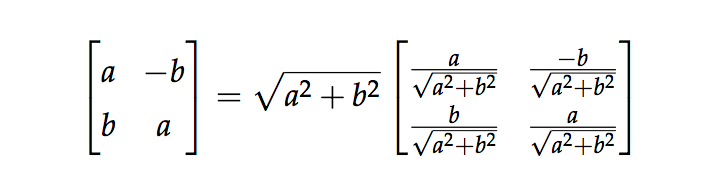
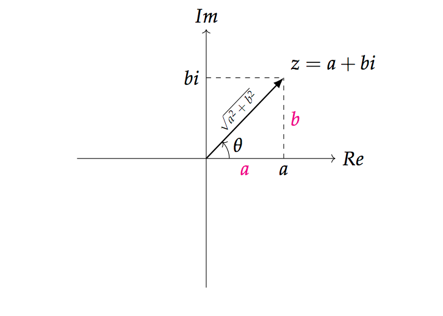
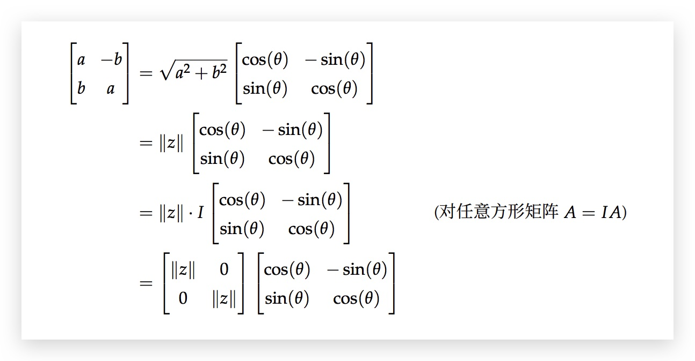
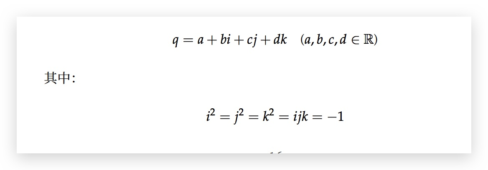
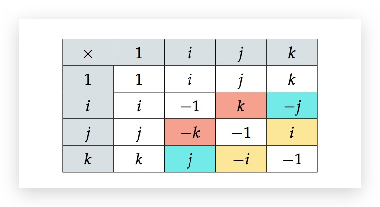
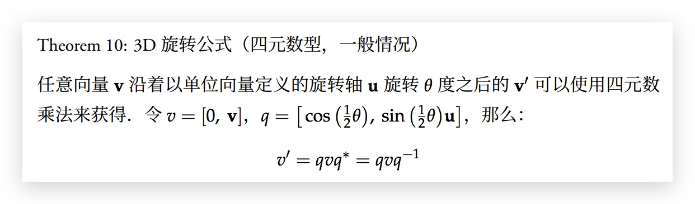

# 四元数

## 复数和二维空间中的旋转

a+bi 的矩阵形式

$$
\left[\begin{array}{cc}{a} & {-b} \\\ {b} & {a}\end{array}\right]
$$

在矩阵形式下，两个复数的相乘就是矩阵的相乘！且 1 就是单位矩阵，满足 $i^2=-1$
由此说明复数和矩阵形式存在关联！

左侧为缩放矩阵，右侧为旋转矩阵。（旋转矩阵的复数形式 $\cos(\theta) + i \sin(\theta)$）

然后可以看下对两个基的变换，由此可以直观感受到旋转和缩放，并理解复数的相乘其实是旋转与缩放变换的复合。

再根据欧拉公式，就得到了复数的极坐标形式

$$
z = re^{i\theta}
$$

这样的话，复数就和实部虚部无关了，而只和缩放因子和旋转角度有关。

可以验证，旋转的复合也是满足的（即依次转两个角度等价于一次转角度和）

## 三维旋转

右手方向。

在轴角的表示方法中，需要知道 4 个参数： 轴的 x,y,z 坐标，以及旋转角。
这里其实是多了一个自由度，实际上，三维旋转只需要 3 个自由度，轴的长度并不是必须的（可以把模长定为 1，这样就消去了一个自由度）。

## 四元数

四元数的乘法是不遵循交换律的。

三维向量用纯四元数（没有实部）来表示。

> 单位四元数与 3D 旋转有一个「2 对 1 满射同态」(2-1 Surjective
> Homomorphism) 关系，或者说单位四元数双倍覆盖 (Double Cover) 了 3D

两个不同的单位四元数 q 与 −q 对应的其实是同一个旋转.因此是 2 对 1.

## 参考

[四元数](https://krasjet.github.io/quaternion/quaternion.pdf)
