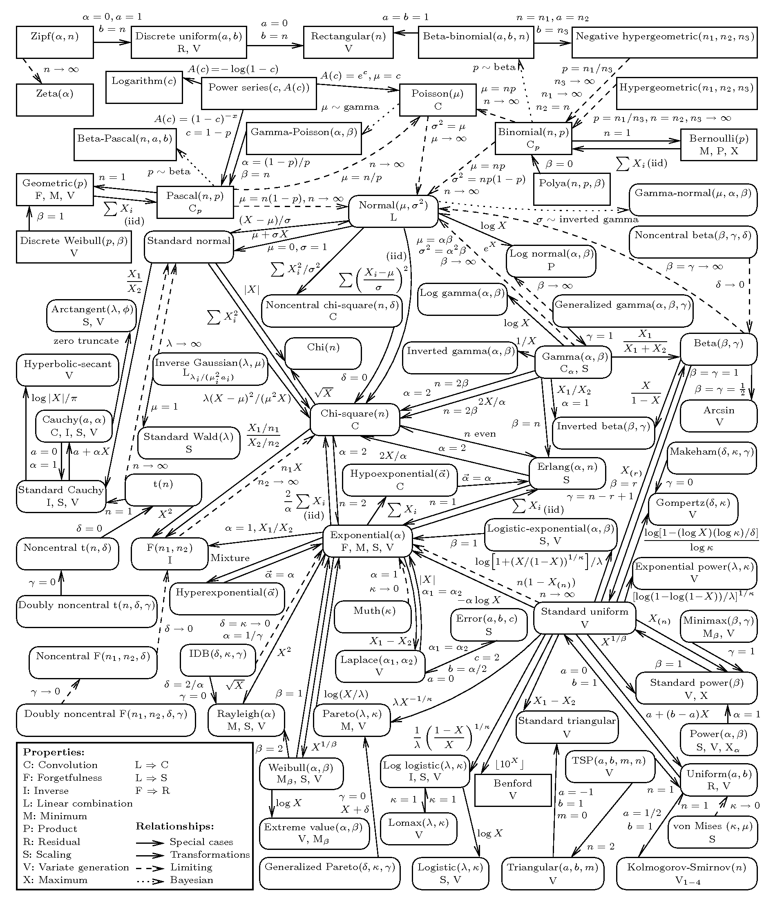

# 统计分布

    <figure align='center'>
        
        <figcaption>http://www.math.wm.edu/~leemis/chart/UDR/UDR.html</figcaption>
    </figure>

## Beta 分布

$$
\begin{aligned} f ( x ; \alpha , \beta ) & = \frac { x ^ { \alpha - 1 } ( 1 - x ) ^ { \beta - 1 } } { \int _ { 0 } ^ { 1 } u ^ { \alpha - 1 } ( 1 - u ) ^ { \beta - 1 } d u } \\\ & = \frac { \Gamma ( \alpha + \beta ) } { \Gamma ( \alpha ) \Gamma ( \beta ) } x ^ { \alpha - 1 } ( 1 - x ) ^ { \beta - 1 } \\\ & = \frac { 1 } { \mathrm { B } ( \alpha , \beta ) } x ^ { \alpha - 1 } ( 1 - x ) ^ { \beta - 1 } \end{aligned}
$$

性质

1. $\mu = E ( X ) = \frac { \alpha } { \alpha + \beta }$
2. $\operatorname { Var } ( X )  = \frac { \alpha \beta } { ( \alpha + \beta ) ^ { 2 } ( \alpha + \beta + 1 ) }$

> Beta 分布是二项分布的共轭先验

## 多项式分布

例如，掷骰子

$$
\left \\{ x _ { 1 } , x _ { 2 } , \cdots , x _ { k } \right\\}= \frac { n ! } { m _ { 1 } ! m _ { 2 } ! \cdots m _ { k } ! } \prod _ { i = 1 } ^ { n } p _ { i } ^ { m _ { i } } \\\
\sum _ { i = 0 } ^ { n } p _ { i } = 1 \\\
\sum _ { i } ^ { k } m _ { i } = n
$$

## Dirichlet 狄利克雷分布

> Dirichlet 分布则是多项式分布的共轭先验

## 指数分布族

$$
p ( y ; \eta ) = b ( y ) \exp \left( \eta ^ { T } T ( y ) - a ( \eta ) \right)
$$

$e ^ { - a ( \eta ) }$ 本质上起着规范化常数的作用

## 多元正态分布

$$
p ( x ; \mu , \Sigma ) = \frac { 1 } { ( 2 \pi ) ^ { n / 2 } | \Sigma | ^ { 1 / 2 } } \exp \left( - \frac { 1 } { 2 } ( x - \mu ) ^ { T } \Sigma ^ { - 1 } ( x - \mu ) \right)
$$
