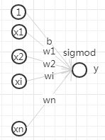

# 常用算法总览 {ignore=true}

[TOC]

> One good thing about doing machine learning at present is that people actually use it!

## LR

逻辑回归是广义线性模型，从其函数形式来看，LR 模型可以看做是一个没有隐层的神经网络模型（感知机模型）。

    <figure align='center'>
        
    </figure>

### 模型

模型的假设：对数几率(称为 logit)是特征的线性函数。化简后即为

$$
h _ { \theta } ( x ) = \frac { 1 } { 1 + e ^ { - \theta ^ { T } x } }
$$

### 求解

损失函数为交叉熵
按照极大似然法估计：

$$
P ( Y | X ; \theta ) = \prod _ { i = 1 } ^ { N } \left( h _ { \theta } \left( x ^ { ( i ) } \right) ^ { y ^ { ( i ) } } \left( 1 - h _ { \theta } \left( x ^ { ( i ) } \right) ^ { 1 - y ^ { ( i ) } } \right) \right)
$$

这个极大似然函数和交叉熵损失函数其实可以看做是一致的。

sigmoid 函数的求导：

$$
s ^ { \prime } ( x ) = \mathrm { s } ( \mathrm { x } ) \cdot ( 1 - \mathrm { s } ( \mathrm { x } ) )
$$

因此，对 $y\log h + (1-y) \log{(1-h)}$ 求导得：

$$
y \frac {xh(1-h)} {h} + (1-y) \frac {-xh(1-h)}{1-h} = (h-y)x
$$

LR 这种线性模型很容易并行化，处理上亿条训练样本不是问题,同时可解释性强。
但这种解法的不足是，因为线性模型的学习能力有限，需要引入大量的领域知识来人工设计特征以及特征之间的交叉组合来间接补充算法的非线性学习能力，非常消耗人力和机器资源，而且即使有经验的工程师也很难穷尽所有的特征交叉组合。

像 LR 这样的 wide 模型学习特征与目标之间的直接相关关系，偏重记忆（memorization），如在推荐系统中，wide 模型产生的推荐是与用户历史行为的物品直接相关的物品。这样的模型缺乏刻画特征之间的关系的能力，比如模型无法感知到“土豆”和“马铃薯”是相同的实体，在训练样本中没有出现的特征组合自然就无法使用，因此可能模型学习到某种类型的用户喜欢“土豆”，但却会判定该类型的用户不喜欢“马铃薯”。

为了让线性模型能够学习到原始特征与拟合目标之间的非线性关系，通常需要对原始特征做一些非线性转换。常用的转换方法包括：连续特征离散化、特征之间的交叉等。

**特征离散化相当于把线性函数变成了分段线性函数，从而引入了非线性结构**。比如不同年龄段的用户的行为模式可能是不同的，但是并不意味着年龄越大就对拟合目标（比如，点击率）的贡献越大，因此直接把年龄作为特征值训练就不合适。而把年龄分段后，模型就能够学习到不同年龄段的用户的不同偏好模式。离散化的其他好处还包括对数据中的噪音有更好的鲁棒性（异常值也落在一个划分区间，异常值本身的大小不会过度影响模型预测结果）；离散化还使得模型更加稳定，特征值本身的微小变化（只有还落在原来的划分区间）不会引起模型预测值的变化。

特征交叉是另一种常用的引入非线性性的特征工程方法。通常 CTR 预估涉及到用户、物品、上下文等几方面的特征，往往单个特征对目标判定的贡献是较弱的，而不同类型的特征组合在一起就能够对目标的判定产生较强的贡献。比如用户性别和商品类目交叉就能够刻画例如“女性用户偏爱美妆类目”，“男性用户喜欢男装类目”的知识。特征交叉是算法工程师把领域知识融入模型的一种方式。

## 岭回归

普通线性回归加上 L2 正则项

$$
\sum_{i=1}^n (y_i - \theta ^Tx_i)^2+\lambda \left||\theta\right||^2
$$

## LASSO

$$
\sum_{i=1}^n (y_i - \theta ^Tx_i)^2+\lambda \left||\theta\right||_1
$$

## 最近邻

- 近似最近邻(ANN, approximate nearest neighbour)

  annoy ： python 库
  [new-approximate-nearest-neighbor-benchmarks-2018 年](https://erikbern.com/2018/06/17/new-approximate-nearest-neighbor-benchmarks.html)

  [hnsw](https://github.com/nmslib/hnsw): python 库

    - LSH(locality-sensitive hashing)

        基本思想：将原始数据空间中的两个相邻数据点通过相同的映射或投影变换（projection）后，这两个数据点在新的数据空间中仍然相邻的概率很大，而不相邻的数据点被映射到同一个桶的概率很小
        参考博文：[局部敏感哈希介绍](http://blog.csdn.net/icvpr/article/details/12342159)

## 奇异值分解

参考 [SVD](./mf.md#SVD)

## 决策树和 XGBoost

## 随机森林

[Awesome Random Forest](http://jiwonkim.org/awesome-random-forest/)

减小列采样的数量或者减小树的深度，都能减小相关性，从而降低随机的方差。但泛化误差从来都不只和方差有关系，方差的减小往往意味着偏差的增加

其它参数不变，增加树的数量，偏差不变；方差减小，方差下限为 [公式]

随机森林主要是在降低模型的方差。与此相对比，Boosting 方法主要是在降低模型的偏差

## 其他

- 感知机
- 支持向量机

- 朴素贝叶斯
- 极大后验概率(MAP)
- 贝叶斯估计
  - 和 MAP 的最大区别：MAP 假设参数是固定值，而贝叶斯估计假设未知参数也是随机变量。

* 隐马尔科夫
  模型 model = (初始状态, 转移矩阵, 观测概率)

  - 学习问题：已知观测，估计模型，采用 EM 算法
  - 概率计算：在已知模型下得到特定观测的概率，采用前向/后向算法
  - 解码问题：已知模型和观测序列，求最大可能的状态序列，采用维特比算法

- 概率图模型
- 条件随机场

## 集成方法(Ensembling)专题

集成方法现在真是火的不要不要的。
参考　[Kaggle Ensembling Guide](http://mlwave.com/kaggle-ensembling-guide/) 一文

- AdaBoost
- GradientBoost

- xgboost

## Semi-supervised Learning 半监督学习

针对只有极少部分数据有标记而大量数据无标记的情形
参考 [半监督学习](http://www.cnblogs.com/liqizhou/archive/2012/05/11/2496155.html)

常用假设： 聚类假设、流形假设。在聚类假设下，大量未标记示例的作用就是帮助探明示例空间中数据分布的稠密和稀疏区域, 从而指导学习算法对利用有标记示例学习到的决策边界进行调整, 使其尽量通过数据分布的稀疏区域。流形假设是指处于一个很小的局部邻域内的示例具有相似的性质,因此, 其标记也应该相似。这一假设反映了决策函数的局部平滑性。和聚类假设着眼 _整体特性_ 不同, 流形假设主要考虑模型的 _局部特性_。在该假设下,大量未标记示例的作用就是让数据空间变得更加稠密, 从而有助于更加准确地刻画局部区域的特性,使得决策函数能够更好地进行数据拟合。

- transductive learning 直推学习

和半监督学习的不同：直推学习将未标记的数据视作测试样本，学习的目的是在这些测试样本上取得最佳泛化能力，也就是说，学习器的目标就是将有标记的样本上获得的知识迁移到无标记的样本（如何做到？）； 而半监督学习并不知道要预测的示例是什么。简单理解为：直推学习是一种‘短视’的学习，而半监督更具长远眼光。

active learning 主动学习

学习器与外部环境有交互，即进行场外援助：对一些样本，学习器向外界求助。

- PU Learning

Learning from Positive and Unlabeled Examples
属于部分监督学习（Partially Supervised Classification）

能拿到的数据只有正样本，和一大堆未标记的样本。
正样本可能来自人工标记等方式，可能量也不会太多，在这种场景下，我们非常希望有一种方式能够学习到我们在标注这一批正样本的时候所暗含在内的‘智慧’。

这就是 PU Learning 的用武之地了: 通过标注过的正样本和大量未标注的样本训练出一个二元分类器。

由于没有负样本，传统的监督学习方式就不能用了，或者说，不能直接用。

PU learning 的思路，其实也不复杂：没有负样本，就先选出来一些作为负样本嘛。有了负样本就能训练模型了。这就是 two-stage-strategy
问题是，如何选取可靠的负样本呢（Reliable Negative Examples，RN）？

理论上已经证明：如果最大化未标注样本集 U 中负样本的个数，同时保证正样本被正确分类，则会得到一个性能不错的分类器。

遵循这个想法，具体的选择 RN 的方式有：

1. 朴素贝叶斯

（1）把 P 中的每个样本标记为类别 1；
（2）把 U 中的每个样本标记为类别-1；
（3）使用 P 和 U 训练得到贝叶斯分类器；
（4）对 U 中的每个样本使用上述分类器进行分类，如果分类结果为-1，则把该样本加入 RN。

间谍法
从正样本中划分出一部分间谍到负样本集合中去。训练完模型之后，通过间谍们的概率值，确定阈值。对 U 中所有小于 该阈值的，归入 RN

更进一步，假如我们认为，分错负样本和正样本的代价是不同的，那么我们就要用到 cost-sensitive-strategy

Building Text Classifiers Using Positive and Unlabeled Examples(2003)

Liu, B., Dai, Y., Li, X. L., Lee, W. S., & Philip, Y. (2002). [Partially supervised classification of text documents](https://www.cs.uic.edu/~liub/S-EM/unlabelled.pdf). In ICML 2002, Proceedings of the nineteenth international conference on machine learning. (pp. 387–394).

Elkan, Charles, and Keith Noto. "Learning classifiers from only positive and unlabeled data." Proceeding of the 14th ACM SIGKDD international conference on Knowledge discovery and data mining. ACM, 2008.
在样本满足一定分布情况下，根据正样本和未标记样本作为负样本训练出来的分类模型，预测出来的结果和该样本属于正样本的概率存在一个固定常数系数

Fusilier, D. H., Montes-y-Gómez, M., Rosso, P., & Cabrera, R. G. (2015). Detecting positive and negative deceptive opinions using PU-learning. Information Processing & Management, 51(4), 433-443

Ryuichi Kiryo, Gang Niu, Marthinus Christoffel du Plessis, and Masashi Sugiyama. "Positive-Unlabeled Learning with Non-Negative Risk Estimator." Advances in neural information processing systems. 2017.

[基于 PU-learning 的分类方法](https://jlunevermore.github.io/2017/04/18/58.PU-Learning/)

[基于 PU-Learning 的恶意 URL 检测](https://xz.aliyun.com/t/2190)

Regularized Greedy Forest 正则化贪心森林(RGF)

## One-Shot-Learning

## 关于机器学习的反思

机器学习并不是万能的。

- [Machine Learning: The High-Interest Credit Card of Technical Debt](http://static.googleusercontent.com/media/research.google.com/en//pubs/archive/43146.pdf) by D. Sculley, et al.

* [Hidden Technical Debt in Machine Learning Systems](https://papers.nips.cc/paper/5656-hidden-technical-debt-in-machine-learning-systems.pdf) by D. Sculley, et al., Google

  机器学习系统中隐藏的技术债。_Not all debt is bad, but all debt needs to be serviced_．　这些技术债包括：复杂的模型可能会悄然改变抽象边界，CACE(change anything changes everything)，数据依赖等

## 资料

- [机器学习](http://wenku.baidu.com/course/view/49e8b8f67c1cfad6195fa705?fr=search) by 余凯、张潼

- [Ruls of Machine Learning](http://martin.zinkevich.org/rules_of_ml/rules_of_ml.pdf)
