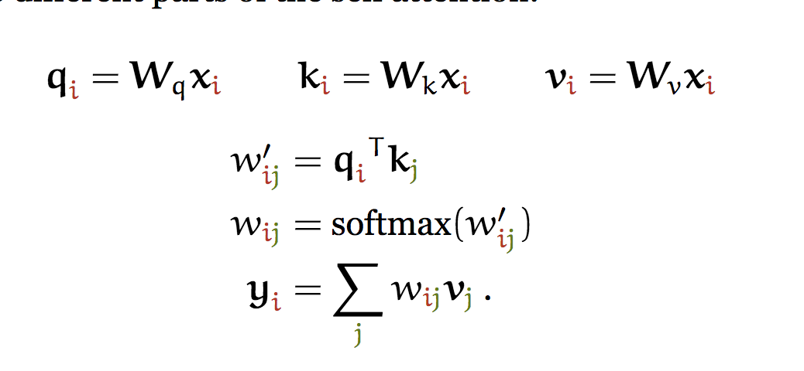
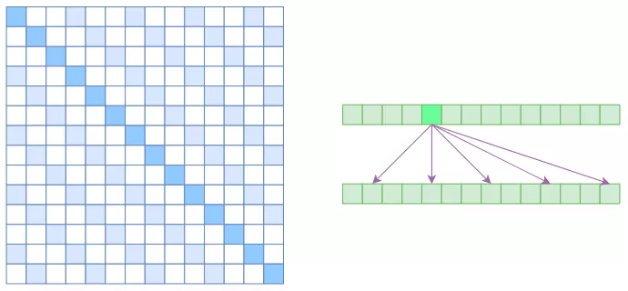
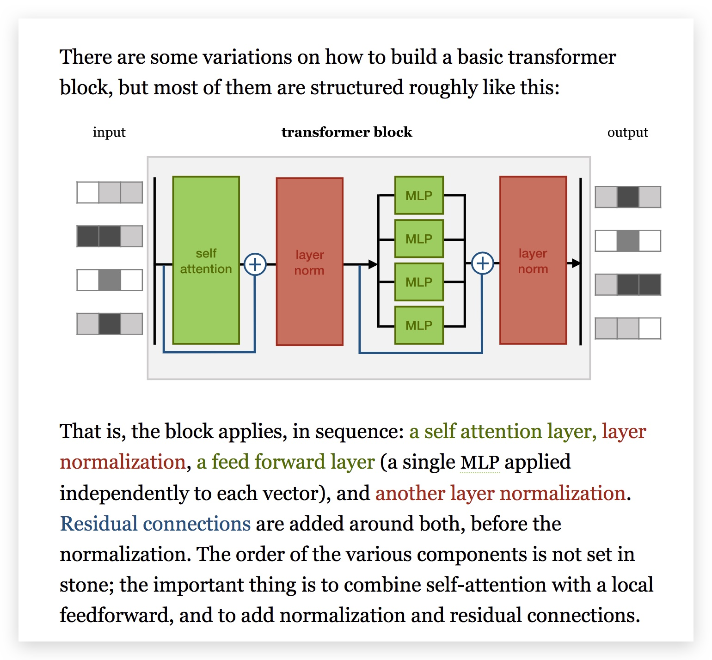

# Attension 专题 {ignore=true}

[TOC]

> 细想神毫注意深

注意力是形成短期记忆的重要环节， 而短期记忆经过回忆确认反复之后才会形成长期记忆。

Attension 大约在 2014 年的时候被引入计算机视觉领域，后来逐渐扩张到了 NLP.

NIPS 2017「Attension is All you Need」论文提出完全用 attention 来做序列转换，抛弃了以往的 CNN 和 RNN 结构，是之后大名鼎鼎的 BERT 的基础。

RNN 结构在语言模型和 Seq2Seq 模型中被广泛使用，但是 RNN 的一个缺陷是无法像 CNN 那样可以并行，这极大的限制了 RNN 的训练.

注意机制的核心问题在于：如何确定在哪里倾注注意力以及如何量化。就好比老师在期末考试复习的时候告诉大家要抓重点，但真正的问题在于重点在哪里。

## Attension

### Self-Attention

$$
\mathbf{y}_{i}=\sum_{j} w_{i j} x_{j}
$$

其中，权重的取法可以是

$$
w_{i j}^{\prime}=x_{i}^{\top} x_{j}
$$

当然，可以先将权重 softmax 归一化。

例如，`the cat walks on the street`

这里也可以看到，self-attension 将输入视为集合，而不是序列，即 permutation equivariant.

```python
raw_weights = torch.bmm(x, x.transpose(1, 2))
weights = F.softmax(raw_weights, dim=2)
y = torch.bmm(weights, x)
```

多头： 多个头权重矩阵。



$$
w_{i j}^{\prime}=\frac{\mathbf{q}_{i}^{\top} \mathbf{k}_{j}}{\sqrt{k}}
$$

软对齐模型(soft alignment models) 和硬对齐模型(hard alignment models)

Global （Soft）和 Local （Hard） Attention

硬注意机制每次只注意一个地方，而软注意机制只在一个地方倾注相对更多的注意而已。因此，前者需要随机抽样，需要的计算量相对少一些，而后者是确定性的，虽然计算量大一点，但可以用后向传播训练并因此容易嵌入其他网络。

图片描述和 MT 的区别：前者存在一个粒度(granularity)问题。比如，应该说图片中有一只猫，还是说有一只看起来很慵懒的眯着眼睛的大花猫？

和 显著图 (Saliency Map) 的区别和联系:

<aside class='key-point'>
bottom up saliency, top down attention
</aside>

2017 Google 「Attension is All You Need」

本质上来说，都是抛弃了 RNN 结构来做 Seq2Seq 任务。

NLP 领域一般都采用基于 RNN 的 Attension 机制，

### 基于 RNN 的注意力机制

### Multi-Head Attension

### Self Attension

### Position Embedding

### Position Encoding

### Atrous Self Attention

<div align="center">
    <figure align='center'>
        
        <figcaption>Atrous Self Attention的注意力矩阵（左）和关联图示（右）.</figcaption>
    </figure>
</div>

## Adversarial Attention

## Transformer

[TRANSFORMERS FROM SCRATCH](http://www.peterbloem.nl/blog/transformers)

> Transformer = Attension in NLP

构建在已有的 Encoder-Decoder 框架下

A transformer is not just a self-attention layer, it is an architecture

Normalization and residual connections are standard tricks used to help deep neural networks train faster and more accurately. The layer normalization is applied over the embedding dimension only.



**position embeddings**

**position encodings**

## 工具和应用

- [Recurrent Models for Visual Attention](http://arxiv.org/abs/1406.6247)

- [Neural Machine Translation by Jointly Learning to Align and Translate by Dzmitry Bahdanau, et al., ICLR 2015.](http://arxiv.org/abs/1409.0473)

  这篇文章应该是最早将注意机制从视觉引入自然语言处理的，Yoshua Bengio 也是作者之一。我们知道，基于深度学习的机器语言翻译采用的是 _编码-解码_ 的方式，通过对解码端引入视觉机制，减轻了编码端的压力。

- [Encoding Source Language with Convolutional Neural Network for Machine Translation by Fandong Meng, et al., 中科院](http://arxiv.org/abs/1503.01838)

  也是机器翻译领域的。

- [Effective Approaches to Attention-based Neural Machine Translation by Minh-Thang Luong, et al., EMNLP 2015, camera-ready version](http://arxiv.org/abs/1508.04025)

  集成了全局和局部两种注意机制后得到的结果更好。

- [A Neural Attention Model for Abstractive Sentence Summarization by Alexander M.Rush, et al., 2015](http://arxiv.org/abs/1509.00685)

  首次将注意机制引入了句子摘要问题。

- [DRAW: A Recurrent Neural Network for Image Generation by Karol Gregor, et al., Google, 2015](http://arxiv.org/abs/1502.04623)

  提出了一种被称作 _DRAW_(deep recurrent attentive writer) 的用以生成图片的网络架构。主要的一个观察：人在作画的时候也不是一笔挥就一蹴而成，而是经过不断的调整、修改细节才最终成型。因此，DRAW 每次会注意到某个部分，将之修改. 问题在于，如何确定这个注意部分呢？
  和传统的注意机制的不同之处：传统的注意机制中，注意是在解码阶段被引入的，并且不会去影响到编码阶段，而 DRAW

- [Teaching Machines to Read and Comprehend by Karl Moritz Hermann, et al.,Google, NIPS 2015, to appear](http://arxiv.org/abs/1506.03340)

  教会机器阅读理解。构建了一个 _（（文档，提问），答案）_ 数据集。两个模型，_attentive reader_ 和 _impatient reader_. 后者需要一遍又一遍地重读文档，

- [Learning Wake-Sleep Recurrent Attention Models by Jimmy Ba, 2015](http://arxiv.org/abs/1509.06812)

  Ruslan Salakhutdinov 也是作者之一。采用了硬注意机制(hard attention mechanism)，

- [Not All Contexts Are Created Equal: Better Word Representations with Variable Attention by Wang Lin, et al.](http://www.cs.cmu.edu/~lingwang/papers/emnlp2015-2.pdf)

  不得不说，文章名称非常有吸引力，

- [Show, Attend and Tell: Neural Image Caption Generation with Visual Attention by Kelvin Xu, et al., 2015](http://arxiv.org/abs/1502.03044)

* [Predicting the Next Location: A Recurrent Model with Spatial and Temporal
  Contexts by Qiang LIu, et al., 中科院](http://www.shuwu.name/sw/Predicting%20the%20Next%20Location%20A%20Recurrent%20Model%20with%20Spatial%20and%20Temporal%20Contexts.pdf)

      时空上下文。

- spatial transformer networks 空间变换网络
  spatial transformer ： affine transformasion ，projective transformation、 thin plate spline（薄板样条）

* [PyTorch implementation of Spatial Transformer Network (STN) with Thin Plate Spline (TPS)](https://github.com//WarBean/tps_stn_pytorch)

## 参考

- [Survey on Attension-based Models Applied in NLP, 2015.10.07](http://yanran.li/peppypapers/2015/10/07/survey-attention-model-1.html)
- [Survey on Attention-based Models Applied in NLP](http://yanran.li/peppypapers/2015/10/07/survey-attention-model-1.html)
