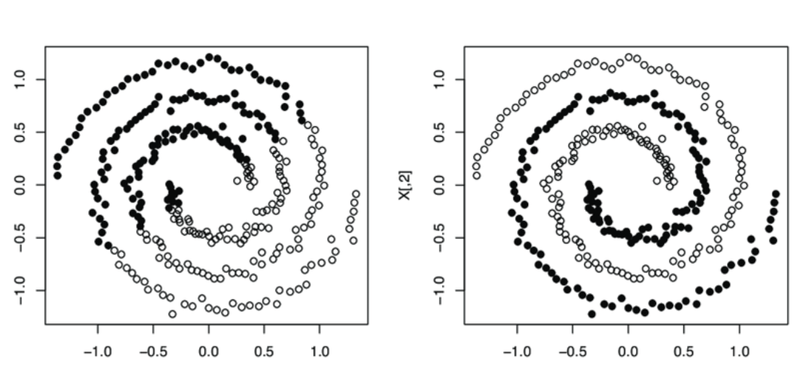

# 聚类算法专题

[TOC]

## 常用算法

### 层次聚类法

### K-Means

Kmeans 的缺点： 无法度量确定性（有些点应该是非常容易分割的，但是有些点其实属于混淆地带，但是 kmeans 均一视同仁）

    <figure align='center'>
        
        <figcaption>Clustering the spirals dataset with k-means (left) and spectral clustering (right)</figcaption>
    </figure>

显然， Kmeans 对螺旋分布效果不好。

可以证明的是 K-means 完全可以保证收敛性, 但不能保证取得的最小值是全局最小值。 为了防止陷入局部最优， 可以选取不同的初始值跑多遍 k-means，然后取其中最小的 损失对应的结果输出。

为什么说 Kmeans 是 EM 算法的特例呢。

首先回到初始问题，我们目的是将样本分成 k 个类，其实说白了就是求每个样例 x 的隐含类别 y，然后利用隐含类别将 x 归类。由于我们事先不知道类别 y，那么我们首先可以对每个样例假定一个 y 吧，但是怎么知道假定的对不对呢？怎么评价假定的好不好呢？我们使用样本的极大似然估计来度量，这里是就是 x 和 y 的联合分布 P(x,y)了。如果找到的 y 能够使 P(x,y)最大，那么我们找到的 y 就是样例 x 的最佳类别了，x 顺手就聚类了。但是我们第一次指定的 y 不一定会让 P(x,y)最大，而且 P(x,y)还依赖于其他未知参数，当然在给定 y 的情况下，我们可以调整其他参数让 P(x,y)最大。但是调整完参数后，我们发现有更好的 y 可以指定，那么我们重新指定 y，然后再计算 P(x,y)最大时的参数，反复迭代直至没有更好的 y 可以指定

### DBSCAN

### 谱聚类

### BIRCH

## 参考

- [Python Data Science Handbook ](https://jakevdp.github.io/PythonDataScienceHandbook/05.12-gaussian-mixtures.html)
