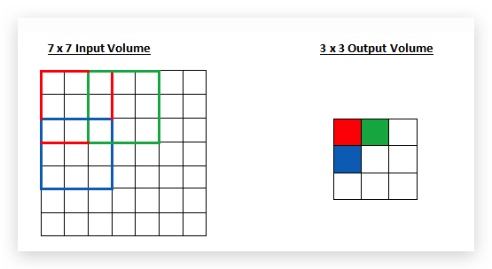
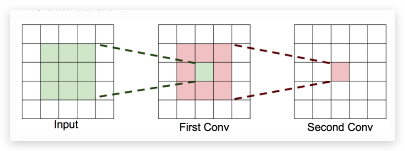

# CNN {ignore=true}

[TOC]

CNN 四大手段：局部连接／权值共享／池化操作／多层次结构

CNN 已经有了诸多成熟的架构

空洞卷积原理
focal loss

## 基本原理

### 卷积

**stride**
每次移动卷积核的步长可以大于 1，可以减少输出的空间维度实现降维。 如下图所示的例子，它的 stride=2，输出的空间维度在每个维度上都大约减少了一半。 另一个角度来看，它相当于将下采样的功能集中到卷积层当中

**1-1 卷积**

**卷积核分解**

用两层的 3x3 卷积可以达到和一层 5x5 卷积相同的可视范围

**深度分离卷积**
深度分离卷积（Depthwise Separable Convolution）由 Xception 的作者 Chollet 提出， 将卷积层的两个功能——空间卷积核特征通道全连接完全分解为两个部分

**分组卷积**
分组卷积(Group Convolution)最早来自 AlexNet

## 经典结构

### 1998-LeNet-5

被誉为是卷积神经网络的“Hello Word”

### 2012-AlexNet

Hinton 团队的 AlexNet 可以算是开启本轮深度学习浪潮的开山之作了。由于 AlexNet 在 ImageNet LSVRC-2012（Large Scale Visual Recognition Competition）赢得第一名，并且错误率只有 15.3%（第二名是 26.2%），引起了巨大的反响。相比较之前的深度学习网络结构，AlexNet 主要的变化在于激活函数采用了 Relu、使用 Dropout 代替正则降低过拟合等。

共有 8 层网络。
采用 ReLU 主要考虑的是加快训练速度。
Dropout 大约使得收敛的迭代次数翻倍了

### 2014-VGG-Net

Visual Geometry Group

> 问： 如何设计网络结构以提高精度？
> 答： 使用较小的卷积核，更深的网络层

> It's not complicated, it's just a lot of it - 费曼描述宇宙

所有的卷积核大小都是 3x3 的

采用 Caffe 作为深度学习框架并开源了模型。

### 2014-googleNet

[Going deeper with convolutions](http://arxiv.org/pdf/1409.4842.pdf)

提出了 Inception 结构

### 2015-ResNet

论文 `Deep Residual Learning for Image Recognition` 提出的残差网络，荣获 CVPR2016 年度最佳论文。

自从深度神经网络在ImageNet大放异彩之后，后来问世的深度神经网络就朝着网络层数越来越深的方向发展。直觉上我们不难得出结论：增加网络深度后，网络可以进行更加复杂的特征提取，因此更深的模型可以取得更好的结果。

但事实并非如此，人们发现随着网络深度的增加，模型精度并不总是提升，并且这个问题显然不是由过拟合（overfitting）造成的，因为 **网络加深后不仅测试误差变高了，它的训练误差竟然也变高了**。作者提出，这可能是因为更深的网络会伴随梯度消失/爆炸问题，从而阻碍网络的收敛。作者将这种加深网络深度但网络性能却下降的现象称为退化问题（degradation problem）

网络增加了一个跳跃连接，也有说是加飞线

设第 $l$ 层输入向量为 $x_l$，那么输出变为

$$
y _ { l } = F \left( x _ { l } ; W _ { l } \right) + x _ { l }
$$

可以看到，非线性变化实际上是在拟合残差,这也是为什么称作残差连接的原因

为了降低网络参数量和计算复杂度，作者引入了 `BotteleNeck` 结构，在超过 50 层的网络中使用 BottleNeck 来代替原始的残差块

理论上来讲，残差网络（ResNet）已经构造出一种结构，可以不断地增加网络的层数来提高模型的准确率，虽然会使得计算复杂度越来越高。它证实了我们可以很好地优化任意深度的网络。要知道，在那之前，在网络层数达到一定深度后，继续增加反而会使得模型的效果下降！因此，残差网络将人们对深度的探索基本上下了一个定论，**没有最深，只有更深**，就看你资源够不够！

[very deep convolutional networks for large-scale image recognition](http://arxiv.org/pdf/1409.1556.pdf)

#### ResNet 变种

### 其他
- OverFeat

  [OverFeat: Integrated Recognition, Localization and Detection using Convolutional Networks](http://arxiv.org/pdf/1312.6229.pdf)

- R-CNN

  [R-CNN: Regions with Convolutional Neural Network Features](https://github.com/rbgirshick/rcnn)

* ShCNN

  [Shepard Convolutional Neural Networks by Jimmy SJ. Ren, et al., NIPS 2015](https://papers.nips.cc/paper/5774-shepard-convolutional-neural-networks.pdf)

  SenseTime(商汤科技，一家专注于计算机视觉和深度学习原创技术的中国公司)研究人员出品，[代码在此](https://github.com/jimmy-ren/vcnn_double-bladed/tree/master/applications/Shepard_CNN)。可用在超分辨率重建，图像修补等。

* PlaNet

  [PlaNet - Photo Geolocation with Convolutional Neural Networks](http://arxiv.org/abs/1602.05314)

  谷歌的工作，仅用图片的像素来定位图片位置

### 时间卷积网络（Temporal Convolutional Nets, TCNs）

ByteNet, FairSeq

- An Empirical Evaluation of Generic Convolutional and Recurrent Networks for Sequence Modeling

## OctConv

## Dorefa-Net

[论文地址](https://arxiv.org/abs/1606.06160)
