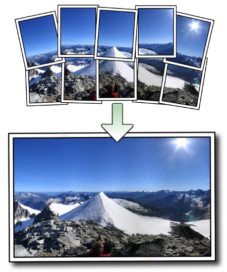

# 传统计算机视觉专题

### 总论

计算机视觉和自然语言处理这两个领域的发展和命运是很相似的：它们在发展过程中都积累了诸多传统方法，但随着深度学习的崛起，传统方法逐渐失去往日的光辉而显得没落，大地上留下的似乎只剩下深度学习那模糊但强壮的身影。

传统的图像处理方法依赖于图片的像素矩阵表示，有了矩阵之后，能做的事情就非常多了，例如二值化，阈值化，色彩均化，滤波（模糊/光滑），形态学开集和闭集，以及联通区域划分，图像金字塔等。这些处理方法在实际当中应用广泛，例如许多图片应用的滤镜/增强/变形效果,以及图片压缩。

上面这些只是针对单张图片的操作，随着照相技术的发展，图片越来越多，因此有了图片的分类以及基于内容的检索等实际的需求。传统机器视觉的方法或者说套路是，先针对问题和对特征的具体要求（例如希望特征具有旋转不变性等）设计一些特征抽取方法，有了特征之后，就能拿去喂给一些机器学习算法去做分类等进行后续的工作了。所以重点集中在了特征的设计这里。简单的特征，如颜色直方图，只是一个简单的统计描述，而其他常用的特征，如 Harris 角点，FAST 角点，图像梯度以及 HOG, LBP(local binary pattern), SIFT 特征以及其变体 SUFT 和 ORB, haar 等，则经过了精心的设计，并且涉及一些诸如利用积分图像来优化计算的技巧，是传统计算机视觉的重要成果。

有了特征之后，能够解决的问题包括边缘检测/轮廓提取，图像分割，图片分类，人脸识别，图片拼接(image stitching)，视觉测距（包括单目视觉测距(Monocular Visual Odometry)和立体视觉测距(Stereo Visual Odometry)）等。

后来视频数据也多了起来。视频无非是一些连续的图片，因此图片处理技术很自然地被扩展到了视频处理上。当然，视频的动态特征也得到了特殊的对待，于是有了均值漂移、GMM（混合高斯模型）等背景建模的方法，以及利用光流法等实现物体的跟踪。

这之后，随着人工智能技术的崛起，深度学习大潮席卷了包括计算机视觉和自然语言处理在内的诸多领域，许多在之前无法有效解决的问题，比如图片语义分割、图片/视频内容描述、图片/视频问答等开始得到解决，许多新的问题，如图片自动生成、图片风格迁移等开始出现，并在深度学习的火炬下显示出无限可能，而传统的方法，那些人工设计特征的时代，似乎正在渐行渐远。

### Saliency

[MIT Saliency Benchmark](http://saliency.mit.edu/datasets.html)

---

### 对象识别

- [Active Object Localization with Deep Reinforcement Learning by Juan C. Caicedo, et al, 2015](http://arxiv.org/abs/1511.06015)

* [Rapid object detection using a boosted cascade of simple features](https://www.cs.cmu.edu/~efros/courses/LBMV07/Papers/viola-cvpr-01.pdf)

2001 年 Paul Viola 和 Michael Jones 在 CVPR 上发表，文章中提出了三个要点：Haar-like 特征，AdaBoost 算法和 Cascade 结构，被称为 _Viola-Jones_ 框架。

[MS COCO 2015 Detection Challenge](http://mscoco.org/dataset/#detections-leaderboard), 微软夺得第一名！[ILSVRC 2015](http://www.image-net.org/challenges/LSVRC/2015/results), 微软遥遥领先！　背后的论文[Deep Residual Learning for Image Recognition by Kaiming He, et al., 2015](http://arxiv.org/pdf/1512.03385.pdf),何凯明牛人。

#### 人脸识别

[Labeled Faces in the Wild](http://vis-www.cs.umass.edu/lfw/)

HMAX(Hierarchical Model and X)

##### 人脸重建

- [What Makes Tom Hanks Look Like Tom Hanks by Supasorn Suwajanakorn, ICCV2015](http://grail.cs.washington.edu/projects/3DPersona/)

  提取个性化情态要素实现表情迁移。[视频效果在此](http://video.weibo.com/show?fid=1034:a6d1ee2afbe1fc4c9cd6a4c91e985683)，很牛叉。

---

#### 车牌号识别

[OpenAlpr](https://github.com/openalpr/openalpr)

---

### 视觉目标追踪专题(VOT, visual object tracking)

VOT 在视频监控、人机交互等方面都是很有用的。

车辆检测、追踪和计数以及车速估计(Vehicle Detection, Tracking and Counting)便是 VOT 中的一个重要子话题。（youtube 上的这个视频展示[Real time vehicle counting and velocity estimation using OpenCV](https://www.youtube.com/watch?v=m_Y3Ym5n8Vc)）

[VOT2015 Challenge](http://votchallenge.net/vot2015/),ICCV2015 的伴随大赛，面向单个物体的短期追踪（无对象的先验模型信息条件下）

VOT 的难点：一是多目标，目标存在交叉、折叠等现象；二是长时追踪，物体在中间过程中可能被树木等短时遮挡，有时甚至需要多个摄像头接力追踪；三是摄像头不固定的情形，比如手持设备拍摄。

- [Understanding and Diagnosing Visual Tracking Systems by Naiyan Wang, et al., ICCV2015](http://winsty.net/tracker_diagnose.html)

  这篇文章旨在评价和比较一些现有的 VOT 框架。作者认为，仅是简单地比较这些方法在一些基准视频上的效果（是骡子是马拉出来溜溜）的做法并不充分，至少这无法让我们理解这些方法的优势和缺陷。

  作者提出的 VOT 系统的理解和诊断方法：将追踪系统分解为　 motion model, feature extractor, observation model, model updater, and ensemble post-processor 　五个部分，通过烧蚀实验，发现特征提取部分是最重要的（这在我们的意料之中），而观察模型（就是具体的判别算法，例如逻辑回归和支持向量机）对效果的影响较小。

  此外，HOG + row color 特征在传统特征中是最好的，但是干不过用 CNN 提取的特征。然并卵，CNN 提取特征计算量不足以实时追踪。

－[Multi-target tracking with Single Moving Camera](http://wwweb.eecs.umich.edu/vision/mttproject.html)

多目标的追踪，单个移动摄像头的情形。核心：估计摄像头参数和追踪目标这两件事一起做。参数估计用 MCMC 粒子滤波法。作者给出的展示视频看起来很强大。

－[Target Tracking with Pan-Tilt-Zoom Cameras](http://users.isr.ist.utl.pt/~jag/msc/1011/msc_ptz.htm)

利用平移－倾斜－变焦摄像头俩追踪目标（电影电视剧中的情节啊）。需要人工选择兴趣域，

---

### 图片检索

主要还是用哈希。用到的哈希方法大概分为两种，一种是数据相关的(因此也被称为 L2H, 即 learning to hash)，一种是数据无关的，比如局部敏感哈希(LSH, locality-sensitive hashing，ANN 的一种)。

L2H 既然是从数据中学习，自然又可以被分为两种：有监督的和无监督的。

- [Feature Learning based Deep Supervised Hashing with Pairwise Labels](http://arxiv.org/abs/1511.03855)

  采用用深度学习方法同时学习特征和哈希编码。

基于内容他的图片搜索(CBIR, content based image retrieval)传统上采用的都是特征匹配的方法，后来有了 CNN 之后，人们将网络的中间隐层激活子作为特征，结合最大池池化(max-pooling) 操作，也取得了不错的效果。

[particular object retrieval with integral
max-pooling of cnn activations, by Giorgos Tolias, et al., ICLR 2016, under review](http://arxiv.org/pdf/1511.05879v1.pdf)

---

### 图片生成专题

图片生成的一大难点可能在于，它是一个开放式问题，而不是确定性的。

- [Sketch2Photo: Internet Image Montage by Tao Chen, et al., 2009](http://mmcheng.net/mftp/Papers/09Sketch2photo.pdf)

  由简笔画生成图片，这个比较具有实际意义。不过，这里的生成其实指的是将搜索到的诸多图片进行 _合成_ 而已，而不同于我们一般理解的完全自主生成。

  文中给出的示例超酷。

* [eyescream](http://soumith.ch/eyescream/)

- [Learning FRAME Models Using CNN Filters 　 by Yang Lu, et al., UCLA](http://www.stat.ucla.edu/~yang.lu/project/deepFrame/main.html)

  基于 CNN 特征生成图片和纹理以及图片和纹理的混合，作为可视化 CNN 的一种。注意 FRAME 是　 Filters, Random field, And Maximum Entropy 　的首字母缩略词。

* [A Neural Algorithm for Artistic Style by Leon A. Gatys, et al., 2015](http://arxiv.org/abs/1508.06576)

  生成艺术图片：将内容和风格解耦并重组，进而创造

  MXNet 实现[在这里](https://github.com/dmlc/mxnet/tree/master/example/neural-style)

* [DRAW: A Recurrent Neural Network for Image Generation by Karol Gregor, et al., Google, 2015](http://arxiv.org/abs/1502.04623)

  提出了一种被称作 _DRAW_(deep recurrent attentive writer) 的用以生成图片的网络架构。主要的一个观察：人在作画的时候也不是一笔挥就一蹴而成，而是经过不断的调整、修改细节才最终成型。因此，DRAW 每次会注意到某个部分，将之修改. 问题在于，如何确定这个注意部分呢？
  和传统的注意机制的不同之处：传统的注意机制中，注意是在解码阶段被引入的，并且不会去影响到编码阶段，而 DRAW

* [Attribute2Image: Conditional Image Generation from Visual Attributes by Xinchen Yan](http://arxiv.org/pdf/1512.00570.pdf)

  这个工作首先听起来很酷：给出一组视觉特征的描述，算法生成符合该描述的图片。但其实文中的示例仅有人脸图像。

---

### 相机标定/场景重建

structure from motion

[OpenSFM](https://github.com/mapillary/OpenSfM)

---

###　其他话题

##### 图像哈希(图像指纹)

主要用以检测重复图像, 也就是图像配准，即，给你两幅图像，通过系统来判定两幅图像是否为同一副图像。

_phash 算法_

Perceptual hash algorithm

离散余弦变换(DCT)来获取图片的低频成分

##### 超分辨率重建

[Single Image Super-Resolution from Transformed Self-Exemplars](https://sites.google.com/site/jbhuang0604/publications/struct_sr)

利用单张图片进行超分辨率重建，实现图像增强

##### 延时视频(hyperlapse)合成

Vincent-Soille 分水岭算法

---

### 前沿

- [Deep Painterly Harmonization](https://arxiv.org/abs/1804.03189)

  - 无缝嵌入，贴合风格。

- [Gaze and the Control of Foot Placement When Walking in Natural Terrain](<http://www.cell.com/current-biology/fulltext/S0960-9822(18)30309-9>)

  自然环境中的行走时落脚点的观察和选择。

- [End-to-end Recovery of Human Shape and Pose](https://akanazawa.github.io/hmr/)
  人类形体和动作的重建。

---

### 工具/数据

[OpenCV](http://opencv.org/)：有此神器，做 CV 的夫复何求

[CV Datasets on the Web](http://www.cvpapers.com/datasets.html) CV 数据分门别类一网打尽

### 资料

1. [Awesome Computer Vision](https://github.com/jbhuang0604/awesome-computer-vision)

2) [面向机器视觉的深度学习资源汇总](http://www.open-open.com/lib/view/open1435818441450.html)
