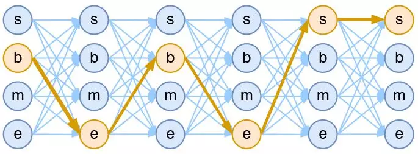

# CRF

条件随机场

CRF 主要用于序列标注问题。

**条件随机场是逻辑回归的序列化版本**。
逻辑回归是用于分类的对数线性模型，条件随机场是用于*序列化标注* 的对数线性模型。

以路径为单位，考虑的是路径的概率。

每一个 HMM 模型都等价于某个 CRF

CRF 要比 HMM 更加强大。

假如一个输入有 $n$ 帧，每一帧的标签有 $k$ 中可能性，那么理论上就有 $k^n$ 中不同的输入. 模型要做的，就是从这么多的可能性中个，选择一条。

    <figure align='center'>
        
        <figcaption>4tag分词模型中输出网络图</figcaption>
    </figure>

$$
\operatorname { score } ( l | s ) = \sum _ { j = 1 } ^ { m } \sum _ { i = 1 } ^ { n } \lambda _ { j } f _ { j } \left( s , i , y _ { i } , y _ { i - 1 } \right)
$$

$f$ 是一个衡量函数，权重为 $\lambda$, $y$ 是 标注。

对其做 softmax 即可。

假设一：该分布是指数族分布

$$
P \left( y _ { 1 } , \ldots , y _ { n } | x \right) = \frac { 1 } { Z ( x ) } \exp \left( f \left( y _ { 1 } , \ldots , y _ { n } ; x \right) \right)
$$

假设二：输出之间的关联仅发生在相邻位置，并且关联是指数加性的。

$$
\begin{aligned} f \left( y _ { 1 } , \ldots , y _ { n } ; \boldsymbol { x } \right) = h \left( y _ { 1 } ; \boldsymbol { x } \right) & + g \left( y _ { 1 } , y _ { 2 } ; \boldsymbol { x } \right) + h \left( y _ { 2 } ; \boldsymbol { x } \right) + \ldots \\\ & + g \left( y _ { n - 1 } , y _ { n } ; \boldsymbol { x } \right) + h \left( y _ { n } ; \boldsymbol { x } \right) \end{aligned}
$$

这也就是说，现在我们只需要对每一个标签和每一个相邻标签对分别打分，然后将所有打分结果求和得到总分。

**线性链 CRF**

尽管已经做了大量简化，但上式所表示的概率模型还是过于复杂，难以求解。

进一步假设函数 g 跟 x 无关

$$
\begin{aligned} f \left( y _ { 1 } , \ldots , y _ { n } ; \boldsymbol { x } \right) = h \left( y _ { 1 } ; \boldsymbol { x } \right) + g \left( y _ { 1 } , y _ { 2 } \right) + h \left( y _ { 2 } ; \boldsymbol { x } \right) + \ldots & \\\ + g \left( y _ { n - 1 } , y _ { n } \right) + h \left( y _ { n } ; \boldsymbol { x } \right) & \end{aligned}
$$

$$
P \left( y _ { 1 } , \ldots , y _ { n } | x \right) = \frac { 1 } { Z ( x ) } \exp \left( h \left( y _ { 1 } ; x \right) + \sum _ { k = 1 } ^ { n - 1 } \left[ g \left( y _ { k } , y _ { k + 1 } \right) + h \left( y _ { k + 1 } ; x \right) \right] \right)
$$

**归一化因子**

为了训练 CRF 模型，我们用最大似然方法，也就是用

$$
-\log P \left( y _ { 1 } , \ldots , y _ { n } | x \right)
$$

作为损失函数，可以算出其等价于

$$
-\left( h \left( y _ { 1 } ; x \right) + \sum _ { k = 1 } ^ { n - 1 } g \left( y _ { k } , y _ { k + 1 } \right) + h \left( y _ { k + 1 } ; x \right) \right) + \log Z ( x )
$$

归一化因子难算，几乎是所有概率图模型的公共难题

幸运的是，在 CRF 模型中，由于我们只考虑了临近标签的联系（马尔可夫假设），因此我们可以递归地算出归一化因子，这使得原来是指数级的计算量降低为线性级别。
