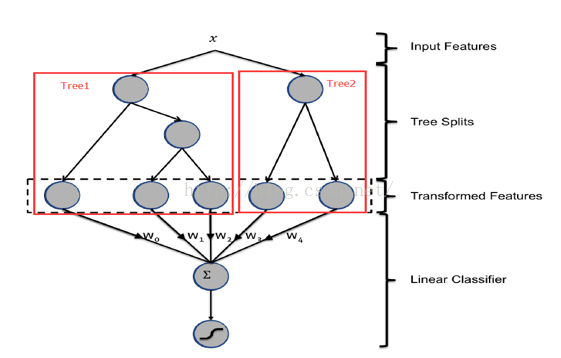
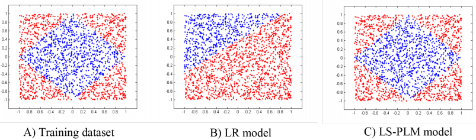
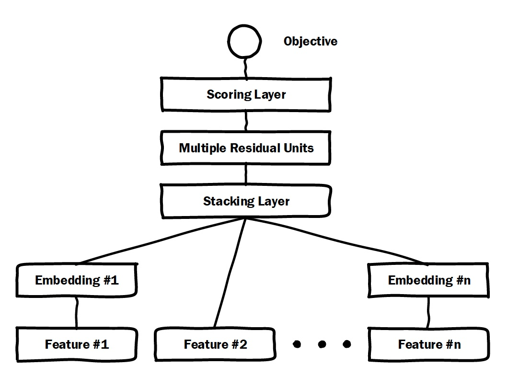
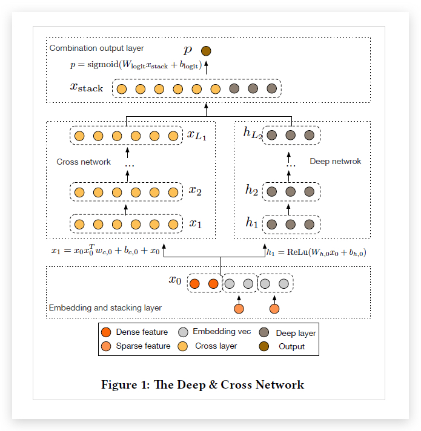

# CTR {ignore=true}

[TOC]

<aside class='key-point'>
CTR 预估中，预估值需要是一个具有实际意义的精准的CTR，而不是仅仅输出广告排序的高低关系
</aside>

## 传统方法 - 前深度学习时代

### LR

一度独领风骚.

参见[常用机器学习算法](./section6/MLAlgorithms.md) LR 部分。

### POLY2 - 特征交叉的开始

$$
\phi _ { \mathrm { Poly } 2 } ( \boldsymbol { w } , \boldsymbol { x } ) = \sum _ { j _ { 1 } = 1 } ^ { n } \sum _ { j _ { 2 } = j _ { 1 } + 1 } ^ { n } w _ { h \left( j _ { 1 } , j _ { 2 } \right) } x _ { j _ { 1 } } x _ { j _ { 2 } }
$$

在上面 POLY2 二阶部分的目标函数中（上式省略一阶部分和 sigmoid 函数的部分），我们可以看到 POLY2 对所有特征进行了两两交叉，并对所有的特征组合赋予了权重

POLY2 通过暴力组合特征的方式一定程度上解决了特征组合的问题。并且由于本质上仍是线性模型，其训练方法与 LR 并无区别，便于工程上的兼容。

### FM (2010)

参见 [FM](./fm.md)

### GBDT + LR (2014): 特征工程模型化的开端

Practical Lessons from Predicting Clicks on Ads at Facebook, 2014
提出了 GBDT + LR 的模型架构

    <figure align='center'>
        
        <figcaption>叶节点向量作为LR的输入</figcaption>
    </figure>

优点： 特征工程模型化

#### ID 类特征

#### GBDT 的实时学习

> The boosted decision trees can be trained daily or every couple of days, but the linear classifier can be trained in near real-time by using some flavor of online learning.

低频更新 embedding，高频或实时更新基于 embedding 特征的 LR，NN 等预测模型

#### 概率矫正

$$
q = \frac { p } { p + ( 1 - p ) / w }
$$

$p$ 是模型的预估 CTR，$w$ 是负采样频率

### FTRL(2013): 天下武功，唯快不破

全称是 Follow-the-regularized-Leader，是一种在线实时训练模型的方法。

FTRL 本质上是模型的训练方法。虽然 Google 的工程化方案是针对 LR 模型的，但理论上 FTRL 可以应用在 FM，NN 等任何通过梯度下降训练的模型上

具体可参考 [../section4/optimization.md]

### 2017- MLR

Mixed Logistic Regression 混合逻辑回归

MLR 虽然是 2017 年公布的(论文 「Learning Piece-wise Linear Models from Large Scale Data for Ad Click Prediction」)，但其实 2011-2012 年就已经在阿里开始使用了。
盖坤

在 LR 的基础上采用**分而治之**的思路，先对样本进行分片，再在样本分片中应用 LR 进行 CTR 预估

    <figure align='center'>
        
        <figcaption>使用4个分片的MLR模型学到的结果</figcaption>
    </figure>

**目标函数**

$$
f ( x ) = \sum _ { i = 1 } ^ { m } \pi _ { i } ( x , \mu ) \cdot \eta _ { i } ( x , w ) = \sum _ { i = 1 } ^ { m } \frac { e ^ { \mu _ { i } ^ { I } x } } { \sum _ { j = 1 } ^ { m } e ^ { \mu _ { j } ^ { T } x } } \cdot \frac { 1 } { 1 + e ^ { - w ^ { T } x } }
$$

其中, $\pi _ { i } ( x , \mu ) = \frac { e ^ { \mu _ { i } T _ { x } } } { \sum _ { j = 1 } ^ { m } e ^ { \mu _ { j } ^ { T } x } }$ 是聚类参数，决定分片空间的划分(显然这里选择的是 Softmax 划分)，即某个样本属于某个特定分片的概率；$\eta _ { i } ( x , w ) = \frac { 1 } { 1 + e ^ { - u ^ { T } x } }$ ,是分类参数，决定分片空间内的预测。

从神经网络的视角看，整个特征会学到表示所有分片隶属度的的向量，也会学到每个预测器的值，不同预测器会组成一个向量，最后是两个向量作为一个内积，变成一个预估值。这其实很像神经网络的 Embedding 方法，或者基本上可以判断是 Embedding 方法的一种。

用 L1 和 L21 范数同时做正则。 由于 L 范数不可导，导致整体目标函数不可导，但是处处方向可导，能求出方向可导的最速下降方向，用最速下降方向代替梯度，用 LBFGS 做一个二阶加速。

OWL-QN

### Lambda Mart

## 深度学习 CTR

关于这块的进展，推荐阅读阿里朱小强（花名怀人） [镶嵌在互联网技术上的明珠：漫谈深度学习时代点击率预估技术进展](https://zhuanlan.zhihu.com/p/54822778)， 特别高屋建瓴。

> 如果说大规模浅层机器学习时代的特征工程(feature engineering, FE)是经验驱动，那么大规模深度学习时代的模型工程(model engineering, ME)则是数据驱动

### 2016-GwEN

group-wise embedding network，2016 年，阿里在 MLR 遇到瓶颈的时候，由朱小强提出的第一代端到端深度 CTR 模型网络架构，成为第一代生产化的深度 ctr 模型，其实也就是后来的 DIN 模型中的 base 模型。

### 2016-PNN-丰富特征交叉的方式

Product-based Neural Network
参见 [推荐系统](./recommender.md)

### 2016 Wide&Deep

参见 [推荐系统笔记](./recommender.md#2016-Wid)

### FNN

用 FM 模型学习到的隐向量初始化深度神经网络模型（MLP），再由 MLP 完成最终学习。

### 2017 DCN

Deep & Cross Network

自动构造有限高阶的交叉特征

    <figure align='center'>
        
    </figure>

http://xudongyang.coding.me/dcn/

### 2017-华为-DeepFM - 用 FM 代替 Wide 部分

参见 [FM](./fm.md)

### AFM（2017 年）- 引入 Attention 机制的 FM

### 2018-阿里 DIN- 阿里加入 Attention 机制的深度学习网络

参见 [推荐系统笔记](./recommender.md#2018-DIN)

### Airbnb 搜索应用

Applying Deep Learning To Airbnb Search。
深度学习在搜索业务的探索

参见[recommender](./recommender.md)

### 阿里-Deep Image CTR Model

参见 [MultiModel](./multimodel.md)

### 2020-Deep Match to Rank

Deep Match to Rank Model for Personalized Click-Through Rate Prediction (AAAI20)

### MIMN(Multi-channel user Interest Memory Network)

利用 UIC 将用户行为序列建模（特征embedding ）过程和预测过程解耦。

UIC 的更新只依赖于具体的触发事件，而不依赖于请求。

> MIMN improves DIEN with AUC gain of 0.01, which is significant for our business

随着使用的用户序列特征长度的增加，AUC指标是线性增长的。但受限于工程效率，用户序列长度不能太长，例如，用户点击的商品id这个序列特征最大长度一般要求不超过50，但MIMN 方法却 `is ready to exploit long sequential user behavior data with length scaling up to thousands in our system and enjoys improvement of model performance. `

**MUR**
Memory Utilization Regularization

**MIR**
Memory Induction Unit

双十一这种大促的数据应该去除。

## 参考

- [10 大深度学习 CTR 模型最全演化图谱](https://zhuanlan.zhihu.com/p/63186101)
