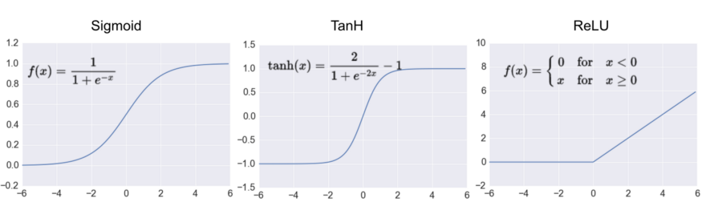
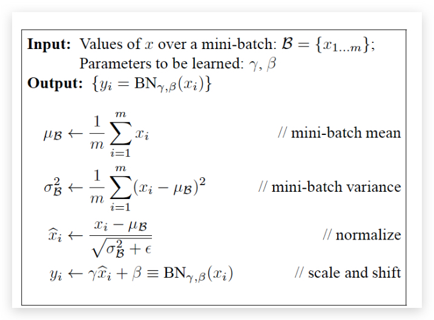
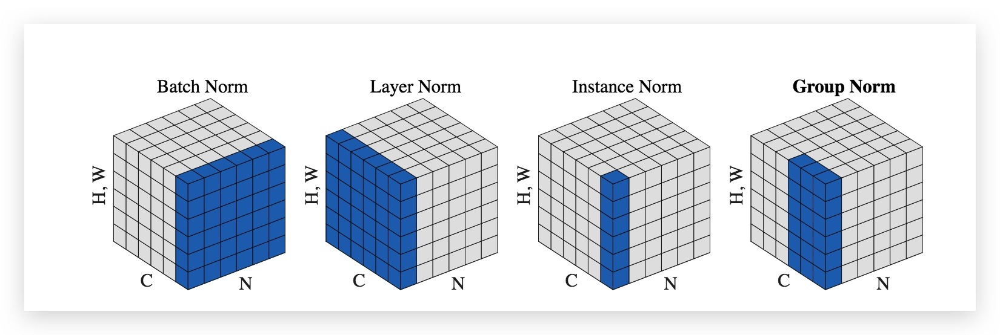
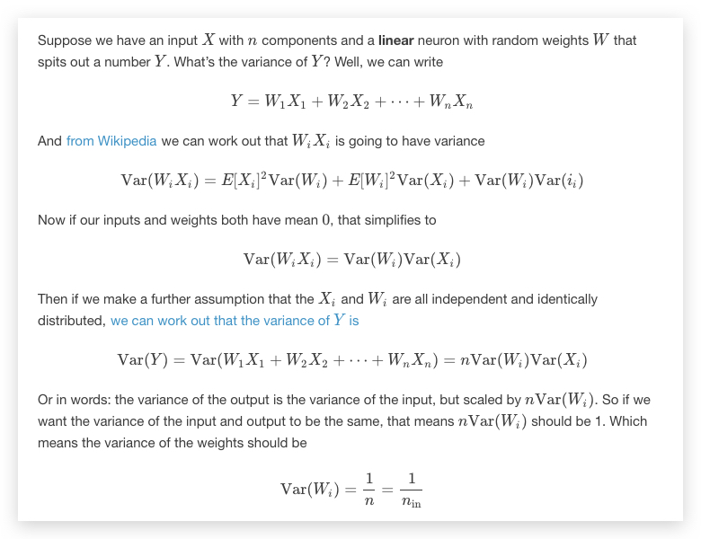

# 深度学习专题 {ignore=true}

[TOC]

2018 年，3 位深度学习大拿获得图灵奖，尽管缺乏足够的理论支撑一直是深度学习广为人诟病的一点。

## 理论基础

深度学习的核心在于学习多层次的表示（distributed representations，对应不同程度的抽象），从而实现 dikw 金字塔(data -> information -> knowledge -> wisdom).

- [Representation Learning: A Review and New Perspectives by Yoshua Bengio, et al., 2012](http://arxiv.org/abs/1206.5538)

greedy layerwise pre-training 将深度网络分解成几个浅层网络，每层用无监督方法训练

Stacks of RBMs forms a deep belief network (DBN)
即，受限玻尔兹曼机堆叠成为深度信念网络
Stacks of slightly modified RBMs can form a deep Boltzmann machine (DBM).

Enery-based Models 分为有潜变量和无潜变量的情形；极大似然方法学习参数

2017-ICLR 最佳论文
`Understanding deep learning requires rethinking generalization`

### 反向传播原理

假设我们的输入数据是 $X$，真实的标签是 $y$。

首先假设神经网络有 $L$ 层，最后一层是输出层，只有一个神经元。每层的变量和函数都使用**上标**表示其所在的层。每一层的激活函数的输出为 $A$，激活函数的输入是 $Z$，它是由权重矩阵 $W$ 和偏移 $b$ 一起，作用于输入得到的。当这个层是第一层的时候，输入是数据 $X$，当这个层不是第一层的时候，其输入是前一层的激活函数的输出。假设输出层的输出是 $\hat{y}$ , 即预测结果。

假设我们考虑第 $l$ 个隐层，其输入是 $A^{[l-1]}$， 则其前向传播的表示为

$$
\begin{array} { c } { Z ^ { [ l ] } = W ^ { [ l ] } A ^ { [ l - 1 ] } + b ^ { [ l ] } } \\\ { A ^ { [ l ] } = g ^ { [ l ] } \left( Z ^ { [ l ] } \right) } \end{array}
$$

当 $ l= 1$ 的时候，$A^{[0]} = X$; 当 $ l = L$ 时，$A^{[L]} = \hat{y} $

假设损失函数为

$$
J = \frac { 1 } { 2 } ( \hat { y } - y ) ^ { 2 } = \frac { 1 } { 2 } \left( A ^ { [ L ] } - y \right) ^ { 2 }
$$

则对最后一层求导

$$
\begin{align}
d A ^ { [ L ] } = &\partial J / \partial A ^ { [ L ] } \\\
 =& \hat{y} - y
\end{align}
$$

$d A ^ { [ L ] }$ 有了之后，继续求 $d Z ^ { [ L ] }$

$$
\begin{aligned} d Z ^ { [ L ] } & = \frac { \partial J } { \partial Z ^ { L } } \\\ & = ( \hat { y } - y ) \cdot \frac { \partial \hat { y } } { \partial Z ^ { L } } \\\ & = ( \hat { y } - y ) \cdot g ^ { [ L ] ^ { \prime } } \left( Z ^ { [ L ] } \right) \\\ & = d A ^ { [ L ] } \cdot g ^ { [ L ] ^ { \prime } } \left( Z ^ { [ L ] } \right) \end{aligned}
$$

接下来求 $d W [ L ]$

$$
\begin{aligned} d W ^ { [ L ] } & = \frac { \partial J } { \partial W ^ { L } } \\\ & = ( \hat { y } - y ) \cdot \frac { \partial \hat { y } } { \partial W ^ { L L } } \\\ & = ( \hat { y } - y ) \cdot g ^ { [ L ] ^ { \prime } } \left( Z ^ { [ L ] } \right) \cdot \frac { \partial Z ^ { [ L ] } } { \partial W ^ { L } ] } \\\ & = d Z ^ { [ L ] } \cdot A ^ { [ L - 1 ] } \end{aligned}
$$

继续求 $d b ^ { [ L ] } $

$$
\begin{aligned} d b ^ { [ L ] } & = \frac { \partial J } { \partial b ^ { L } } \\\ & = ( \hat { y } - y ) \cdot \frac { \partial \hat { y } } { \partial b ^ { L } } \\\ & = ( \hat { y } - y ) \cdot g ^ { [ L ] ^ { \prime } } \left( Z ^ { [ L ] } \right) \cdot \frac { \partial Z ^ { [ L ] } } { \partial b ^ { L } } \\\ & = d Z ^ { [ L ] } \end{aligned}
$$

最后求

$$
\begin{aligned} d A ^ { [ L - 1 ] } & = \frac { \partial J } { \partial A ^ { L - 1 } } \\\ & = ( \hat { y } - y ) \cdot \frac { \partial \hat { y } } { \partial A ^ { [ L - 1 ] } } \\\ & = ( \hat { y } - y ) \cdot g ^ { [ L ] ^ { \prime } } \left( Z ^ { [ L ] } \right) \cdot \frac { \partial Z ^ { [ L ] } } { \partial A ^ { L - 1 } } \\\ & = d Z ^ { [ L ] } \cdot W ^ { [ L ] } \end{aligned}
$$

然后就要更新参数了：

$$
\begin{aligned} W ^ { [ L ] } & = W ^ { [ L ] } - \alpha d W ^ { [ L ] } \\\ b ^ { [ L ] } & = b ^ { [ L ] } - \alpha d b ^ { [ L ] } \end{aligned}
$$

### 激活函数

#### ELU

#### ReLU

#### Sigmoid

#### PReLU(Leaky Relu)

#### 自归一激活函数 SELU

#### Dics

阿里在 DIN 中提出和采用。参见 [推荐系统专题](./recommender.md) 阿里 DIN 网络部分。

### 正则化技术

#### L2 Normalization

#### 2015-BN

Batch normalization, 2005 年由谷歌提出。

激活函数的输入分布不断在发生变化（称为 Internal Covariate Shift, **ICS**）, 学习的过程需要使每一层去不断适应输入的分布，因此不得不降低网络的学习率，并且要小心初始化。

如果仅通过归一化方法使得数据具有零均值和单位方差，则会降低层的表达能力

通过变换，让激活函数的输入落在非平坦区（梯度饱和区）！

注意，最后一步中，经过 $\beta$ 和 $\gamma$ 处理后，数据似乎变换回了原来的分布？其实不是，因为每个神经元的 $\beta$ 和 $\gamma$ 都是在训练过程中学习的最优参数，各不相同，这样也给整个网络增加了更大的灵活性，在一定程度上对模型起到了正则化的效果。

另外，由于网络中每层输入数据的分布相对稳定，这样也**加速了模型学习速度**， **对 learning rate 的敏感度更低**

**测试阶段**
训练阶段保留每组 mini-batch 训练数据 在网络中每一层的 $\beta_{batch}$ 和 $\gamma_{batch}$ ， 并将其无偏估计作为测试数据的$\beta$ 和 $\gamma$

但 `How Does Batch Normalizetion Help Optimization` 论文指出，原作者认为是因为网络中各层都标准化后使得分布相同，因此造成的性能提优，其实是因为 norm 直接作用了 loss 函数，将 loss 函数变成了一个一阶、二阶均平滑的函数。

Batch Normalization 的效果虽好，但是它也有一些缺陷。当 batch_size 较小的时候，bn 算法的效果就会下降，这是因为在较小的 batch_size 中，bn 层难以学习到正确的样本分布，导致 gamma 和 betta 参数学习的不好

#### 2015-LSR

Label Smoothing Regularization, 是 2015 年的经典论文 `《Rethinking the Inception Architecture for Computer Vision》`的一个副产品

#### 2016-LN

Layer Normalization

#### 2017-IN

Instance normalization

#### 2018-GN

Group Normalization

来自何凯明论文 [Group Normalization](), 值得一读。

随着 batch_size 的减小，batch norm 的 error 率逐渐上升，而 group norm 的 error 率几乎不变。在一些目标检测方面的模型中，例如 faster-rcnn 或 mask-rcnn，当你只拥有一个 GPU 时，要求的 batch_size 通常为 1 或 2 张图片，这种情况下 batch norm 的效果就会大打折扣

可以看出，group normalization 和 batch normalization 的算法过程极为相似，仅仅通过划分 group 这样的简单操作就改善了 batch norm 所面临的问题，在实际应用中取得了非常好的效果

#### 2018-SN

Switchable Normalization

#### Drop Out

Dropout as a Bayesian Approximation: Insights and Applications

#### 自适应正则

参见 [推荐系统专题](./recommender.md) 阿里 DIN 网络部分。

#### WN

Weight Normalization

#### 2020-MABN

[Moving Average Batch Normalization](https://github.com/megvii-model/MABN)

意在解决 BD 在 small batch 下效果不佳的问题。

#### 总结

BN 和 IN 其实本质上是同一个东西，只是 IN 是作用于单张图片，但是 BN 作用于一个 batch。但是为什么 IN 还会被单独提出，而且在 Style Transfer 的这个任务中大放异彩呢？简言之，这背后的逻辑链是这样的：

1. 通过调整 BN 统计量，或学习的参数 beta 和 gamma，BN 可以用来做 domain adaptation。
2. Style Transfer 是一个把每张图片当成一个 domain 的 domain adaptation 问题

BN 适用于判别模型中，比如图片分类模型。因为 BN 注重对每个 batch 进行归一化，从而保证数据分布的一致性，而判别模型的结果正是取决于数据整体分布。但是 BN 对 batchsize 的大小比较敏感，由于每次计算均值和方差是在一个 batch 上，所以如果 batchsize 太小，则计算的均值、方差不足以代表整个数据分布；IN 适用于生成模型中，比如图片风格迁移。因为图片生成的结果主要依赖于某个图像实例，所以对整个 batch 归一化不适合图像风格化中，在风格迁移中使用 Instance Normalization 不仅可以加速模型收敛，并且可以保持每个图像实例之间的独立。

---

### Pooling

池化其实和激活函数的作用一样，都是为了提供非线性变换。
池化同时也是一种降维的方法，它将一个小区域通过下采样、平均或者取最大值等方式变成单个像素，实现降维
除了降维外，还能在一定程度上实现局部平移不变性，使得分类器具有一定的鲁棒性

与卷积层类似，Pooling 操作也可以引入 stride，即跳过特定的距离进行 Pooling。上述示意图实际上是 stride=Pooling 的大小的特定情况。

#### average-pooling

#### sum-pooling

#### max-pooling

#### attentive pooling

### multi-hot

### 初始化

uniform

几种主要的权值初始化方法： lecun_uniform / glorot_normal / he_normal / batch_normal
lecun_uniform:Efficient BackProp
glorot_normal:Understanding the difficulty of training deep feedforward neural networks
he_normal:Delving Deep into Rectifiers: Surpassing Human-Level Performance on ImageNet Classification
batch_normal:Batch Normalization: Accelerating Deep Network Training by Reducing Internal Covariate Shift

#### xavier

如何让激活函数的输入尽量多的落在激活区域（而非那些平坦区）？

初始化权重： 均值为 0，方差如下

$$
\operatorname { Var } ( W ) = \frac { 1 } { n _ { \mathrm { in } } }
$$

#### ZCA

### 前沿理论

neural tangent kernel(NTK)

## CNN 专题

参见 [CNN](./cnn.md)

## RNN 专题

参见 [RNN](./rnn.md)

### Memory Networks

[End-to-End Memory Networks by Sainbayar Sukhbaatar, et al., 2015](http://arxiv.org/pdf/1503.08895v4.pdf)

- [Memory-based Bayesian Reasoning with Deeep Learning](http://blog.shakirm.com/wp-content/uploads/2015/11/CSML_BayesDeep.pdf)

  to read

- [Ask Me Anything: Dynamic Memory Networks for Natural Language Processing](http://arxiv.org/pdf/1506.07285v1.pdf)

如何在 sequence-2-sequence 任务中，实现对一些关键信息的‘保留’？
比如我们在对话过程中，会出现“你好啊，我叫小 S”，然后另一方要回答，“很高兴认识啊小 S。”那么这个小 S，也就是说实体信息或者日期信息等等，就是在对话的 input-output 中，被“复制”的。
这个信息是应该“原封不动”地被保留，从 sequence2sequence 的输入端被复制到输出端的。
现有的 end2end sequence2sequence 等模型，即使加了 attention 机制，也很难做到这点

## Seq2Seq 专题

参见 [seq2seq](./seq2seq.md)

## GNN 专题

参见 [Graph Neural Networs](./gnn.md)

## Attension 专题

参见 [Attension](./attension.md)

## 模型压缩和精简

参见 [模型压缩和精简](./model_compress_simplify.md)

## 待分类

###  NTM
[Neural Turing Machines](http://arxiv.org/abs/1410.5401)
代码 [在此](https://github.com/shawntan/neural-turing-machines)

Memory Read

Memory Write

### CopyNet

提出了拷贝机制。

## 贝叶斯深度学习

Bayesian Deep Learning

- [On Bayesian Deep Learning and Deep Bayesian Learning](https://pan.baidu.com/s/1bp8mP1H)
  贝叶斯深度学习 和 深度贝叶斯学习，from 剑桥 deepmind 团队。

## 深度学习的应用

### 在图像／视频领域的应用

### 在 NLP 领域的应用

- [Predicting online user behaviour using deep learning algorithms by Armando Vieira](http://arxiv.org/abs/1511.06247v1)

  预测在线用户行为

- [Using Neural Networks for Click Prediction of Sponsored Search](http://arxiv.org/abs/1412.6601)

点击率预测

- [Convolutional Neural Networks for Pedestrian Detection](https://github.com/DenisTome/DeepPed)

  行人检测

- [Reinforcement Learning Neural Turing Machine](http://arxiv.org/abs/1505.00521)

* [Neural-Colorizer](https://github.com/YerevaNN/neural-colorizer)

利用卷积自编码为灰度图着色

- [用深度卷积神经网络下围棋](http://jmlr.org/proceedings/papers/v37/clark15.pdf)
  这背后用到的原理阐述。

- [Neural Programmer-Interpreters by Scott Reed, et al., ICLR 2016, submitted](http://arxiv.org/abs/1511.06279)

  利用深度学习运行计算机程序，这听起来是如此虚幻。

* [opinion mining with deep recurrent nets](http://www.cs.cornell.edu/~oirsoy/drnt.htm)

  观点挖掘

- 图像风格转换

* 音乐风格转化
  [Neural Style Transfer for Musical Melodies](https://ashispati.github.io//style-transfer/)

## 工具

### X-Learning

阿里巴巴 [XDL](https://github.com/alibaba/x-deeplearning/wiki)

### 可视化工具

- [VisualDL](https://github.com/PaddlePaddle/VisualDL)

    <figure align='center'>
        
        <figcaption>WaveNet</figcaption>
    </figure>

## 参考

1. [video lecture: 深度学习暑期学校](http://videolectures.net/deeplearning2015_bengio_theoretical_motivations/),2015,蒙特利尔
2. [Awesome Deep Vision](https://github.com/kjw0612/awesome-deep-vision)
3. [A Statistical View of Deep Learning](http://blog.shakirm.com/wp-content/uploads/2015/07/SVDL.pdf)
   用统计学的视角看深度学习
4. [Deep Learning](http://goodfeli.github.io/dlbook/)
   Ian Goodfellow, Aaron Courville 以及 Yoshua Bengio 　三人合著。
5. [Neural Networks and Deep Learning ](http://neuralnetworksanddeeplearning.com/)
   也许是最好的入门教程？
6. [Mathmatics of Deep Learning](https://arxiv.org/abs/1712.04741)
   评述了近期对深度网络的全局最优、几何稳定性、表示不变性等诸多性质的数学理论依据研究。
