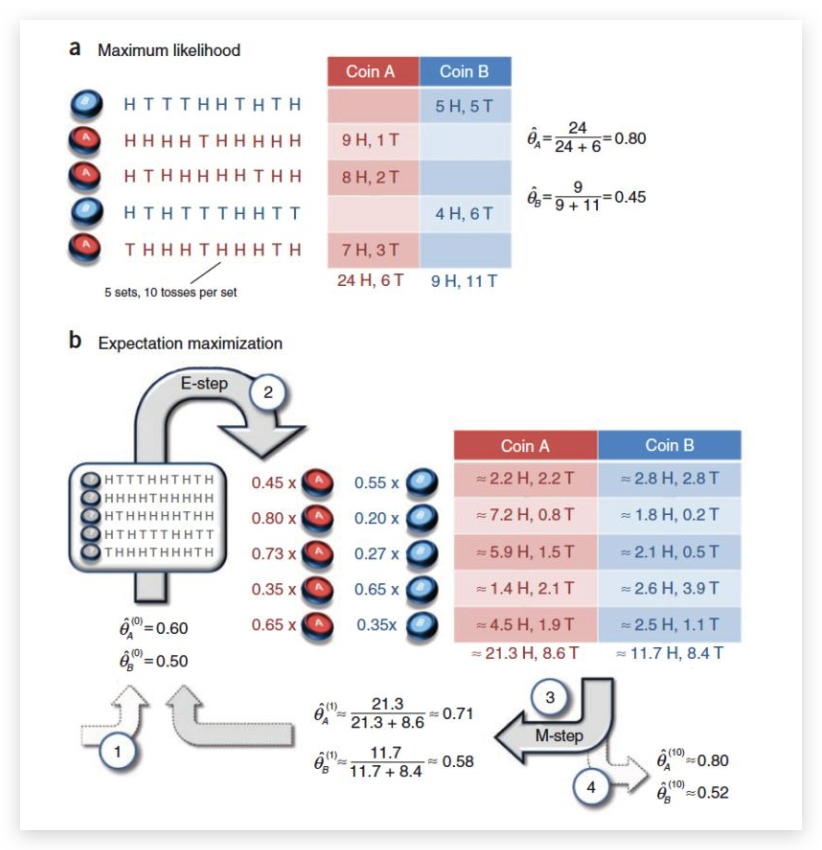

# EM 算法

[TOC]

EM（Expectation Maximization）是在含有隐变量（latent variable）的情况下计算最大似然的一种参数估计方法。和极大似然一样，与其说是一种算法，不如说是一种解决问题的思想。

## 原理

其实 EM 算法是用 E-Step 把一个非凸问题变成一个凸问题，用 M-Step 来解这个问题。

### 推导

$Q$ 表示该样例隐含变量 z 的某种分布

$$
\begin{aligned} \ell ( \theta ) & = \sum _ { i } \log p \left( x ^ { ( i ) } ; \theta \right) \\\ & = \sum _ { i } \log \sum _ { z ^ { ( i ) } } p \left( x ^ { ( i ) } , z ^ { ( i ) } ; \theta \right) \\\ & = \sum _ { i } \log \sum _ { z ^ { ( i ) } } Q _ { i } \left( z ^ { ( i ) } \right) \frac { p \left( x ^ { ( i ) } , z ^ { ( i ) } ; \theta \right) } { Q _ { i } \left( z ^ { ( i ) } \right) } \\\ & \geq \sum _ { i } \sum _ { z ^ { ( i ) } } Q _ { i } \left( z ^ { ( i ) } \right) \log \frac { p \left( x ^ { ( i ) } , z ^ { ( i ) } ; \theta \right) } { Q _ { i } \left( z ^ { ( i ) } \right) } \end{aligned}
$$

根据 Jensen 不等式，要想让等式成立，需要让随机变量变成常数值，这里得到：

$$
\frac { p \left( x ^ { ( i ) } , z ^ { ( i ) } ; \theta \right) } { Q _ { i } \left( z ^ { ( i ) } \right) } = c
$$

### 收敛性

要证明 EM 算法收敛，则我们需要证明我们的对数似然函数的值在迭代的过程中一直在增大。即

$$
\sum _ { i = 1 } ^ { m } \log P \left( x ^ { ( i ) } | \theta ^ { j + 1 } \right) \geq \sum _ { i = 1 } ^ { m } \log P \left( x ^ { ( i ) } | \theta ^ { j } \right)
$$

EM 算法可以保证收敛到一个稳定点，但是却不能保证收敛到全局的极大值点，因此它是局部最优的算法.

当然，如果我们的优化目标是凸的，则 EM 算法可以保证收敛到全局极大值，这点和梯度下降法这样的迭代算法相同.

### 和坐标上升法的联系

## EM 算法的应用

#### 支持向量机的 SMO 算法

#### 混合高斯模型

#### K-means

#### 隐马尔可夫模型

### 经典案例-两硬币模型

假如有两枚硬币， 它们正面朝上的概率分别为 $θ_A$ 和 $θ_B$, 我们重复以下操作五次:

1. 从 AB 中随机抽一个硬币。 但是我们不知道每次操作的时候我们抛的到底是 A 还是 B
2. 抛该硬币 10 次并记录结果

接着我们需要从这个实验中得到对 $θ_A$ 和 $θ_B$ 的估计.

如果知道了每次选的是哪个硬币，就可以通过极大似然法估计每个硬币正面朝上的概率。反过来，只有知道了每个硬币正面朝上的概率，我们才更有把握知道每次选的到底是哪个硬币。这两个问题是相互依赖的关系。

    <figure align='center'>
        
        <figcaption></figcaption>
    </figure>

令 $Z$ 为每次操作时选择的类别 ，则 $Z$ 其实就是一个隐含变量。

E 步：初始化 $\hat { \theta } _ { A } ^ { ( 0 ) } = 0.60$ 和 $\hat { \theta } _ { B } ^ { ( 0 ) } = 0.50$ ，计算每个实验中选择的硬币是 A 和 B 的概率，例如第一个实验中选择 A 的概率为：

$$
P \left( z = A | y _ { 1 } , \theta \right) = \frac { P \left( z = A , y _ { 1 } | \theta \right) } { P \left( z = A , y _ { 1 } | \theta \right) + P \left( z = B , y _ { 1 } | \theta \right) } = \frac { ( 0.6 ) ^ { 5 } * ( 0.4 ) ^ { 5 } } { ( 0.6 ) ^ { 5 } * ( 0.4 ) ^ { 5 } + ( 0.5 ) ^ { 10 } } = 0.45
$$

$$
P \left( z = B | y _ { 1 } , \theta \right) = 1 - P \left( z = A | y _ { 1 } , \theta \right) = 0.55
$$

计算出每个实验为硬币 A 和硬币 B 的概率，然后进行加权求和

M 步：求出似然函数下界 $Q \left( \theta , \theta ^ { i } \right)$ ，$\mu_j$ 代表第 $j$ 次实验选择硬币 A 的概率，$1-\mu_j$ 代表第 $j$ 次实验选择硬币 B 的概率 。
