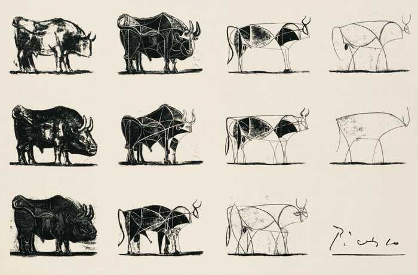
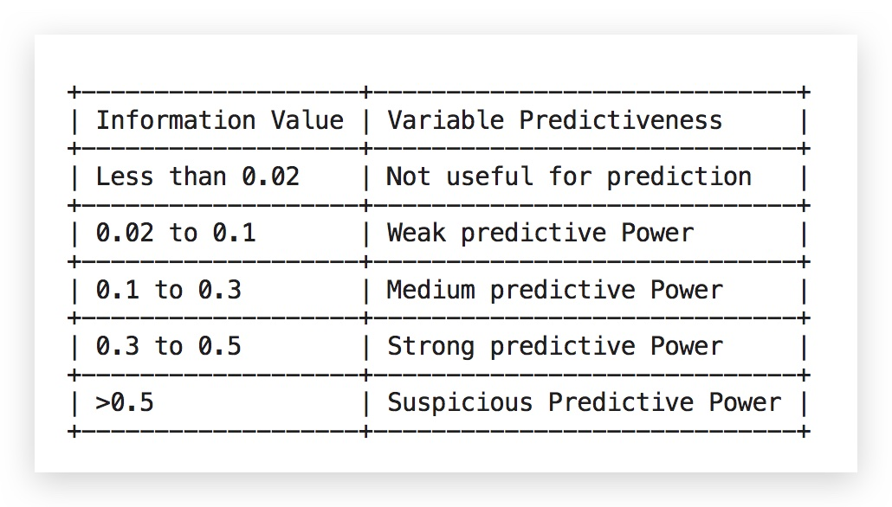

# 特征工程

在深度学习喧嚣的背景之下，经常能够听到对特征工程的批评，“问题相关，需要领域知识”。但是，至少就目前为止，很多业务场景下，特征工程仍然是能够获得较高收益的做法，因此，特征工程在机器学习中仍然有重要的地位。

> 数据和特征决定了上限，模型和算法只是在逼近这个上限

<div align="center">
    <figure align='center'>
        
        <figcaption>毕加索 公牛</figcaption>
    </figure>
</div>

### 特征选择

---

- BOW(bag of words)
  通常被翻译为词袋法，但其实它是一个通用的特征生成方法，并不局限在自然语言处理中。例如，图像识别
- TF_IDF

- WOE（Weight of Evidence）

分子： 该分组中正样本占所有正样本的比例
分母： 该分组中负样本占所有负样本的比例
woe = 对数（分子除以分母）

woe 越大，该分组中存在正样本的可能性越大。实际上也等价于衡量的是： 当前分组中正负样本的比例和整体上正负样本比例之间的差异性。

但是，WOE 只考虑了两个比例的大小关系，没有考虑到该分组中的样本个数！

```python
from xverse.transformer import WOE
clf = WOE()
clf.fit(X, y)
clf.woe_df
```



- IV 值（Information Value）

IV 值考虑了分组中样本占整体样本的比例，相当于 WOE 的加权求和。
权重为 分子-分母。

这样，IV 值都是正的。

全部分段的 IV 值加起来，也可以作为整个特征的评价指标。

- Voting Selector

采用多种策略取选取特征，哪些特征被选择的多，哪些特征就重要。

```python
from xverse.ensemble import VotingSelector
clf = VotingSelector()
clf.fit(X, y)
clf.feature_importances_
clf.feature_votes_
clf.transform(X).head()
```

一般用 IV 值来 指导离散特征分段

###

### 特征变换

---

- 标准化／无量纲化
  - 作用
    1. 避免大数属性主导
    2. 避免计算中的数值困难（中间结果膨胀等）
- 缺失值填充
-

#### Monotonic Binning

```python
from xverse.transformer import MonotonicBinning
clf = MonotonicBinning()
clf.fit(X, y)print(clf.bins)
output_bins = clf.bins #will be used later in this exerciseHere

clf = MonotonicBinning(custom_binning=output_bins) #output_bins wascreated earlier
out_X = clf.transform(X)
out_X.head()
```

####
