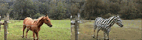
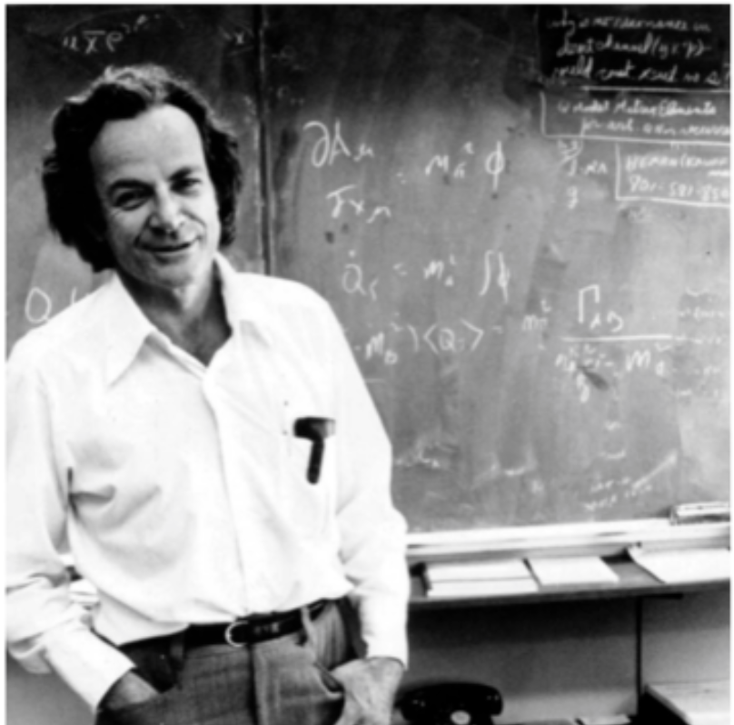
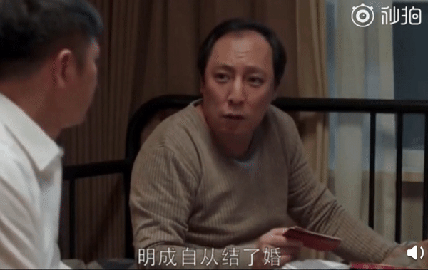

# 生成对抗网络（Generative Adversarial Nets ，GAN） {ignore=true}

[TOC]

# 前言

生成对抗网络（Generative Adversarial Nets ，GAN）目前已广泛应用于图像生成、超分辨率图片生成、图像压缩、图像风格转换、数据增强、文本生成等场景。越来越多的研发人员从事 GAN 网络的研究，提出了各种 GAN 模型的变种，包括 CGAN、InfoGAN、WGAN、CycleGAN 等。

有多火？
Bengio 2018 年图灵奖的三大贡献之一（另外两个贡献分别是 90 年代的序列概率模型和 00 年代的语言模型）

<div align="center">
    <figure align='center'>
        
    </figure>
</div>

# 第一部分 GAN 的理论基础

GAN 最早由 _Goodfellow_ [^10] 在论文 [Generative Adversarial Networks by Ian J. Goodfellow, etl 2014](https://arxiv.org/abs/1406.2661) 中提出，主要由两部分构成：Generator（生成器），简称 G；Discriminator（判别器）, 简称 D。生成器主要用噪声 z 生成一个类似真实数据的样本，样本越逼真越好；判别器用于估计一个样本来自于真实数据还是生成数据，判定越准确越好。如下图所示：

[^10]: Goodfellow 本人就]是少年得志的典范。他本科在斯坦福，硕士在 Andrew Ng 手下，博士就跑到蒙特利尔 Yoshua Bengio 手下了。他另外还有一个导师 Aaron Courville。大家现在经常讲的花书 Deep Learning，作者就是 Ian Goodfellow 和他两个博士导师。他是 85 年人，发表 GAN 在 2014 年，29，还差一年才 30。GAN 这个工作也给 Goodfellow 带来了很多荣誉，比如 17 年就被 MIT under 35 选中了。Goodfellow 博士毕业后去了 Google Brain，后来又跳到 open AI,又跳回 google，现在在苹果做特别项目机器学习项目负责人。实际上现在他也就 34 岁。(from @唐杰 THU)

<div align="center">
    <figure align='center'>
        
        <figcaption>$GAN$</figcaption>
    </figure>
</div>

可以将生成器和判别器看作博弈的双方，比如在犯罪分子造假币和警察识别假币的过程中：

- 生成模型相当于制造假币的一方，其目的是根据看到的钱币情况和警察的识别技术，去尽量生成更加真实的、警察识别不出的假币。

- 判别模型 D 相当于识别假币的一方，其目的是尽可能的识别出犯罪分子制造的假币。

这样通过造假者和识假者双方的较量和朝目的的改进，使得最后能达到生成器能尽可能生成真的钱币、识假者判断不出真假的效果(真假币概率都为 0.5)。

## 2.1 原生 GAN

> adversarial training is the coolest thing since sliced bread
> 对抗训练是继切片面包之后最酷的事情。
> &nbsp;&nbsp;&nbsp;&nbsp;&nbsp;&nbsp;&nbsp;&nbsp;&nbsp;&nbsp;&nbsp;&nbsp;&nbsp;&nbsp;&nbsp;&nbsp;&nbsp;&nbsp; - Yann LeCun

### 2.1.1 数学原理

假设 $P_r$ 和 $P_g$ 分别代表真实数据的分布与生成数据的分布，这样判别模型的目标函数可以表示为：

$$
\min _ { G} \max _ { \mathbf { D } } E _ { x \sim P _ { r } } [ \log D ( x ) ] + E _ { x \sim P _ { g } } [ \log ( 1 - D ( x ) ) ]
$$

最大最小的优化，分步骤进行。这里先优化 $D$，然后再优化 $G$，本质上是两个优化问题，可以拆解如下：

- 优化 $D$ :
  对 $D$ 来说，当然是希望真实数据的预测概率接近 1，而生成数据的结果接近 0

$$
\max _ { D } E _ { x \sim P _ { r } } [ \log D ( x ) ] + E _ { x \sim P _ { g } } [ \log ( 1 - D ( x ) ]
$$

- 优化 $G$ :
  对 $G$ 来说，真实数据没啥用，只希望假样本的预测结果接近 1

$$
\min _ { G}   E _ { x \sim P _ { g } } [ \log ( 1 - D ( x ) ) ]
$$

生成式模型，估计的是联合概率分布（区别于判别模型 $p(y|x)$）

**GAN 是更好的生成模型，在某种意义上避免了马尔科夫链式的学习机制**，这使得它能够区别于传统的概率生成模型。
传统概率生成模型一般都需要进行马可夫链式的采样和推断，而 GAN 避免了这个计算复杂度特别高的过程，直接进行采样和推断，从而提高了 GAN 的应用效率，所以其实际应用场景也就更为广泛。

其次**GAN 是一个非常灵活的设计框架**，各种类型的损失函数都可以整合到 GAN 模型当中，这样使得针对不同的任务，我们可以设计不同类型的损失函数，都会在 GAN 的框架下进行学习和优化。

再次，最重要的一点是，**当概率密度不可计算的时候，GAN 依然可以使用**，因为它引入了一个非常聪明的内部对抗的训练机制，可以逼近一些不是很容易计算的目标函数；而传统依赖于数据自然性解释的一些生成模型就不可以在上面进行学习和应用。

> 如果人工智能是一块蛋糕，那么强化学习是蛋糕上的一粒樱桃，监督学习是外面的一层糖霜，无监督/预测学习则是蛋糕胚。目前我们只知道如何制作糖霜和樱桃，却不知如何制作蛋糕胚。 by Yann LeCun

### 2.1.2 简例：生成正态分布

例如，我们想学习一个已知的正态分布，在过去，这通过参数的极大似然估计就能得到

$$
\boldsymbol { \theta } ^ { * } = \underset { \boldsymbol { \theta } } { \arg \max } \mathbb { E } _ { x \sim p _ { \text { data } } } \log p _ { \text { model } } ( \boldsymbol { x } | \boldsymbol { \theta } )
$$

但是，如果我们实际上并不知道真实数据的分布，参数估计方法就无从施展。
但是 GAN 方法可以！ 因为它不依赖关于分布的**任何**假设

<div align="center">
    <figure align='center'>
        
        <figcaption>http://blog.aylien.com/introduction-generative-adversarial-networks-code-tensorflow/</figcaption>
    </figure>
</div>

损失函数的变化

训练困难、效果不稳定

$D$ 网络训练多次，$G$ 训练 1 次，结果就不一样

生成器和判别器的 loss 无法指示训练进程、生成样本缺乏多样性

### 2.1.3 简例： Mnist

```python {.line-numbers}
# -*- coding: utf-8 -*-
# @author: https://github.com/eriklindernoren/Keras-GAN/blob/master/gan/gan.py

from __future__ import print_function, division

import keras
from keras.datasets import mnist
from keras.layers import Input, Dense, Reshape, Flatten, Dropout
from keras.layers import BatchNormalization, Activation, ZeroPadding2D
from keras.layers.advanced_activations import LeakyReLU
from keras.layers.convolutional import UpSampling2D, Conv2D
from keras.models import Sequential, Model
from keras.optimizers import Adam

import matplotlib.pyplot as plt

import sys

import numpy as np

class GAN():
    def __init__(self):
        self.img_rows = 28
        self.img_cols = 28
        self.channels = 1
        self.img_shape = (self.img_rows, self.img_cols, self.channels)
        self.latent_dim = 100

        optimizer = Adam(0.0002, 0.5)

        # Build and compile the discriminator
        self.discriminator = self.build_discriminator()
        self.discriminator.compile(loss='binary_crossentropy',
            optimizer=optimizer,
            metrics=['accuracy'])

        # Build the generator
        self.generator = self.build_generator()

        # The generator takes noise as input and generates imgs
        z = Input(shape=(self.latent_dim,))
        img = self.generator(z)

        # For the combined model we will only train the generator
        self.discriminator.trainable = False

        # The discriminator takes generated images as input and determines validity
        validity = self.discriminator(img)

        # The combined model  (stacked generator and discriminator)
        # Trains the generator to fool the discriminator
        self.combined = Model(z, validity)
        self.combined.compile(loss='binary_crossentropy', optimizer=optimizer)


    def build_generator(self):

        model = Sequential()

        model.add(Dense(256, input_dim=self.latent_dim))
        model.add(LeakyReLU(alpha=0.2))
        model.add(BatchNormalization(momentum=0.8))
        model.add(Dense(512))
        model.add(LeakyReLU(alpha=0.2))
        model.add(BatchNormalization(momentum=0.8))
        model.add(Dense(1024))
        model.add(LeakyReLU(alpha=0.2))
        model.add(BatchNormalization(momentum=0.8))
        model.add(Dense(np.prod(self.img_shape), activation='tanh'))
        model.add(Reshape(self.img_shape))

        model.summary()

        noise = Input(shape=(self.latent_dim,))
        img = model(noise)

        return Model(noise, img)

    def build_discriminator(self):

        model = Sequential()

        model.add(Flatten(input_shape=self.img_shape))
        model.add(Dense(512))
        model.add(LeakyReLU(alpha=0.2))
        model.add(Dense(256))
        model.add(LeakyReLU(alpha=0.2))
        model.add(Dense(1, activation='sigmoid'))
        model.summary()

        img = Input(shape=self.img_shape)
        validity = model(img)

        return Model(img, validity)

    def train(self, epochs, batch_size=128, sample_interval=50):

        # Load the dataset
        (X_train, _), (_, _) = mnist.load_data()

        # Rescale -1 to 1
        X_train = X_train / 127.5 - 1.
        X_train = np.expand_dims(X_train, axis=3)

        # Adversarial ground truths
        valid = np.ones((batch_size, 1))
        fake = np.zeros((batch_size, 1))

        for epoch in range(epochs):

            # ---------------------
            #  Train Discriminator
            # ---------------------

            # Select a random batch of images
            idx = np.random.randint(0, X_train.shape[0], batch_size)
            imgs = X_train[idx]

            noise = np.random.normal(0, 1, (batch_size, self.latent_dim))

            # Generate a batch of new images
            gen_imgs = self.generator.predict(noise)

            # Train the discriminator
            d_loss_real = self.discriminator.train_on_batch(imgs, valid)
            d_loss_fake = self.discriminator.train_on_batch(gen_imgs, fake)
            d_loss = 0.5 * np.add(d_loss_real, d_loss_fake)

            # ---------------------
            #  Train Generator
            # ---------------------

            noise = np.random.normal(0, 1, (batch_size, self.latent_dim))

            # Train the generator (to have the discriminator label samples as valid)
            g_loss = self.combined.train_on_batch(noise, valid)

            # Plot the progress
            print ("%d [D loss: %f, acc.: %.2f%%] [G loss: %f]" % (epoch, d_loss[0], 100*d_loss[1], g_loss))

            # If at save interval => save generated image samples
            if epoch % sample_interval == 0:
                self.sample_images(epoch)

    def sample_images(self, epoch):
        r, c = 5, 5
        noise = np.random.normal(0, 1, (r * c, self.latent_dim))
        gen_imgs = self.generator.predict(noise)

        # Rescale images 0 - 1
        gen_imgs = 0.5 * gen_imgs + 0.5

        fig, axs = plt.subplots(r, c)
        cnt = 0
        for i in range(r):
            for j in range(c):
                axs[i,j].imshow(gen_imgs[cnt, :,:,0], cmap='gray')
                axs[i,j].axis('off')
                cnt += 1
        fig.savefig("images/%d.png" % epoch)
        plt.close()


if __name__ == '__main__':
    print(keras.__version__)
    gan = GAN()
    gan.train(epochs=30000, batch_size=32, sample_interval=200)

```

<div align="center">
    <figure align='center'>
        
        <figcaption>数字生成</figcaption>
    </figure>
</div>

### 2.1.4 如何评价 GAN

1. example-based
   顾名思义，基于样本层面做评价的方法： 对生成样本与真实样本提取特征，然后在特征空间做距离度量
2. Inception Score (IS)
   对于一个训练良好的 GAN，其生成的样本丢给 Inception[^7] 网络进行测试的时候，得到的判别概率应该具有如下特性：
   - 对于同一个类别的图片，其输出的概率分布应该趋向于一个脉冲分布。可以保证生成样本的准确性。
   - 对于所有类别，其输出的概率分布应该趋向于一个均匀分布，这样才不会出现 mode collapsing 等，可以保证生成样本的多样性。
   $$
   I S \left( P _ { g } \right) = e ^ { E _ { x \sim P _ { g } } \left[ K L \left( p _ { M } ( y | x ) \| p _ { M } ( y ) \right) \right] }
   $$
   特点：可以一定程度上衡量生成样本的多样性和准确性，但是无法检测过拟合
   [全面解析 Inception Score 原理及其局限性](https://www.jiqizhixin.com/articles/2019-01-10-18)
3. Fréchet Inception Distance (FID)
4.

[^7]: Inception 来源于 Google 的 Inception Net

### _Model Collapse_（模型塌陷）

生成器只需锁定到另一个模型。这个循环无限重复，限制了生成样本的多样性

Even though the generator might be able to trick the corresponding discriminator, it fails to learn to represent the complex real-world data distribution and gets stuck in a small space with extremely low variety.

1. Feature Matching
   Feature matching suggests to optimize the discriminator to inspect whether the generator’s output matches expected statistics of the real samples. In such a scenario, the new loss function is defined as $\left\| \mathbb { E } _ { x \sim p _ { r } } f ( x ) - \mathbb { E } _ { z \sim p _ { z } ( z ) } f ( G ( z ) ) \right\| _ { 2 } ^ { 2 }$ where $f(x)$ can be any computation of statistics of features, such as mean or median.

2. Minibatch Discrimination
3. WGAN by Martin Arjovsky

## 2.2 CGAN： 随心所欲

$$
\min _ { G } \max _ { D } V ( D , G ) = \mathbb { E } _ { \boldsymbol { x } \sim p _ { \text { data } } ( \boldsymbol { x } ) } [ \log D ( \boldsymbol { x } | \boldsymbol { y } ) ] + \mathbb { E } _ { \boldsymbol { z } \sim p _ { z } ( \boldsymbol { z } ) } [ \log ( 1 - D ( G ( \boldsymbol { z } | \boldsymbol { y } ) ) ) ]
$$

可按照数字标签生成相应标签的数字图像

其中，$y$ 是加入的监督信息，$D(x|y)$ 表示在 $y$ 的条件下判定真实数据 $x$，$D(G(z|y))$ 表示在 $y$ 的条件下判定生成数据 $G(z|y$)。例如，MNIST 数据集可根据数字 label 信息，生成相应标签的图片；人脸生成数据集，可根据性别、是否微笑、年龄等信息，生成相应的人脸图片


[zi2zi: Master Chinese Calligraphy with Conditional Adversarial Networks]()

<div align="center">
    <figure align='center'>
        
        <figcaption>字到字</figcaption>
    </figure>
</div>

## 2.3 WGAN

> 要说真正实用的 GAN
> WGAN 必须要有姓名。

回想一下，我们一开始的目标无非是想估计真实的数据分布 $P_r$， 如果采用 极大似然法呢？

$$
\max _{\theta \in \mathbb{R}^{d}} \frac{1}{m} \sum_{i=1}^{m} \log P_{\theta}\left(x^{(i)}\right)
$$

可以证明，在极限意义下（样本无限多），其实这等价于优化 KL 散度！

$$
\begin{aligned} \lim _{m \rightarrow \infty} \max _{\theta \in \mathbb{R}^{d}} \frac{1}{m} \sum_{i=1}^{m} \log P_{\theta}\left(x^{(i)}\right) &=\max _{\theta \in \mathbb{R}^{d}} \int_{x} P_{r}(x) \log P_{\theta}(x) d x \\\ &=\min _{\theta \in \mathbb{R}^{d}}-\int_{x} P_{r}(x) \log P_{\theta}(x) d x \\\ &=\min _{\theta \in \mathbb{R}^{d}} \int_{x} P_{r}(x) \log P_{r}(x) d x-\int_{x} P_{r}(x) \log P_{\theta}(x) d x \\\ &=\min _{\theta \in \mathbb{R}^{d}} K L\left(P_{r} \| P_{\theta}\right) \end{aligned}
$$

### KL (Kullback–Leibler) Divergence

KL (Kullback–Leibler) Divergence measures how one probability distribution $p$ diverges from a second expected probability distribution $q$

$$
D _ { K L } ( p \| q ) = \int _ { x } p ( x ) \log \frac { p ( x ) } { q ( x ) } d x
$$

显然，当 $p$ 和 $q$ 在定义域上几乎处处相等的时候，其 D L 散度为 0
（这里的 $log$ 函数其实可以是任意满足如下两个条件的函数
$1. 凸函数  \\\ 2. f(1) = 0$
因此，这种距离也被称为 $f-divergence$

$$
D_{f}(p \| q)=\int_{x} q(x) f\left(\frac{p(x)}{q(x)}\right) d x \geq f\left(\int q(x) \frac{p(x)}{q(x)} d x\right)=f(1)=0
$$

在 p 有定义而 q 无定义的范围中，KL 散度趋向无穷。
可以通过加入噪声的方式缓解。
但是，引入噪声也会引入误差。
退一步讲，即使学习到了一个好的密度函数，从中抽样可能也是非常复杂耗时的。

因此，更倾向于另外一种方案：对已有的一个分布（例如均匀分布或者高斯分布），学习一个将其映射到密度函数的映射函数，也就是生成模型的方案。（缺点： 我们不再知道具体的密度函数是什么）

如何更好地衡量两个分布之间的距离呢？

### JS (Jensen–Shannon) Divergence

KL 散度是不对称的，JS 改造使其对称

$$
D _ { J S } ( p \| q ) = \frac { 1 } { 2 } D _ { K L } \left( p \| \frac { p + q } { 2 } \right) + \frac { 1 } { 2 } D \_ { K L } \left( q \| \frac { p + q } { 2 } \right)
$$

### EMD-推土机距离

<div>
    <figure >
        
        <figcaption align='center'>推土机哪家强？代价最低找 Wasserstein</figcaption>
    </figure>
</div>

Wasserstein Distance, 又称 _Earth Mover's Distance_

$$
W \left( p _ { r } , p _ { g } \right) = \inf _ { \gamma \sim \Pi \left( p _ { r } , p _ { g } \right) } \mathbb { E } _ { ( x , y ) \sim \gamma } [ \| x - y \| ]
$$

其中，$\Pi( p _ { r } , p _ { g }) $ 是 $p_r$ 和 $q_r$ 的联合分布集合（只需满足其边际分布分别为 $p _ { r }$ 和 $p _ { g }$）。

和前述 _f-divergency_ 距离不同，这种距离被称为 Integral probality metric (IPM)

直观意义： 如果把分布想象成一堆土的不同形状，则 EMD 可以理解为是将呈某个分布形状的一堆土变换成另外一个分布的最小能量代价。这里代价被量化为：移动的土的数量乘以其移动的距离。

因为是理论上可以有无数种移动方式，因此，EMD 的计算本身是一个优化问题。


First move 2 shovelfuls from P1 to P2 => (P1,Q1) match up.
Then move 2 shovelfuls from P2 to P3 => (P2,Q2) match up.
Finally move 1 shovelfuls from Q3 to Q4 => (P3,Q3) and (P4,Q4) match up.

If we label the cost to pay to make Pi and Qi match as $\delta_i$, we would have $\delta_{i+1} = \delta{i} + P_i - Q_i$ and in the example:

$$
\begin{aligned} \delta _ { 0 } & = 0 \\\
\delta _ { 1 } & = 0 + 3 - 1 = 2 \\\
\delta _ { 2 } & = 2 + 2 - 2 = 2 \\\
\delta _ { 3 } & = 2 + 1 - 4 = - 1 \\\
\delta \_ { 4 } & = - 1 + 4 - 3 = 0 \end{aligned}
$$

Finally the Earth Mover’s distance is $W = \Sigma \left| \delta _ { i } \right| = 5$

来看一个实际的例子

假设真实的分布为（0,y），y 服从 [0,1] 均匀分布。
考虑一组分布 $P_\theta = (\theta, y)$, 其中，y 也服从 [0,1] 均匀分布
随着 $\theta$ 不断趋于 0，两个分布之间的距离应该越来越小。

然鹅：

$$
K L \left( P _ { 0 } \| P _ {\theta } \right) = K L \left( P _ { \theta } \| P _ { 0 } \right) = \begin{cases}
{+ \infty}, & \text{if $\theta$ $\neq$ 0} \\\
0, & \text{if $\theta$ = 0}
\end{cases}
$$

$$
J S \left( P _ { 0 } \| P _ { \theta } \right) = \begin{cases}
{\log2}, & \text{if $\theta$ $\neq$ 0} \\\
0, & \text{if $\theta$ = 0}
\end{cases}
$$

$$
W \left( P _ { 0 } , P _ { \theta } \right) = | \theta |
$$

优点： 在两个分布不重叠的时候也是连续的！

> 如果两个分布无交集呢？

$$
J S \left( P _ { r } \| P _ { g } \right) = \log 2
$$

也就是说，只要两个分布没有一点重叠或者重叠部分可忽略，JS 散度就固定是常数 $\log 2$，而这对于梯度下降方法意味着*梯度为 0*！ 此时对于判别器来说，生成器是得不到任何梯度信息的。

**分布无交集的情况会经常发生吗？**

> 当 $P_r$ 与 $P_g$ 的支撑集（support）[^4]是高维空间中的低维流形（manifold）[^5]时，$P_r$ 与 $P_g$ 重叠部分测度（measure）[^6]为 0 的概率为 1

[^4]: 支撑集（support）其实就是函数的非零部分子集，比如 ReLU 函数的支撑集就是 $(0, +\infty)$，一个概率分布的支撑集就是所有概率密度非零部分的集合。
[^5]: 流形（manifold）是高维空间中曲线、曲面概念的拓广，我们可以在低维上直观理解这个概念，比如我们说三维空间中的一个曲面是一个二维流形，因为它的本质维度（intrinsic dimension）只有 2，一个点在这个二维流形上移动只有两个方向的自由度。同理，三维空间或者二维空间中的一条曲线都是一个一维流形。
[^6]: 测度（measure）是高维空间中长度、面积、体积概念的拓广，可以理解为“超体积”。

W 散度 在理论上还有如下优良性质：


并且，可以证明

- 在 KL 和 JS 散度意义下收敛的，在 W 散度下也必收敛
- 一个小的 EMD 确实意味着分布之间的微小差异
- 在给出上述性质保证的测度中，EMD 是最弱的（可以理解为条件最宽泛）。

除此之外，可以证明，原始 GAN 的损失函数等价于

$$
2 J S \left( P _ { r } \| P _ { g } \right) - 2 \log 2
$$

As a result, training a GAN faces an dilemma:

> If the discriminator behaves badly, the generator does not have accurate feedback and the loss function cannot represent the reality.
> If the discriminator does a great job, the gradient of the loss function drops down to close to zero and the learning becomes super slow or even jammed.

> 原生 GAN：想说爱你不容易

因此，WGAN 横空出世

$$
W \left( p _ { r } , p _ { g } \right) = \inf _ { \gamma \sim \Pi \left( p _ { r } , p _ { g } \right) } \mathbb { E } _ { ( x , y ) \sim \gamma } [ \| x - y \| ]
$$

但是，一个新的问题： 公式中的下确界没法直接求解！

论文中提出了一种近似求解的方法。

根据 Kantorovich-Rubinstein 对偶( 关于 KR 对偶，参考 [Wasserstein GAN and the Kantorovich-Rubinstein Duality](https://vincentherrmann.github.io/blog/wasserstein/))

$$
W \left( p _ { r } , p _ { g } \right) = \frac { 1 } { K } \sup _ { \| f \| _ { L } \leq K } \mathbb { E } _ { x \sim p _ { r } } [ f ( x ) ] - \mathbb { E } _ { x \sim p _ { g } } [ f ( x ) ]
$$

也就是说，$f$ 必须满足是$K-Lipschitz 连续$ [^1] 的

[^1]: 注意，处处可导函数一定是$K-Lipschitz 连续$)的，但是 $K-Lipschitz 连续$ 的函数未必是处处可导的，例如 $f ( x ) = | x |$


假如有一组 $K-Lipschitz 连续$ 的函数，则有

$$
L \left( p _ { r } , p _ { g } \right) = W \left( p _ { r } , p _ { g } \right) = \max _ { w \in W } \mathbb { E } _ { x \sim p _ { r } } \left[ f _ { w } ( x ) \right] - \mathbb { E } _ { z \sim p _ { r } ( z ) } \left[ f _ { w } \left( g _ { \theta } ( z ) \right) \right]
$$

为了限制 $f$ 是一个 $k-Lipsschitz$ 函数，WGAN 给出的方案是做 weight clipping，即限制构成 $f$ 的 NN 的参数 $w$ 的范围在 $[-c,c]$ 之间，经过梯度下降更新后，一旦某个 w 超过了这个范围，则把 w 强制限定为 $-c$ 或 $c$。


### 实验结果


### 总结

WGAN（Wasserstein GAN）的主要优点：

能够平衡生成器和判别器的训练程度，使得 GAN 的模型训练稳定。
能够保证生产样本的多样性。
提出使用 Wasserstein 距离来衡量模型训练的程度，数值越小表示训练得越好，成器生成的图像质量越高。

在实现上，WGAN 的算法与原始 GAN 算法的差异主要体现在如下四点改进：

去掉判别模型最后一层的 sigmoid 操作（因为判别器不再是分类，而是拟合 Wasserstein 距离，属于回归任务）。
生成模型和判别模型的 loss 值不取 log 操作。
每次更新判别模型的参数之后把模型参数的绝对值截断到不超过固定常数 c。
使用 RMSProp 算法，不用基于动量的优化算法，例如 momentum 和 Adam。

参考

1. 论文[Wasserstein GAN, 2017](https://arxiv.org/abs/1701.07875)
2. [令人拍案叫绝的 Wasserstein GAN](https://zhuanlan.zhihu.com/p/25071913)

## 2.4 Improved WGANs (WGAN-GP)

[从 weight clipping 到 gradient penalty，更加先进的 Lipschitz 限制手法](https://www.zhihu.com/question/52602529/answer/158727900)

> Weight clipping is a clearly terrible way to enforce a Lipschitz constraint

统计了经过充分训练的判别器中所有网络参数的数值分布，发现真的集中在最大和最小两个极端上， 因此提出 gradient penalty 取代 weight clipping


优化目标变为加上惩罚项的损失函数


和最优传输理论的联系

谱归一化

## 2.5 LS-GAN

[Loss Sensitive GAN](https://github.com/guojunq/lsgan)，损失敏感 GAN

Generalized LS-GAN ([GLS-GAN](https://github.com/guojunq/glsgan))
整合了 lsgan 和 wgan，并引入了新的变种。

假定了 Lipschitz 连续

## 2.6 其他变种


快速推进的研究领域， 百家争鸣，层出不穷！


[The GAN Zoo](https://github.com/hindupuravinash/the-gan-zoo)

α-GAN 作者在论文中吐槽说，之所以用希腊字母做前缀，是因为拉丁字母几乎都被占了……

<div align="center">
    <figure align='center'>
        
    </figure>
</div>

[用充满爱与和平的 GUNs 挑战 GANs？](https://www.leiphone.com/news/201703/ydqn1Q6mJBkR8uow.html)

SigBovik
: 计算机领域的怪异会议,利用计算机领域各种严谨的方法去解决稀奇古怪的问题

SIGBOVIK 2017, Samuel Albanie、Sebastien Ehrhardt 和 Joao F. Henriques 三人联合完成的学术论文：[Stopping GAN Violence](https://arxiv.org/abs/1703.02528)
作者在论文中表示，当今社会人类暴力严重泛滥，此点在生成对抗网络（GANs）的运行原理中表现的尤为明显。方法太过“暴力”，而且不够道德，完全不利于推动世界和平与发展；倒不如用他们发明的生非对抗网络（GUNs），和谐快乐又高产

如果说 GANs 中两个模型是彼此虎视眈眈，那么 GUNs 的两个模型则相亲相爱的多。

> a generator G that does its best to capture whichever data distribution it feels it can manage and a motivator M that helps G to achieve its dream.


就这样，生成 G 提出样本 PROPS，而激励器 M 作为回应给出确认和表扬：ACKS。两个网络之间友爱互助，最后共同实现愿望。
绝对禁止 G 和 M“打架”，它们要学会尊重彼此之间的差异，并在此基础上进行演化

<div align="center">
    <figure align='center'>
        
    </figure>
</div>

我们挑选其中有代表性的几个来重点看下

1.  AAE(Adversarial Autoencoders)

2.  VAE-GANs
    VAE 本身和 GAN 一样都是生成模型的代表。

3.  LAPGAN
    [Deep Generative Image Models using Lapalacian Pyramid of Adversarial Networks]()
4.  creative-gan

5.  dual-gan
6.  srgan

7)  SAGAN([Self-Attention GANs](https://arxiv.org/abs/1805.08318), 2018)
    自注意力 GAN
8)  ProGANs
    渐进生成对抗网络（progressive GANs）
    一般生成图像的像素为 256x256，而 ProGANs 则可以生成 1024x1024 的图像
9)  CycleGAN

    > present an approach for learning to translate an image from a source domain X to a target domain Y in the absence of paired examples

    <div align="center">
        <figure align='center'>
            
            <figcaption>斑马和马的转换</figcaption>
        </figure>
    </div>
    <div align="center">
        <figure align='center'>
            
        </figure>
    </div>


    paper: [Unpaired Image-to-Image Translation using Cycle-Consistent Adversarial Networks, Jun-Yan Zhu. etl. 2017](https://junyanz.github.io/Cycleimg-GAN/)
    [github code](https://github.com/junyanz/Cycleimg-GAN/)


    围绕这篇论文也已经有了很多其他的应用，参考上面的链接。

10. DCGAN (深度卷积生成对抗网络, Deep Convolutional GAN）
    来自 Facebook AI Research
    [paper]()
    [github code ](https://github.com/carpedm20/DCGAN-tensorflow)

11) Improved DCGANs

12) Relativistic GANs

    > standard GAN (SGAN) is missing a fundamental property, i.e., training the generator should not only increase the probability that fake data is real but also decrease the probability that real data is real. This property is fundamental and should have been in the very first GAN

13) BigGANs
14) BEGANs
    边界平衡 GANs
15) Sequence GANs
16) StarGAN
    顾名思义，就是星形网络结构，在 StarGAN 中，生成网络 $G$ 被实现成星形。如下图所示，左侧为普通的 Pix2Pix 模型要训练多对多模型时的做法，而右侧则是 StarGAN 的做法，可以看到，StarGAN 仅仅需要一个 $G$ 来学习所有领域对之间的转换
    
    最终的效果如下
    

17. Spectral GAN
18. InfoGAN
    在 GAN 中，生成器用噪声 z 生成数据时，没有加任何的条件限制，很难用 z 的任何一个维度信息表示相关的语义特征。所以在数据生成过程中，无法控制什么样的噪声 z 可以生成什么样的数据，在很大程度上限制了 GAN 的使用。InfoGAN 可以认为是无监督的 CGAN，在噪声 z 上增加潜变量 c，使得生成模型生成的数据与浅变量 c 具有较高的互信息，其中 Info 就是代表互信息的含义。互信息定义为两个熵的差值，H(x) 是先验分布的熵，H(x|y) 代表后验分布的熵。如果 x，y 是相互独立的变量，那么互信息的值为 0，表示 x，y 没有关系；如果 x，y 有相关性，那么互信息大于 0。这样在已知 y 的情况下，可以推断出那些 x 的值出现高。这样 InfoGAN 的目标方程为：

$$
\min _ { G } \max _ { D } V \_ { I } ( D , G ) = V ( D , G ) - \lambda I ( c ; G ( z , c ) )
$$

21. CoupledGAN
22. VideoGAN
23. SeqGAN
24. [SN-GAN 谱归一化 GAN](https://openreview.net/pdf?id=B1QRgziT-)
    提出新的归一化方法：谱归一化
    虽然 GAN 十分擅长于生成逼真的图像，但仅仅限于单一类型，比如一种专门生成人脸的 GAN，或者一种专门生成建筑物的 GAN，要用一个 GAN 生成 ImageNet 全部 1000 种类的图像是不可能的。
    但是，这篇 ICLR 论文做到了，SN-GAN 是第一个用一种 GAN 就覆盖 ImageNet 全部 1000 种类数据的 GAN 变体
25. [StyleGAN](https://github.com/NVlabs/stylegan)
    被誉为 **_GAN 2.0_**
26. [SSGAN]()
    Semi Supervised GAN 半监督 GAN
    paper: Improved Techniques for Training GANs
    [tensorflow code](https://github.com/gitlimlab/SSGAN-Tensorflow)

- [对抗球](https://arxiv.org/abs/1801.02774)

对微小扰动的脆弱，是数据流形上高维几何的自然表现。

27. Dirac GAN

# 第四部分 应用

佳士得拍卖会上拍卖了一副由 AI 创作的肖像画——《 爱德蒙·贝拉米的肖像 》， 该画最终售价 43.25 万美元 (301 万元人民币)，远远超过了 7000 到 1 万美元的预计售价，同时也引发了人们对人工智能作画的热烈探讨

<div align="center">
    <figure align='center'>
        
    </figure>
</div>

## 4.0 工具

> 不要怂，就是 GAN :smile:

- tf-gan
  为了更容易地应用及实践 GAN 模型，谷歌开源了名为 [TFGAN](https://github.com/tensorflow/tensorflow/tree/master/tensorflow/contrib/gan) 的 TensorFlow 库，可快速实践各种 GAN 模型。

```python
import tensorflow as tf
tfgan = tf.contrib.gan
```

- [Keras](https://github.com/eriklindernoren/Keras-GAN)
- [pytorch](https://pytorch-cn.readthedocs.io/zh/latest/)
- [cleverhans](https://github.com/tensorflow/cleverhans)
  聪明的汉斯

## 4.1 数据生成

> <font color=red>What I cannot create, I do not understand.</font> > &nbsp;&nbsp;&nbsp;&nbsp;&nbsp;&nbsp;&nbsp;&nbsp;&nbsp;&nbsp;&nbsp;&nbsp;&nbsp;&nbsp;&nbsp;&nbsp;&nbsp;&nbsp; - Richard Feynman
> 

### 4.1.1 生成图片

- [arg-DCGAN](https://github.com/robbiebarrat/art-DCGAN)
  Modified implementation of DCGAN focused on generative art

<div align="center">
    <figure align='center'>
        
        <figcaption>Abstract Landscape GAN</figcaption>
    </figure>
</div>

- 涂鸦变风景 NVIDIA SPADE
  教你一步步来画一匹马

<div align="center">
    <figure align='center'>
        
        <figcaption>画马的步骤</figcaption>
    </figure>
</div>
      首先，画两个圈；接着画 4 条腿、脸；然后画上毛发；最后再加几笔细节就大功告成了

GauGAN

<div align="center">
    <figure align='center'>
        
        <figcaption>保罗·高更（1848年6月7日－1903年5月8日）</figcaption>
    </figure>
</div>

<div align="center">
    <figure align='center'>
        
    </figure>
</div>

你只管乱画，最后不好看算我输
Semantic Image Synthesis with Spatially-Adaptive Normalization
利用空间适应正规化进行语义图片合成（[CVPR 2019 论文](https://nvlabs.github.io/SPADE/)）


SPatially ADaptivE Normalization 其实和 Batch Normalization 类似
semantic maps
生成器加了一层 SPADE

- [High-Fidelity Image Generation With Fewer Labels](https://arxiv.org/abs/1903.02271)
  跨模态
  Cross Domain Image Generation through Latent Space Exploration with Adversarial Loss

* [MakeGirlsMoe](https://make.girls.moe/#/) 在线生成二次元

- [This Repository Does Not Exis](https://github.com/paubric/thisrepositorydoesnotexist)
  A curated list of awesome projects which use Machine Learning to generate synthetic content.
  例如人脸，猫，[诗歌](http://botpoet.com/vote/desire-beautifully-lusts/)，简历、假房源

### 4.1.2 见字如面：从文本描述生成高质量的图片

- [Generative Adversarial Text to Image Synthesis](https://arxiv.org/pdf/1605.05396.pdf)

- StackGAN: Stacked Generative Adversarial Networks
  第一阶段的对抗生成网络利用文本描述粗略勾画物体主要的形状和颜色，生成低分辨率的图片。第二阶段的对抗生成网络将第一阶段的结果和文本描述作为输入，生成细节丰富的高分辨率图片

  以鸟类图片生成为例，和 baseline 对比的生成结果如下图所示：
  
  第一阶段和第二阶段的对比如下图所示：
  

### 4.1.3 语音／音乐生成

## 4.2 域转换-图片翻译

给定来自两个不同域的训练数据，这些模型学习如何将图像从一个域转换到另一个域
包括风格转换

- [这些假脸实在太逼真了！英伟达造出新一代 GAN，生成壁纸级高清大图毫无破绽](https://blog.csdn.net/yH0VLDe8VG8ep9VGe/article/details/85004159)
  

StyleGAN 把一张图像，看做许多风格 (Styles) 的集合。

每种风格都会在一个不同的尺度 (Scale) 上控制图像的效果
粗糙 (Coarse Styles) ：姿势、头发、脸型。
中度 (Middle Styles) ：面部特征、眼睛。
精细 (Fine Styles) ：配色。
调节不同“风格”，就可以在不同尺度上调节人脸图片。

Reddit 上一位网友利用 StyleGAN 训练生成了 999 幅抽象派画作，下面是其中一副


<div align="center">
    <figure align='center'>
        
        <figcaption>Jon Snow through the ages - generated by StyleGAN</figcaption>
    </figure>
</div>

- Google Deep Dream
  [Ostagram](https://www.ostagram.me/static_pages/lenta?last_days=30&locale=en), 一款来自俄罗斯的应用，Prisma 的升级版
  
  
  
  
  
  
  
  
- man2woman/apple2orange
  [CycleGAN code ](https://github.com/vanhuyz/CycleGAN-TensorFlow)
  man2woman 数据从 CelebA 数据集中整理得到

- [Controllable Artistic Text Style Transfer via Shape-Matching GAN](https://arxiv.org/abs/1905.01354)
  艺术字风格转换
  

- [CartoonGAN: Generative Adversarial Networks for Photo Cartoonization](https://github.com/mnicnc404/CartoonGan-tensorflow)
  来自清华
  


- [GANimation: Anatomically-aware Facial Animation from a Single Image](https://github.com/albertpumarola/GANimation)


- pix2pix
  paper: [Image-to-Image Translation with Conditional Adversarial Networks](https://phillipi.github.io/pix2pix/)
  
  [online Demo](https://affinelayer.com/pixsrv/) for edges2cats, edges2shoes, edges2handbags, et.
- ImageToImage
  是 CGAN 的一种，实现图像的风格转换。


- [FUNIT: Few-Shot Unsupervised Image-to-Image Translation, from 英伟达](https://nvlabs.github.io/FUNIT/index.html)
  Translate images to unseen domains in the test time with few example images.

<div align="center">
    <figure align='center'>
        
        <figcaption>图片取自论文 </figcaption>
    </figure>
</div>

- [Few-Shot Adversarial Learning of Realistic Neural Talking Head Models](https://arxiv.org/abs/1905.08233)

<div align="center">
    <figure align='center'>
        
        <figcaption>话痨蒙娜丽莎 </figcaption>
    </figure>
</div>

- vid2vid
  [Video-to-Video Synthesis](https://tcwang0509.github.io/vid2vid/)
  英伟达

<table>
    <tr>
        <td ><center> </center></td>
        <td ><center> </center></td>
    </tr>
</table>

- [Few-Shot Adversarial Learning of Realistic Neural Talking Head Models](https://arxiv.org/abs/1905.08233)
  

- [Ming-Yu Liu, Thomas Breuel, Jan Kautz, "Unsupervised Image-to-Image Translation Networks" NIPS 2017 Spotlight, arXiv:1703.00848 2017](https://arxiv.org/abs/1703.00848)
  无监督的图片大到图片翻译，英伟达

  based on Coupled GANs

<div align="center">
   <figure align='center'>
       
       <figcaption>白天转黑夜</figcaption>
   </figure>
</div>

- [faceswap](https://github.com/deepfakes/faceswap)
  识别和替换图片或视频中的人脸

  > Faceswap is not porn.

  [faceswap-gan](https://github.com/shaoanlu/faceswap-GAN)

<table>
    <tr>
        <td ><center> 杨幂 </center></td>
        <td ><center>吴彦祖 </center></td>
    </tr>
</table>

- 性别迁移
  [Snapchat's new gender-bending filter](https://blog.evjang.com/2019/05/fun-with-snapchats-gender-swapping.html)
  

- 人脸转正
  [Beyond Face Rotation: Global and Local Perception GAN for Photorealistic and Identity Preserving Frontal View Synthesis](https://arxiv.org/abs/1704.04086)
  
  采用双通道网络(Two Pathway Generator) : 一个是 local pathway,另一个是 global pathway.

## 4.4 图片超分辨率重建

[paper: Photo-Realistic Single Image Super-Resolution Using a Generative Adversarial Network, 2016](https://arxiv.org/abs/1609.04802)


[ PI-REC: Progressive Image Reconstruction Network With Edge and Color Domain](https://github.com/youyuge34/PI-REC)

老照片着色 DeOldify


- Image Completion 图片补全
  
  [Image Completion with Deep Learning in TensorFlow, 2016](http://bamos.github.io/2016/08/09/deep-completion/)
  代码见 [github ](https://github.com/bamos/dcgan-completion.tensorflow)
  DCGAN 的应用
  
- 去水印（inpaint）
  [Semantic Image Inpainting with Deep Generative Models, 2016](https://arxiv.org/abs/1607.07539)

3D 重建

<table>
    <tr>
        <td ><center></center></td>
        <td ><center></center></td>
        <td ><center> </center></td>
    </tr>
</table>

[3D-GAN: Learning a Probabilistic Latent Space of Object Shapes
via 3D Generative-Adversarial Modeling](http://3dgan.csail.mit.edu/)


[Visual Object Networks: Image Generation with Disentangled 3D Representation]()
视觉对象网络（Visual Object Networks，VON）


视频下一帧预测


无监督表示学习
[unsupervised representation learning with deep convolutional generative adversarial networks, ICLR 2016](https://arxiv.org/abs/1511.06434)


## NLP 领域

直接把 GAN 应用到 NLP 领域（主要是生成序列），有如下问题：

1. 图像是连续的，而文本是离散的，
2. 对于序列生成问题，每生成一个单词，我们就需要判断这个序列是否合理，可是 GAN 里面的判别器是没法做到的。除非我们针对每一个 step 都设置一个判别器，这显然不合理。

因此，一般都会引入强化学习中的策略梯度下降（Policy gredient descent）

- [Generating Text via Adversarial Training]()

- [SeqGAN: Sequence Generative Adversarial Nets with Policy Gradient]()

- [MaskGAN: Better Text Generation via Filling in the \_\_]()
  三位作者有两位算是大名鼎鼎：William Fedus、Ian Goodfellow、Andrew M. Dai
  引入了 actor-critic 架构
- [Training language GANs from Scratch, 2019](https://arxiv.org/abs/1905.09922)

<div align="center">
    <figure align='center'>
        
    </figure>
</div>

[Adversarial Generation of Natural Language 论文背后的论战](https://www.zhihu.com/question/60902505/answer/181516454)

SentiGAN (Wang and Wan, IJCAI 2018)

AAAI2017-SeqGan

NIPS2017-RankGAN

## 信息检索/搜索推荐领域

- [IRGAN: A Minimax Game for Unifying Generative and Discriminative Information Retrieval models](https://arxiv.org/abs/1705.10513v1)
  以生成式检索模型作为生成器，输入 query，我们选取相关的 document，构成数据对，作为生成数据。
  以判别式检索模型作为判别器，用一个打分 score 来表示判别器的判别能力，判别器越能区分生成数据和真实数据（即输入生成数据时输出 0，输入真实数据时输出 1），则判别能力越强。
  根据生成器生成的固定数据和真实数据，训练判别器。然后固定判别器，训练生成器使得判别器的判别能力最小化（即输入生成数据时也输出 1）。这样完成一次博弈，迭代多次博弈不断训练。
  因为 IRGAN 生成的数据是离散的（需要对 documents 进行采样），所以需要使用**基于策略梯度的强化学习来训练生成器**。

## 4.5 和深度强化学习的结合

- 生成对抗模仿学习（**GAIL**, Generative Adversarial Imitation Learning）
  [Generative Adversarial imitation learning, NIPS, 2016]()

- [LearningToPaint](https://zhuanlan.zhihu.com/p/61761901)
  让 AI 学会先画出大致轮廓，再填充细节
  

<div align="center">
    <iframe height=498 width=510  src="/Users/zhangxisheng/Documents/personal/grocery-store-of-lancezhange/docs/section6/img-gan/zyt.mp4" frameborder=0 allowfullscreen></iframe>
    <figcaption>依婷</figcaption>
</div>

困难点：每一个笔画的动作空间很大，AI 要决策一个笔画的位置，形状，颜色，透明度，而每项参数都有非常多选择。如果我们强行将动作离散化，会损失控制的精度，同时还会面临组合爆炸的问题（每项参数选择数乘法原理）
**_深度确定策略梯度 (DDPG) 算法_**。
简单来说，DDPG 运用了演员-评论家（Actor - Critic) 框架，是一种是策略梯度算法和值函数方法的混合算法，其中策略网络被称为 Actor，而价值网络被称为 Critic。在画画这个任务中，Actor 每次画一个笔画，而 Critic 来为 Actor 的这个笔画做一个评价，Actor 的目标是得到更好的评价，Critic 的目标是评价得更准确。DDPG 的优点是能够在连续的动作空间上作决策，也就是说，我们可以设计一个 k 维向量 $(x_1, x_2, ..., x_k)$ ，其中每一维在 0 到 1 之间，来控制笔画的不同属性，比如 $(x_1, x_2)$ 控制笔画起点坐标， $(x_3, x_4)$ 控制笔画终点坐标等。而且 DDPG 还能离线训练，即 AI 对环境的探索信息可以存储在一个缓冲区中，训练从其中采样，一个信息可以重复使用
WGAN Loss 是一种比欧几里得距离更好的度量，使得最后画出来的图细节更丰富。
Actor 和 Critic 是输入缩小版本的 ResNet-18。Batch Normalization (BN) 可以加快 Actor 训练，而在 Critic 上效果不明显。Critic 使用带 TReLu 激活函数的 Weight Normalization (WN with TReLu)。渲染器用 Sub-pixel 来代替反卷积显著消除棋盘效应。GAN 的判别器网络用了类似 PatchGAN 的结构，加上 WN with TReLu。

还可以设计不同形状的笔画来得到十分有趣的结果，比如限制 AI 只能画圆，或者只能画三角形等
类似还有 StrokeNet，Sketch-RNN 系列

QBC [^8]
[^8]: Quadratic Bezier Curve: 贝塞尔曲线

## 4.4 依葫芦画瓢：模仿学习

[Generative Adversarial Imitation Learning](https://arxiv.org/abs/1606.03476)

<aside class='caution'>
GAN 在 去除马赛克、去雾、图片隐写等其他领域也有非常多的应用，更多关于 GAN 的应用，参见
<a href="https://github.com/nashory/gans-awesome-applications" target="目标" title="说明"><strong>github</strong></a>
</aside>

# 第五部分 机器学习模型对抗攻击专题

聪明汉斯的故事


汉斯并不是根据主人的问题来决定要敲多少下蹄子，而是通过观察提问者和现场观众的细微线索，比如身体姿势，面部表情等，来决定什么时候停止敲蹄子。汉斯没有学会如何做数学运算，它只是善于观察！

对抗样本指的是一个经过微小调整就可以让机器学习算法输出错误结果的输入样本。在图像识别中，可以理解为原来被一个卷积神经网络（CNN）分类为一个类（比如“熊猫”）的图片，经过非常细微甚至人眼无法察觉的改动后，突然被误分成另一个类（比如“长臂猿”）

对抗样本和 AI 安全(AI safety)紧密相关。

1.  非定向对抗攻击赛：轻微修改原图像，使得未知分类器将修改后的图像错误分类
    
2.  定向对抗攻击赛： 轻微修改原图像，使得未知分类器将修改后的图像错误分类到指定的类
3.  对抗防御： 生成基于机器学习的分类器，对对抗样本有强的防御力，也即能够正确地把对抗样本进行分类

## AI 隐身术

- [Fooling automated surveillance cameras: adversarial patches to attack person detection](https://arxiv.org/abs/1904.08653)
  停车指示牌等，不像人一样具有较大的类中差异(intra-class variety)。因此，对人这一类别的识别攻击更具难度。
  
  本文针对的是 YOLOv2, the YOLOv2 object detector outputs a grid of cells each containing a series of anchor points (five by default). Each anchor point contains the position of the bounding box, an object probability and a class score

  甚至考虑到了生成 patch 的颜色是否可以打印

  $$
  L _ { n p s } = \sum _ { p _ { \mathrm { patch } } \in p } \min _ { \mathrm { print } } \left| p _ {  \mathrm { patch } } - c _ { \mathrm { print } } \right|
  $$

  色彩变化流畅顺滑

  $$
  L _ { t v } = \sum _ { i , j } \sqrt { \left( \left( p _ { i , j } - p _ { i + 1 , j } \right) ^ { 2 } + \left( p _ { i , j } - p _ { i , j + 1 } \right) ^ { 2 } \right. }
  $$

  $L _ { \mathrm { obj } }$ : The maximum objectness score in the image
  总的损失函数：

  $$
  L = \alpha L _ { n p s } + \beta L _ { t v } + L _ { o b j }
  $$

- [Delving into Transferable Adversarial Examples and Black-box Attacks]()
  对抗样本可转移性与黑盒攻击深入研究
- [paper: Physical Adversarial Textures that Fool Visual Object Tracking , 2019](https://arxiv.org/abs/1904.11042)
  作者来自滑铁卢大学和 Element AI [^2]
  没细看这篇
  [^2]:2016 年 10 月，Yoshua Bengio 等人在加拿大蒙特利尔创办，被称为加拿大版 YC

* [Adversarial Examples Are Not Bugs, They Are Feature](http://gradientscience.org/adv/)

  > dversarial vulnerability is a direct result of our models’ sensitivity to well-generalizing features in the data

  对抗攻击易受性不是方法的问题，而是数据的问题！对抗扰动真的和它们看上去的那样无意义吗？
  把图片中的特征分成两类：“稳健特征”(Robust Features)，指即使做了像素层面的修改也不会影响识别结果的特征（如耳朵、胡须），和 “非稳健特征”(Non-robust Features)，即会被像素修改而影响的特征（通常无法被人类识别）

## 黑盒攻击

真实世界的案例：生成 [Clarifai.com](https://clarifai.com/) 的对抗样本
这个网址目前提供最先进的分类服务，其使用的模型、训练集和类标都是不可知的，所以这是一个黑盒攻击

## 可迁移攻击

adversarial transferability: the phenomenon that adversarial perturbations computed for one model often transfer to other, independently trained models.

通用扰动（universal perturbations）的存在

## Textual Adversarial Attack and Defense

[Must-read Papers on Textual Adversarial Attack and Defense](https://github.com/thunlp/TAADpapers)

## 生成方法

### Fast Gradient Sign Method（FGSM）

这个算法在 Good Fellow 的论文 EXPLAINING AND HARNESSING ADVERSARIAL EXAMPLES 中提出

### EOT 方法

Expectation Over Transformation

- [Adversarial Image Translation: Unrestricted Adversarial Examples in Face Recognition Systems](https://www.arxiv-vanity.com/papers/1905.03421/)
  扰动不局限于微小的扰动（不再限制人眼看去无差别，而是限制人眼能正确区分）

## 比赛

- [对抗样本攻防赛 CAAD2018 (Competition on Adversarial Attacks and Defenses 2018)](https://en.caad.geekpwn.org/)

  冠军做到了使亚马逊 celebrity recognition 将 蒋昌建 人像照片识别为 阿诺德·施瓦辛格!

- [CAAD 2019](http://2019.geekpwn.org/zh/index.html)
  新增一个 语音对抗样本挑战赛，挑战目标是任何公开的语音转文字服务或产品，选手对比赛提供的正常声音文件（可能是人说话，鸟叫，火车汽笛等各种声音）做很小的修改，最终这些文件可以转成服务、产品识别成组委指定的文字内容，或者进行其他合理的对服务、产品的误导等。
  正式比赛将在 2019 年 10 月在上海。

# 第六部分 附录

## 6.1 深度学习知识点

1. Batch Norm
   批标准化
2. Virtual Batch Normalization (VBN)
3. Normalizing Flow
   a powerful statistics tool for density estimation
   [标准化流(Normalizing Flow)教程（一） by Eric jang](https://blog.evjang.com/2018/01/nf1.html)
   
4. Invertible 1x1 conv
5. 常用激活函数
   1. Sigmoid
   2. Relu
      $$r ( x ) = x ^ { + } = \max \{ 0 , x \}$$
   3. Softplus(平滑版的 Relu)
      $$\zeta ( x ) = \log \left( 1 + e ^ { x } \right)$$
6. 卷积和反卷积
   
   

7.

## 6.2 关于生成模型

生成模型显然不是只有 GAN，除此之外还有

1.  Variational autoencoders
    VAE inexplicitly optimizes the log-likelihood of the data by maximizing the evidence lower bound (ELBO).
    
2.  Flow-based generative models
    A flow-based generative model is constructed by a sequence of invertible transformations. Unlike other two, the model explicitly learns the data distribution p(x) and therefore the loss function is simply the negative log-likelihood
    OpenAI 的 [Generative Flow with Invertible 1×1 Convolutions]()
    

          <div align="center">
              <figure align='center'>
                  
                  <figcaption>渐变</figcaption>
              </figure>
          </div>


3. 自回归模型（Auto-regressive
4. VAE-GAN

## 6.3 一些必要的数学基础知识回顾

1. 方阵行列式为 0 则为奇异阵，不可逆
2. $\operatorname { det } ( A B ) = \operatorname { det } ( A ) \operatorname { det } ( B )$
3. Change of Variable Theorem
4.

## 6.4 一些数据集

- [sprites 精灵](https://github.com/PokeAPI/sprites)
- [celebA]()
  香港中文大学的开放数据，包含 10177 个名人身份的 202599 张图片，并且都做好了特征标记，对人脸相关的训练是非常好用的数据集
- [Inria]()

## 6.5 tensorflow 知识点

- name_scope
- variable_scope
- get_variable() 除了 tf.Variable() 之外的变量创建方法。搜索变量名，没有就新建，有就直接用，并且不受 name_scope 的影响，而且在未指定 **共享变量** 时，如果重名会报错，tf.Variable()会自动检测有没有变量重名，如果有则自动引入别名机制处理。
  需要注意的是：创建一个新的 variable_scope 时不需要把 reuse 属性设置未 False，只需要在使用的时候设置为 True 就可以了;

  name_scope 只能管住操作 Ops 的名字，而管不住变量 Variables 的名字

- trainable_variables()
- 初始化
  - tf.random_normal_initializer(stddev=0.5)
  - tf.constant_initializer(0.0)
  - tf.global_variables_initializer().run()
  - tf.local_variables_initializer().run()
  -
- 优化器
  - tf.train.AdamOptimizer
  -

---

## 参考资料

- [NIPS 2016 Tutorial: Generative Adversarial Networks, Ian Goodfellow](https://arxiv.org/abs/1701.00160)
- [如何应用 TFGAN 快速实践生成对抗网络？](https://www.infoq.cn/article/how-to-use-tfgan-to-generate-adversarial-nets)
- [对抗样本和对抗网络](http://www.lancezhange.com/2015/11/19/adversarial-samples/)
- [美团云-TensorFlow 生成对抗网络实战案例](https://www.mtyun.com/doc/products/ai/dls/tensorflow-gan)
- [From GAN to WGAN](https://www.arxiv-vanity.com/papers/1904.08994/)
  详细揭示从 GAN 到 WGAN 的数学逻辑
- [令人拍案叫绝的 Wasserstein GAN](https://zhuanlan.zhihu.com/p/25071913)
  by 商汤科技-郑华滨，解读深入浅出，强推！
- [Wasserstein GAN and the Kantorovich-Rubinstein Duality](https://vincentherrmann.github.io/blog/wasserstein/)
  详解 KR 对偶
- [Read-through: Wasserstein GAN](https://www.alexirpan.com/2017/02/22/wasserstein-gan.html)
  WGAN 论文导读
- [From GAN to WGAN, 2017](https://lilianweng.github.io/lil-log/2017/08/20/from-GAN-to-WGAN.html#improved-gan-training)
- [An Incomplete Map of the GAN models](http://www.cs.ucf.edu/~gqi/GANs.htm)
  更宏观地对 GAN 进行分类
- [十种主流 GANs，我该如何选择？](https://weibo.com/ttarticle/p/show?id=2309404176849692455630)
- [对抗样本：知其然，知其所以然](https://blog.csdn.net/nemoyy/article/details/81052301)
- [Threat of Adversarial Attacks on Deep Learning in Computer Vision: A Survey](https://www.arxiv-vanity.com/papers/1801.00553/)
- [Awesome Adversarial Machine Learning](https://github.com/yenchenlin/awesome-adversarial-machine-learning)
- [深度学习新星：GAN 的基本原理、应用和走向](https://www.leiphone.com/news/201701/Kq6FvnjgbKK8Lh8N.html)
- [Ian Goodfellow ICLR 2019 talk](https://www.bilibili.com/video/av52414025)
- [The GAN Landscape: Losses, Architectures, Regularization, and Normalization](https://arxiv.org/abs/1807.04720) todo: read
- [Are GANs Created Equal? A Large-Scale Study](https://arxiv.org/abs/1711.10337)
