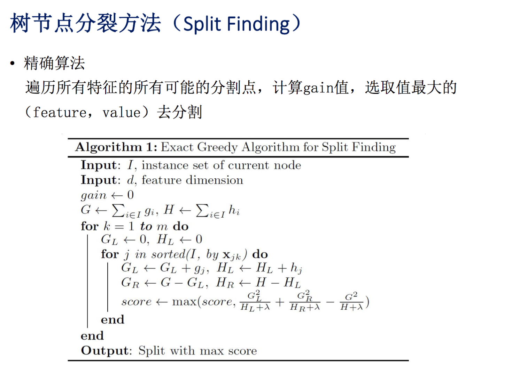
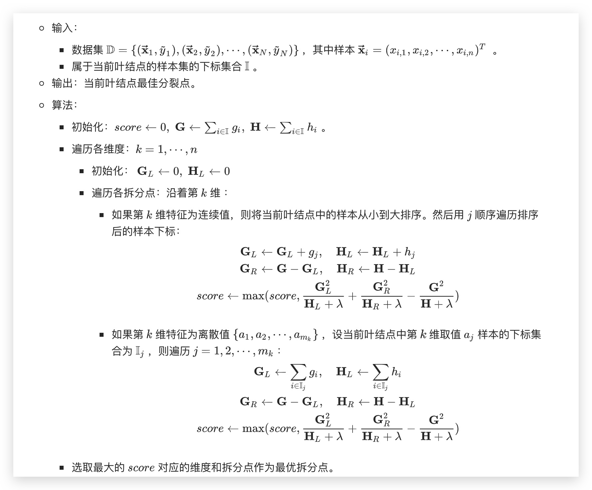
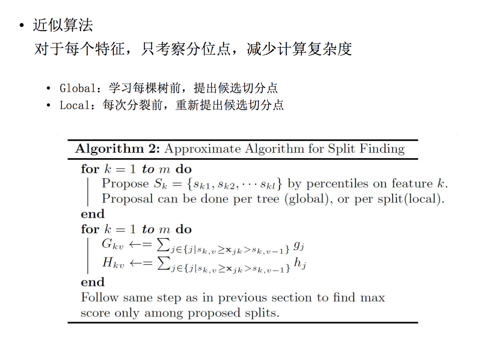

# Tree Boosting {ignore}

[TOC]

树模型的优缺点

| 优点             | 缺点                                                 |
| ---------------- | ---------------------------------------------------- |
| 不用归一化特征   | 缺乏平滑性（回归预测时输出值只能输出有限的若干种数值 |
| 有特征组合的作用 | 不适合处理高维稀疏数据                               |

### 决策树

决策树算法的缺点： 容易过拟合

对序列

$$
X = \left\\{ x _ { 0 } , x _ { 1 } , x _ { 2 } , \ldots , x _ { n } \right\\}
$$

如何找到一个分割点，使得左侧和右侧的均方误差最小化？

简单粗暴的办法就是从 0 到 n 遍历所有的切分点。但这样的话，每次遍历一次切分点，都要重新计算一次均值，然后再算 n 次减法的平方和。

#### ID3

采用 entropy 计算增益。缺点： 偏好用取值数目较多的属性进行划分。

#### C4.5

增益率: 增益除以该特征本身固有的熵。

#### CART

分类和回归树

采用 gini 指数计算增益。

$$
\operatorname { Gini } ( p ) = \sum _ { k = 1 } ^ { K } p _ { k } \left( 1 - p _ { k } \right) = 1 - \sum _ { k = 1 } ^ { K } p _ { k } ^ { 2 }
$$

从公式可以看到，基尼指数的意义是：从数据集 D 中随机抽取两个样本，其类别标记不一致的概率

## GBDT

$$
F ( x ; w ) = \sum _ { i = 0 } ^ { T } \alpha _ { t } h _ { t } \left( x ; w _ { t } \right) = \sum _ { i = 0 } ^ { T } f _ { t } \left( x ; w _ { t } \right)
$$

NP 难问题 -> 通过贪心法，迭代求局部最优解

## XGBoost

### 算法原理

#### 预测函数

$$
h ( \hat { y } | \vec { x } ) = \sum _ { i = 1 } ^ { K } f _ { i } ( \vec { x } ) ; \\\
其中
f _ { i } \in F , F = \\{ f (\vec { x } ) = w _ { q ( \vec { x } ) } \\}
\left( q : \vec { x } \rightarrow T , w \in R ^ { T } \right)
$$

$T$ 是叶子节点的个数。
每个$f$ 都对应一个独立的树结构 $q$ 和 叶节点的权重 $w$

$q(x)$ 表示将样本 $x$ 分到了某个叶子节点上，$w$ 是叶子节点的分数（leaf score），所以 $ w _ { q ( x ) }$表示回归树对样本的预测值

这里就体现出了 **加性模型**（additive training）

另外注意到： 树结构和叶子节点的权重分开来看！

#### 目标函数

$n$ 个样本 和 $K$ 个树，$T$ 个叶子节点

$$
O b j = \sum _ { i = 1 } ^ { n } l \left( y _ { i } , \hat { y } _ { i } \right) + \sum _ { k = 1 } ^ { K } \Omega \left( f _ { k } \right)
$$

$$
\Omega ( f _ { k } ) = \gamma T + \frac 1 2  \lambda \sum_{j=1}^T {w _ { j } ^ { 2 }}
$$

其中，$l$ 是一个可微凸损失函数。

对叶子节点个数进行惩罚，相当于在训练过程中做了剪枝。

#### 优化求解

第 t 次迭代后，模型的预测等于前 t-1 次的模型预测加上第 t 棵树的预测

$$
\hat { y } _ { i } ^ { ( t ) } = \hat { y } _ { i } ^ { ( t - 1 ) } + f _ { t } \left( x _ { i } \right)
$$

此时目标函数可写作：

$$
\mathcal { L } ^ { ( t ) } = \sum _ { i = 1 } ^ { n } l \left( y _ { i } , \hat { y } _ { i } ^ { ( t - 1 ) } + f _ { t } \left( \mathbf { x } _ { i } \right) \right) + \Omega \left( f _ { t } \right)
$$

$y _ { i } , \tilde { y } _ { i } ^ { ( t - 1 ) }$ 均为已知，模型要学习的的只有第$t$课树 $f_t$

将误差函数在 $\tilde { y } _ { i } ^ { ( t - 1 ) }$ 处进行二阶泰勒展开：

$$
\mathcal { L } ^ { ( t ) } \simeq \sum _ { i = 1 } ^ { n } \left[ l \left( y _ { i } , \hat { y } ^ { ( t - 1 ) } \right) + g _ { i } f _ { t } \left( \mathbf { x } _ { i } \right) + \frac { 1 } { 2 } h _ { i } f _ { t } ^ { 2 } \left( \mathbf { x } _ { i } \right) \right] + \Omega \left( f _ { t } \right)
$$

其中

$$
g _ { i } = \partial _ { \hat { y } ^ { ( t - 1 ) } } l \left( y _ { i } , \hat { y } ^ { ( t - 1 ) } \right) \\\
h _ { i } = \partial _ { \hat { y } ^ { ( t - 1 ) } } ^ { 2 } l \left( y _ { i } , \hat { y } ^ { ( t - 1 ) } \right)
$$

将公式中的常数项去掉，得

$$
\tilde { \mathcal { L } } ^ { ( t ) } = \sum _ { i = 1 } ^ { n } \left[ g _ { i } f _ { t } \left( \mathbf { x } _ { i } \right) + \frac { 1 } { 2 } h _ { i } f _ { t } ^ { 2 } \left( \mathbf { x } _ { i } \right) \right] + \Omega \left( f _ { t } \right)
$$

把 $f _ { t } , \Omega \left( f _ { t } \right)$ 写成树结构的形式，即把下式带入：

$$
f ( \mathbf { x } ) = w _ { q ( \mathbf { x } ) } \quad \Omega ( f ) = \gamma T + \frac { 1 } { 2 } \lambda \| w \| ^ { 2 }
$$

得到

$$
\begin{align}
\widetilde { L } ^ { ( t ) } & = \sum _ { i = 1 } ^ { n } \left[ g _ { i } f _ { t } \left( x _ { i } \right) + \frac { 1 } { 2 } h _ { i } f _ { t } ^ { 2 } \left( x _ { i } \right) \right] + \Omega \left( f _ { t } \right) \\\
& = \color{red} {\sum _ { i = 1 } ^ { n } \left[ g _ { i } w _ { q \left( x _ { i } \right) } + \frac { 1 } { 2 } h _ { i } w _ { q \left( x _ { i } \right) } ^ { 2 } \right] }+ \gamma T + \lambda \frac { 1 } { 2 } \color{blue}{\sum _ { j = 1 } ^ { T } w _ { j } ^ { 2 }}
\end{align}
$$

红色的部分对样本累加，蓝色的部分要对叶节点累加，如何统一？

定义每个叶节点 j 上的样本集合为 $I_j = \\{i|q(x_i) = j\\}$
则目标函数可以写成按叶节点累加的形式：

$$
\begin{aligned} \widetilde { L } ^ { ( t ) } & = \sum _ { j = 1 } ^ { T } \left[ \left( \sum _ { i \in I _ { j } } g _ { i } \right) w _ { j } + \frac { 1 } { 2 } \left( \sum _ { i \in I _ { j } } h _ { i } + \lambda \right) w _ { j } ^ { 2 } \right] + \gamma T \\\ & = \sum _ { j = 1 } ^ { T } \left[ G _ { j } w _ { j } + \frac { 1 } { 2 } \left( H _ { j } + \lambda \right) w _ { j } ^ { 2 } \right] + \gamma T \end{aligned}
$$

$G _ { j }$刻画了隶属于叶结点 $j$ 的那些样本的一阶偏导数之和。
$H _ { j }$刻画了隶属于叶结点 $j$ 的那些样本的二阶偏导数之和。

如果确定了树的结构（即$q(x)$ 确定），为了使目标函数最小，注意到叶节点权重之间无交叉，因此可以令每个$w_j$导数为 0，解得每个叶节点的最优预测分数为：

$$
w _ { j } ^ { * } = - \frac { G _ { j } } { H _ { j } + \lambda }
$$

带入目标函数，得到最小损失为

$$
\widetilde { L } ^ { * } = - \frac { 1 } { 2 } \sum _ { j = 1 } ^ { T } \frac { G _ { j } ^ { 2 } } { H _ { j } + \lambda } + \gamma T
$$

这个式子厉害了，它可以被视为一个衡量树结构质量的打分函数。也就是，对一个结构，有一个结构分。

但问题是，怎么确定树的结构？
暴力枚举所有可能的树结构，选择损失值最小的 - NP 难问题
因此用贪心法，每次尝试分裂一个叶节点，计算分裂前后的增益，选择增益最大的。

对于一个叶结点，假如给定其分裂点，定义划分到左子结点和右子节点的样本的集合分别为

$$
\mathbb { I } _ { L } = \left\\{ i | q \left( \overrightarrow { \mathbf { x } } _ { i } \right) = L \right\\} \\\
\mathbb { I } _ { R } = \left\\{ i | q \left( \overrightarrow { \mathbf { x } } _ { i } \right) = R \right\\}
$$

则有

$$
\begin{aligned} \mathbf { G } _ { L } & = \sum _ { i \in \mathbb { I } _ { L } } g _ { i } , \mathbf { G } _ { R } = \sum _ { i \in \mathbb { I } _ { R } } g _ { i } \\\ \mathbf { H } _ { L } & = \sum _ { i \in \mathbb { I } _ { L } } h _ { i } \mathbf { H } _ { R } = \sum _ { i \in \mathbb { I } _ { R } } h _ { i } \\\ \mathbf { G } =& \sum _ { i \in \mathbb { I } _ { L } } g _ { i } + \sum _ { i \in \mathbb { I } _ { R } } g _ { i } = \mathbf { G } _ { L } + \mathbf { G } _ { R } \\\ \mathbf { H } = & \sum _ { i \in \mathbb { I } _ { L } } h _ { i } + \sum _ { i \in \mathbb { I } _ { R } } h _ { i } = \mathbf { H } _ { L } + \mathbf { H } _ { R } \end{aligned}
$$

定义叶结点的分裂增益为

$$
\text { Gain } = \frac { 1 } { 2 } \left[ \frac { \mathbf { G } _ { L } ^ { 2 } } { \mathbf { H } _ { L } + \lambda } + \frac { \mathbf { G } _ { R } ^ { 2 } } { \mathbf { H } _ { R } + \lambda } - \frac { \mathbf { G } ^ { 2 } } { \mathbf { H } + \lambda } \right] - \gamma
$$

括号里的三项分别对应左结构分和右结构分以及不分裂的结构分。
$-\gamma$ 是因为分裂导致叶结点数量增大 1，从而导致增益的下降。

每次只分裂一个叶结点，因此其它叶结点不会发生变化。因此：
若 gain > 0 则选择分裂，否则不分裂。

那么问题又来了： 不知道分裂点。对于每个叶结点，存在很多个分裂点，且可能很多分裂点都能带来增益。

解决的办法是：对于叶结点中的所有可能的分裂点进行一次扫描。然后计算每个分裂点的增益，选取增益最大的分裂点作为本叶结点的最优分裂点。

#### 增益的计算

- ID3 算法采用信息增益
- C4.5 算法采用信息增益比
- CART 采用 Gini 系数
- XGBoost 的打分函数
  Gain 的值越大，分裂后 L 减小越多。所以当对一个叶节点分割时，计算所有候选(feature,value)对应的 gain，选取 gain 最大的进行分割

#### 分裂点求解

##### 贪心算法

贪心算法尝试所有特征和每个特征所有分裂位置，从而求得最优分裂点。
当样本太大且特征为连续值时，这种暴力做法的计算量太大。

##### 近似算法

近似算法寻找最优分裂点时不会枚举所有的特征值，而是对特征值进行聚合统计，然后形成若干个桶。
然后仅仅将桶边界上的特征的值作为分裂点的候选，从而获取计算性能的提升。

如果第 $k$ 个特征为连续特征，则执行**百分位分桶**.

分桶有两种模式：

1. 全局模式.
   在算法开始时，对每个维度分桶一次，后续的分裂都依赖于该分桶并不再更新。
   - 优点是：只需要计算一次，不需要重复计算。
   - 缺点是：在经过多次分裂之后，叶结点的样本有可能在很多全局桶中是空的。
2. 局部模式
   除了在算法开始时进行分桶，每次拆分之后再重新分桶。
   - 优点是：每次分桶都能保证各桶中的样本数量都是均匀的。
   - 缺点是：计算量较大。

全局模式会构造更多的候选拆分点。而局部模式会更适合构建更深的树。

##### 加权分桶

假设候选样本的第 $k$ 维特征，及候选样本的损失函数的二阶偏导数为：

$$
\mathcal { D } _ { k } = \left\\{ \left( x _ { 1 , k } , h _ { 1 } \right) , \left( x _ { 2 , k } , h _ { 2 } \right) , \cdots , \left( x _ { N , k } , h _ { N } \right) \right\\}
$$

定义排序函数：

$$
r _ { k } ( z ) = \frac { \sum _ { \left\\{ i | \left( x _ { i k } , h _ { i } \right) \in \mathcal { D } _ { k } , x _ { i , k } < z \right\\} } h _ { i } } { \sum _ { \left\\{ i | \left( x _ { i , k } , h _ { i } \right) \in \mathcal { D } _ { k } \right\\} } h _ { i } }
$$

它刻画的是：第 $k$ 维小于 $z$ 的样本的 $h$ 之和，占总的 $h$ 之和的比例。
即，每个数据点以 $h_i$ 作为权重。

给定分桶的宽度 $\epsilon$（由此知大致的分桶个数为 $\frac 1 {\epsilon}$）, 选取拆分点，使得相邻拆分点的排序函数值小于$\epsilon$, 第 $k$ 维每个桶内样本的 $h$ 之和，占总的 $h$ 之和的比例小于 $\epsilon$ 。

这种拆分点使得每个桶内的以 $h$ 为权重的样本数量比较均匀，而不是样本个数比较均匀.

那么，这种分桶方式是处于何种考虑呢？
因为，损失函数可以写为

$$
\sum _ { i = 1 } ^ { N } \frac { 1 } { 2 } h _ { i } \left( f _ { t } \left(  { \mathbf { x } } _ { i } \right) - \frac { g _ { i } } { h _ { i } } \right) ^ { 2 } + \Omega ^ { \prime } \left( f _ { t } (  { \mathbf { x } } ) \right) + \text { constant }
$$

上式正好是 label 为 $\frac {g_i} {h_i}$ 、权重为 $h_i$ 的加权平方损失。

#### xgboost 和 GBDT 的不同

- xgboost 其实也是一种 GBDT，只不过和传统的 GBDT 的实现上有诸多不同，因此，这里的 GBDT 特指 Friedman 的论文 **Greedy Function Approximation：A Gradient Boosting Machin** 中提到的算法
- 传统 GBDT 以 CART 作为基分类器，xgboost 还支持 LR 和 Linear 线性分类器
- xgboost 对代价函数进行了二阶泰勒展开，同时用到了一阶和二阶导数
- 代价函数 可以自定义
- xgboost 在代价函数里加入了正则项，用于控制模型的复杂度
- 列抽样（column subsampling）
- 缺失值自动处理，无需填充

#### xgboost 的可扩展性-计算速度提升大法

XGBoost 的一大特色（也是陈天奇在论文中反复强调的）是 可扩展性。那么，XGBoost 是如何实现良好的可扩展性的呢？

- **分块**
  提出 column block 数据结构来降低排序时间。
  每个特征进行分块（block）并排序，使得各个特征的增益计算能够并行。
  复杂度：
  设训练集中非缺失样本数为 $||x||_0$, $k$ 棵树，树的深度最大为 $d$，
  则精确贪心算法的复杂度为 $O(kd||x||_0 \log n)$，采用 block 结构后，复杂度只有 $O(kd||x||_0 + ||x||_0 \log n)$
  对近似算法，复杂度为 $O(kd||x||_0 + ||x||_0 \log q)$, 其中 $q$ 是分桶数，采用 block 结构后，复杂度只有 $O(kd||x||_0 + ||x||_0 \log B)$，其中 $B$ 是每个 block 中的最大行。

- **预取**
  通过设置合理的 block 的大小，充分利用了 CPU 缓存进行读取加速（cache-aware access）
  在精确贪心分裂时，针对一些大数据量的情形，运行速度可以达到原先的两倍！
  经验值： 每个 block $2^{16}$ 个样本。

- **压缩和分片**： **out-of-core**(基于外存) 通过将 block 压缩（block compressoin）并存储到硬盘上，并且通过将 block 分区到多个硬盘上（block Sharding）实现了更大的 IO 读写速度，使得 xgboost 处理大数据量的能力有所提升

#### XGBoost 对稀疏数据的处理

#### 防止过拟合

除了加入正则项以外，XGBoost 防止过拟合的措施还包括：

1. 使用 Shrinkage 来削弱每棵树的影响
   $f _ { t } ( { \mathbf { x } } ) = f _ { t - 1 } (  { \mathbf { x } } ) + \nu h _ { t } \left( { \mathbf { x } } ; \Theta _ { t } \right) , 0 < \nu \leq 1$
2. 列抽样

#### 处理缺失值

在 xgboost 算法的实现中，允许对数值 0 进行不同的处理。可以将数值 0 视作缺失值，也可以将其视作有效值。

对带有缺失值的节点，通过两轮遍历来确定稀疏值位于左子树和右子树。

#### 特征重要度

判断特征重要程度的三种指标：

1. weight - 默认值，该特征在所有树中被用作分割样本的特征的次数。
2. gain - 使用特征在作为划分属性时 loss 平均的降低量
3. cover - 使用特征在作为划分属性时对样本的覆盖度

#### 总结

XGBoost 的优点：

1. 支持用户自定义目标函数
2. 缺失值处理。
3. 理论上得到验证的加权分位数略图法
4. 优秀的系统设计

#### 其他问题

Xgboost 加入正则项和 CART 的剪枝，哪个更好？

## LightGBM

### LightGBM 的改进

Gradient-based One Side Sampling(GOSS)

梯度大的数据保留，梯度下的抽样，但是为了不改变分布

### 并行优化

传统的特征并行：

1. 垂直切分数据，每个 worker 只有部分特征，每个 worker 找到局部最佳切分点
2. worker 之间通信，找到全局最佳切分点
3. 具有最佳切分特征的 worker 进行节点分裂，并广播切分后左右子树的样本索引。
4. 其他 worker 根据广播的样本索引进行节点分裂。

LightGBM 的特征并行：

1. 每个 worker 保存所有数据集。
2. 每个 worker 在其负责的特征子集上寻找最佳切分
3. 通信，找到全局最佳切分点，广播，循环。

虽然避免了广播样本索引，减小了网络通讯量，但是数据量较大时，单 worker 存储全部数据代价大。

### 直方图加速

## 参考

- [统计学习-梯度提升树](http://www.huaxiaozhuan.com/%E7%BB%9F%E8%AE%A1%E5%AD%A6%E4%B9%A0/chapters/7_GBT.html)
