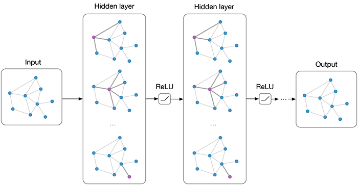

---
toc:
  depth_from: 1
  depth_to: 3
  ordered: false
---

# Graph Neural Networks {ignore=true}

[TOC]

## 什么是图神经网络

Deep Learning On Graphs ， **图神经网络**

GNN 的概念首先是 F. Scarselli 等人的论文 **The graph neural network model**（F. Scarselli et. al. 2009）中提出的，是一种 **建模结构化数据**的强大架构。

    <figure align='center'>
        
        <figcaption>Multi-layer Graph Convolutional Network (GCN) with first-order filters</figcaption>
    </figure>

2018 年，DeepMind 联合谷歌大脑、MIT 等机构 27 位作者发表重磅论文[「Relational inductive biases, deep learning, and graph networks」](https://arxiv.org/abs/1806.01261)，提出 「图网络」（Graph network），提议 **把传统的贝叶斯因果网络和知识图谱，与深度强化学习融合**，将端到端学习与归纳推理相结合，有望解决深度学习无法进行关系推理的问题。

可以处理的问题包括： 节点的 label 预测。

> 图灵奖得主、贝叶斯网络之父 Judea Pearl：深度学习的因果推理之殇

**Graph to Graph**

**graph convolutions**

**Spectral graph theory**

Combinatorial Generalization
: 组合泛化, 将不同的实体和关系进行组合可以产生无限的生成能力, 参照自然语言.

Inductive Biases
: 归纳偏置，即我们在归纳的时候用的假设。图网络具有强大的关系归纳偏置，而神经网络等的归纳偏差较弱。

在得知 **泄漏** 这个词汇可以和情报一起使用后, 我们怎么对泄漏的使用进行泛化呢?

> 实例类的可组合性 是 抽象类可组合性的充分必要条件.

符号主义 和 连接主义 的结合

动态图、时序图

## 原始 GNN

### 构建方式

### 存在的问题

## 图卷积网络 GCN

将卷积运算从传统数据（例如图像）推广到图数据

GCN 方法又可以分为两大类，基于频谱（spectral-based）和基于空间（spatial-based）。

1. 基于频谱的方法 Spectral-based Graph Convolutional Networks
   从图信号处理的角度引入滤波器来定义图卷积，其中图卷积操作被解释为从图信号中去除噪声。
   在基于频谱的图神经网络中，图被假定为无向图，无向图的一种鲁棒数学表示是正则化图拉普拉斯矩阵，即

   $$
   \mathbf { L } = \mathbf { I } _ { \mathbf { n } } - \mathbf { D } ^ { - \frac { 1 } { 2 } } \mathbf { A } \mathbf { D } ^ { - \frac { 1 } { 2 } }
   $$

   正则化图拉普拉斯矩阵具有实对称半正定的性质。利用这个性质，正则化拉普拉斯矩阵可以分解为

   $$
   正则化图拉普拉斯矩阵具有实对称半正定的性质。利用这个性质，正则化拉普拉斯矩阵可以分解为
   $$

2) 基于空间的方法将图卷积表示为从邻域聚合特征信息，当图卷积网络的算法在节点层次运行时，图池化模块可以与图卷积层交错，将图粗化为高级子结构。

在效率方面，基于频谱的模型的计算成本随着图的大小而急剧增加，因为它们要么需要执行特征向量计算，要么同时处理整个图(需要将整个图加载到内存中以执行图卷积)，这使得它们很难适用于大型图。基于空间的模型有潜力处理大型图，因为它们通过聚集相邻节点直接在图域中执行卷积。计算可以在一批节点中执行，而不是在整个图中执行。当相邻节点数量增加时，可以引入采样技术来提高效率。

在一般性方面，基于频谱的模型假定一个固定的图，使得它们很难在图中添加新的节点。另一方面，基于空间的模型在每个节点本地执行图卷积，可以轻松地在不同的位置和结构之间共享权重。

在灵活性方面，基于频谱的模型仅限于在无向图上工作，有向图上的拉普拉斯矩阵没有明确的定义，因此将基于频谱的模型应用于有向图的唯一方法是将有向图转换为无向图。基于空间的模型更灵活地处理多源输入，这些输入可以合并到聚合函数中。因此，近年来空间模型越来越受到关注。

### GraphSage

### 2019-AliGraph

### ModGraph

## 图注意力网络（Graph Attention Networks, GAT）

## 图自编码器（ Graph Autoencoders）

## 图生成网络（ Graph Generative Networks）

## 图时空网络（Graph Spatial-temporal Networks）

## 图神经网络的应用

### 在计算机视觉中的应用

### 在推荐系统中的应用

###

## 参考文献

- [图神经网络综述](https://zhuanlan.zhihu.com/p/75307407)
-
