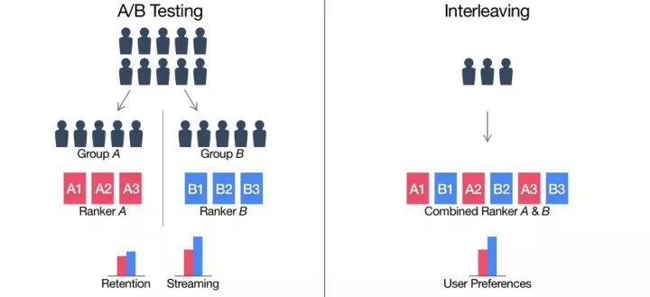

# 产品工业实践 {ignore=true}

[TOC]

## 模型的快速线上评估方法

### A/B Testing

产品和决策在互联网行业都要以用户反馈为依据，A/B 测试作为一种控制对比实验手段，在用户反馈分析中有非常重要的应用。

#### 结果的显著性

从总体 N 个样本中以采样率 p 采样出来的样本数目为 X，在 p 远小于 1 时，那么 X 的标准差可以等于 $\sqrt { N p ( 1 - p ) } \approx \sqrt { N p } \approx \sqrt { X }$，也就是等于观察到样本数目开根号， 可以称之为**根号法则**
一般认为自然波动不超过 3 个标准差。即，超过 3 个标准差的波动就是显著的。

这也可以用来检验 AB 分流是否有问题。

#### AB 测试的校验-AA 测试

即使分流符合比例，也不代表真正随机。因此，有必要用 AA 实验证明AB有效。

### Interleaving

[王喆的机器学习笔记：Interleaving](https://mp.weixin.qq.com/s/396vl-RJkE5J6Gd2c0-nLg)[^1]

[^1]: interleaving: 交叉

> 流媒体巨头 Netflix 的“独门线上评估秘笈”

2017 年就已经在使用了。

两阶段的线上测试过程:

    1. 第一阶段利用被称为 Interleaving 的测试方法进行候选算法的快速筛选，
       从大量初始想法中筛选出少量“优秀的”Ranking算法。
    2. 第二阶段是对缩小的算法集合进行传统的AB Test，
       以测量它们对用户行为的长期影响。

传统的 AB Test 除了存在效率问题，还存在一些统计学上的显著性差异问题. 例如，验证用户群体是否对“可口可乐”和“百事可乐”存在口味倾向。那么按照传统的做法，我们会将测试人群随机分成两组然后进行“盲测”，即在不告知可乐品牌的情况下进行测试。第一组只提供可口可乐，第二组只提供百事可乐，然后根据大家一定时间内的可乐消耗量来观察人们是更喜欢“可口可乐”还是“百事可乐”。

这个实验一般意义上确实是有效的，很多时候我们也是这么做的。但也确实存在一些潜在的问题：

    1.总的测试人群中，对于可乐的消费习惯肯定各不相同，从几乎不喝可乐到每天喝大量可乐的人都有。

    2.可乐的重消费人群肯定只占总测试人群的一小部分，但他们可能占整体汽水消费的较大比例。

这两个问题导致了，即使 AB 两组之间重度可乐消费者的微小不平衡也可能对结论产生不成比例的影响。

在互联网场景下，这样的问题同样存在。比如 Netflix 场景下，非常活跃用户的数量是少数，但其贡献的观看时长却占较大的比例，因此 Netflix AB Test 中活跃用户被分在 A 组的多还是被分在 B 组的多，将对结果产生较大影响，从而掩盖模型的真实效果。

那么如何解决这个问题呢？一个方法是不对测试人群进行分组，而是让所有测试者都可以自由选择百事可乐和可口可乐（测试过程中仍没有品牌标签，但能区分是两种不同的可乐）。在实验结束时，统计每个人可口可乐和百事可乐的消费比例，然后进行平均后得到整体的消费比例。

这个测试方案的优点在于：

    1.消除了 AB 组测试者自身属性分布不均的问题；

    2.通过给予每个人相同的权重，降低了重度消费者对结果的过多影响。

这个测试思路应用于 Netflix 的场景，就是 Interleaving。

当然，在用 Interleaving 方法进行测试的时候，必须要考虑位置偏差的存在，避免来自算法 A 的视频总排在第一位。因此需要以相等的概率让算法 A 和算法 B 交替领先。

| 优势                                                                                     | 不足                                                                 |
| ---------------------------------------------------------------------------------------- | -------------------------------------------------------------------- |
| 灵敏度高，同样精度的结论需要更少的样本，从而可以支持更多实验，大大加强了线上测试的能力。 | 工程实现更加复杂                                                     |
| 和 AB test 存在强相关性                                                                  | 只是一个相对测量，不能得出完整的表现                                 |
|                                                                                          | 实验之间互相影响，非正交，在一些排他场景下不可使用，例如广告平滑消耗 |

其实 Interleaving 方法有点多臂老虎机的感觉： 随着用户来摇臂，逐渐确定哪个臂更好。

## 产品分析

### 用户分析

#### 族群分析(cohort analysis)

人群行为分析的一种, 主要用于用户粘性分析, 留存分析

### 竞品分析

## 思考视野

互联网的价值

互联网作用于社会的方式：连接一切

关系赋权

## 参考

- [揭秘大众点评网大规模并行 A/B 测试框架 Gemini](http://www.csdn.net/article/2015-03-24/2824303)

- [Overlapping Experiment Infrastructure: More, Better, Faster Experimentation by Diane Tang, et al., google, 2010](http://static.googleusercontent.com/media/research.google.com/en//pubs/archive/36500.pdf)

  重叠实验架构： 更多、更好、更快地实验。
  更多：我们需要能同时进行多个实验的可扩展性。但是我们也需要灵活性：不同的实验需要不同的配置和不同的流量来衡量实验的统计意义上的效果显著性.
  更好：不合理的实验是不应该让它在线上流量进行的。合理的但是很差的实验（比如，有 bug 的实验或是无意中产生的很差的实验结果）都应该能很快的被捕获并且停止它的进行。标准化的标价指标可以让所有的实验进行公平的比较.
  更快：能够很容易并且很快地建立一个实验。容易到非工程师不需要写代码就可以创建一个实验。评价指标应该很快的被统计出来，以便分析。简单的迭代可以很快速地进行.
  待读，翻译在[这里](http://ju.outofmemory.cn/entry/112729)，以及[解读](http://blog.sina.com.cn/s/blog_6e654d2b0101hpkr.html)

- [喻国明：互联网的价值本质是网络连接之下的关系赋权](http://mp.weixin.qq.com/s?__biz=MzI5NzAyODEzMw==&mid=401819581&idx=1&sn=dda264ad06b493e1a27adf10aabde034&scene=23&srcid=0217CCf3bpc0gFToASKEYDDb#rd)
