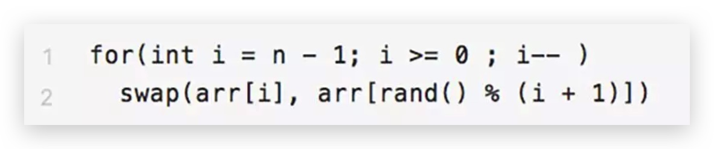

# 问题 {ignore=true}

[TOC]

## 数学基础

1. 解释什么是极大似然估计？
2. 贝叶斯公式
3. 贝塔分布
4. 指数组分布
5. 多元正太分布
6. 最大后验估计
7. 相关性衡量
8. 大数定律
9. 中心极限定律
10. 假设检验和 p 值
11. 拉格朗日乘子法
12. 对偶法
13. 最优化

从单位圆盘上随机选择一点，距离圆心的距离期望是多少？

## 机器学习

### 一般理论

1. 偏差-方差权衡
2. 生成模型和判别模型的区别
3. 过拟合和欠拟合
4. VC 维度
   3

**如何防止模型过拟合**
Early Stopping、数据集扩充、正则化法 以及 dropout， 决策树剪枝
标签平滑

**生成算法和判别算法的区别**

1. 你常用的评估模型的指标有哪些？
2. 如何处理不平衡数据
   1. 选择合适的评价指标
   2. 抽样
   3. 设计损失函数

特征处理(包括获取、编码、归一化、处理流程等)，模型使用(开源还是自行开发，为什么这样选择)，评价方法(准召率以及其他考量，在线指标还是离线评估)

### 模型

1. 广义线性模型 GLM
2. 逻辑回归
3. 广义线性混合模型 GLMM
4. 高斯判别分析 GDA
5. SVM
6. 关联规则
7. MCMC
8. GBDT
   1. xgboost
   2. lightgbm
   3. adaboost
9. 随机森林
10. 矩阵分解
11. 协同过滤
12. FM
13. FFM
14. DeeoFM
15. 朴素贝叶斯
16. EM
17. KNN
18. PCA
19. K-means
20. CRF
21. HMM
22. 概率图模型
23. MDP
24. Bayes Network
25. 变分推断
26. 模拟退火
27. RBM

- [ ] 加权逻辑回归

### 特征选择方法

### 误差函数

### 模型评估

## 深度学习

1. MLP
2. DCN
   1. 1\*1 的卷积核 有什么用
   2. 常见的网络结构异同，例如 Alex Net , VGG Net
3. Word2vec
4. LSTM
5. GAN
6. wide\&deep
7. attention
8. Transformer
9. CapsNet
10. 什么是 Inception ?
    - GoogleNet 中的模块
    - 引入的场景： 为卷积操作选择合适的卷积核大小比较困难。
    - Inception 的思路是：在同一层级上运行具有多个尺寸的滤波器，并级联输出。网络本质上会变得稍微宽一些
    -

使用用户历史点击／下单的 POI 序列来刻画用户偏好，行为序列中每个 POI 的相关属性通过 embedding 的方式进行映射并通过 pooling 的方式聚合,这种方式有什么不足？

1. 没有利用到这个特征的时序信息
2. 模型无法区分序列中不同行为的权重

## 数据结构与算法

字典树

## 编程

1. python

topK 问题

显然全排序的复杂度为 $O(n*lg(n))$, 而冒泡的话是可以做到 $O(n*k)$ 的，但其实冒泡的话，k 个元素也是排序的，这并不必要 ，因此，可以继续优化为堆。具体的，维护一个小顶堆。
接着，从第 k+1 个元素开始扫描，和堆顶（堆中最小的元素）比较，如果被扫描的元素大于堆顶，则替换堆顶的元素，并调整堆，以保证堆内的 k 个元素，总是当前最大的 k 个元素。复杂度 $O(n*lg(k))$

另外，可以用二分法找到第 k 大的数，然后做一次划分。这种方法也称随机选择算法。 它的时间复杂度是 O(n)。

python 中，is 和 == 的区别？
is 是对比地址,==是对比值

**青蛙爬楼问题**
每步可上 1 或 2 级台阶，问 N 级台阶的上法有多少种？

错误的想法： 先上到 N-2，然后有两种选择，所以 $f(n) = f(n) + 2$
错误之处在于： N-2 未必一定是到达的，也有可能是跳过的。
正确的想法： 最后一步，要么跳一下，要么跳两下，因此 $f(n) = f(n-1) + f(n-2)$
其实就是斐波那契数列

```python
from functools import wraps
# functools.wraps 是包装器的装饰器，不加也不会影响装饰器工作，但加上之后，函数的名称和help函数不会失效
def memo(func):
    cache={}
    @wraps(func)
    def wrap(*args):
        if args not in cache:
            cache[args]=func(*args)
        return cache[args]
    return wrap

@memo
def fib(i):
    if i<2: return 1
    return fib(i-1)+fib(i-2)
```

迭代形式

```python
def fib(n):
    if n <= 2: return 1
    a, b = 1,1
    i = 2
    while n >= 2:
        a, b = b, a+b
        n = n + 1
    return b

```

**公平的洗牌算法**

什么是公平？

全排列中随机抽一个是最公平的，但是复杂度太高（n 的阶乘）！

Knuth 洗牌算法


复杂度是线性的。

## 大数据

有一个好友列表，其中第一列是用户，后面的列是用户关注的好友。要求 找出每两个好友的共同好友。

## 工业

1. AB test 样本量如何确定？

### 场景

1. 完整的数据挖掘、机器学习项目的流程。
2. 如何预测蔬菜价格。
   提几个特征做预测模型：肉的价格、土壤健康指标、天气情况、国民收入、货币汇率等等。
3. 广告位置只有一个，如何在满足约束最优？

## 务虚

1. 你觉得人生至此你最重要的成就，或者最令你骄傲的东西是什么？

2. 你上一次通过「没有遵守世俗的规则」而获取了某种优势，或者为自己赢得了某种机会的经历是怎么样的？（英文解释：Have you ever hacked something to your advantage? ——"Hacked" in the sense of beating the system, not breaking into computers.）

3. 你有什么样的兴趣和爱好？你为其付出过怎样的努力与代价？

4. 向我推荐一部你非常喜欢的作品（领域不限），说说你为什么会喜欢它？

5. 在你的生活中可以接触到的人里面，你觉得谁会讨厌你或者不太喜欢你？在你的想象中，他们不喜欢你的原因会是什么？

6. 你人生至此印象比较深刻的一次失败或者一个后悔是什么？

7. 你认为如果把「学习能力」向下拆分，可以拆分成哪些更细节的能力？其中你比较擅长哪一个？最不擅长哪一个？

8. 你觉得谁是自己学习过的最好的老师？为什么？以及 TA 的局限性是什么？

9. What important truth do very few people agree with you on?（这一题当时是需英文作答）

10. 如何给盲人描述黄色？

    1. 先天还是后天？

11. 美团、百度和淘宝的搜索场景有什么不同？
    1. 目标： 交易、相关性
    2. 数据结构化程度
    3. 位置约束进而供给约束
    4. 能力的侧重
12.

## 参考资料

- [The Data Science Interview Study Guide](https://pan.baidu.com/s/1z_qU6_5yHpmzLQ0khDxXJg)
- [Gitbook: machine learning](https://legacy.gitbook.com/book/shunliz/machine-learning/details)
- [book: Foundations of Data Science]()
-
