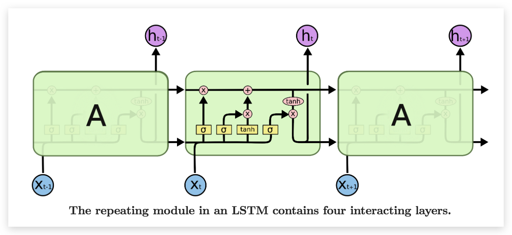

# LSTM {ignore=ture}

[TOC]

LSTM(long short term memory networks)， Hochreiter 和 Schmidhuber 于 1997 年提出

一般用 BPTT（通过时间的反向传播） 训练 RNN 模型时会因为梯度坍塌/爆炸而无法捕捉远距离依赖，而 LSTM 专治此不服。

LSTM 目前已在诸多领域获得了成功，俨然已是最流行的 RNN 模型，[谷歌的邮件智能回复系统](http://googleresearch.blogspot.co.uk/2015/11/computer-respond-to-this-email.html)也采用了 LSTM.

## LSTM 原理

## 双向 LSTM

## 参考资料

- [Understanding LSTM Networks](http://colah.github.io/posts/2015-08-Understanding-LSTMs/)
  是一篇不错的介绍文章，里面对 LSTM 有很生动的介绍。
- Andrej Karpathy 所写的 [The Unreasonable Effectiveness of Recurrent Neural Networks](http://karpathy.github.io/2015/05/21/rnn-effectiveness/) 更是值得一读。
- [RNN Tutorials 系列文章](http://www.wildml.com/2015/09/recurrent-neural-networks-tutorial-part-1-introduction-to-rnns/) 也写的很好，建议一读。
