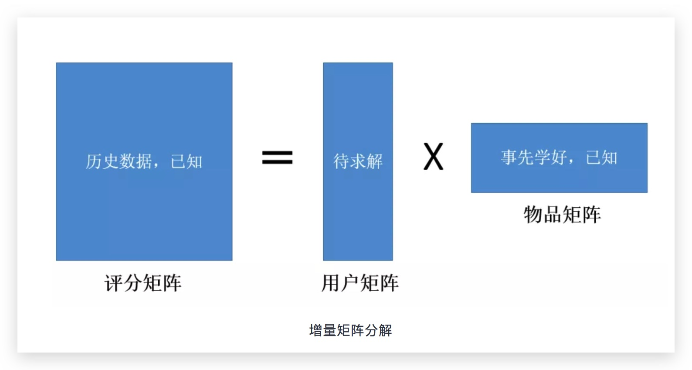

# 矩阵分解 {ignore=true}

[TOC]

基于模型的协同过滤技术.

注意到，矩阵分解也是生成 embedding 表示的一种方法。

## 显式矩阵分解

### 目标函数

$$
\min _ { X , Y } \sum _ { r _ { u i } \neq 0 } \left( r _ { u i } - x _ { u } ^ { T } y _ { i } \right) ^ { 2 } + \lambda \left( \sum _ { u } \left\| x _ { u } \right\| _ { 2 } ^ { 2 } + \sum _ { i } \left\| y _ { i } \right\| _ { 2 } ^ { 2 } \right)
$$

<aside class='key-point'>
为何这里误差项只包含了有评分的项，而不包括没有评分的项？
因为没有评分的话，就不知道真实的评分啊，真实的评分不是0
</aside>

### 求解方法

#### 交替最小二乘法(alternative least square, ALS)

##### 原理

先固定 $X$ 优化 $Y$ ，然后固定 $Y$ 优化 $X$ ，这个过程不断重复，直到 $X$ 和 $Y$ 收敛为止。每次固定其中一个优化另一个都需要解一个最小二乘问题，所以这个算法叫做交替最小二乘方法。

$Y$ 固定为上一步迭代值或初始化值，优化 $X$ ：

此时，$Y$ 被当做常数处理，目标函数被分解为多个独立的子目标函数，每个子目标函数对应一个用户。对于用户 $u$ ，目标函数为：

$$
\min _ { X_u } \sum _ { r _ { u i } \neq 0 } \left( r _ { u i } - x _ { u } ^ { T } y _ { i } \right) ^ { 2 } + \lambda  \left\| x _ { u } \right\| _ { 2 } ^ { 2 }
$$

这里面残差项求和的个数等于用于 $u$ 评过分的物品的个数，记为 $m$ 个。把这个目标函数化为矩阵形式，得

$$
J \left( x _ { u } \right) = \left( R _ { u } - Y _ { u } ^ { T } x _ { u } \right) ^ { T } \left( R _ { u } - Y _ { u } ^ { T } x _ { u } \right) + \lambda x _ { u } ^ { T } x _ { u }
$$

其中

$$
R _ { u } = \left[ r _ { u i _ { 1 } } , \cdots , r _ { u i _ { m } } \right] ^ { T }
$$

表示用户 $u$ 对这 $m$ 个物品的评分构成的向量，

$$
Y _ { u } = \left[ y _ { i _ { 1 } } , y _ { i _ { 2 } } , \cdots , y _ { i _ { m } } \right]
$$

表示这 $m$ 个物品的向量构成的矩阵，顺序跟 $R_u$ 中物品的顺序一致。

对目标函数 $J$ 关于 $x_u$ 求梯度，并令梯度为零，得：

$$
\frac { \partial J \left( x _ { u } \right) } { \partial x _ { u } } = - 2 Y _ { u } \left( R _ { u } - Y _ { u } ^ { T } x _ { u } \right) + 2 \lambda x _ { u } = 0
$$

解这个线性方程组，可得到 $x_u$ 的解析解为

$$
x _ { u } = \left( Y _ { u } Y _ { u } ^ { T } + \lambda I \right) ^ { - 1 } Y _ { u } R _ { u }
$$

$X$ 固定为上一步迭代值或初始化值，优化 $Y$, 和上面是类似的。

##### ALS 的工程实现

当固定 $Y$ 时，各个 $x_u$ 的计算是独立的，因此可以对 $x_u$ 进行分布式并行计算。同理，当固定 $X$ 时，各个 $y_i$ 的计算也是独立的，因此也可以对 $y_i$ 做分布式并行计算。

因为 $x_u$ 和 $Y_i$ 中只包含了有评分的用户或物品，而非全部用户或物品，因此 $x_u$ 和 $y_i$ 的计算时间复杂度为 $O(k^2n_u+k^3)$ , 其中 $n_u$ 是有评分的用户数或物品数，$k$ 为隐变量个数。

## 隐式矩阵分解

隐式矩阵分解与显式矩阵分解的一个比较大的区别，就是评分矩阵退化为元素只有 0 或 1，它会去拟合评分矩阵中的零，即没有评分的地方也要拟合。

因为不是显式评分，所以需要对构建的评分矩阵有一个置信度衡量

$$
c _ { u i } = 1 + \alpha r _ { u i }
$$

$$
p _ { u i } = \left\\{ \begin{array} { l l } { 1 } & { r _ { u i } > 0 } \\\ { 0 } & { r _ { u i } = 0 } \end{array} \right.
$$

### 目标函数

$$
\min _ { X , Y } \sum _ { u = 1 } ^ { N } \sum _ { i = 1 } ^ { M } c _ { u i } \left( p _ { u i } - x _ { u } ^ { T } y _ { i } \right) ^ { 2 } + \lambda \left( \sum _ { u = 1 } ^ { N } \left\| x _ { u } \right\| _ { 2 } ^ { 2 } + \sum _ { i = 1 } ^ { M } \left\| y _ { i } \right\| _ { 2 } ^ { 2 } \right)
$$

### 求解方法

#### ALS

##### 原理

$Y$ 固定为上一步迭代值或初始化值，优化 $X$ ：

$$
\min _ { x _ { u } } \sum _ { i = 1 } ^ { M } c _ { u i } \left( p _ { u i } - x _ { u } ^ { T } y _ { i } \right) ^ { 2 } + \lambda \left\| x _ { u } \right\| _ { 2 } ^ { 2 }
$$

把这个目标函数化为矩阵形式，得

$$
J \left( x _ { u } \right) = \left( P _ { u } - Y ^ { T } x _ { u } \right) ^ { T } \Lambda _ { u } \left( P _ { u } - Y ^ { T } x _ { u } \right) + \lambda x _ { u } ^ { T } x _ { u }
$$

其中

$$
P _ { u } = \left[ p _ { u 1 } , \cdots , p _ { u M } \right] ^ { T }
$$

为用户 $u$ 对每个物品的偏好构成的列向量

$$
Y = \left[ y _ { 1 } , y _ { 2 } , \cdots , y _ { M } \right]
$$

表示所有物品向量构成的矩阵

$\Lambda _ { u }$ 为 用户 $u$ 对所有物品的置信度 $c_{ui}$ 构成的对角阵，即

$$
\Lambda _ { u } = \left( \begin{array} { c c c } { c _ { u 1 } } & { } & { } \\\ { } & { \ddots } & { } \\\ { } & { } & { c _ { u M } } \end{array} \right)
$$

对目标函数 $J$ 关于 $x_u$ 求梯度，并令梯度为零，得：

$$
\frac { \partial J \left( x _ { u } \right) } { \partial x _ { u } } = - 2 Y \Lambda _ { u } \left( P _ { u } - Y ^ { T } x _ { u } \right) + 2 \lambda x _ { u } = 0
$$

解得

$$
x _ { u } = \left( Y \Lambda _ { u } Y ^ { T } + \lambda I \right) ^ { - 1 } Y \Lambda _ { u } P _ { u }
$$

同理可得

$$
y _ { i } = \left( X \Lambda _ { i } X ^ { T } + \lambda I \right) ^ { - 1 } X \Lambda _ { i } P _ { i }
$$

##### 工程实现

直接用上述解析解的表达式来计算，复杂度将会很高

以 $x_u$ 的表达式来说，$Y \Lambda _ u Y^T$ 这一项就涉及到所有物品的向量，少则几十万，大则上千万，**而且每个用户的都不一样，每个用户都算一遍时间上不可行**。所以，这里要先对 $x_u$ 的表达式化简，看看有哪些是公共的部分可以分解出来，只计算一次，以降低复杂度。

注意到 $\Lambda _ u$ 的特殊性，它是由置信度构成的对角阵，对于一个用户来说，由于大部分物品都没有评分，以此 $\Lambda _ u$ 对角线中大部分元素都是 1，利用这个特点，我们可以把 $\Lambda _ u$ 拆成两部分的和，即

$$
\Lambda _ { u } = \left( \Lambda _ { u } - I \right) + I
$$

$\Lambda _ u -I$ 为对角阵，并且对角线上大部分元素为 0，于是，可以重写为如下形式：

$$
Y \Lambda _ { u } Y ^ { T } = Y Y ^ { T } + Y \left( \Lambda _ { u } - I \right) Y ^ { T }
$$

分解成这两项之后，第一项 $Y Y ^ { T }$ 对每个用户都是一样的，只需要计算一次，存起来，后面可以重复利用，对于第二项，由于$\Lambda _ u -I$ 为对角线大部分是 0 的对角阵，所以计算 $Y (\Lambda _ u -I) Y ^T$ 的复杂度是 $O(k^2n_u)$。其中 $n_u$ 是 $\Lambda _ u -I$ 中非零元的个数，也就是用户 u 评过分的物品数，通常不会很多，所以整个 $Y \Lambda _ { u } Y ^ { T }$ 的计算复杂度由 $O(k^2M)$ 降为 $O(k^2n_u)$。由于 $M \gg n_u$，所以计算速度大大加快。

对于 $x_u$ 表达式的 $Y \Lambda _ { u } P _ { u }$ 这一项，则应 $Y (\Lambda _ { u } P _ { u })$ 这样计算，利用 $P_u$ 中大部分元素是 0 的特点，将计算复杂度由 $O(kM )$ 降低到 $O(kn_u)$。通过使用上述数学技巧，整个 $x_u$ 的计算复杂度可以降低到 $O(k2nu+k^3)$，其中 $n_u$ 是有评分的用户数或物品数，$k$ 为隐变量个数，完全满足在线计算的需求。

## 增量矩阵分解

> 在不重算所有用户向量的前提下，快速计算出新用户向量

在交替最小二乘法里，当固定 $Y$ 计算 $x_u$ 时，我们只需要用到用户 $u$ 的历史行为数据 $r_{ui}$ 以及 $Y$ 的当前值，不同用户之间 $x_u$ 的计算是相互独立的。这就启发我们，对于训练集以外的用户，我们同样可以用他的历史行为数据以及训练集上收敛时学到的 Y，来计算新用户的用户向量

因此，这和上面固定 $Y$ 计算 $x_u$ 是一样的，仅有两处不同

1. $Y$ 可是 MF 在训练集上收敛时得到的，或者其他方式得到即可
2. 用户的历史行为数据 $P_u$ 要过滤掉在 $Y$ 中没出现过的物品，因为没有出现过的物品还没有物品向量。

## 矩阵分解方法的可解释性

传统的 ItemCF 算法有很好的可解释性，其实矩阵分解方法也可以。

已知物品的矩阵 $Y$ 时，用户 $u$ 的向量的计算表达式为：

$$
x _ { u } = \left( Y \Lambda _ { u } Y ^ { T } + \lambda I \right) ^ { - 1 } Y \Lambda _ { u } P _ { u }
$$

假设物品 $i$ 的向量为 $y_i$，那么用户 $u$ 对物品 $i$ 的预测评分为：

$$
\hat { r } _ { u i } = y _ { i } ^ { T } x _ { u } = y _ { i } ^ { T } \left( Y \Lambda _ { u } Y ^ { T } + \lambda I \right) ^ { - 1 } Y \Lambda _ { u } P _ { u }
$$

令

$$
W _ { u } = \left( Y \Lambda _ { u } Y ^ { T } + \lambda I \right) ^ { - 1 }
$$

并把 $Y \Lambda _ { u } P _ { u }$ 展开来写， 则有

$$
\hat { r } _ { u i } = y _ { i } ^ { T } W _ { u } \sum _ { j \in N ( u ) } c _ { u j } y _ { j } = \sum _ { j \in N ( u ) } c _ { u j } \left( y _ { i } ^ { T } W _ { u } y _ { j } \right) = \sum _ { j \in N ( u ) } c _ { u j } s _ { j i }
$$

其中

$$
s_ { j i } = y _ { i } ^ { T } W _ { u } y _ { j }
$$

可以看成是物品 $j$ 和物品 $i$ 之间的相似度

这样就能像 ItemCF 那样去解释 $N(u )$(表示用户 $u$ 有过行为的物品集合)中每一项对推荐物品 i 的贡献了.

从 $s_{ji}$ 的计算表达式中，我们还可以看到，

> 物品 $j$ 和物品 $i$ 之间的相似度 $s_{ji}$ 是跟用户 $u$ 有关系的

也就是说，即使是相同的两个物品，在不同用户看来，它们的相似度是不一样的，这跟 ItemCF 的固定相似度有着本质上的区别，MF 的相似度看起来更合理一些。

## SVD

## SVD ++

## 矩阵分解应用

### 基于内容的 MF 召回

在文章推荐场景中，如前增量计算中所述，物品向量可以用文章基于词向量得到的表示，这样就能得到用户向量。

计算出 $x_u$ 后，将 $x_u$ 和每一个 $y_i$ 计算一下内积，把内积最大的 top K 篇文章作为召回结果返回。在工程实现上，这种需要从 $Y$ 中快速找出 top K 个与 $x_u$ 最相似的向量问题，通常都可以交给**向量索引系统**去做，例如 Faiss。

由于这里用到的 $Y$ 是从文章语料库学出来的内容向量，而不是从行为数据中学出来的，因此，这里的 MF 召回属于基于内容的召回

与基于邻域的内容召回方法(用历史点击文章的相似文章作为召回结果)相比，MF 的优势在于它能提高召回内容的准确性。基于邻域的方法可以看成是 MF 的一种特例。两者的主要区别在于，在基于邻域的算法里，两篇文章的相似度对所有用户都是一样的，而在 MF 中，两篇文章的相似度对不同用户是不一样的。也就是 MF 考虑得更细，因此会比基于邻域的方法更准确。在线实验中也表明 MF 召回比基于邻域的内容召回方法要更好。

### 基于行为的 MF 召回

分解由在一定时间窗口内的用户行为构成的物品共现矩阵 $\mathrm { R } = \left\\{ r _ { i j } \right\\}$。

对矩阵 $R$ 的每一行做截断，只保留数值最大的 K 个非零的 $r_{ij}$ ，其余 $r_{ij}$ 置零。记 $x_i$ 为文章 $i$ 位于滑动窗口中心时的向量，$y_i$ 表示文章 $i$ 不在滑动窗口中心时的向量，可构造矩阵分解模型如下

$$
\min _ { X , Y } \sum _ { i = 1 } ^ { M } \sum _ { j = 1 } ^ { M } c _ { i j } \left( \log r _ { i j } - x _ { i } ^ { T } y _ { j } \right) ^ { 2 } + \lambda \left( \sum _ { i = 1 } ^ { M } \left\| x _ { i } \right\| _ { 2 } ^ { 2 } + \sum _ { j = 1 } ^ { M } \left\| y _ { j } \right\| _ { 2 } ^ { 2 } \right)
$$

其中， $c _ { i j } = \alpha \log \left( 1 + r _ { i j } \right)$, $\alpha$ 和 $\lambda$ 为超参数。

解这个目标函数，可以得到每篇文章的向量 $x_i$ 和 $y_i$ ，用的时候我们只用 $x_i$

有了文章的向量，我们就可以计算文章之间的相似度，为每篇文章找到 top K 相似文章列表，根据用户历史点击文章关联出相似文章作为召回结果

相比于用 jaccard 公式或余弦公式计算文章间的行为相似度，MF 方法的优势在于它的泛化性。jaccard 和余弦公式都是基于已观测到的行为数据，如果文章 A 和文章 B 没有同时出现在任何一个用户的阅读历史中，它们是无法应用 jaccard 或余弦公式计算相似度的。用户行为数据的稀疏性限制了可计算相似度的文章范围。MF 则克服了这个问题，它用整个行为数据集学出了每篇文章的向量，因此任何两篇文章的行为相似度都是可计算的。

为什么不直接分解“用户-文章”的行为矩阵，而是分解“文章-文章”的共现矩阵？

后者更稠密，也再一定程度上摆脱了热门物品的干扰

### 作为精排的特征使用

包括 MF 计算得到的用户向量 $x_u$ 和交叉特征 $x _ { u } ^ { T } y _ { i }$

## 参考

- [原理篇 | 推荐系统之矩阵分解模型](https://mp.weixin.qq.com/s/Fy2ZyxYvRj3C8BqOp6IGPQ) by 腾讯技术工程
- [实践篇 | 推荐系统之矩阵分解模型](https://mp.weixin.qq.com/s/NnykbxFA6xnTUbLzX8GVIg) by 腾讯技术工程
