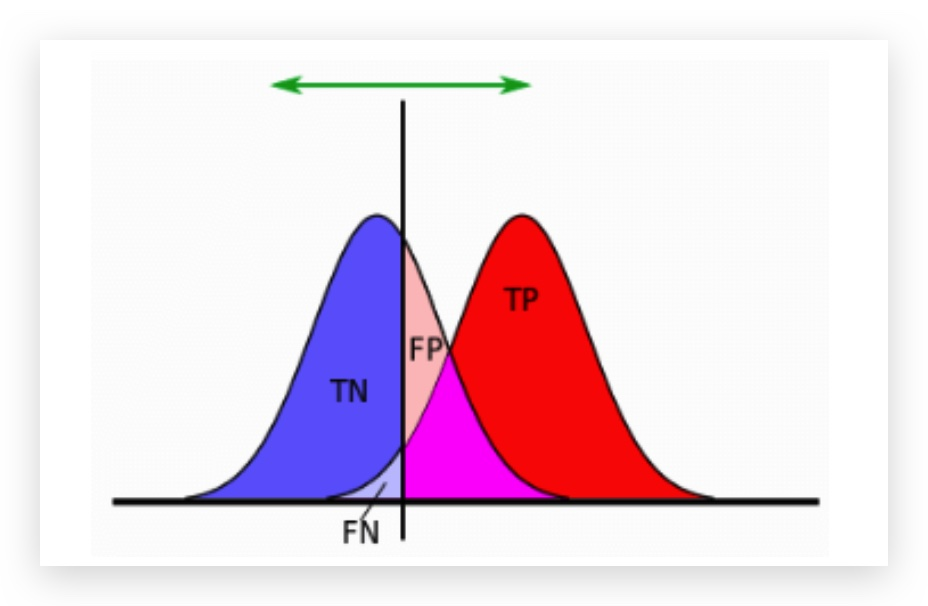
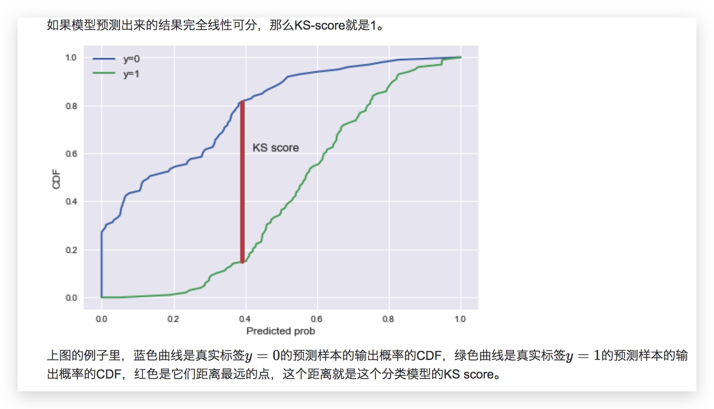
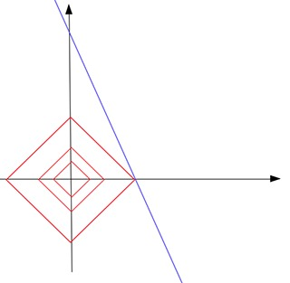
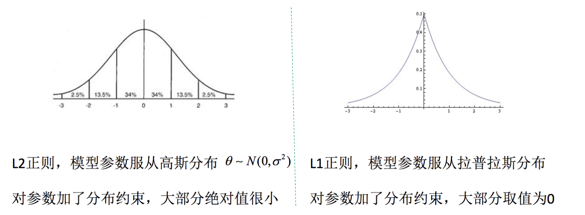
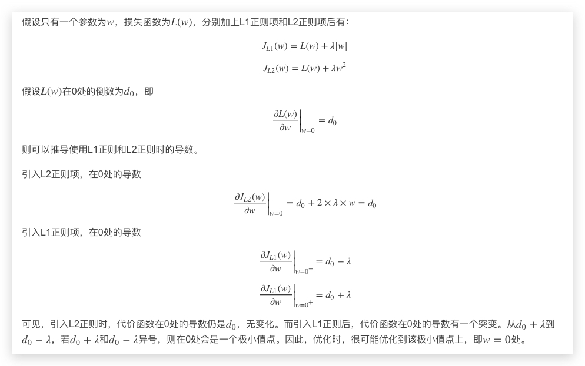
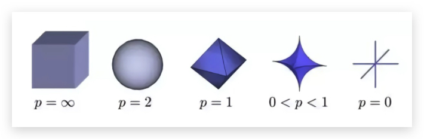
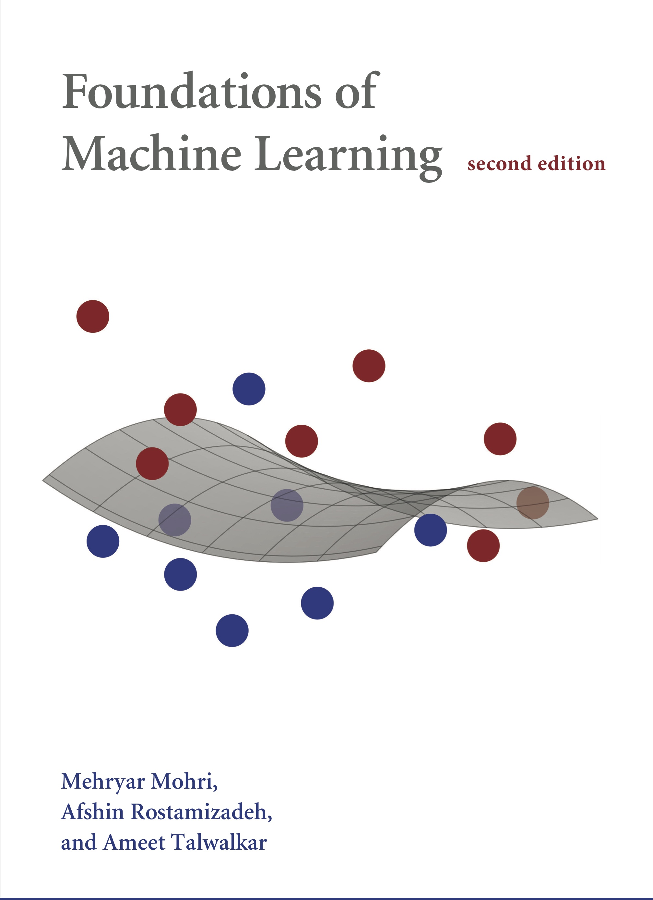

# 机器学习常见概念 {ignore=true}

[TOC]

机器学习三要素：模型、策略、算法。

## 基础概念

### 学习的可行性

> NFL(No Free Lunch)

### Hoeffding 不等式

$$
p ( | \nu - \mu | > \epsilon ) \leq 2 \exp \left( - 2 \epsilon ^ { 2 } N \right)
$$

### 过拟合

> There are many ways to overfit

#### Validation

> Good Validation is more important than good model

#### 经验风险最小化 VS 结构风险最小化

泛化误差上界

$$
\begin{aligned} E ( g - f ) ^ { 2 } & = E \left( g ^ { 2 } - 2 g f + f ^ { 2 } \right) \\\ & = E \left( g ^ { 2 } \right) - \overline { g } ^ { 2 } + ( \overline { g } - f ) ^ { 2 } \\\ & = E \left( g ^ { 2 } \right) - 2 \overline { g } ^ { 2 } + \overline { g } ^ { 2 } + ( \overline { g } - f ) ^ { 2 } \\\ & = E \left( g ^ { 2 } - 2 g \overline { g } ^ { 2 } + \overline { g } ^ { 2 } \right) + ( \overline { g } - f ) ^ { 2 } \\\ & = \underbrace { E ( g - \overline { g } ) ^ { 2 } } _ { \operatorname { var } ( x ) } + \underbrace  {E ( \overline { g } - f ) ^ { 2 } } _ { \operatorname { bias } ^ { 2 } ( x ) } \end{aligned}
$$

#### 生成模型 VS 判别模型

#### 监督学习 VS 无监督学习 VS 半监督学习

#### multi-task learning VS multiclass learning

- VC 维: 精确定义分类器的复杂度
  - 直观定义：单个分类器可最多分类的点个数（不要求对在同一直线上的点分类）,例如，对二维平面上的 3 个点，总能划线正确分类，但是对 4 个点不一定，因此，二维平面的 VC 维为 3
  - **N 维空间中的线性分类器的 VC 维为 N+1**

VC 维和数据量的关系

$$
p ( \text {Ein-Eout} | > \varepsilon ) \leq 4 ( 2 N )  ^ { d c } \exp \left( - \frac { 1 } { 8 } \varepsilon ^ { 2 } N \right)
$$

一般情况下，样本数量大约等于 10 dvc 就可以了

#### 偏差和方差(bias VS variance)

均方误差

#### 导致偏差和方差的原因

偏差通常是由于我们对学习算法做了错误的假设，或者模型的复杂度不够

- 比如真实模型是一个二次函数，而我们假设模型为一次函数，这就会导致偏差的增大（欠拟合）

- 由偏差引起的误差通常在训练误差上就能体现，或者说训练误差主要是由偏差造成的

方差通常是由于模型的复杂度相对于训练集过高导致的；

- 比如真实模型是一个简单的二次函数，而我们假设模型是一个高次函数，这就会导致方差的增大（过拟合）；
- 由方差引起的误差通常体现在测试误差相对训练误差的增量上。

### Label Smoothing

---

### 常用损失函数

- 平方损失（均方误差）
- 0-1 损失
- 绝对损失
- 对数损失
- 合页损失

#### 交叉熵

$$
J = - \frac { 1 } { N } \sum _ { i= 1 } ^ { N } \sum _ { j = 1 } ^ { k } y _ { ij } \cdot \log \left( p _ { ij } \right)
$$

其中，$y_i$ 是类别 $i$ 的真实标签，$p_i$ 是类别 $i$ 的概率值。

对 K_L 散度 公式

$$
D _ { K L } ( p \| q ) = \sum _ { i = 1 } ^ { n } p \left( x _ { i } \right) \log \frac { p \left( x _ { i } \right) } { q \left( x _ { i } \right) } )
$$

变形之后写作

$$
\begin{aligned} D _ { K L } ( p \| q ) & = \sum _ { i = 1 } ^ { n } p \left( x _ { i } \right) \log \left( p \left( x _ { i } \right) \right) - \sum _ { i = 1 } ^ { n } p \left( x _ { i } \right) \log \left( q \left( x _ { i } \right) \right) \\\ & = - H ( p ( x ) ) + \left[ - \sum _ { i = 1 } ^ { n } p \left( x _ { i } \right) \log \left( q \left( x _ { i } \right) \right) \right] \end{aligned}
$$

等式的前一部分恰巧就是 p 的熵，等式的后一部分，就是交叉熵.

我们期望的是预测的概率分布和真实的样本标签分布式一致的，即希望二者的 KL 散度较小，由于标签分布的熵已经固定，因此按照上式，等价于交叉熵损失最小。

categorical cross entropy

注意: 在 keras 中，当使用 categorical_crossentropy 作为目标函数时,标签应该为多类模式,即one-hot编码的向量,而不是单个数值. 可以使用工具中的to_categorical函数完成该转换

binary cross entropy
: logloss

softmaxloss

### 评价函数

- accuracy
- 精度
- 召回
- F 值

#### Mean Reciprocal Rank (MRR)

$$
M R R=\frac{1}{|Q|} \sum_{i=1}^{|Q|} \frac{1}{r a n k_{i}}
$$

#### Normalized Discounted Cumulative Gain (NDCG)

#### PR 曲线

PR 曲线完全聚焦于正例。
类别不平衡问题中由于主要关心正例，所以在此情况下 PR 曲线被广泛认为优于 ROC 曲线。

**AUCPR** 为 precision-recall 曲线下面积, 也即平均精度(average precision)。

对 _AUCROC_, 随便猜的结果就是 0.5。

对于精度-召回曲线下的面积，如果正样本的比例为 α，那么随便猜的情况下，精度-召回曲线下的面积就是 α。

如果数据是平衡的，正负各一半，那么精度-召回曲线下的面积等于 0.5 就不好。

如果数据是非平衡的，正样本占 10%，那么精度-召回曲线下的面积等于 0.5 就说明模型还不错。

#### AUC

TPR 即 TP 占的比例，当然是在实际正例中的占比，因此也就是召回率了。实际正例中有多少召回，因此也被称为敏感度！当阈值为 0 的时候，也即全部判为正例，此时召回率为 1

TPR 是实际正例中有多少被判为正例，那自然也会有一个指标是说实际负例中有多少被判为负例，即 TNR， 称为特异性. 也就是说，当阈值为 0 的时候，也即全部判为正例，此时负例的召回率为 0

因此上面两个指标完全是此消彼长，而 AUC 是同零同 1 的，因此，取 1- 特异性 为 FPR，即 FP 在实际负例中的占比。

也就是说，TPR 和 FPR 一个衡量正例中有多少**比例**判对，一个衡量负例中有多少**比例**判错。

ROC 曲线 以 FPR 为横轴，以 TPR 为纵轴，不同的阈值计算粗不同给的 FPR 和 TPR ，描图即可。（我对 AUC 的理解一直有个误区： 以为是从 阈值 0 开始画的，其实恰恰相反，因为阈值小的时候，TPR 越大，因此其实如果要说顺序，反而是从 1 到 0 开始画，也就是，按概率从大到小排序，将概率分别作为阈值）

**AUC 的概率解释及其证明**

AUC 常常被用来作为模型排序好坏的指标，原因在于 AUC 可以看做随机从正负样本中选取一对正负样本，其中正样本的得分大于负样本的概率。

根据上述概率解释，AUC 实际上在说一个模型把正样本排在负样本前面的概率！ 所以，AUC 常用在排序场景的模型评估，比如搜索和推荐等场景！ 这个解释还表明，如果将所有的样本的得分都加上一个额外的常数，并不改变这个概率，因此 AUC 不变！ 因此，在广告等需要绝对的点击率场景下，AUC 并不适合作为评估指标，而是用 logloss 等指标。

**AUC 对正负样本比例不敏感**
？

**AUC 的计算技巧**

利用其与 wilcoxon-mann-witney test 的等价性，求出正样本的 score > 负样本的 score 的 pair 数，但还是复杂。
进一步的改进方法：首先对 score 从大到小排序。

**AUC 的优化**

采用极大似然估计对应的损失函数是 logloss，因此极大似然估计的优化目标并不是 AUC。

- GAUC (group auc)
  假如有两个用户，分别是甲和乙，一共有 5 个样本，其中+表示正样本，-表示负样本，我们把 5 个样本按照模型 A 预测的 score 从小到大排序，得到 甲-，甲+，乙-，甲+，乙+. 那么实际的 auc 应该是 (1+2+2)/(32)=0.833， 那假如有另一个模型 B，把这 5 个样本根据 score 从小到大排序后，得到 甲-，甲+，甲+，乙-，乙+， 那么该模型预测的 auc 是(1+1+2)/(32)=0.667.

  那么根据 auc 的表现来看，模型 A 的表现优于模型 B，但是从实际情况来看，对于用户甲，模型 B 把其所有的负样本的打分都比正样本低，故，对于用户甲，模型 B 的 auc 是 1， 同理对于用户乙，模型 B 的 auc 也应该是 1，所以从实际情况来看，模型 B 的效果要是要比模型 A 好的，这和实际的 auc 的结果矛盾。

  $$
    G A U C = \frac { \sum _ { ( u , p ) } w _ { ( u , p ) } * A U C _ { ( u , p ) } } { \sum _ { ( u , p ) } w _ { ( u , p ) } }
  $$

  计算每个用户的 auc，然后加权平均，最后得到 group auc
  实际处理时权重一般可以设为每个用户 view 的次数，或 click 的次数，而且一般计算时，会过滤掉单个用户全是正样本或负样本的情况.

##### KS 值

KS 值是衡量一个模型是否有区分度的一个非常重要的指标，模型一般在 0.3 以上就具有一定的区分能力。我了解到，目前各大公司在实际应用模型时，大部分模型 ks 基本在 0.2 左右。

#### 距离函数

EMD(Earth Mover’s Distance) 距离
EMD 实际上是线性规划中运输问题的最优解

机器视觉领域的顶会

- CVPR 国际计算机视觉和模式识别会议
- ICCV 国际计算机视觉大会
- ECCV 欧洲计算机视觉大会

#### ELBO

Evidence Lower Bound, 证据下界

#### KL 距离

$$
K L ( p ( x ) \| q ( x ) ) = \int p ( x ) \ln \frac { p ( x ) } { q ( x ) } d x = \mathbb { E } _ { x \sim p ( x ) } \left[ \ln \frac { p ( x ) } { q ( x ) } \right]
$$

KL 距离可以写成期望的形式，这允许我们通过对其采样进行计算，这是它的一个优点！

### 正则

正则项的作用，可以从几个角度去解释：

- 通过偏差方差分解去解释
- PAC-learning 泛化界解释
- Bayes 先验解释，把正则当成先验

$L_0$ 正则： 限制向量中非 0 元素的个数。
$L_0$ 很难优化求解。$L_1$ 范数是 $L_0$ 范数的最优凸近似， 因此一般也就用 $L_1$ 了。

$L1$ 正则 为何容易获得比 $L2$ 更稀疏的解？

假设样本分布后，用最大似然估计就能分别得到 L1，L2 正则的损失函数了。
$[0.1,0.1]$ 和 $[1000,0]$ 这两个向量，显然第二个更稀疏，但是第一个的$L_1$ 范数更小！

所以这里稀疏的含义并不仅仅意味着非 0 值少

$$
f ( x | \mu , b ) = \frac { 1 } { 2 b } \exp \left( - \frac { | x - \mu | } { b } \right)
$$

如果取对数,剩下的是一个一次项 $|x-u|$, 这就是 $L_1$ 范式.

用公式解释如下

**从优化的角度看 $L_2$ 正则**

加入$L_2$ 正则项实际上是将目标函数变成 **λ 强凸**，这样可以保证函数在任意一点都存在一个非常漂亮的二次函数下界，从而能通过梯度更快找到近似解。

因此，$L_2$ 范数除了能防止过拟合，还有一个优点：可以使得权重接近于 0 但是不等于 0，有利于处理条件数不好情况下矩阵求逆问题，让优化求解变得稳定和快速。

矩阵的条件数

$$
\kappa ( A ) = \| A \| \left\| A ^ { - 1 } \right\|
$$

#### Lovasz Softmax

一种基于 IOU 的 loss，效果优于 cross_entropy，可以在分割任务中使用

[机器学习的表现力、训练力和泛化力](http://blog.evjang.com/2017/11/exp-train-gen.html)

## 参考

- [Foundations of Machine Learnig](https://cs.nyu.edu/~mohri/mlbook/)

    <figure align='center'>
        
    </figure>

- [Deep Learning](http://www.deeplearningbook.org/)
  By Ian Goodfellow et al.

- [L1 Norm Regularization and Sparsity Explained for Dummies](https://medium.com/mlreview/l1-norm-regularization-and-sparsity-explained-for-dummies-5b0e4be3938a)

* [AI 算法工程师手册](http://www.huaxiaozhuan.com/)
