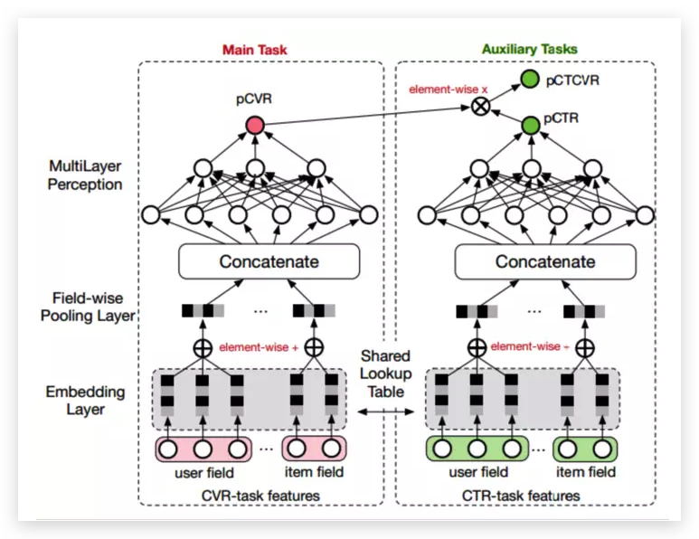

# 多模型多任务专题 {ignore=ture}

[TOC]

## 多模态

多模态指将文本与图像/音频/视频等结合

- [Unifying Visual-Semantic Embeddings with Multimodal Neural Language Models, by Ryan Kiros, et al. 2014](http://arxiv.org/abs/1411.2539)

  先八卦几句。作者 Ryan Kiros 是 Toronto 大学博士，导师为 Ruslan Salakhutdinov （2016 年就要去 CMU 了）和 Richard Zemel.
  他们以及 YuKun Zhu(本硕在上交) 等人构成了自然语言处理和计算机视觉领域的 Toronto 帮派。Ryan Kiros 本人在 github 上的 3 个[代码库](https://github.com/ryankiros?tab=repositories)（分别是 neural-storyteller, skip-thoughts, bisual-semantic-embedding）均获得了大量的赞.后者正是该文的伴随代码。

  该文的一大惊艳成果 `_image of a blue car_ - "blue" + "red" is near images of red cars.`

- [多模态的语言学规律(multimodal linguistic regularities)](http://www.iro.umontreal.ca/~bengioy/cifar/NCAP2014-summerschool/slides/ryan_kiros_cifar2014kiros.pdf)

- [Order-Embeddings of Images and Language by Ivan Vendrov, et al., 2015, ICLR 2016, under review](http://arxiv.org/abs/1511.06361)

  图片和语言的有序嵌入. 上位词、文本蕴含、图片描述，其实都可以视为在建模层次结构。该层次结构又有明显的偏序结构，可以用 _偏序表示_ 来刻画，本文提出了一种获得偏序表示的方法。

  偏序结构并不具有对称性，所以作者认为嵌入空间中使用对称的相似距离测度（例如欧几里得距离）会带来系统性误差。

  一般嵌入的时候，都要求嵌入映射是保距的，因为我们希望原空间中相似的物体在嵌入空间中也相似，但作者认为，在建模偏序结构时，_与其保距，不如保序_。

* [Multimodal Convolutional Neural Networks for Matching Image and Sentence by Lin Ma, et al., ICCV 2015](http://arxiv.org/abs/1504.06063)

  提出了多模态卷积神经网络模型(m-CNNs)，用以图片和句子的匹配。

## 多任务

Multi-Task Learning

多任务学习 Multi-task Learning 有时也称作联合学习、learning to learn、带辅助任务的学习。

在深度学习中，多任务学习通过隐藏层 hard 或者 soft 参数共享来实现。

**Hard Parameter Sharing**
Hard parameter sharing 是神经网络中使用 MTL 的最常见的方法。通常通过所有任务中共用隐藏层，而针对不同任务使用多个输出层来实现。

**Soft Parameter Sharing**

在软参数共享中，每个任务都有单独的模型，每个模型包含各自的参数。模型参数之间的距离会作为正则项来保证参数尽可能相似

### ESMM

完整空间多任务模型.

`Entire Space Multi-Task Model: An Effective Approach for Estimating Post-Click Conversion Rate`, SIGIR18
在完整的样本数据空间**同时学习点击率和转化率**

$$
\underbrace { p ( y = 1 , z = 1 | \boldsymbol { x } ) } _ { p \subset T C V R } = \underbrace { p ( y = 1 | \boldsymbol { x } ) } _ { p C T R } \times \underbrace { p ( z = 1 | y = 1 , \boldsymbol { x } ) } _ { p C V R }
$$

该模型主要解决的是 CVR 预估中的两个主要问题：样本选择偏差和稀疏数据。

同时解决了**训练空间和预测空间不一致**以及**同时利用点击和转化数据进行全局优化**两个关键的问题。

样本选择偏差
: 大多数 CVR 预估问题是 8\*在用户点击过的样本空间上进行训练\*\*的，而预测的时候却要对整个样本空间的样本进行预测。这种训练样本从整体样本空间的一个较小子集中提取，而训练得到的模型却需要对整个样本空间中的样本做推断预测的现象称之为样本选择偏差。

数据稀疏
: 用户点击过的物品只占整个样本空间的很小一部分，使得模型训练十分困难

对于一个给定的展现，ESMM 模型能够同时输出预估的 pCTR、pCVR 和 pCTCVR

从模型结构上看，最底层的 embedding 层是 CVR 部分和 CTR 部分共享的，共享 Embedding 层的目的主要是解决 CVR 任务正样本稀疏的问题，利用 CTR 的数据生成用户（user）和物品（item）更准确的特征表达。
中间层是 CVR 部分和 CTR 部分各自利用完全隔离的神经网络拟合自己的优化目标，pCVR 和 pCTR。最终，将 pCVR 和 pCTR 相乘得到 pCTCVR。

$$
\underbrace { p ( y = 1 , z = 1 | x ) } _ { p C T C V R } = \underbrace { p ( y = 1 | x ) } _ { p C T R } \times \underbrace { p ( z = 1 | y = 1 , x ) } _ { p C V R }
$$

### 2018-DICM

DICM, Deep Image CTR Model, CIKM’18
Image Matters: Visually modeling user behaviors using Advanced Model Server

> DICM 开启了在推荐系统中引入多媒体特征的新篇章。

1. 之前的工作尽管也在推荐/搜索算法中引入了图片信息，可是那些图片只用于物料侧，用于丰富商品、文章的特征表示。而阿里的这篇论文，是第一次将图片用于用户侧建模，**基于用户历史点击过的图片（user behavior images）来建模用户的视觉偏好**。加入了用户的视觉偏好，补齐了一块信息短板.

2. 图片特征引入的大数据量成为技术瓶颈。为此，阿里团队通过给每个 server 增加一个可学习的“压缩”模型，先压缩 image embedding 再传递给 worker，大大降低了 worker/server 之间的通信量，使 DICM 的效率能够满足线上系统的要求。这种为 server 增加“模型训练”功能的 PS，被称为 Advanced Model Server （AMS）

### DUPN
