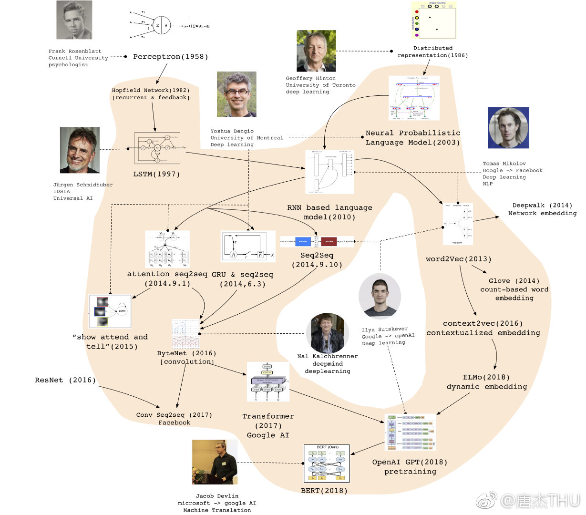

# 自然语言处理专题 {ignore=true}

[TOC]

    <figure align='center'>
        
        <figcaption>图片来自微博@唐杰THU</figcaption>
    </figure>

## 传统自然语言处理

传统的自然语言处理方法是从语法分析，句法分析到语义分析的完整链条，每个步骤都需要人工设计（而深度学习则是‘端到端’的，这个我们后面会讲到）。

正如计算机视觉领域所经受的那样，NLP 也经历了传统方法的兴盛（所谓的理性时代），后来 Deep Learning 成功入侵了语音和视觉领域，并最终在自然语言处理方面也展现了它强大的存在，使得传统方法逐渐走向没落（当然，或许有朝一日，理性主义会卷土重来）。

参考　[穿越乔家大院寻找“毛毛虫”](http://blog.sina.com.cn/s/blog_729574a00102wf63.html) by 白硕

### n 元模型

n 元模型的缺陷
无法建模更远的关系，语料的不足使得无法训练更高阶的语言模型。
无法建模出词之间的相似度。
训练语料里面有些 n 元组没有出现过,其对应的条件概率就是 0,导致计算一整句话的概率为 0。解决这个问题有两种常用方法： 平滑法和回退法。

##### 语法分析

首先将句子分词，并做词性标注、去除停用词等工作。英文单词孤立，不涉及分词，而中文就需要分词了。常用的分词方法，有基于语法规则的，有基于词典的（如最大正向/反向匹配），也有基于统计的（比如 HMM, CRF）。

将词语作为单元，可以研究词语之间的关系，包括　 synset 同义词，hypernymy 上位词，例如 person 是 woman 的上位词.

词形变化关系，例如，

> 老虎是一种凶猛的动物，狮子是一种凶猛的动物

则(老虎，狮子)就是词形变化关系，体现在相似的上下文中

syntagmatic relation
组合关系，比如，在前面的例子中，(老虎，凶猛)就是组合关系，它体现在

分词

词性标注

##### 句法分析(systactic parsing)

##### 远程监督

远监督

Distant Supervision

##### 语义分析

- 语义依存分析

在句子结构中分析实词和实词之间的语义关系，这种关系是一种事实上或逻辑上的关系，且只有当词语进入到句子时才会存在。语义依存分析的目的即回答句子的”Who did what to whom when and where”的问题。

语言被认为具有树形结构

### 序列模型 VS 树结构

> 在以下两种情况下，我们无需使用树结构模型

> 1、我们面对的是简单问题，其较少考虑长距离的语义依赖关系；
>
> 2、即使面对的是复杂问题，只要我们能够获得足够的训练数据；
>
> by 车万翔

- Recognise Textual Entailment 文本蕴含关系识别

所谓文本蕴含关系，就是蕴含关系在文本中的体现，比如‘我因为喜欢读书所以去上了大学’就蕴含‘’我喜欢读书，也蕴含‘我上过大学’，但并不蕴含‘我上过火星’。

- word sense disambiguation 语义消歧

目标：确定一个多义词在特定语境中的使用的是哪一个语义。

在词性标注那里，通常用的是邻近的结构信息，比如副词后面紧跟着动词，但语义消歧这里往往依赖的是长距离信息，比如，_苹果是一款非常受人们欢迎的手机_，*苹果*一词的语义其实跟最右的*手机*一词相关(比较：_苹果是一种非常受人们欢迎的水果_)，因此，语义消歧要使用 **_更为广泛_** 的上下文信息。

常用的语义消歧方法包括基于标注训练集的有监督消歧、

- [sense2vec - A Fast and Accurate Method for Word Sense Disambiguation In Neural Word Embeddings by Andrew Trask, et al., ICLR 2016, underreview](http://arxiv.org/abs/1511.06388)

  词嵌入的时候，多义词不应该只有一种向量表示。

@import "nlp_word2vec.md"

### 主题模型

最为常用的算法可能要属于 LDA 了。
LDA 的前身为概率潜在语义分析(pLSA)

[WarpLDA: a Simple and Efficient O(1) Algorithm for Latent Dirichlet Allocation by Jianfei Chen, et al., 2015](http://arxiv.org/abs/1510.08628v1)

### 文本摘要专题(Text Summarization)

中等长度的摘要其实要比短摘要和长摘要都要难，因为，短摘要，例如一句话总结，容易遗漏要点，而长摘要涉及语句之间的逻辑关系（就好比写一篇小作文，语文不好的童鞋可头疼了），中等长度的摘要集合了上述所有难点。

A Neural Attention Model for Abstractive Sentence Summarization

### 命名实体识别(NER, Named Entity Recognition)

Sequential Learning
给序列中的每个元素打上标签集合中的某个标签。
例如，对分词，标签集合 = [B,M,E,S],其中 B 代表这个汉字是词汇的开始字符，M 代表这个汉字是词汇的中间字符，E 代表这个汉字是词汇的结束字符，而 S 代表单字词。
这样打完之后，将 BME 组合起来就是词汇。
从这个角度看，分词、命名体识别、词性标注、依存分析等，都是序列标注问题。

命名实体识别(Named EntitiesRecognition, NER)是自然语言处理的一个基础任务。其目的是识别语料中人名、地名、组织机构名等命名实体。由于这些命名实体数量不断增加，通常不可能在词典中穷尽列出，且其构成方法具有各自的一些规律性，因而,通常把对这些词的识别从词汇形态处理(如汉语切分)任务中独立处理，称为命名实体识别。命名实体识别技术是信息抽取、信息检索、机器翻译、问答系统等多种自然语言处理技术必不可少的组成部分。 命名实体是命名实体识别的研究主体，一般包括 3 大类(实体类、时间类和数字类)和 7 小类(人名、地名、机构名、时间、日期、货币和百分比)命名实体。评判一个命名实体是否被正确识别包括两个方面：实体的边界是否正确；实体的类型是否标注正确。主要错误类型包括文本正确，类型可能错误；反之，文本边界错误,而其包含的主要实体词和词类标记可能正确。

命名实体识别的主要技术方法分为：基于规则和词典的方法、基于统计的方法、二者混合的方法等。

1.基于规则和词典的方法
基于规则的方法多采用语言学专家手工构造规则模板,选用特征包括统计信息、标点符号、关键字、指示词和方向词、位置词(如尾字)、中心词等方法，以模式和字符串相匹配为主要手段，这类系统大多依赖于知识库和词典的建立。基于规则和词典的方法是命名实体识别中最早使用的方法，一般而言，当提取的规则能比较较精确地反映语言现象时，基于规则的方法性能要优于基于统计的方法。但是这些规则往往依赖于具体语言、领域和文本风格，编制过程耗时且难以涵盖所有的语言现象，特别容易产生错误，系统可移植性不好，对于不同的系统需要语言学专家重新书写规则。基于规则的方法的另外一个缺点是代价太大，存在系统建设周期长、移植性差而且需要建立不同领域知识库作为辅助以提高系统识别能力等问题。

2.基于统计的方法
基于统计机器学习的方法主要包括：隐马尔可夫模型(HiddenMarkovMode,HMM)、较大熵(MaxmiumEntropy,ME)、支持向量机(Support VectorMachine,SVM)、条件随机场( ConditionalRandom Fields,CRF)等。

在这几种学习方法中，较大熵模型结构紧凑，具有较好的通用性，主要缺点是训练时间复杂性非常高，有时甚至导致训练代价难以承受，另外由于需要明确的归一化计算，导致开销比较大。
而条件随机场为命名实体识别提供了一个特征灵活、全局最优的标注框架，但同时存在收敛速度慢、训练时间长的问题。一般说来，较大熵和支持向量机在正确率上要比隐马尔可夫模型高一些，
但是隐马尔可夫模型在训练和识别时的速度要快一些，主要是由于在利用 Viterbi 算法求解命名实体类别序列的效率较高。隐马尔可夫模型更适用于一些对实时性有要求以及像信息检索这样需要处理大量文本的应用,如短文本命名实体识别。
基于统计的方法对特征选取的要求较高，需要从文本中选择对该项任务有影响的各种特征，并将这些特征加入到特征向量中。依据特定命名实体识别所面临的主要困难和所表现出的特性，考虑选择能有效反映该类实体特性的特征集合。主要做法是通过对训练语料所包含的语言信息进行统计和分析，从训练语料中挖掘出特征。有关特征可以分为具体的单词特征、上下文特征、词典及词性特征、停用词特征、核心词特征以及语义特征等。
基于统计的方法对语料库的依赖也比较大，而可以用来建设和评估命名实体识别系统的大规模通用语料库又比较少。

1. 基于深度学习的方法
   双向 LSTM （即 BILSTM）

4.混合方法
自然语言处理并不完全是一个随机过程,单独使用基于统计的方法使状态搜索空间非常庞大，必须借助规则知识提前进行过滤修剪处理。
目前几乎没有单纯使用统计模型而不使用规则知识的命名实体识别系统，在很多情况下是使用混合方法：
3.1 统计学习方法之间或内部层叠融合。
3.2 规则、词典和机器学习方法之间的融合，其核心是融合方法技术。 在基于统计的学习方法中引入部分规则，将机器学习和人工知识结合起来。
3.3 将各类模型、算法结合起来，将前一级模型的结果作为下一级的训练数据，并用这些训练数据对模型进行训练，得到下一级模型。 这种方法在具体实现过程中需要考虑怎样高效地将两种方法结合起来，采用什么样的融合技术。由于命名实体识别在很大程度上依赖于分类技术,在分类方面可以采用的融合技术主要包括如 Voting, XVoting,GradingVa,l Grading 等。

BILSTM + CRF，这是目前比较主流的算法。

BILSTM 学习到的是每个词映射到 tag 的概率值，最后再用 CRF 学习一个最优序列。

https://github.com/deepmipt/ner

- [Natural Language Processing (almost) from Scratch by Ronan Collobert, et al., 2011](http://arxiv.org/abs/1103.0398)

  很喜欢这篇文章的文笔。
  提出的架构可以通用于词性标注(POS)、语块标注(CHUNK)、NER、语义角色标注(SRL)等诸多问题（文章中对此四个问题当时的　 state-of-the-art 模型方法有一个汇总说明，注意到，这四个问题的难度是依次递增的），因此无需特定领域的先验知识。
  从大量无标注的数据上学习中间表示

- [FOFE NER](https://github.com/xmb-cipher/fofe-ner)

---

### 情感分析/意见挖掘(sentiment analysis/opinion mining)

问题总结为一句话：　针对什么表达了什么倾向的意见。

其实，最准确的，还应该考虑：　谁针对什么表达了什么倾向的意见。不同的主体其权重不同，因此主体是谁这一点也应该注意；不过一般主体信息较为明确且容易获得，因此不是问题。

针对什么就是评价对象抽取问题。所谓评价对象，即评论的维度，例如，对一件产品的评论可能涉及到该产品的某个组件或者某个功能，一篇电影评论中可能涉及剧本、特技、演员等。

什么倾向就是要判断评论的情感极别是正面的还是负面的。

情感分析并不是最终的目的，它是更上层建筑的基石。例如，它可以用在观点问答系统中，回答诸如“人们喜不喜欢这部电影的特效？”这样的问题，也可以用在推荐系统中，向用户推荐在某个维度上获得好评的产品（例如特技被认为超级牛叉的电影），以及用在观点总结系统中（典型的如淘宝上产品的评价汇总）

#### 评价对象抽取

参考 [评价对象抽取综述](http://www.cnblogs.com/siegfang/p/3455160.html)　一文。

---

### 意见挖掘

基于方面的意见挖掘
就是先把意见分为几种类型，例如，对服务人员态度的意见，多菜品的意见，对装修的意见，等等。

OER : Opinion Element Recognition, 意见要素挖掘
ORE : Opinion Relation Extraction, 意见关系抽取
EPC : Emotion polarity Classification, 情感极性

语义依存图是近年来提出的对树结构句法或语义表示的扩展，它与树结构的主要区别是允许一些词拥有多个父节点，从而使其成为有向无环图（direct edacyclic graph，DAG）

目前依存树分析领域两大主流方法分别是基于转移（Transition-based）和基于图（Graph-based）的依存分析。基于图的算法将依存分析建模为在有向完全图中求解最大生成树的问题。基于转移的依存分析算法将句子的解码过程建模为一个有限自动机问题（类比编译器中的句法分析组件）。

#### 情感计算

统计数据（暂时没有找到出处）指出一个语言的情感信息 10%来自于语言本身的内容，20%来自于语言的语调、语气，70%来自于表情。

情感一致性：用户在一段时间内对同一话题的观点较为一致

情感传播：沿着关系网络传播，并且，同一社区内的观点较为一致

[中文实体情感知识库](https://github.com/rainarch/SentiBridge)

---

### 机器翻译(MT, Machine Translation)

本文介绍机器翻译。

[phrasal](https://github.com/stanfordnlp/phrasal): 斯坦福自然语言处理小组出品的统计机器翻译系统。

- 对齐(alignment)

  对齐，分段落、句子、短语、词语等不同级别

  [词语对齐的对数线性模型](http://nlp.ict.ac.cn/~liuyang/papers/acl05_chn.pdf)

* _[Sequence to Sequence Learning with Neural Networks](http://papers.nips.cc/paper/5346-sequence-to-sequence-learning-with-neural-networks.pdf)_

  Google 出品.传统的 DNN 需要的输入和输出都是固定维度的，但在机器翻译这种情景中，输入和输出都是序列(sequence, 不定长)，因此提出了一个通用的序列到序列的方法，直接粗暴。具体地，用多层 LSTM 将序列映射到一个定长向量，然后用另外一个深层 LSTM 将该向量解码为序列，好比请了两个翻译。其实请翻译的做法之前就已经有人做了，只不过这里作者请的翻译是 RNN 的一个变种，即 LSTM. 而之所以请 LSTM 做翻译，是因为 LSTM 比较擅长处理长距离的时序依赖（体现在句子中就是长距离的单词之间的语义依赖），使得在语言翻译问题中能够得到好的效果。
  trick：输入序列逆序化能够将效果提升很多，作者认为这是他们论文最大的贡献之一。可能的解释是，反序之后，输入序列和输出序列的平均距离虽然没有变，但最小距离减小很多。

- PBMT(phrase based machine translation)

- 统计机器翻译(SMT, statistical machine translation)

  包括基于单词，基于短语，基于形态分析（词形变化），基于句法（不再将句子视为无结构的单词序列）

  奠基之作：_《A statistical approach to machine translation》_(简称 Brown90)

First Order Probablistic Logic
一阶概率逻辑

[A survey of First-Order Probablistic Models](http://cogcomp.cs.illinois.edu/papers/BrazAmRo08.pdf)
[Statistical Phrase-based Translation ](http://dl.acm.org/citation.cfm?id=1073462)

---

### 自然语言生成(NLG,natural Language Generation)

自然语言生成是高阶话题了，因为它涉及的能力比较全面，就好像语文考试中最重要的作文一样。
图片描述和视频描述是自然语言生成的重要应用，这个我们放到[问答系统专题](qa.md)去讲。

[Generating Text with RNN](http://www.cs.utoronto.ca/~ilya/pubs/2011/LANG-RNN.pdf)

[Role of RL in Text Generation by GAN](https://zhuanlan.zhihu.com/p/29168803)

- [Simple Models for Word Formation in English Slang](https://arxiv.org/pdf/1804.02596.pdf)

  提出了英语俚语中三种类型（混合, 缩略 和 叠词）的生成模型。
  俚语作为一种超语法构词现象，伴随着互联网的兴起，更为年轻群体所广泛使用，对俚语的研究因此很有必要。

  俚语的非标准型特点。

  俚语举例：
  Double Income No Kids 丁克一族——有双薪收入而没有小孩的夫妇
  lambortini, lamborghini 和 martini 的混合

  insight:

  1. 混合型的俚语可以视为一个序列标记的问题，而不是 seq2seq.

### 语料资源

- [WordNet](http://wordnet.princeton.edu/)

  普林斯顿大学的科研人员设计的一个基于认知语言学的英语字典，它将单词按照意义组合成不同的同义词集合，并记录了这些集合之间的层次关系。

- [ConceptNet](http://conceptnet5.media.mit.edu/)

  语义网络，出自 MIT

- [FrameNet](https://framenet.icsi.berkeley.edu/fndrupal/home)

  伯克利出品。按照情景(frame)组织，每种情景由其触发词汇。缺点：frame 那么多，我们永远也弄不全的！

- HowNet

## 深度学习文本模型

TextCNN
Convolutional Neural Networks for Sentence Classification

做法： 先定长（长的截断，短的补 0）

TextRNN

---

### 机器阅读理解

[2018 机器阅读理解技术竞赛](https://mp.weixin.qq.com/s/vAj7vUkvPS7jqHzewb5AuQ)
2018 机器阅读理解技术竞赛由中国中文信息学会（CIPS）和中国计算机学会（CCF）联合主办，
百度公司、中国中文信息学会评测工作委员会和计算机学会中文信息技术专委会联合承办

竞赛数据集包含 30 万来自百度搜索的真实问题，每个问题对应 5 个候选文档文本，以及人工撰写的优质答案。数据集划分为 28 万的训练集，1 万开发集和 1 万测试集。该数据集中包含了 DuReader(https://arxiv.org/abs/1711.05073)中已发布的 20 万问题数据，可自由下载（下载地址:(http://ai.baidu.com/broad/introduction?dataset=dureader)）用于预训练和测试

---

### 常用工具

- [NLTK]()
- [spaCy](http://spacy.io/)
  号称具有工业强度，用 Cython 编写，比 NLTK 快 400 倍

  仅支持英语，且不能在 windows 下使用（这倒没啥大不了的）

- Stanford Core NLP

  还有[python 接口](https://github.com/dasmith/stanford-corenlp-python)

* 语言技术平台（Language Technology Platfor，LTP）
* 结巴分词

## 神经网络语言模型（NNLM）

第一篇提出神经网络语言模型的论文是 Bengio 在 2003 年发表的「A Neural Probabilistic Language Model」

> 预训练语言模型的成功，证明了我们可以从海量的无标注文本中学到潜在的语义信息，而无需为每一项下游 NLP 任务单独标注大量训练数据。此外，预训练语言模型的成功也开创了 NLP 研究的新范式，即首先使用大量无监督语料进行语言模型预训练（Pre-training），再使用少量标注语料进行微调（Fine-tuning）来完成具体 NLP 任务（分类、序列标注、句间关系判断和机器阅读理解等）.

### transformer

[Transformer: A Novel Neural Network Architecture for Language Understanding](https://ai.googleblog.com/2017/08/transformer-novel-neural-network.html)

预训练（掩词猜测和下句预测）

[从 bert 中提取 6 种注意力模式](https://towardsdatascience.com/deconstructing-bert-distilling-6-patterns-from-100-million-parameters-b49113672f77)
Pattern 1: Attention to next word
Pattern 2: Attention to previous word
Pattern 3: Attention to identical/related words
Pattern 4: Attention to identical/related words in other sentence
Pattern 5: Attention to other words predictive of word
Pattern 6: Attention to delimiter tokens

Transformer 在 2017 年由 Google 在题为 Attention Is All You Need 的论文中提出。

> Transformer 是一个完全基于注意力机制的编解码器模型，它完全抛弃了之前其它模型引入注意力机制后仍然保留的循环与卷积结构，而采用了自注意力（Self-attention）机制，在任务表现、并行能力和易于训练性方面都有大幅的提高。
> 在 Transformer 出现之前，基于神经网络的机器翻译模型多数都采用了 RNN 的模型架构，它们依靠循环功能进行有序的序列操作。虽然 RNN 架构有较强的序列建模能力，但是存在训练速度慢，训练质量低等问题。
> 与基于 RNN 的方法不同，Transformer 模型中没有循环结构，而是把序列中的所有单词或者符号并行处理，同时借助自注意力机制对句子中所有单词之间的关系直接进行建模，而无需考虑各自的位置。具体而言，如果要计算给定单词的下一个表征，Transformer 会将该单词与句子中的其他单词一一对比，并得出这些单词的注意力分数。注意力分数决定其他单词对给定词汇的语义影响。之后，注意力分数用作所有单词表征的平均权重，这些表征输入全连接网络，生成新表征。

Transformer 自从提出以来，俨然已经是 RNN 的一个有竞争力的替代品了

They address a significant shortcoming of RNNs, i.e. their inherently sequential computation which prevents parallelization across elements of the input sequence, whilst still addressing the vanishing gradients problem through its self-attention mechanism

依赖自注意机制

优点

1. **时序无关可并行**
   There is no connections in time as with RNNs, allowing one to fully parallelize per-symbol computations.
2. **全局感知域**
   Each symbol’s representation is directly informed by all other symbols’ representations (in contrast to e.g. convolutional architectures which typically have a limited receptive field).
   缺点

[Universal Transformer](https://arxiv.org/pdf/1807.03819.pdf)
Published as a conference paper at ICLR 2019

Universal Transformer 的产生是因为 Transformer 在实践上和理论上的两个缺点。
universal 代表的是 computationally universal，即图灵完备

Transition 层？

- [ ] [Universal Transformers 解读](http://mostafadehghani.com/2019/05/05/universal-transformers/)

#### ELMO（Embeddings from Language Models）

来自 2018 年的论文 `Deep contextualized word representations`

我们知道，词向量一经训练，就是固定的了，但是像多义词这种，用固定的向量并不足以表达多义。
也就是说，词向量不灵活！

ELMo 的做法是我们只预训练 language model, 而 word embedding 是通过输入的句子实时输出的，这样单词的意思就是上下文相关的了, 这样就很大程度上缓解了歧义的发生.

#### Bert

参见 [bert 走读](./bert.md)

#### GPT-2

[GPT_2](https://openai.com/blog/better-language-models/#update)

来自 OpenAI 的语言模型全能王！

作为一个没有经过任何领域数据专门训练的模型，它的表现比那些专为特定领域打造的模型还要好

简单来说，GPT-2 就是基于 Transformer 架构的大规模模型。

GPT-2 是 GPT 算法“进化版”，比 GPT 参数扩大 10 倍，达到了 15 亿个，数据量扩大 10 倍，使用了包含 800 万个网页的数据集，共有 40 GB。

这个庞大的算法使用语言建模作为训练信号，以无监督的方式在大型数据集上训练一个 Transformer，然后在更小的监督数据集上微调这个模型，以帮助它解决特定任务

https://github.com/BrikerMan/Kashgari

## 学习资料

- [coursera 课程： 自然语言处理](https://class.coursera.org/nlp/lecture)

  老师为斯坦福大学的 Dan Jurafsky 和 Christopher Manning

- [Natural Language Understanding: Fundations and State-of-the-Art](http://icml.cc/2015/tutorials/icml2015-nlu-tutorial.pdf)
  须深读之。

    ICML 教程之一，待看

- [Speech and Language Processing --- An Introduction to Natural Language Processing, Computational Linguistics, and Speech Recognition](https://www.cs.colorado.edu/~martin/slp.html)

- [Publications of deep Learning in NLP](https://github.com/niangaotuantuan/Publications-of-Deep-Learning-in-NLP/blob/master/neural_lm.md)
- [What has Deep Learning brought to NLP](http://computing.dcu.ie/~qliu/Talks/20180321%20What%20does%20deep%20learning%20bring%20to%20natural%20language%20processing%20v2.pdf)

  毫无疑问，DL 为 NLP 带来的是深刻的变化。几乎所有的 NLP 任务的最好结果都被刷新；诸如图片标题生成等之前比较困难的问题变得容易了；而类似中间语等之前貌似不可能的问题也变得可能了。

  本文试图回答的几个问题：

  1. DL 为 NLP 带来了哪些基础性的变化？
  2. 这些基础性的变化有什么影响？
  3. NLP 中的 DL 有什么弱项？
  4. NLP 的未来方向在哪儿？

  针对第一个问题的回答：
  NLP 问题的定义空间变了，从符号离散空间变到了数值连续空间。随着这个趋势，方法也从基于规则的，到统计方法，再到神经网络。 其他变化还包括：更细粒度（不再是词和短语这样的硬性粒度划分，不同粒度之间的知识也能更好迁移），更好的泛化，打破模型之间的边界（多模态和跨模型方法变得更直接也更容易，类似 VQA 这样的问题能够得以有效解决），整体性的 NLP 模型（不再子模型分而治之，而是统一建模，端到端）。

  针对第三个问题的回答：
  小数据上行不通；语义不明；

  针对第四个问题的回答：
  应用更多诸如强化学习、对抗学习等 DL 技术到 NLP 中；研究将人类智慧和语义纳入模型的更普遍方法

## 附录

### NLP 灾难系列

- 熊大便当烤肉饭
- 小龙女对杨过说：我曾经也想过过过过过过的生活。
- 这个领带看着不错……才怪！

- 这不是为了对手的保护，而是为了对手的保护
- 广州拟立法禁食野生动物，食用人最高罚 10 万
-

### 顶会/研究机构

- ACL 计算机语言学协会

  [ACL Anthology](http://aclweb.org/anthology/index.html)

- NIPS 　每年 12 月由 NIPS 基金会主办的机器学习和神经计算领域的顶级会议

- EMNLP(Conference on Empirical Methods in Natural Language Processing)

  自然语言处理实证方法会议，2015 年 9 月 17-22 日在葡萄牙里斯本市召开

－ [The Stanford Natural Language Processing Group](http://nlp.stanford.edu/)

### 历史发展

2019 年在 NLP 的发展史上是一个特殊的年份，在这一年，基于深度学习的 NLP 方法取得了光彩夺目的发展。
