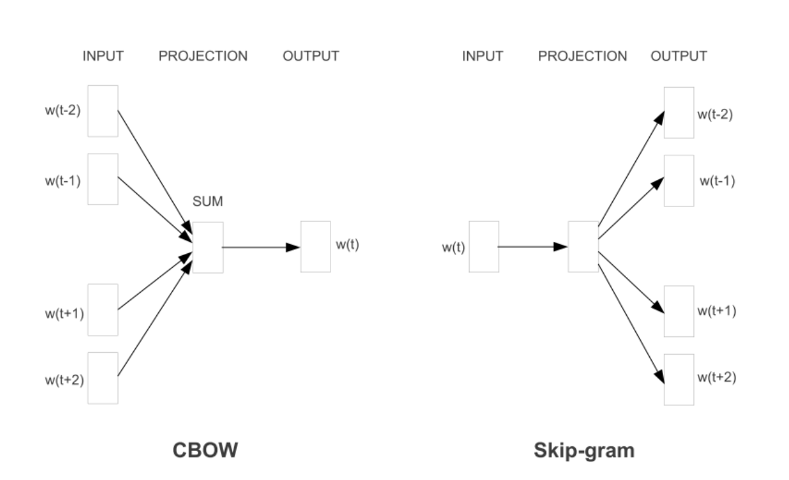
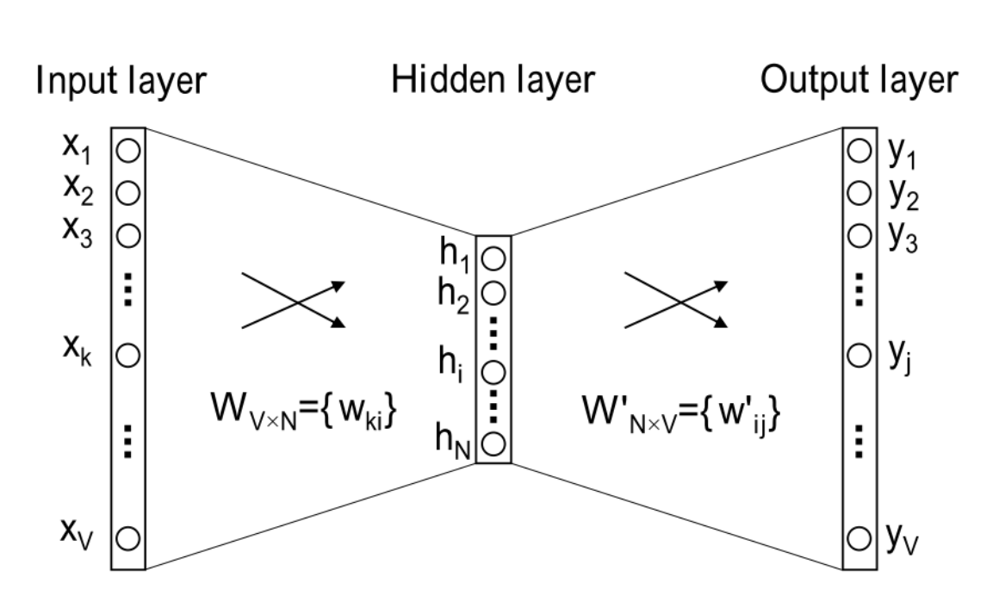
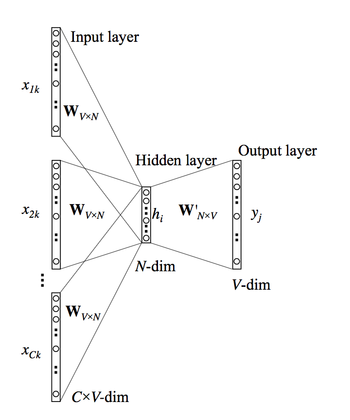
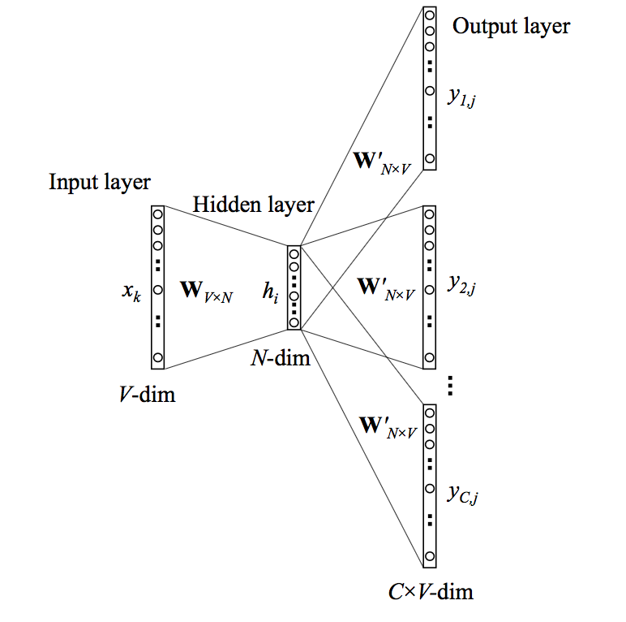
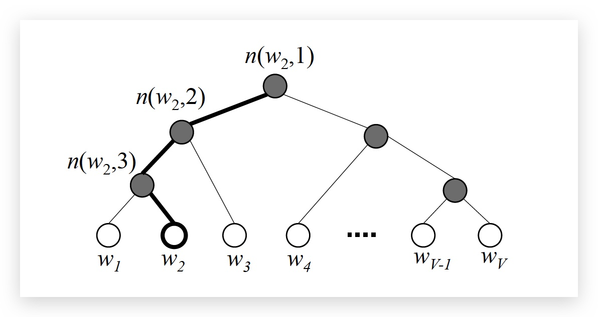
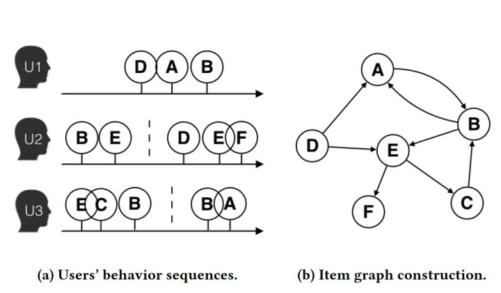
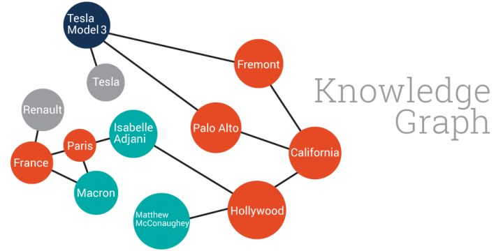
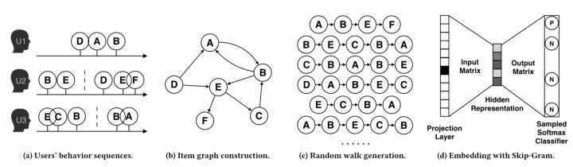
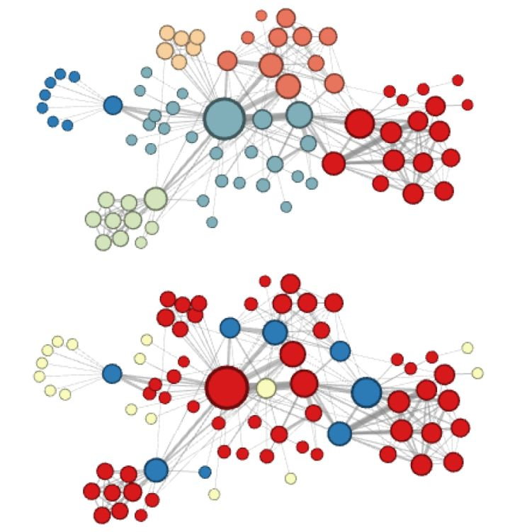

# Embeding 专题 {ignore=true}

[TOC]

Embedding 早已有之（还记得本科上抽象代数的时候，听老师说早先的学者将嵌入读作 kan 入），自 Word2vec 一出，Embeding 更加流行，蔚然成风。

> 万物皆可 Embedding

需要特别指出的是，Embedding 并不仅仅是词嵌入，还包括更广泛的特征嵌入等，因此，像 FM 和 MF 等都是学习 Embedding 的方法，在这个意义上，Embedding 与其说是一种方法，毋宁说是一种思想。

## LSA

潜在语义分析 latent semantic analysis:LSA 的基本假设是：如果两个词多次出现在同一篇文档中，则这两个词具有语义上的相似性。

对文档单词矩阵 $D$ 做 `SVD` 分解：

$$ \mathbf { D } = \mathbf { P } \boldsymbol { \Sigma } \mathbf { Q } ^ { T } $$

1. $\mathbf { P } \in \mathbb { R } ^ { N \times N } , \mathbf { Q } \in \mathbb { R } ^ { V \times V }$ 为单位正交阵
2. $\boldsymbol { \Sigma } \in \mathbb { R } ^ { N \times V }$ 为广义对角矩阵。

理解为： `文档-单词` 矩阵 = `文档-主题` 矩阵 x `主题强度` x `主题-单词` 矩阵。

将奇异值从大到小进行排列, 选择 top k 的奇异值来近似 $D$，即

$$
\mathbf { D } _ { k } = \mathbf { P } _ { k } \boldsymbol { \Sigma } _ { k } \mathbf { Q } _ { k } ^ { T }
$$

任意两个主题之间的相似度为 0

LSA 虽然通过**全局矩阵分解**降维获得了一定的语义关联，但是，由于词袋模型的局限性，无法捕捉词语之间的先后关系。

## Word2vec

词嵌入(word embeding)

CBOW (Continuous Bag-of-Word)
: 连续词袋。以上下文词汇预测当前词: $w_{t−1}$和$w_{t+1}$去预测 $w_t$

SkipGram
: 以当前词预测其上下文词汇: $w_t$ 去预测 $w_{t−1}$ 和 $w_{t+1}$。

    <figure align='center'>
        
        <figcaption></figcaption>
    </figure>

- CBOW
  输入是多个词！
  隐层的取法： 取平均
- SkipGram
  输出是多个词！

在 CBOW 中，同一个单词的表达（即输入向量 $\overrightarrow { \mathbf { w } } _ { I }$） 是相同的， 因为参数 $\mathbf W$ 是共享的。输出向量随着上下文不同而不同。 而在 SkipGram 中正好相反，输入向量随着上下文不同而不同，但输出向量是相同的。

经验上讲 Skip-gram 的效果好一点。

word2vec 严格来说立连神经网络都算不上，因为其整个网络结构是线性的，没有激活函数。

### CBOW

#### 一个单词上下文 One-word context

输入输出都只有一个词, 这是最简单的情形。输入是前一个单词，输出是后一个单词。

    <figure align='center'>
        
        <figcaption>一个单词上下文的网络结构</figcaption>
    </figure>

其中，

- 输入层的单词 $w_I$ 使用 `one-hot` 来表示,
- $N$ 为隐层的大小，即隐向量 $\overrightarrow { \mathbf { h } } \in \mathbb { R } ^ { N }$
- 网络输出 $\overrightarrow { \mathbf { y } } = \left( y _ { 1 } , y _ { 2 } , \cdots , y _ { V } \right) ^ { T } \in \mathbb { R } ^ { V }$ 是输出单词为词汇表各单词的概率。
- 相邻层之间为全连接
- 对应的隐向量 $\mathbf { h } = \mathbf { W } ^ { T } \mathbf { x } = \mathbf { W } _ { ( k , \cdot ) } ^ { T } : = \mathbf { v } _ { w _ { I } } ^ { T }$

因此，$\mathbf { h } = \mathbf { W } ^ { T } \mathbf { x }$ **相当于拷贝了 $W$ 对应的第 $i$ 行(行向量转秩为列向量)**, 即，可以理解为是第 $i$ 个词的输入权重向量。

<aside class='caution'>
注意word2vec的隐层并没有激活函数，或者说只是一个简单的线性激活函数
</aside>

输出向量

$$
u _ { j } = \mathbf { v } _ { w _ { j } } ^ { \prime T } \mathbf { h }
$$

$W^{\prime}$ 的第 $i$ 列称作单词 $V_i$ 的输出向量。

可以将 $W^{\prime}$ 的每一列看做每个单词的方向向量，然后输出向量就是看压缩后的单词的向量在每个单词上的投影。

$\overrightarrow { \mathbf { u } }$ 之后接入一层 softmax:

$$
p \left( w _ { j } | w _ { I } \right) = y _ { j } = \frac { \exp \left( u _ { j } \right) } { \sum _ { j ^ { \prime } = 1 } ^ { V } \exp \left( u _ { j ^ { \prime } } \right) }
$$

化简得

$$
p \left( w _ { j } | w _ { I } \right) = \frac { \exp \left( \mathbf { v } _ { w _ { j } } ^ { \prime } T _ { \mathbf { v } _ { \boldsymbol { W } _ { I } } } \right) } { \sum _ { j ^ { \prime } = 1 } ^ { V } \exp \left( \mathbf { v } _ { w _ { j ^ { \prime } } } ^ { \prime T } \mathbf { v } _ { w _ { I } } \right) }
$$

##### 优化目标

假设给定一个单词 $\text { word } _ { I }$ （它称作上下文），观测到它的下一个单词为 $\text { word } _ { O }$ 。
假设 $\text { word } _ { O }$ 对应的网络输出编号为 $j^*$ ，则网络的优化目标是：

$$
\begin{align}
\max _ { \mathbf { W } , \mathbf { W } ^ { \prime } } p \left( \text { word } _ { O } | \text { word } _ { I } \right) & = \max _ { \mathbf { W } , \mathbf { W } ^ { \prime } } y _ { j ^ { * } } = \max _ { \mathbf { W } , \mathbf { W } ^ { \prime } } \log \frac { \exp \left( \overrightarrow { \mathbf { w } } _ { j ^ { * } } ^ { \prime } \cdot \overrightarrow { \mathbf { w } } _ { I } \right) } { \sum _ { i = 1 } ^ { V } \exp \left( \overrightarrow { \mathbf { w } } _ { i } ^ { \prime } \cdot \overrightarrow { \mathbf { w } } _ { I } \right) } \\\
& =  \max _ { \mathbf { W } , \mathbf { W } ^ { \prime } } \left[ \overrightarrow { \mathbf { w } } _ { j ^ { \prime } } ^ { \prime } \cdot \overrightarrow { \mathbf { w } } _ { I } - \log \sum _ { i = 1 } ^ { V } \exp \left( \overrightarrow { \mathbf { w } } _ { i } ^ { \prime } \cdot \overrightarrow { \mathbf { w } } _ { I } \right) \right]
\end{align}
$$

$u_j = \overrightarrow { \mathbf { w } } _ { j } ^ { \prime } \cdot \overrightarrow { \mathbf { w } } _ { I }$, 定义

$$
E = - \log p \left( \text { word } _ { O } | \text { word } _ { I } \right) = - \left[ \overrightarrow { \mathbf { w } } _ { j ^ { * } } ^ { \prime } \cdot \overrightarrow { \mathbf { w } } _ { I } - \log \sum _ { i = 1 } ^ { V } \exp \left( \overrightarrow { \mathbf { w } } _ { i } ^ { \prime } \cdot \overrightarrow { \mathbf { w } } _ { I } \right) \right] \\\
= - \left[ u _ { j ^ { * } } - \log \sum _ { i = 1 } ^ { V } \exp \left( u _ { i } \right) \right]
$$

##### 参数更新

定义 $t _ { j } = \mathbb { I } \left( j = j ^ { * } \right)$

则

$$
\frac { \partial E } { \partial u _ { j } } = y _ { j } - t _ { j } : = e _ { j }
$$

根据链式法则

$$
\frac { \partial E } { \partial w _ { i j } ^ { \prime } } = \frac { \partial E } { \partial u _ { j } } \cdot \frac { \partial u _ { j } } { \partial w _ { i j } ^ { \prime } } = e _ { j } \cdot h _ { i }
$$

因此，$W^{\prime}$的权重更新公式

$$
w _ { i j } ^ { \prime ( \text { new } ) } = w _ { i j } ^ { \prime ( \text { old} ) } - \eta \cdot e _ { j } \cdot h _ { i }
$$

$W$ 的 权重更新公式的话，注意到

$$
\frac { \partial E } { \partial h _ { i } } = \sum _ { j = 1 } ^ { V } \frac { \partial E } { \partial u _ { j } } \cdot \frac { \partial u _ { j } } { \partial h _ { i } } = \sum _ { j = 1 } ^ { V } e _ { j } \cdot w _ { i j } ^ { \prime } : = \mathrm { EH } _ { i }
$$

且

$$
h _ { i } = \sum _ { k = 1 } ^ { V } x _ { k } \cdot w _ { k i }
$$

因此

$$
\frac { \partial E } { \partial w _ { k i } } = \frac { \partial E } { \partial h _ { i } } \cdot \frac { \partial h _ { i } } { \partial w _ { k i } } = \mathrm { EH } _ { i } \cdot x _ { k }
$$

等价于

$$
\frac { \partial E } { \partial \mathbf { W } } = \mathbf { x } \otimes \mathrm { EH } = \mathbf { x } \mathrm { EH } ^ { T }
$$

因此，$W$ 的参数更新公式为

$$
\mathbf { v } _ { w _ { I } } ^ { ( \text { new } ) } = \mathbf { v } _ { w _ { I } } ^ { ( \text { old } ) } - \eta \mathrm { EH } ^ { T }
$$

#### 多个单词上下文 Multi-word context

    <figure >
        
        <figcaption align='center' >多个单词上下文的网络结构</figcaption>
    </figure>

隐向量为所有输入单词映射结果的均值：

$$
\overrightarrow { \mathbf { h } } = \frac { 1 } { C } \mathbf { W } ^ { T } \left( \overrightarrow { \mathbf { x } } _ { 1 } + \overrightarrow { \mathbf { x } } _ { 2 } + \cdots + \overrightarrow { \mathbf { x } } _ { C } \right) = \frac { 1 } { C } \left( \overrightarrow { \mathbf { w } } _ { I _ { 1 } } + \overrightarrow { \mathbf { w } } _ { I _ { 2 } } + \cdots + \overrightarrow { \mathbf { w } } _ { I _ { C } } \right)
$$

损失函数其实和单个上下文的是一样的，唯一不同的是$h$; 因此，从隐层到输出层的权重 $W^{\prime}$ 的参数更新公式是不变的：

$$
\mathbf { v } _ { w _ { j } } ^ { \prime  ( \text { new } )} = \mathbf { v } _ { w _ { j } } ^ { \prime  ( \text { old } )} - \eta \cdot e _ { j } \cdot \mathbf { h } \qquad \text { for } j = 1,2 , \cdots , V
$$

输入到隐层的权重 $W$的参数更新公式则稍有不同

$$
\mathbf { v } _ { w _ { I , c } } ^ { ( \mathrm { new } ) } = \mathbf { v } _ { w _ { I , c } } ^ { ( \text { old } ) } - \frac { 1 } { C } \cdot \eta \cdot \mathrm { EH } ^ { T } \qquad \text { for } c = 1,2 , \cdots , C
$$

### SkipGram

    <figure >
        
        <figcaption align='center'>SkipGram 模型网络结构</figcaption>
    </figure>

从输入到隐层这块和 CBOW 是一样的，隐向量还是相当于将输入-隐藏权重矩阵的对应行向量拷贝过来。

而输出部分就不同了，需要输出$C$个多项分布

$$
p \left( w _ { c , j } = w _ { O , c } | w _ { I } \right) = y _ { c , j } = \frac { \exp \left( u _ { c , j } \right) } { \sum _ { j ^ { \prime } = 1 } ^ { V } \exp \left( u _ { j ^ { \prime } } \right) }
$$

好在从隐层到输出层的权重是共享的，因此有

$$
u _ { c , j } = u _ { j } = \mathbf { v } _ { w _ { j } } ^ { \prime T } \cdot \mathbf { h } , \text { for } c = 1,2 , \cdots , C
$$

损失函数

$$
\begin{aligned} E & = - \log p \left( w _ { O , 1 } , w _ { O , 2 } , \cdots , w _ { O , C } | w _ { I } \right) \\\ & = - \log \prod _ { c = 1 } ^ { C } \frac { \exp \left( u _ { c , j _ { c } ^ { * } } \right) } { \sum _ { j ^ { \prime } = 1 } ^ { V } \exp \left( u _ { j ^ { \prime } } \right) } \\\ & = - \sum _ { c = 1 } ^ { C } u _ { j _ { c } ^ { * } } + C \cdot \log \sum _ { j ^ { \prime } = 1 } ^ { V } \exp \left( u _ { j ^ { \prime } } \right) \end{aligned}
$$

求导

$$
\frac { \partial E } { \partial u _ { c , j } } = y _ { c , j } - t _ { c , j } : = e _ { c , j }
$$

记 $\mathrm { EI } = \left\\{ \mathrm { EI } _ { 1 } , \cdots , \mathrm { EI } _ { V } \right\\}$ , 其中 $\mathrm { EI } _ { j } = \sum _ { c = 1 } ^ { C } e _ { c , j }$

则 关于隐层到输出层权重矩阵 $W^{\prime}$ 的求导

$$
\frac { \partial E } { \partial w _ { i j } ^ { \prime } } = \sum _ { c = 1 } ^ { C } \frac { \partial E } { \partial u _ { c , j } } \cdot \frac { \partial u _ { c , j } } { \partial w _ { i j } ^ { \prime } } = \mathrm { EI } _ { j } \cdot h _ { i }
$$

因此，参数更新公式为

$$
w _ { i j } ^ { \prime  ( \text { new } )} = w _ { i j } ^ { \prime  \text { (old) }} - \eta \cdot \mathrm { EI } _ { j } \cdot h _ { i }
$$

而输入到隐层的权重矩阵参数更新公式不变

$$
\mathbf { v } _ { w _ { I } } ^ { ( \text { new } ) } = \mathbf { v } _ { w _ { I } } ^ { ( \text { old } ) } - \eta \cdot \mathrm { EH } ^ { T }
$$

### 计算效率优化

如上，每个单词其实有输入向量和输出向量两个向量表示。输入向量的学习是比较容易的，而学习输出向量的代价却十分昂贵。

复杂度很大的根本原因是 softmax 的分母上的 $\sum$， 可以通过 `分层 softmax` 来高效计算进行优化。另外，可以通过负采样来缩减输出单元的数量。

优化的主要思想是：限制输出单元的数量。

#### Hierarchical Softmax

`Hierarchical softmax(分层 softmax)` 是一种高效计算 softmax 的方法, 因为它将词汇编码为哈夫曼树.
每个词不再有输出向量表示。取而代之，对每个内部节点有一个向量表示(作为每个节点逻辑回归的参数向量，内部节点共有 $V-1$个，因此，参数量几乎没有减少)。根节点的词向量对应我们的投影后的词向量。

由于每个词都有一个霍夫曼编码，因此对目标词，我们知道每一步向右还是向左，将这些步的概率乘起来，就是目标词作为输出词的预测概率。（在不用 Hierarchical Softmax 时，我们计算目标词的输出概率时，要计算其他所有词的概率作为分母，所有其他词的概率计算仅仅是为了计算分母！现在则不需要了，直接连乘得到目标词的输出概率。）

由于是二叉树，之前计算量为 $V$ ,现在变成了 $log2V$

$$
p \left( w = w _ { O } \right) = \prod _ { j = 1 } ^ { L ( w ) - 1 } \sigma \left( \mathbb { I } n ( w , j + 1 ) = \operatorname { ch } ( n ( w , j ) ) \mathbb{I} \cdot \mathbf { v } _ { n ( w , j ) } ^ { \prime } T _ { \mathbf { h } } \right)
$$

其中，$\operatorname { ch } ( n )$ 是单元 n 的左节点，且

$$
\mathbb { I } x \| = \left\\{ \begin{array} { l l } { 1 } & { \text { if } x \text { is true; } } \\\ { - 1 } & { \text { otherwise } } \end{array} \right.
$$

霍夫曼树的结构是基于贪心的思想，**对训练频率很大的词很有效，但是对词频很低的词很不友好，因为路径太深**

#### Negative Sampling

在参数的每一轮更新中，实际上只需要用到一部分单词的输出概率；大部分单词的输出概率为 0 。

例如

$$
P _ { n } ( w ) = \frac { f r e q ( w ) ^ { 3 / 4 } } { \sum _ { w \neq w _ { O } } f r e q ( w ) ^ { 3 / 4 } }
$$

背后的物理意义为：单词在语料库中出现的概率越大，则越可能被挑中.

目标函数简化为

$$
E = -\log \sigma \left( \mathbf { v } _ { w _ { O } } ^ { \prime  ^ { T }} \mathbf { h } \right) - \sum _ { w _ { j } \in \mathcal { W } _ { \mathrm { neg } } } \log \sigma \left( - \mathbf { v } _ { w _ { j } } ^ { \prime T } \mathbf { h } \right)
$$

#### 其他细节

1. $\sigma (x)$ 的近似计算
2.

### Glove

Global Vectors for Word Representation， 是一个**基于全局词频统计**（count-based & overall statistics）的词表征（word representation）工具.

结合了 LSA 算法和 Word2Vec 算法的优点，既考虑了全局统计信息，又利用了局部上下文。

[GloVe](http://www-nlp.stanford.edu/projects/glove/glove.pdf)(GLobal Vector for word representation)

[A GloVe implementation in python](http://www.foldl.me/2014/glove-python/)
首先扫描预料，建立词语共生矩阵，后续就用该共生矩阵替代原预料。

W2V 的缺点，W2V 中所用的 softmax 比起普通 softmax 有何区别，为什么能减少计算量

### fastText

1. 结构与 CBOW 类似，但学习目标是人工标注的分类结果

2. 采用 hierarchical softmax 对输出的分类标签建立哈夫曼树，样本中标签多的类别被分配短的搜寻路径；

3. 引入 N-gram，考虑词序特征

4. 引入 subword 来处理长词，处理未登陆词问题

## Doc2Vec

Distributed Representations of Sentences and Documents
其实是 paragraph vector, 或称 sentence embeddings

每个段落拥有自己的段落向量. 对于每次训练，这里选择联结(concatenate)的方式，将 Word2Vec 中的输入词向量与输入词向量所属的段落向量联结，拼接成一个大向量。

### PV-DM

把句子向量也看做一个单词加入。它的作用相当于是上下文的记忆单元或者是这个段落的主题

### PV-DBOW

Distributed Bag of Words version of Paragraph Vector()

## Item2Vec

[Item2Vec-Neural Item Embedding for Collaborative Filtering (Microsoft 2016)]()
微软将 word2vec 应用于推荐领域的一篇实用性很强的文章

$$
\frac { 1 } { K } \sum _ { i = 1 } ^ { K } \sum _ { j \neq i } ^ { K } \log p \left( w _ { j } | w _ { i } \right)
$$

KDD 2018 best paper [Real-time Personalization using Embeddings for Search Ranking at Airbnb]() 也介绍了 Airbnb 的 embedding 最佳实践

具体到 embedding 上，文章通过两种方式生成了两种不同的 embedding 分别 capture 用户的 short term 和 long term 的兴趣。

- 一是通过 click session 数据生成 listing 的 embedding，生成这个 embedding 的目的是为了进行 listing 的相似推荐，以及对用户进行 session 内的实时个性化推荐。
- 二是通过 booking session 生成 user-type 和 listing-type 的 embedding，目的是捕捉不同 user-type 的 long term 喜好。由于 booking signal 过于稀疏，Airbnb 对同属性的 user 和 listing 进行了聚合，形成了 user-type 和 listing-type 这两个 embedding 的对象。

## 离散特征嵌入

这里一般针对的是高维、稀疏、多 Field、离散特征。

用神经网络做 Embedding 的一般做法： 网络的输入层是实体 ID（categorical 特征）的 one-hot 编码向量。与输入层相连的一层就是 Embedding 层，两层之间通过全连接的方式相连。Embedding 层的神经元个数即 Embeeding 向量的维数（𝑚）。输入层与 Embedding 层的链接对应的权重矩阵 𝑀(𝑛×𝑚)，即对应 𝑛 个输入实体的 m 维 embedding 向量。由于 one-hot 向量同一时刻只会有一个元素值为 1，其他值都是 0，因此对于当前样本，只有与值为 1 的输入节点相连的边上的权重会被更新，即不同 ID 的实体所在的样本训练过程中只会影响与该实体对应的 embedding 表示。假设某实体 ID 的 one-hot 向量中下标为 𝑖 的值为 1，则该实体的 embedding 向量为权重矩阵 𝑀 的第 𝑖 行。

    <figure align='center'>
        
    </figure>

## Graph Embedding

在面对图结构的时候，传统的序列 embedding 方法就显得力不从心了。在这样的背景下，对图结构中间的节点进行表达的 graph embedding 成为了新的研究方向，并逐渐在深度学习推荐系统领域流行起来。

word2vec 和 item2vec 全都是在序列（句子或者物品列表）的基础上，而在互联网场景下，数据对象之间更多呈现的是图结构。典型的场景是由用户行为数据生成的物品全局关系图，以及加入更多属性的物品组成的知识图谱.

图比序列好的一点，就是图上可以得到序列，并且能生成一些并不存在的序列，即一定程度的泛化，并且图可以记录边的权重，节点有属性额外信息。

    <figure >
        
        <figcaption>由用户行为序列生成的物品全局关系图 (引自阿里论文)</figcaption>
    </figure>

    <figure >
        
        <figcaption>由属性、实体、各类知识组成的知识图谱</figcaption>
    </figure>

### 经典的 Graph Embedding 方法——DeepWalk

早期影响力较大的 graph embedding 方法是 2014 年提出的 DeepWalk，它的主要思想是在由物品组成的图结构(由用户行为序列构建)上进行随机游走，产生大量物品序列，然后将这些物品序列作为训练样本输入 word2vec 进行训练，得到物品的 embedding

核心显然在第三步：如何随机游走？ 也就是，如何定义随机游走的转移概率？
简单的当然是加权一下按比例分配了

$$
P \left( v _ { j } | v _ { i } \right) = \left\\{ \begin{array} { l l } { \frac { \mathrm { M } _ { i j } } { \sum _ { j \in N _ { + } \left( v _ { i } \right) } \mathrm { M } _ { i j } } , } & { v _ { j } \in N _ { + } \left( v _ { i } \right) } \\\ { 0 , } & { e _ { i j } \notin \varepsilon } \end{array} \right.
$$

显然，DeepWalk 遍历节点的方式，本质还是属于 `DFS`

### 2015-LINE

Large-scale Information Network Embedding (MSRA 2015)

#### 相似度

一阶相似度： 直接相连则相似度为边权，否则为 0

### DeepWalk 的进一步改进——Node2vec

2016 年，斯坦福大学在 DeepWalk 的基础上更进一步，通过调整随机游走权重的方法使 graph embedding 的结果在网络的 **同质性**（homophily）和**结构性**（structural equivalence）中进行权衡。

Scalable Feature Learning for Networks (Stanford 2016)

同质性
: 距离相近节点的 embedding 应该尽量近似，因此倾向于深度优先搜索 DFS

结构性
: 结构上相似的节点的 embedding 应该尽量接，因此倾向于宽度优先搜索 BFS （跳的更远一点，去发现相同的结构）

    <figure >
        
        <figcaption>node2vec 实验结果</figcaption>
    </figure>

### 2016-SDNE

Structural Deep Network Embedding
和 node2vec 并列的工作，均发表在 2016 年的 KDD 会议中。

### 2017-Structure2vec

参考 [Struc2Vec：算法原理，实现和应用](https://zhuanlan.zhihu.com/p/56733145)

不同于那些领域相似假设的方法，认为*两个不是近邻的顶点也可能拥有很高的相似性*.
重点关注结构相似性， 因此从空间结构相似性的角度定义顶点相似度。

直观来看，具有相同度数的顶点是结构相似的，若各自邻接顶点仍然具有相同度数，那么他们的相似度就更高。

#### 顶点对距离定义

令 $R _ { k } ( u )$ 表示到顶点 $u$ 距离为 $k$ 的顶点集合 (特别的，$R_1(u)$ 表示$u$ 的 直接相邻近邻集合。

令 $s(S)$ 表示顶点集合 $S$ 的有序度序列。

如下定义顶点 $u$ 和 $v$ 之间距离为 $k$（这里的距离 k 实际上是指距离小于等于 $k$ 的节点集合）的环路上的结构距离

$$
f _ { k } ( u , v ) = f _ { k - 1 } ( u , v ) + g \left( s \left( R _ { k } ( u ) \right) , s \left( R _ { k } ( v ) \right) \right) , k \geq 0 \text { and } \left| R _ { k } ( u ) \right| , \left| R _ { k } ( v ) \right| > 0
$$

其中 $g \left( D _ { 1 } , D _ { 2 } \right) \geq 0$ 是衡量有序度序列 $D_1$ 和 $D_2$ 的距离的函数，且 $f_{-1} = 0$

由于两个序列的长度可能不同，并且可能含有重复元素，因此文章采用了 `Dynamic Time Warping(DTW)` 来衡量两个有序度序列。

#### 构建层次带权图

#### 采样获取顶点序列

### 阿里的 Graph Embedding 方法 EGES

2018 年阿里公布了其在淘宝应用的 Embedding 方法 EGES（Enhanced Graph Embedding with Side Information），其基本思想是在 DeepWalk 生成的 graph embedding 基础上引入附加信息，以重点解决冷启动和长尾商品的问题。

生成 Graph embedding 的第一步是生成物品关系图，通过用户行为序列可以生成物品相关图，利用相同属性、相同类别等信息，也可以通过这些相似性建立物品之间的边，从而生成基于内容的 knowledge graph。而基于 knowledge graph 生成的物品向量可以被称为补充信息（side information）embedding 向量，当然，根据补充信息类别的不同，可以有多个 side information embedding 向量。

那么如何融合一个物品的多个 embedding 向量，使之形成物品最后的 embedding 呢？最简单的方法是在深度神经网络中加入 average pooling 层将不同 embedding 平均起来，阿里在此基础上进行了加强，对每个 embedding 加上了权重

## 动态词向量

之前的词向量均是静态的词向量，无法解决一次多义等问题。

### ELMO-GPT-Bert

elmo 采用 LSTM 进行特征提取, 而 GPT 和 bert 均采用 Transformer[^1] 进行特征提取。
[^1]: Transformer : 参见 attension 专题

GPT 采用单向语言模型，elmo 和 bert 采用双向语言模型。但是 elmo 实际上是两个单向语言模型（方向相反）的拼接，这种融合特征的能力比 bert 一体化融合特征方式弱。

GPT 和 bert 都采用 Transformer，Transformer 是 encoder-decoder 结构，GPT 的单向语言模型采用 decoder 部分，decoder 的部分见到的都是不完整的句子；bert 的双向语言模型则采用 encoder 部分，采用了完整句子。

#### ELMO

Embedding from Language Models

出自论文 `Deep contextualized word representation`, 关键词： 场景化

主要思路： 根据当前上下文对 Word Embedding 动态调整

双层双向 LSTM， 得到 3 个 embedding, 下游使用的时候对权重进行整合。

#### GPT

GPT 是“Generative Pre-Training”的简称

#### GPT2

模型强大到 OpenAI 都不敢公布完整模型！

GPT-2 参数达到了 15 亿个，使用了包含 800 万个网页的数据集来训练，共有 40GB

#### Bert

来自谷歌

Bidirectional Encoder Representation from Transformers，bert 的核心是双向 Transformer Encoder

BERT Transformer 使用双向 self-attention，而 GPT Transformer 使用受限制的 self-attention，其中每个 token 只能处理其左侧的上下文。双向 Transformer 通常被称为“Transformer encoder”，而左侧上下文被称为“Transformer decoder”，decoder 是不能获要预测的信息的。

为了训练一个深度双向表示（deep bidirectional representation），研究团队采用了一种简单的方法，即随机屏蔽（masking）部分输入 token，然后只预测那些被屏蔽的 token。论文将这个过程称为“masked LM”(MLM)。

##### Bert 应用

- 谷歌[官方代码](https://github.com/google-research/bert#pre-trained-models)

- [Bert-As-Service](https://github.com/hanxiao/bert-as-service)
  利用 ZeroMQ (分布式消息) 实现的句子编码服务，其中，句子长度可变。
  `pip install -U bert-serving-server bert-serving-client`
  下载中文模型（364M，解压后 412M）
  起服务 `bert-serving-start -model_dir /Users/zhangxisheng/Documents/models/chinese_L-12_H-768_A-12 -num_worker=1`

### XLNet

通过 `permutation loss` 的方式避免了 BERT 里面 `[MASK]` 带来的上下文的损失，却又能兼顾左右的信息

attention mask

## 其他

### Time Embedding

万物皆可嵌入，连时间也行。

[Time2Vec: Learning a Vector Representation of Time](https://www.arxiv-vanity.com/papers/1907.05321/)

## 参考

- [Deep Learning in NLP （一）词向量和语言模型](http://licstar.net/archives/328)
- [Word2vec Parameter Learning Explained (UMich 2016)]()
  by Xin Rong
- [深度学习中不得不学的 Graph Embedding 方法](https://zhuanlan.zhihu.com/p/64200072)
- - [Learning Word Representations by Jointly Modeling Syntagmatic and Paradigmatic Relations ]()

- [Word Representations via Gaussian Embedding by by Luke Vilnis, et al., 2014](http://arxiv.org/abs/1412.6623)

- [Not All Contexts Are Created Equal: Better Word Representations with Variable Attention](http://www.cs.cmu.edu/~lingwang/papers/emnlp2015-2.pdf)

- [lda2vec](https://github.com/cemoody/lda2vec) by Chris Moody

- [利用 n 元笔画信息作中文词嵌入](file:///Users/zhangxisheng/Downloads/cw2vec.pdf)
  例如，木材 和 森林 是关系比较近的，但如果只考虑单字，则无关联，这是不应该的。
  充分利用汉子丰富的内在特征

  智，如果被分为 矢，口，日，则不相关，但是如果氛围 知，日，则相关性就高了。
  具体的做法： 将笔画分为 5 类，

- [Learning Embeddings into Entropic Wasserstein Spaces](https://arxiv.org/abs/1905.03329)

* _[How to Generate a good Word Embeding?](http://arxiv.org/abs/1507.05523)_

  作者本人还写了一篇[博客](http://licstar.net/archives/620)作为论文导读

* ["The Sum of Its Parts": Joint Learning of Word and Phrase Representations with Autoencoders by Rémi Lebret, 2015](http://arxiv.org/abs/1506.05703)
