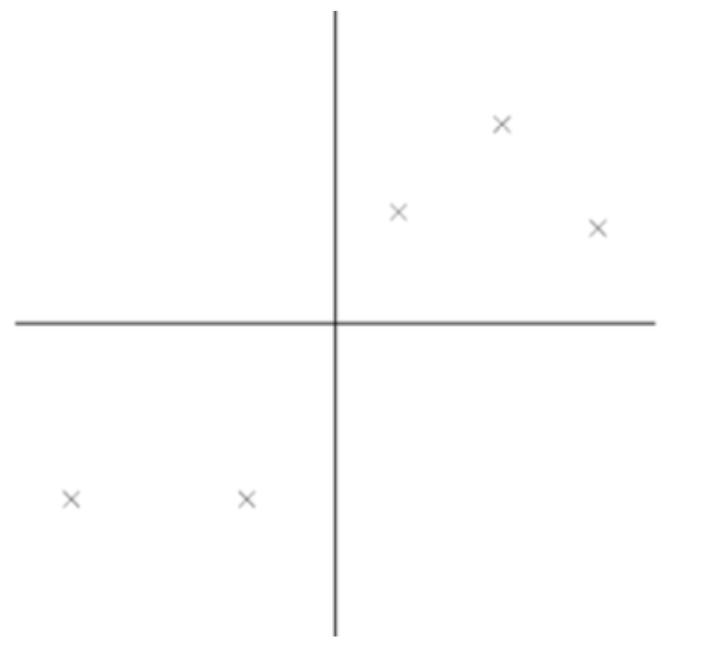
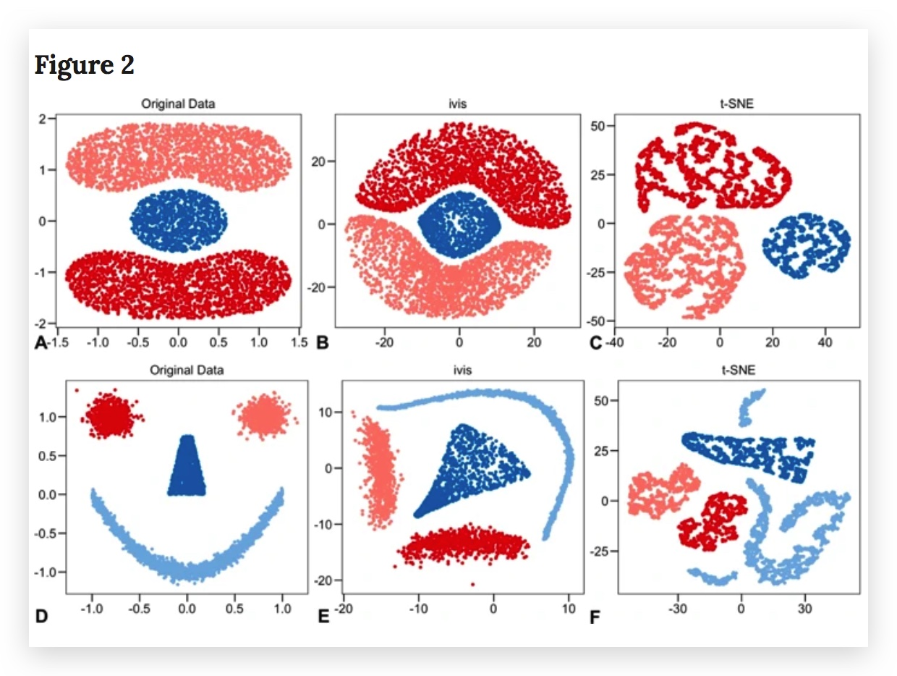
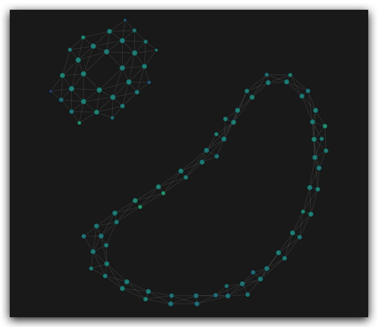

# 降维 (dimensionality reduction) {ignore=ture}

[Toc]

## pca

信息论认为信号具有较大方差，噪音具有较小方差，信噪比就是信号与噪音的方差比.

最大方差理论
: 信噪比越大越好

<div >
    <figure >
        
    </figure>
</div>

进行 PCA 降维时，需要计算协方差矩阵

## t-SNE

t-distributed Stochastic Neighbor Embedding

## ivis

t-SNE 的问题点：

1. not robust
2. 新加点要在全集上重新学习，不够 scalable
3. 复杂度高
4. 局部保结构，不保全局结构
5.



用到的技术： siamese neural networks (SNNs)

附赠 Ivis-animate 和 Ivis-explain.

[Structure-preserving visualisation of high dimensional single-cell datasets](https://www.nature.com/articles/s41598-019-45301-0)

## KeplerMapper

[KeplerMapper](https://github.com/scikit-tda/kepler-mapper)
生成的网页非常酷



更棒的是，你可以在 jupyter notebook 中展示

```python
from kmapper import jupyter
jupyter.display(path_html="http://mlwave.github.io/tda/word2vec-gender-bias.html")
```

<aside class='caution'>
备注:  path_html 如果是本地文件，需要用 python3 -m http.server 8000 起服务后传入 url
</aside>

## UMAP

## 附录-降维可视化

我们可以利用 tensorboard 进行降维可视化（包含 pca,tsne, umap 三种降维方法），特别地，如果数据带标记，可以用不同颜色区分，直观感受降维效果；此外，也可以展示最近邻。

<details>
 <summary>展开代码</summary>

    ```python
    import warnings
    warnings.filterwarnings("ignore")

    import numpy as np
    import tensorflow as tf
    from tensorflow.contrib.tensorboard.plugins import projector


    # ======== data
    # poi_id, poi_label, poi_vec, poi_name
    data_file = "some.txt"
    # poi_id poi_label embedding_sep_with_comma

    meta_file = "/Users/zhangxisheng/Downloads//meta.tsv"
    TENSORBOARD_FILES_PATH = 'where_to_save_tensorboard_log'

    with open(data_file, 'r', encoding='utf-8') as data, open(meta_file, 'w',encoding='utf-8') as meta:

        lines = data.readlines()[1:]
        VOCAB_SIZE = len(lines)
        EMBEDDING_DIM = len(lines[0].split('\t')[2].split(','))
        w2v = np.zeros((VOCAB_SIZE, EMBEDDING_DIM))

        meta.write("Index\tLabel\tName\n")

        for index, line in enumerate(lines):
            content = line.split('\t')
            if len(content) < 3:
                print("line not valid", content)
                continue
            w2v[index] = np.array([float(i) for i in content[2].split(',')])
            meta.write("%d\t%s\t%s\n" % (index, content[1], content[3]))

    with tf.Session() as sess:
        X_init = tf.placeholder(tf.float32, shape=(VOCAB_SIZE, EMBEDDING_DIM), name="embedding")
        X = tf.Variable(X_init)
        init = tf.global_variables_initializer()

        sess.run(init, feed_dict={X_init: w2v})
        saver = tf.train.Saver()
        writer = tf.summary.FileWriter(TENSORBOARD_FILES_PATH, sess.graph)
        config = projector.ProjectorConfig()
        embed = config.embeddings.add()
        embed.metadata_path = meta_file
        projector.visualize_embeddings(writer,config)
        saver.save(sess, TENSORBOARD_FILES_PATH+'/model.ckpt', global_step = VOCAB_SIZE)
    ```

</details>

## 参考

- [降维可视化](https://idyll.pub/post/dimensionality-reduction-293e465c2a3443e8941b016d/)
