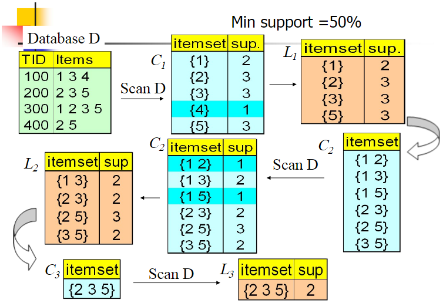
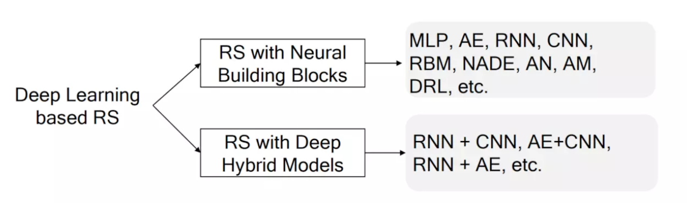
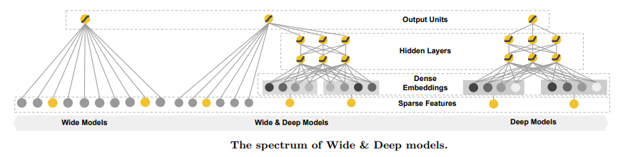
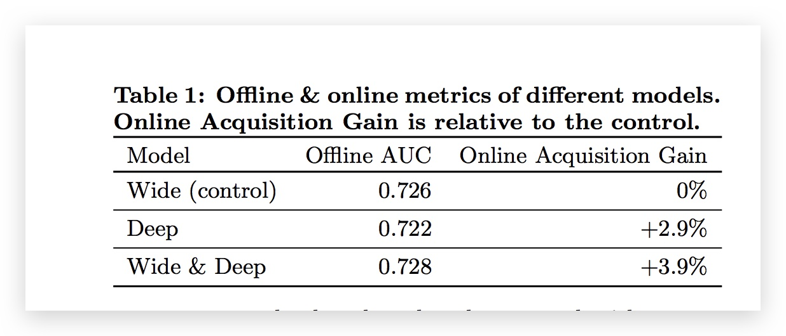
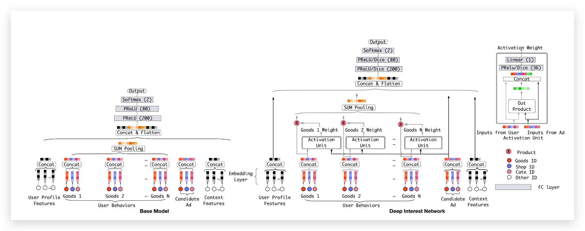
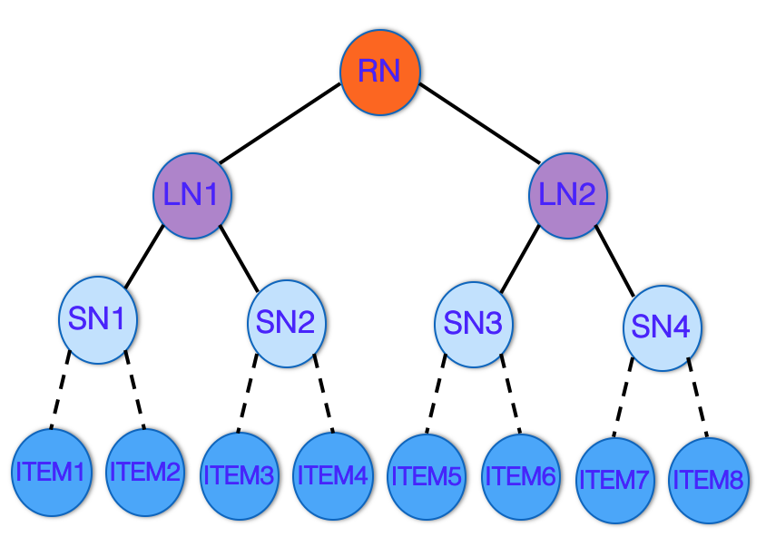
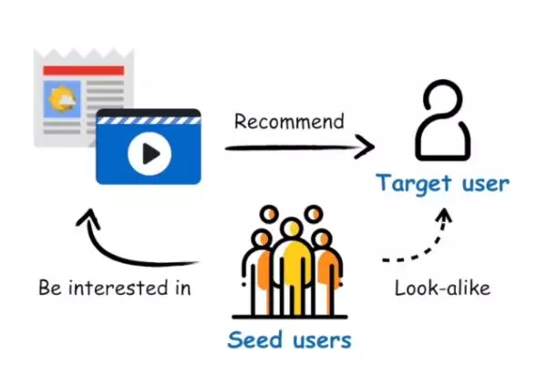
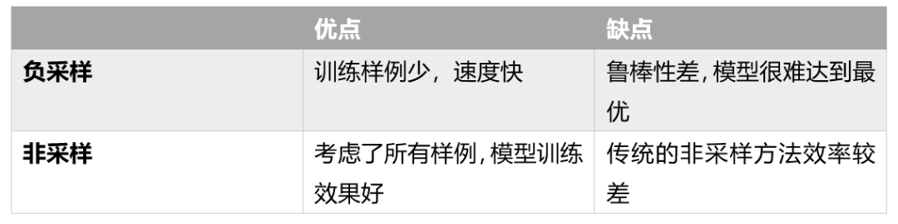

# 推荐系统专题 {ignore=true}

[TOC]

信息过载

分为传统方法和深度学习的方法。

困难和挑战

1. 效率和可扩展性
2. 个性化和差异化
3. 多样化多模态的数据的融合
4. 平衡长短期偏好
5. 如何纳入知识图谱
6. 可解释
7. 冷启动
8. 动态化
   所推荐的东西的疆域不能是封闭的，要对用户进行适当引领，摆脱‘过滤气泡’造成的智识孤立

## 传统方法

虽然现在深度学习已经攻城略地，无所不在，但是传统方法

### 基于规则的推荐

#### 关联规则

共 5 笔订单，2 笔同时包含 AB，即 A->B 的支持度是 2/5。
商品 A 有 3 次购买，这 3 次中有 2 次购买了 B，A->B 的置信度是 2/3

ift(A->B) =confidence(A->B)/support(B)

$$
\text {lif } t ( X = > Y ) = \frac { P ( Y | X ) } { P ( Y ) }
$$

衡量的是： 看了 A 之后推荐 B，相比直接推荐 B 如何？

##### 求解算法

Apriori 算法

- 如果一个项集是频繁项集，则它的所有子集都是频繁项集
- 如果一个集合不是频繁项集，则它的所有父集（超集）都不是频繁项集

FP-Growth

#### 人口统计

### 基于内容的推荐

缺点： 推荐物较为静态

### 协同过滤

User-CF 中，两个用户的相似度，用他们的公共物品来衡量。例如 jaccard 系数等。另外，需要对爆款加一些惩罚。对应的，在 Item-CF 中，公共用户不直接加和，而是乘以权重（权重自然是和看其兴趣物品呈指数反比）。

由于大量数据稀疏，因此可以通过倒排等手段，避免无效计算。

#### Item-CF 和 User-CF

Item-CF 和 User-CF 如何选择

1. user 和 item 数量分布以及变化频率
   - 如果 user 数量远远大于 item 数量, 采用 Item-CF 效果会更好, 因为同一个 item 对应的打分会比较多, 而且计算量会相对较少
   - 如果 item 数量远远大于 user 数量, 则采用 User-CF 效果会更好, 原因同上
   - 在实际生产环境中, 有可能因为用户无登陆, 而 cookie 信息又极不稳定, 导致只能使用 item-cf
   - 如果用户行为变化频率很慢(比如小说), 用 User-CF 结果会比较稳定
   - 如果用户行为变化频率很快(比如新闻, 音乐, 电影等), 用 Item-CF 结果会比较稳定
2. 相关和惊喜的权衡

   - item-based 出的更偏相关结果, 出的可能都是看起来比较类似的结果
   - user-based 出的更有可能有惊喜, 因为看的是人与人的相似性, 推出来的结果可能更有惊喜

3. 数据更新频率和时效性要求
   - 对于 item 更新时效性较高的产品, 比如新闻, 就无法直接采用 item-based 的 CF, 因为 CF 是需要批量计算的, 在计算结果出来之前新的 item 是无法被推荐出来的, 导致数据时效性偏低;但是可以采用 user-cf, 再记录一个在线的用户 item 行为对, 就可以根据用户最近类似的用户的行为进行时效性 item 推荐;
   - 对于像影视, 音乐之类的还是可以采用 item-cf 的

#### 基于模型的协同过滤

仅需要一个 **user-item** 矩阵（矩阵元素为打分值），并不需要 user 和 item 的属性。可以视作矩阵补全问题。

### SimRank

包括 SimRank++， 参见 [图算法](../section4/graphTheory.md#SimRank)

### 矩阵分解

参见 [矩阵分解](./mf.md)

### GBDT+LR

参见 [搜索排序](search.md)

### 2010-FM

包括 FM, FFM, DeepFM 等，参见 [FM](./fm.md)

### 2018-TEM

利用树模型的可解释推荐

`TEM: Tree-enhanced Embedding Model for Explainable Recommendation`

### 混合推荐系统

混合模型是指整合两种或更多种推荐策略的推荐系统

## 深度学习在推荐领域的应用

深度学习在推荐领域的应用。

推荐系统领域领先的国际会议 RecSys 自 2016 年起开始定期进行深度学习推荐系统研讨会

基于深度学习的推荐模型的优势：

1. 非线性变换
   与线性模型相反，深度神经网络能够利用非线性激活（例如 relu，sigmoid，tanh 等）对数据中的非线性进行建模。该属性使得捕获复杂的用户-物品交互模式成为可能。诸如 MF，FM，稀疏线性模型的常规方法基本上是线性模型。
2. 表示学习
3. 灵活性

深度学习技术潜在的劣势：

1. 可解释性
2. 数据和资源要求

### PNN

Product-based Neural Network，简称 PNN

上交 和 UCL 联合发表在 ICDM 2016 的论文 `Product-based Neural Networks for User Response Prediction`

PNN 网络的 embedding 层与全连接层之间加了一层 Product Layer 来完成特征组合.

根据 product 函数的不同选择，PNN 也有不同实现，这里的想象空间就很多了。文中尝试了相对常见的向量内积（inner product）和外积（outer product），对应 IPNN 和 OPNN。

融合 bit-wise 和 vector-wise 交叉特征的方法

### Deep Collaborative Filtering, DCL

深度协同过滤，让深度学习与协同过滤相结合！

### 2016-Wide \& Deep

2016, 谷歌，应用到了 Google Play 的应用推荐中

    <figure align='center'>
        
        <figcaption></figcaption>
    </figure>

结合了线性模型的记忆能力和 DNN 模型的泛化能力（combining the power of memorization and generalization?）。

jointly training a wide linear model (for memorization) alongside a deep neural network (for generalization)

deep 部分则是先对不同的 ID 类型特征做 embedding，在 embedding 层接一个全连接的 MLP（多层感知机），用于学习特征之间的高阶交叉组合关系。

wide 部分其实就是一个广义线性模型： $y=\mathbf{w}^{T} \mathbf{x}+b$, 最后再对 $y$ 做一个 sigmoid 变换。
值得注意的是，wide 部分有些重要的变换特征是 cross-product 特征（类似于 `AND(query="fried chicken", item="chicken and waffles")`, 这种交叉特征在 wide 和 deep 部分中均有使用）。

优化的话，wide 部分用哪 FTRL + L1 正则，deep 部分则用 AdaGrad.

另外，指的一提的是，从论文中所给的模型结果来看，Deep 模型相比 Wide 模型虽然线上效果有提升，但其实线下 auc 是低一些的。

关于数据特征

1. 数值特征归一化是按照 CDF 的方式去划分分位点的。
2.

### 2016 youtube 视频推荐算法

`Deep Neural Networks for YouTube Recommendations`

第一层 Candidate Generation Model 完成候选视频的快速筛选，这一步候选视频集合由百万降低到了百的量级。

第二层是用 Ranking Model 完成几百个候选视频的精排。

十个问题（取自 [YouTube 深度学习推荐系统的十大工程问题](https://zhuanlan.zhihu.com/p/52504407)）

1. 为什么不一个网络搞定，而要分为粗召和精排？

   > During ranking, we have access to many more features describing the video and the user's relationship to the video because only a few hundred videos are being scored rather than the millions scored in candidate generation.

2. 为什么在 online serving 的时候不直接用这套网络进行预测而要使用 nearest neighbor search 的方法?
   工程妥协，KNN 搜索更高效。
3. 在对训练集的预处理过程中，Youtube 没有采用原始的用户日志，而是对每个用户提取等数量的训练样本，这是为什么？
   为了减少高度活跃用户对于 loss 的过度影响

4. 总共的分类有数百万之巨，这在使用 softmax 训练时无疑是低效的，这个问题 YouTube 是如何解决的？
   简单说就是进行了负采样（negative sampling）并用 importance weighting 的方法对采样进行 calibration

5. 模型构建的过程中如何引入用户对新视频的偏好？
   引入了“Example Age”这个 feature
6. 为什么不采取类似 RNN 的 Sequence model，而是完全摒弃了用户观看历史的时序特征，把用户最近的浏览历史等同看待，这不会损失有效信息吗？

7. 为什么不采用经典的随机留一法（random holdout），而是一定要把用户最近的一次观看行为作为测试集？
   主要是为了避免引入 future information，产生与事实不符的数据穿越
8. 在确定优化目标的时候，YouTube 为什么不采用经典的 CTR，或者播放率（Play Rate），而是采用了每次曝光预期播放时间（expected watch time per impression）作为优化目标？

9. 针对某些特征，比如 _previous impressions_，为什么要进行开方和平方处理后，当作三个特征输入模型？
   引入了特征的非线性
10. 为什么 ranking model 不采用经典的 logistic regression 当作输出层，而是采用了 weighted logistic regression？
    模型采用了 expected watch time per impression 作为优化目标，所以如果简单使用 LR 就无法引入正样本的 watch time 信息。因此采用 weighted LR，将 watch time 作为正样本的 weight，在线上 serving 中使用 e(Wx+b)做预测可以直接得到 expected watch time 的近似

### Deep & Cross

`Deep & Cross Network for Ad Click Predictions`

feature cross 的概念都在网络结构中去实现， 无需像 wide & deep 中那样需要手工设计 cross feature

参见 [CTR](./ctr.md)

### 2018-DIN

Deep Interest Network, KDD2018

两个观察

1. 用户在浏览电商网站的过程中显示出的兴趣是十分多样性的，仅用固定用户向量，不足以表达用户多样的兴趣。

2. 由于用户兴趣的多样性，只有部分历史数据会影响到当次推荐的物品是否被点击，而不是所有的历史记录。当我们要预测一个 User $U_i$ 对一个目标 Item $I_t$ 的点击率，我们可能并不需要表达用户的所有兴趣，我们只需要表达其和 $I_t$ 相关的兴趣. 这就有点 attension 的意思。

$$
V _ { u }  = \sum _ { i = 1 } ^ { N } w _ { i } * V _ { i } = \sum _ { i = 1 } ^ { N } g \left( V _ { i } , V _ { a } \right) * V _ { i }
$$

上式中， $V_u$ 是用户的 embedding 向量， $V_a$ 是候选广告商品的 embedding 向量， $V_i$ 是用户 u 的第 $i$ 次行为的 embedding 向量，因为这里用户的行为就是浏览商品或店铺，所以行为的 embedding 的向量就是那次浏览的商品或店铺的 embedding 向量。

因为加入了注意力机制， $V_u$ 从过去 $V_i$ 的加和变成了 $V_i$ 的加权和， $V_i$ 的权重 $w_i$ 就由 $V_i$ 与 $V_a$ 的关系决定，也就是上式中的 $g(V_i,V_a)$

传统的 Attention 机制中，给定两个 item embedding，比如 $u$ 和 $v$，通常是直接做点积 $uv$ 或者 $uWv$，其中 $W$ 是一个$|u|\times|v|$ 的权重矩阵. 但这篇 paper 中阿里显然做了更进一步的改进： 首先是把 $u$ 和 $v$ 以及 $u$ $v$ 的 element wise 差值向量合并起来作为输入，然后喂给全连接层，最后得出权重.

另外，每个 ad 会有 good_id 和 shop_id 两层属性，shop_id 只跟用户历史中的 shop_id 序列发生作用，good_id 只跟用户的 good_id 序列发生作用。

激活函数 Dice

自适应正则(Adaptive Regulation)

评价指标 GAUC

$$
\mathrm { GAUC } = \frac { \sum _ { i = 1 } ^ { n } w _ { i } * \mathrm { AUC } _ { i } } { \sum _ { i = 1 } ^ { n } w _ { i } } = \frac { \sum _ { i = 1 } ^ { n } i m p r e s s i o n _ { i } * \mathrm { AUC } _ { i } } { \sum _ { i = 1 } ^ { n } i m p r e s s i o n _ { i } }
$$

### 2017-Neural collaborative filtering

### 2019-DIEN

DIEN (Deep Interest Evolution Network for Click-Through Rate Prediction)
用户兴趣演化模型， 主要用于定向广告排序中的 CTR（点击率）预估阶段

主要面向两个问题：兴趣提取和兴趣演化. 相比 DIN，加了一个 E，更加强调兴趣演化。

在 DIN 中，也是直接将用户的历史行为直接当做了兴趣分布， 而用户的潜在兴趣往往很难通过行为来完全表示，因此需要挖掘行为背后的用户真实兴趣，并考虑用户兴趣的动态变化。

**兴趣提取层**

作者指出 GRU 只能学习行为之间的依赖，并不能很好反映用户兴趣。 因此引入了一个辅助的 Loss，帮助 GRU 的隐状态更好地表示用户兴趣

**兴趣演化层**

提出了带注意力更新门的 GRU，也就是 AUGRU（Activation Unit GRU），让 GRU 的 update 门和预估的商品相关, 等于是考虑了用户历史之间的时序关系。在建模用户的兴趣演化过程中，AUGRU 会根据不同的预估目标商品构建不同的兴趣演化路径，推断出用户和此商品相关的兴趣。

### 深度树匹配模型 TDM

Tree-based Deep Match

> 使用树结构对全库 item 进行索引，然后训练深度模型以支持树上的逐层检索，从而将大规模推荐中全库检索的复杂度由 $O(n)$（$n$ 为所有 item 的量级）下降至 $O(log n)$

如上图所示，树中的每一个叶节点对应库中的一个 item；非叶节点表示 item 的集合。这样的一种层次化结构，体现了粒度从粗到细的 item 架构。此时，推荐任务转换成了如何从树中检索一系列叶节点，作为用户最感兴趣的 item 返回

在逐层往下的检索过程中，每一层都保留 K 个节点并往下扩展，即经典的 BeamSearch 方法.
那么，如何得到每层内精准的兴趣判别器，来找到每层内的 K 个最感兴趣的节点？

深度网络在 TDM 框架中承担的是用户兴趣判别器的角色。其输出的（用户，节点）对的兴趣度，将被用于检索过程作为寻找每层 Top K 的评判指标。由于 TDM 框架具备高效的剪枝能力，因此其能兼容任意先进的深度网络模型来进行全库检索

#### TDM 模型部署

TDM Serving ，通过这块可以学习到如何部署模型上线

Blaze 是一个面向广告/搜索/推荐场景的高性能深度学习推理引擎。

Beam Search, 一种启发式的贪心搜索方法

纵观阿里这几篇论文，可以看到，一条明显的主线就是围绕着‘用户兴趣’，不断探索什么是用户兴趣，如何表示兴趣。

### 2019-阿里-索引和模型联合优化-JTM

认为树索引的学习和用户偏好建模之间具有内在联系，而之前的方法中，索引学习和预测模型训练之间的目标并不完全一致，使得整体系统只能达到一个次优状态。因此提出对网络与树结构的联合训练。

DIN, DIEN, xDeepFM 等，都不能用于候选召回，因为依赖向量 KNN 搜索索引的方法在建模用户偏好的时候需要引入一个內积形式？而 TDM 是可以做召回的。

所提出的树结构学习方法，等价于二分图中加权最大匹配问题

**Alternatively optimize the index and prediction model under a global loss function**

实际效果来看，JTM 相比 base 模型，CTR 提升 11.3%（TDM 相比 base 提升 5.4%），可以说的特别恐怖的提升了。另外，千次展现收益 RPM 也提升了 12.9%

## 开辟新赛道：超越单体模型

引入多模态/多目标/多场景/多模块信号，端到端地联合建模.
例如 阿里的 ESMM 模型， 参见 [multimodel](./multimodel.md)

## 开辟新赛道：结合强化学习

### DRN

DRN: A Deep Reinforcement Learning Framework for News Recommendation
新闻推荐的深度强化学习框架

### 2019-FeedRec

论文 `Reinforcement Learning to Optimize Long-term User Engagement in Recommender Systems`
是清华大学和京东发表于 KDD 2019 的工作

### 基于强化学习的生成对抗模型

`Generative Adversarial User Model for Reinforcement Learning Based Recommendation System`

### 多臂老虎机

参见 [MAB](./mab.md)

### 2019-youtube

Top-K Off-Policy Correction for a REINFORCE Recommender System，WSDM 2019

## 开辟新赛道：其他思路

### 基于 Session

给定一个 session 中的 item 点击流，预测这个点击流后的下一个点击会是什么 item

论文 `A Survey on Session-based Recommender Systems` 是第一篇全面深入总结 session-based recommendations 的综述文章

### 社会化推荐

### 基于当前情景

### 单品推荐向群体会场、培育心智升级

### Look-alike

相似人群扩展

利用品牌提供的种子用户数据，通过模型算法在广告平台的用户大数据库中找到和种子用户相似的用户群。 品牌的种子用户群体往往量比较小，基于种子用户进行广告投放，广告覆盖面小，达不到预期的流量，所以就借助 Look-alike 能够把投放覆盖的人群放大，同时保证精准定向效果。

如何扩展出去呢？

1. 利用用户画像标签
2. 分类或预测模型
3. 基于社交网络的人群扩展

## 可解释性

参考 [可解释性](/Users/zhangxisheng/Documents/mt_meterial/机器学习/模型解释interprete.md)

## 应用

### 资讯推荐

资讯对时效性的要求更高

### 2019-腾讯-RALM

Realtime Attention-based Look-alike Model

微信看一看

## 附录-关于样本

### 高效非采样学习算法

推荐系统中经常用到的数据是隐式反馈数据（Implicit Feedback Data），如浏览历史，点击日志等。这些数据往往只有正反馈而没有负反馈，并且数据是高度稀疏的（相比于用户点击过的产品，没有被点击过的产品的数量非常多）。
在推荐系统中使用隐式反馈数据，有两种常见的学习方法：1）负采样策略，2）非采样策略。

负采样策略是从所有用户未标记的样例中抽取一部分作为负例，而非采样策略则是将所有用户未标记的样例作为负例

参考 [浅谈个性化推荐系统中的非采样学习](https://mp.weixin.qq.com/s?__biz=MzIwMTc4ODE0Mw==&mid=2247503230&idx=1&sn=7fe7f33a7fa3e926b69fe7c438937f1e&chksm=96ea12fea19d9be85e329dcb91964aebfba6eead44e6f942ec162f99ba8d3934a1f655f14403&token=1434499808&lang=zh_CN#rd)

## 附录-paper 阅读札记

## 参考资料

1. [Amazon.com Recommendations: Item-to-Item Collaborative Filtering](http://www.cin.ufpe.br/~idal/rs/Amazon-Recommendations.pdf)
2. [Deep Learning based Recommender System: A Survey and New Perspectives, 2017](https://arxiv.org/abs/1707.07435)
