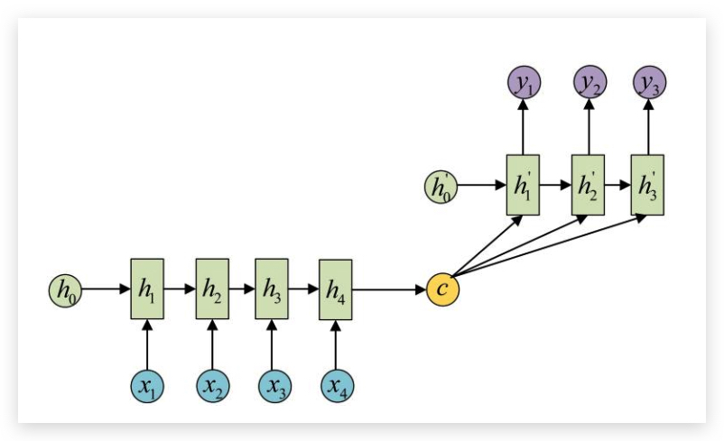

# RNN {ignore-true}

[TOC]
recurrent neural networks, 循环神经网络

RNN 是 Recursive Neural Nwtwork(递归神经网络，有时也被简写为 RNN) 的一种，其核心在于对当前的状态保留`记忆`（以隐变量的方式存在）。

## RNN 原理

给定输入序列 $(x_1,x_2, ..., x_T)$, 一个标准的 RNN 通过如下迭代方程计算输出序列$(y_1,y_2, ..., y_T)$:

$$
h_t = sigma(W^{hx}x-t + W^{hh}h_{t-1}) \\\
y_t = W^{yh}h_t
$$

所谓的记忆重现，就体现在了 $h_t$ 与 $h_{t-1}$ 上了。

此外，注意到，RNN **各层之间共享一套参数**（由此极大减少了待学习的参数数量），训练用到的是 BPTT ( _backpropagation through time_)。

**Encoder-Decoder 结构**

在 Encoder-Decoder 结构中，Encoder 把所有的输入序列都编码成一个统一的语义特征 c 再解码，因此， c 中必须包含原始序列中的所有信息，它的长度就成了限制模型性能的瓶颈。如机器翻译问题，当要翻译的句子较长时，一个 c 可能存不下那么多信息，就会造成翻译精度的下降. 顺着这个思路，有了 Attention

针对传统 RNN 的各种缺陷，有如下几种改进的 RNN 模型。

2. BirDirectional RNNs

   核心想法：t 时刻的输出不仅依赖于之前的序列，可能也要依赖于之后的序列

3. GRU(gated recurrent units)

   包含一个重置门，一个进化门。相比 LSTM 少了一个输出门。

   [Empirical Evaluation of Gated Recurrent Neural Networks on Sequence Modeling](http://arxiv.org/pdf/1412.3555v1.pdf), by Bengio 等人

- [An Empirical Exploration of Recurrent Network Architectures by Rafal Jozefowicz, et al., Google](http://jmlr.org/proceedings/papers/v37/jozefowicz15.pdf)

  探讨 RNN 的内在机理。非常重要的一篇，待认真研读。

- [A Critical Review of Recurrent Neural Networks for Sequence Learning](http://arxiv.org/abs/1506.00019v1)

- [Scheduled Sampling for Sequence Prediction with
  Recurrent Neural Networks](http://arxiv.org/pdf/1506.03099v3.pdf) by Sami Bengio, et al., at Google.

      定时采样

### Weight Tying 技术

## LSTM

参见 [LSTM 专题](./lstm.md)

## 工具和应用

[recurrent.js](https://github.com/karpathy/recurrentjs)
Karpathy 大神用　 javascript 写的 RNN 库

## 参考

- [Awesome RNN](http://jiwonkim.org/awesome-rnn/)
