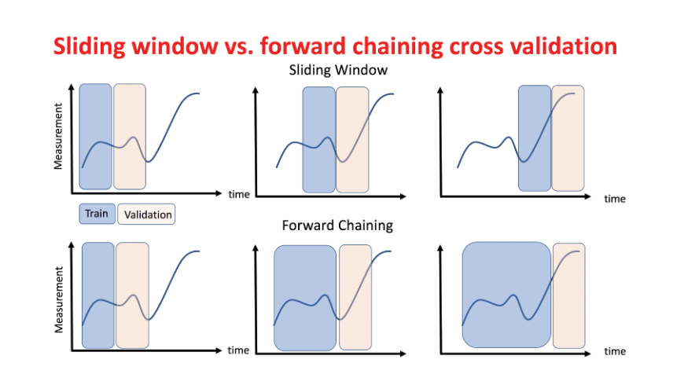

# 时间序列分析专题 {ignore=true}

[TOC]
</br>

<section style="margin-bottom:-16px">
<section style="margin-top:0px;margin-right:0px;margin-bottom:0px;margin-left:2em;padding-top:2px;padding-right:1em;padding-bottom:2px;padding-left:1em;max-width:100%;display:inline-block;background-image:none;background-color:rgb(196, 212, 218);color:rgb(61, 88, 98);font-size:16px;text-align:center;letter-spacing:1.5px;line-height:1.75em;border-top-left-radius:16px;border-top-right-radius:16px;border-bottom-right-radius:16px;border-bottom-left-radius:16px;box-sizing:border-box;word-wrap:break-word;">
<strong>前言</strong>
</section>
</section>
<section style="margin-top:0px;margin-right:0px;margin-bottom:20px;margin-left:0px;padding-top:2.5em;padding-right:1em;padding-bottom:1em;padding-left:1em;max-width:100%;box-sizing:border-box;border-top-width:1px;border-right-width:1px;border-bottom-width:1px;border-left-width:1px;border-top-style:solid;border-right-style:solid;border-bottom-style:solid;border-left-style:solid;border-top-color:rgb(196, 212, 218);border-right-color:rgb(196, 212, 218);border-bottom-color:rgb(196, 212, 218);border-left-color:rgb(196, 212, 218);border-top-left-radius:10px;border-top-right-radius:10px;border-bottom-right-radius:10px;border-bottom-left-radius:10px;word-wrap:break-word;">时间序列分析和建模，是在理论和应用中都比较重要的一类问题。最明显的特点是： 数据不再是无序的，而是有严格的先后顺序。

异常检测通常也属于时间序列分析的一部分，但在本章中并未包含异常检测部分，而是将其单独成章。另外，本章也侧重于预测任务，而并不太关注缺失值填充和分类问题。

</section>

按输入分，一般都是单变量的时序数据，但其实还有多变量的(例如，天气和污染情况)。

按输出分，也有多目标的时间序列，例如，hierarchical time series （自行车的销量可以分为山地车的销量、公路自行车、越野自行车、旅行自行车等）

按预测长度来分，分为 Multi-Step Forecast 和单步

Grouped time series

## 平稳性

### 单位根检验方法

#### ADF

### 自相关性

#### Durbin-Watson

## 传统方法

### ARMA

AR 代表 p 阶自回归过程，MA 代表 q 阶移动平均过程

#### 自回归 AR(p)模型

$$
X _ { t } = c + \sum _ { i = 1 } ^ { p } \varphi _ { i } X _ { t - i } + \varepsilon _ { t }
$$

#### 移动平均 MA(q)模型

$$
X _ { t } = \mu + \varepsilon _ { t } + \sum _ { i = 1 } ^ { q } \theta _ { i } \varepsilon _ { t - i }
$$

使用 PACF 图确定 p 的值

ACF 图用于识别正确的 q 值

### ARIMA

ARIMA 模型是在 ARMA 模型的基础上多了差分的操作。

ARIMA 方法是如此成功，以至于有人说

> If results showed ARIMA models not best, it must be because analyst was unskilled.

### SARIMA

季节 ARIMA， 支持建模季节性成分

SARIMA(p,d,q)(P,D,Q)m, 其中，P,D,Q,m 为季节因素的超参数

### ARIMAX 和 SARIMAX

ARIMAX(SARIMAX) is what added exogenous regressors to ARIMA(SARIMA) .

### VAR

[VAR](https://www.wikiwand.com/en/Vector_autoregression) 即 Vector autoregression（向量自回归），用于建模多个时间序列之间的线性依赖关系，是自回归模型的推广。

$p$ 阶 VAR：

$$
y _ { t } = c + A _ { 1 } y _ { t - 1 } + A _ { 2 } y _ { t - 2 } + \cdots + A _ { p } y _ { t - p } + e _ { t }
$$

例如，一个有两个变量的 VAR(1):

$$
\left[ \begin{array} { l } { y _ { 1 , t } } \\\ { y _ { 2 , t } } \end{array} \right] = \left[ \begin{array} { c } { c _ { 1 } } \\\ { c _ { 2 } } \end{array} \right] + \left[ \begin{array} { l l } { a _ { 1,1 } } & { a _ { 1,2 } } \\\ { a _ { 2,1 } } & { a _ { 2,2 } } \end{array} \right] \left[ \begin{array} { c } { y _ { 1 , t - 1 } } \\\ { y _ { 2 , t - 1 } } \end{array} \right] + \left[ \begin{array} { c } { e _ { 1 , t } } \\\ { e _ { 2 , t } } \end{array} \right]
$$

因为考虑了多个序列之间的关系，因此比拆分为多条时序分别建模的方法要更好一些。

### HoltWinters

## 神经网络方法

### LSTM

数据准备： 将单变量时间序列转化成样本（例如，每三个值预测下一个）

```python
# univariate lstm example
from numpy import array
from keras.models import Sequential
from keras.layers import LSTM
from keras.layers import Dense

# split a univariate sequence into samples
def split_sequence(sequence, n_steps):
	X, y = list(), list()
	for i in range(len(sequence)):
		# find the end of this pattern
		end_ix = i + n_steps
		# check if we are beyond the sequence
		if end_ix > len(sequence)-1:
			break
		# gather input and output parts of the pattern
		seq_x, seq_y = sequence[i:end_ix], sequence[end_ix]
		X.append(seq_x)
		y.append(seq_y)
	return array(X), array(y)

# define input sequence
raw_seq = [10, 20, 30, 40, 50, 60, 70, 80, 90]
# choose a number of time steps
n_steps = 3
# split into samples
X, y = split_sequence(raw_seq, n_steps)
# reshape from [samples, timesteps] into [samples, timesteps, features]
n_features = 1
X = X.reshape((X.shape[0], X.shape[1], n_features))
# define model
model = Sequential()
model.add(LSTM(50, activation='relu', input_shape=(n_steps, n_features)))
model.add(Dense(1))
model.compile(optimizer='adam', loss='mse')
# fit model
model.fit(X, y, epochs=200, verbose=0)
# demonstrate prediction
x_input = array([70, 80, 90])
x_input = x_input.reshape((1, n_steps, n_features))
yhat = model.predict(x_input, verbose=0)
print(yhat)
```

### TreNet

### Tensorflow Model

[Time series forecasting](https://www.tensorflow.org/tutorials/structured_data/time_series?hl=zh-cn)

## 模型评估和选择

### 评估指标

- [MSE](https://www.wikiwand.com/en/Mean_squared_error)

$$
 \mathrm { MSE } = \frac { 1 } { n } \sum _ { i = 1 } ^ { n } \left( Y _ { i } - \hat { Y } _ { i } \right) ^ { 2 })
$$

- [mean absolute percentage error (MAPE)](https://www.wikiwand.com/en/Mean_absolute_percentage_error)

$$
\mathrm { M } = \frac { 100 \% } { n } \sum _ { t = 1 } ^ { n } \left| \frac { A _ { t } - F _ { t } } { A _ { t } } \right|
$$

- MAPE 时间片 X 距离 矩阵

- [Symmetric mean absolute percentage error (SMAPE or sMAPE)](https://www.wikiwand.com/en/Symmetric_mean_absolute_percentage_error)

$$
\mathrm { SMAPE } = \frac { 100 \% } { n } \sum _ { t = 1 } ^ { n } \frac { \left| F _ { t } - A _ { t } \right| } { \left( \left| A _ { t } \right| + \left| F _ { t } \right| \right) / 2 }
$$

- [Mean percentage error](https://www.wikiwand.com/en/Mean_percentage_error)

$$
\mathrm { MPE } = \frac { 100 \% } { n } \sum _ { t = 1 } ^ { n } \frac { a _ { t } - f _ { t } } { a _ { t } }
$$

- 动态时间调整(Dynamic Time Warping, DTW)
  衡量两个时间序列之间的相似度的方法，主要应用在语音识别领域来识别两段语音是否表示同一个单词

### 评估方法

walk-forward model validation

滚动预测

### 交叉验证

训练集和测试集的划分

1. 滑动窗口法：前 N 训练，后 N 测试，滑动
2. Forward Chaining method: 训练集不断扩充
   

### 基线选择

1. 新数据点的值被预测为等于前一个数据点
2. 下一个值作为所有先前值的平均值

### 模型选择

如果有多个时序，不可能一一手动为每个时序挑选参数

#### BIC 值

## 高阶话题

### 时序因果

#### 格兰杰因果关系

Granger causality test

检验一组时间序列 $x$ 是否为另一组时间序列 $y$ 的原因

## 工具

### statsmodels

sm 实现的 ARIMA 不支持高阶(>2)差分

<div class="warning">The computed initial MA coefficients are not invertible
	You should induce invertibility, choose a different model order, or you can
    pass your own start_params
</div>

<div class="warning">The computed initial AR coefficients are not
stationary,You should induce stationarity, choose a different model order, or you can pass your own start_params
</div>

print(results.summary().tables[1])

#### python SRIMAX 多步预测问题

无论是一次性预测多个，还是逐次预测-训练-预测，得到的结果都差不多。
原因： q d q 参数都为 1

### pandas

pandas 关于时序的一些

#### 画自相关图

```python
from pandas.tools.plotting import autocorrelation_plot
```

### skits

[skits](https://github.com/EthanRosenthal/skits)

> A library for SciKit-Inspired Time Series models.

### pmdarima

Auto ARIMA 工具

`pip install pyramid-arima`

### VictoriaMetrics

[VictoriaMetrics](https://github.com/VictoriaMetrics/VictoriaMetrics)
时序数据库

### TFTS

TensorFlow Time Series 模块

### facebook-prophet

[facebook-prophet](https://github.com/facebook/prophet)

### tsfresh

### spark-timeseries

[Spark-Timeseries](https://github.com/sryza/spark-timeseries)
[基于 spark 的时间序列预测包 Sparkts.\_的使用](https://www.jianshu.com/p/1cb74b1adc84)
[Spark-TimeSeries 使用方法](https://blog.csdn.net/qq_30232405/article/details/70622400)

### GluonTS

参考 [预知未来——Gluon 时间序列工具包（GluonTS）](https://zh.mxnet.io/blog/gluon-ts-release)

用于构建、评估以及比较 **基于深度学习** 的时间序列模型的 python 工具包。

## 应用

### 在实际应用当中，需要注意的一些问题点

#### 获取时序数据

注意： 缺失时间点的填充

#### in-sample VS. out-sample

<aside class='key-point'>
if you use data 1990-2013 to fit the model and then you forecast for 2011-2013, it's in-sample forecast. but if you only use 1990-2010 for fitting the model and then you forecast 2011-2013, then its out-of-sample forecast.
</aside>

#### 多步预测 Multi-Step Forecasting

1. Direct Multi-step Forecast Strategy.
2. Recursive Multi-step Forecast Strategy.
3. Direct-Recursive Hybrid Multi-step Forecast Strategies.
4. Multiple Output Forecast Strategy.

##### Direct Multi-step Forecast Strategy.

developing a separate model for each forecast time step.

当时间点较多的时候，每个时间点一个模型的话，在计算上的负担是非常重的；并且，**这种方法忽略了时间点之间的依赖关系**

##### Recursive Multi-step Forecast

先预测一个，将与预测值加入训练集，训练之后，再预测下一个

缺点： 误差累计

##### Direct-Recursive Hybrid Strategies

循环法先给一个预测，然后直接法将其添加到训练集，预测下一个值作为真正的预测。如此循环。

##### Multiple Output Strategy

Multiple output models are more complex as they can learn the dependence structure between inputs and outputs as well as between outputs.

### 高维数据预估

`Forecasting High-Dimensional Data`

在合约广告中，需要提前预估某个定向下的流量情况，从而进行合理的售卖和分配。但是由于定向的组合非常多（广告主的多样的需求导致的），而工程上不允许为每个可能的定向预估其流量，因此这篇论文提出了先预估一些基本定向的流量，然后通过 correlation model 从基本定向的流量计算出各种定向下的流量情况，具有较强的工程性

### KDDCUP-2019-AutoML for Temporal Relational Data

[冠军解决方案](https://github.com/DeepBlueAI/AutoSmart)

## 参考

- [股票预测模型](https://github.com/huseinzol05/Stock-Prediction-Models)
- [Forecasting: Principles and Practice](https://otexts.com/fpp2/)
  作者为 Rob J Hyndman and George Athanasopoulos
  Rob 是一个来自澳大利亚的统计学家，forecast 等 R 包的作者，参看[统计之都对他的采访](https://cosx.org/2014/02/cos-interview-rob-j-hyndman)
- [A Complete Tutorial on Time Series Modeling in R](https://www.analyticsvidhya.com/blog/2015/12/complete-tutorial-time-series-modeling/)
- [How to Develop LSTM Models for Time Series Forecasting](https://machinelearningmastery.com/how-to-develop-lstm-models-for-time-series-forecasting/)
- [时间序列分析基础](http://blog.codinglabs.org/articles/time-series-analysis-foundation.html)
- [A Brief Survey on Sequence Classification](https://www.cs.sfu.ca/~jpei/publications/Sequence%20Classification.pdf)
- [GluonTS - Probabilistic Time Series Modeling in Python](https://github.com/awslabs/gluon-ts)
  基于 MXNet
- [Kaggle: How to use SARIMAX](https://www.kaggle.com/poiupoiu/how-to-use-sarimax)
- [How to Grid Search SARIMA Hyperparameters for Time Series Forecasting](https://machinelearningmastery.com/how-to-grid-search-sarima-model-hyperparameters-for-time-series-forecasting-in-python/)
