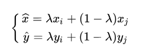
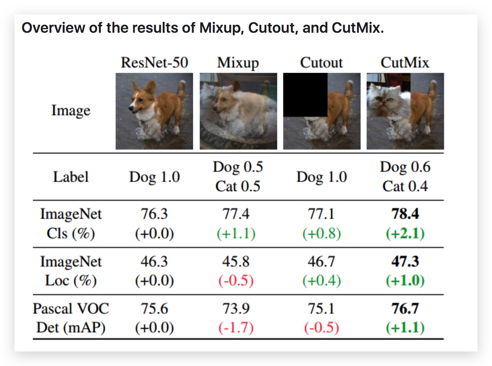
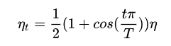
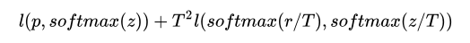
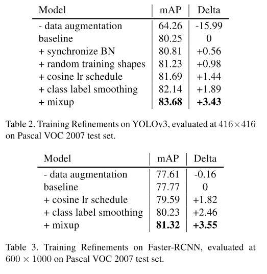

# Tricks {ignore=True}

[TOC]

<br>
<section style="margin-bottom:-16px">
<section style="margin-top:0px;margin-right:0px;margin-bottom:0px;margin-left:2em;padding-top:2px;padding-right:1em;padding-bottom:2px;padding-left:1em;max-width:100%;display:inline-block;background-image:none;background-color:rgb(196, 212, 218);color:rgb(61, 88, 98);font-size:16px;text-align:center;letter-spacing:1.5px;line-height:1.75em;border-top-left-radius:16px;border-top-right-radius:16px;border-bottom-right-radius:16px;border-bottom-left-radius:16px;box-sizing:border-box;word-wrap:break-word;">
<strong>前言</strong>
</section>
</section>
<section style="margin-top:0px;margin-right:0px;margin-bottom:20px;margin-left:0px;padding-top:2.5em;padding-right:1em;padding-bottom:1em;padding-left:1em;max-width:100%;box-sizing:border-box;border-top-width:1px;border-right-width:1px;border-bottom-width:1px;border-left-width:1px;border-top-style:solid;border-right-style:solid;border-bottom-style:solid;border-left-style:solid;border-top-color:rgb(196, 212, 218);border-right-color:rgb(196, 212, 218);border-bottom-color:rgb(196, 212, 218);border-left-color:rgb(196, 212, 218);border-top-left-radius:10px;border-top-right-radius:10px;border-bottom-right-radius:10px;border-bottom-left-radius:10px;word-wrap:break-word;">之所以称之为Tricks，我们也知道在实际应用中是否有效还得看面向不同数据集的具体的任务，需要我们耐心的尝试，才能找到一个相对最优的方案。
</section>
</br>

## 常用 Tricks

### Mixup, Cutout and Cutmix

样本增广的方式

**Mixup**



### Cosine Learning rate decay

**Learning rate warm up**
训练初期由于离目标较远，一般需要选择大的学习率，但是使用过大的学习率容易导致不稳定性。所以可以做一个学习率热身阶段，在开始的时候先使用一个较小的学习率，然后当训练过程稳定的时候再把学习率调回去。比如说在热身阶段，将学习率从 0 调到初始学习率。

例如，前面的例如 m 个 batches 用较小的学习率来 warm up（热身）.



题外话：对学习率的下降，并非所有人都认同，例如论文 `DON’T DECAY THE LEARNING RATE, INCREASE THE BATCH SIZE`

### Label Smoothing

```python
from tensorflow.losses import softmax_cross_entropy
# softmax_cross_entropy 的参数  label_smoothing
```

### Knowledge Distillation.

知识蒸馏的做法是用一个更复杂的 teacher model 来监督一个 student model，目的是为了压缩一个大的网络结构到一个更为紧凑的网络并把知识保留下来。若 z 和 r 分别是 student model 和 teacher model 的输出，p 是真实标签的分布，那么此时的损失函数为，


其中，T 是超参数代表 temperature.

### Random Shapes Training

在训练过程中,每隔一些 epoch 就随机的从{320, 352, 384, 416, 448, 480, 512, 544, 576, 608}中选择一个新的图片分辨率



### SyncBN

跨卡同步 Batch Normalization

### SelfTraining

利用 self-training 标记得到的样本本身就是模型容易区分的样本，再用这部分样本进行训练很容易造成模型过拟合，最终模型在验证集上的性能没有提升反而有所下降。

### CoTraning

### tri-training
