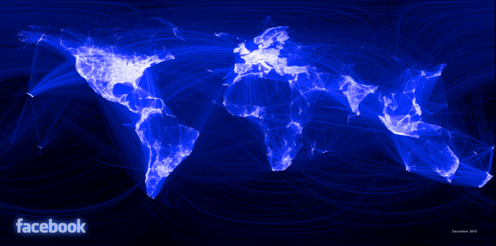

# 可视化专题

是的，我把可视化也放到了这一章（你咬我啊）

数据可视化对增进人们对数据的理解、捕捉数据中潜藏的模式，起着至关重要的作用，正所谓*一图胜千言*。

好的可视化作品，能够让受众发现那些原本非常容易被忽略却极具价值的东西，甚至更进一步，**Good answers lead to more good questions**.

可视化的终极目的是**更好地传递信息**。所以，首先你得有信息，其次才涉及到如何去传递。关于从数据中获取信息，请参考本书[数据分析](../section6/dataAnalysis.md)等专题。这里我们只涉及**如何传递**部分。

#### 一般知识

> “Visualization is really about external cognition, that is, how resources outside the mind can be used to boost the cognitive capabilities of the mind.” — Stuart Card

- [No more Rainbows](https://agilescientific.com/blog/2017/12/14/no-more-rainbows)
  `The world has known for at least 20 years that the rainbow colourmap is A Bad Thing, perhaps even A Very Bad Thing`
  为什么说彩虹图是个特别不好的东西呢？原因大概有如下几点：

  1. 黄色和青色附近有色条，，引入了并不存在的结构，可能会误导受众
  2. 亮度不是单调的，因此无法转为灰度图
  3. 色盲同志无法很好感知

- [Why Should Engineers and Scientists Be Worried About Color?](http://researchweb.watson.ibm.com/people/l/lloydt/color/color.HTM)
  to read

- Parallel Coordinate

一种呈现高维数据的可视化技术，可以方便地看到样本在特征上的分布。

- [Multivariate Network Exploration and Presentation: From Detail to Overview via Selections and Aggregations](http://www.computer.org/csdl/trans/tg/preprint/06875972.pdf)
  该论文挑战了可视化研究领军人物 Ben Shneiderman 所提出的可视化设计原则（“魔咒”）：**overview first, zoom and filter, then details on demand（总览为先 缩放过滤 按需查看细节）**, 详细介绍参见[这篇博文](http://www.storagelab.org.cn/zhangdi/2015/11/07/dosa/)

#### 高维数据的可视化

#### 信息在社交网络上的流播

##### 可视化的欺骗性

可视化有时候是具有欺骗性的，例如一些有意或者无意的视觉操纵。这种欺骗的高明之处在于，它不是数据造假这种低级的欺骗，而是利用信息隐藏、引入一些不易察觉的偏置来达到视觉操作的目的。

常见的欺骗手法：　改变纵轴的起始点，改变放缩比例，改变线条粗细。

参见文章　[Disinformation Visualization: How to lie with datavis](https://visualisingadvocacy.org/blog/disinformation-visualization-how-lie-datavis?utm_campaign=Data%2BElixir&utm_medium=email&utm_source=Data_Elixir_40)
.　非常值得一读。

#### 可视化机器学习

三个方面，第一是特征的可视化探索，第二是训练过程的可视化，第三是结果的可视化解释。

[A visual introduction to machine learning](http://www.r2d3.us/visual-intro-to-machine-learning-part-1/) 非常直观，要是能提炼出通用的工具就好了！
好像这个作品还获得了[凯度信息之美大赛](https://www.informationisbeautifulawards.com/showcase/743-a-visual-introduction-to-machine-learning)

[Visualizing MNIST: An Exploration of Dimensionality Reduction](https://colah.github.io/posts/2014-10-Visualizing-MNIST/)

[Visualizing Representations: Deep Learning and Human Beings](https://colah.github.io/posts/2015-01-Visualizing-Representations/)

[Now You See It: Data Visualisation for Machine Learning](https://docs.google.com/presentation/d/1zAU8ZXTy895g1caJDg6fWoO4owdgXuVajYiFntMLrgs/edit#slide=id.p)

[Visdom](https://github.com/facebookresearch/visdom)
结合 pytorch 服用。

[tensorboard for pytorch (and chainer, mxnet, numpy, ...)](https://github.com/lanpa/tensorboard-pytorch)

[shap: A unified approach to explain the output of any machine learning model](https://github.com/slundberg/shap)
Notebook 中可交互是亮点。

[Netron : Visualizer for deep learning and machine learning models](https://github.com/lutzroeder/Netron)

supports ONNX (.onnx, .pb), Keras (.h5, .keras), CoreML (.mlmodel) and TensorFlow Lite (.tflite). Netron has experimental support for Caffe (.caffemodel), Caffe2 (predict_net.pb), MXNet (-symbol.json), TensorFlow.js (model.json, .pb) and TensorFlow (.pb, .meta).

#### 常用图

1. splom 散点图矩阵
2. Parallel coordinates

[LIME](https://arxiv.org/pdf/1602.04938.pdf)

---

### 工具

- Processing

  已经出到版本 3 了（2015.10.23）

  [Python Mode for Processing](http://py.processing.org/)

  关于　 processing 的书籍，现在也是非常多了。推荐《代码本色－用编程模拟自然系统》(The Nature of Code - Simulating Natural Systems With Processing), 这本书并不是专门讲　 processing 的，但是书中用　 processing 来实现诸多动态模拟，还是很有参考价值。

- [chart.js](http://www.chartjs.org/)

  特点： 简单灵活，基于 HTML5, 自适应，交互式。

- [P5.js]()

- D3.js

  我好钟意你啊，D3

- ggplot2
  大神 Hadley 鼎鼎大名的 R 包

- [visNetwork](http://dataknowledge.github.io/visNetwork/)

  R 包，交互可视化

- [ECharts](http://echarts.baidu.com/index.html)

  百度开源。有集大成者之气。

- [ProcessOn](https://www.processon.com/diagrams)

  在线制作流程图，非常好用，对于偶尔画一两次流程图的童鞋来说，安装软件啥的太麻烦且不必要，processon 绝对可以满足需求。

- [TimeLineJS](https://github.com/NUKnightLab/TimelineJS)

  时间流

  他们又搞个[TimelineJS3](https://github.com/NUKnightLab/TimelineJS3)出来

- [Plotly.js](https://plot.ly/javascript/open-source-announcement/)

  2015.11 开源。基于 D3.js 和 [stack.gl](http://stack.gl/)，绝对利器。

- [Three.js](​http://mrdoob.github.io/three.js/)

- [paper.js]()

- Gephi

* MathBox
  http://acko.net/files/mathbox2/iframe-rtt-history.html
  http://acko.net/files/mathbox2/iframe-quat.html
  http://acko.net/files/gltalks/pixelfactory/online.html
  真是要酷死了

- ArcGis
  > A powerful Python library for spatial analysis, mapping and GIS

* [Rough.js](https://roughjs.com/)
  Create graphics with a hand-drawn, sketchy, appearance
  手写体真的是很可爱啊

- GRASS(Geographic Resources Analysis Support System)
-

## [Story Maps](https://storymaps.arcgis.com/en/)

[河流污染](https://nation.maps.arcgis.com/apps/Cascade/index.html?appid=e50efda431924cd7963edd5491867a40) 这篇可视化真的漂亮，艺术品

[Why Do Cats & Dogs](https://whydocatsanddogs.com/)

这种交互式可视化真的太棒了！
文字和图片交互的感觉也很棒

配色方案

## palettable

## Web-Based Interactive Storytelling

#### 其他一些日常工作偶尔会用到的

饼图内容过多时，可以将一部分放到柱状图
https://antv.alipay.com/zh-cn/gallery/g2/pie-column.html?theme=default

花瓣图
https://antv.alipay.com/zh-cn/gallery/g2/pie-platelets.html

更漂亮的饼图（python 实现）
https://medium.com/@kvnamipara/a-better-visualisation-of-pie-charts-by-matplotlib-935b7667d77f

B 站 见齐 Jannchie 分享的动态柱状图可视化历史排名 代码
https://github.com/Jannchie/Historical-ranking-data-visualization-based-on-d3.js

---

### 作品廊

- [Visualing Algorithms](http://bost.ocks.org/mike/algorithms/)

- [更多编程算法可视化集锦](http://visualgo.net/)

- [分形和数学艺术](https://fractals-and-mathematical-art.zeef.com/alan.richmond)

- [概念可视化集锦(Gallery of Concept visualization.md )](http://conceptviz.github.io/#/e30=)

- [Information Is Beautiful Awards](http://www.informationisbeautifulawards.com/)

- [visualizing Facebook Friends](http://paulbutler.org/archives/visualizing-facebook-friends/)

- [How to Visualize New York City Using Taxi Location Data and ggplot2](http://minimaxir.com/2015/11/nyc-ggplot2-howto/)

- [A Day in the Life of Americans](https://flowingdata.com/2015/12/15/a-day-in-the-life-of-americans/)

* [画出一个好直方图原来也并不简单](http://tinlizzie.org/histograms/)

* [出行数据的可视化例子](https://github.com/tsloan1377/montreal_open_data/blob/master/traffic_heatmap_timeseries.ipynb)
  犹如一个星系，喜欢！

* [程序包管理可视化](https://github.com/anvaka/pm#your-own-graphs)

* [Advertures in Mapping](https://adventuresinmapping.com/)

* [D3.js Gallery](https://github.com/d3/d3/wiki/Gallery)
  太多实例了
* [财新网-数据新闻和可视化作品](http://datanews.caixin.com/datatopic/)

* [Data Sketches](http://www.datasketch.es/)
* [看见统计](https://seeing-theory.brown.edu/cn.html)
* [Forbidden City](https://multimedia.scmp.com/culture/article/2154046/forbidden-city/life/chapter_01.html?src=ef2018_in_graphics)
* [Infomation is Beautiful Awards](https://www.informationisbeautifulawards.com/showcase?award=2019&type=awards)

## 数据大屏

[Demo](http://www.bizinsight.com.cn/big/design.htm)

传统的直方图、折线图、饼图不再赘述。

Chord Diagrams

链接: 密码: 4ak5

## 机构／人物

- [IEE VIS](http://ieeevis.org/)

- [The Visual Analytics Science and Technology (VAST) Challenge](http://vacommunity.org/VAST+Challenge+2015)

* [北大可视分析](http://vis.pku.edu.cn/wiki/)
* https://www.visualcinnamon.com/blog/
* [MIT Senseable City Lab](http://senseable.mit.edu/)
* 邱南森（Nathan Yau）, 我还记得在我本科的时候在图书馆看到他的那本《鲜活的数据》时，第一次惊艳于数据可视化之美。
* [Giorgia Lupi](http://giorgialupi.com/work/) 来自意大利，自称为 _Data Humanism_
  
  [Her TED talk: How we can find oursilves in data](https://www.ted.com/talks/giorgia_lupi_how_we_can_find_ourselves_in_data)
* [Jason Davies](https://www.jasondavies.com/)
* [地图大师](https://www.cartographersguild.com/content.php?s=ca2903c9196b1cb84ed064263df115ea)

## 工具

- [Github 上的一些数据可视化开源工具](https://github.com/topics/data-visualization)

- [Map Talk](https://github.com/maptalks/maptalks.js/)

- [TimeLineJS](https://github.com/NUKnightLab/TimelineJS)
- [Apache Superset](http://superset.apache.org/)
  Apache Superset (incubating) is a modern, enterprise-ready business intelligence web application

### 资料

- [Fundamentals of Data Visualization](https://serialmentor.com/dataviz/)
  Open Source Book
- [gitbook: Data Visualization for All](http://www.datavizbook.org/content/)
- [墨者修齐](https://www.yuque.com/mo-college/weekly/oa5pgd)
  源于 AntV 团队内部的“可视分析培养计划”，以每周周报中与同伴分享最近的学习体会、可视化相关的文章、项目、论文等为主
- [visualisingdata](http://www.visualisingdata.com/)
- [Data Visualization: Fast and Slow](https://medium.com/@Elijah_Meeks/data-visualization-fast-and-slow-d2653d4850b0)

  > Ultimately, data visualization is not a technical problem, it’s a design problem and, more than that, a communication problem

