# FLow 2018

[TOC]

## 20190102

透明的红萝卜

思考、准备、等待

## 20190105

> Managers tend to blame their turnover problems on everything under the sun, while ignoring the crux of the matter: people don't leave jobs; they leave managers
> by Travis BradBerry

## 20190125

YaDS (Yet another Data Scientist)

## 20190126

> Two things are infinite: the universe and human stupidity; and I’m not sure about the universe.
> -- 爱因斯坦

NSFW: Not Safe For Work

## 20190211

> 经济的本质是交易，那么金融的本质呢？金融的本质是金钱的融通与流通。货币的流动是核心，也就是说，经济交易要活跃，货币流速要快，只要货币流通速度够快，即使很少的货币供应，也可以导致经济繁荣

> 想得到一样东西，最靠谱的方法就是让自己配得上它 by 芒格

> if people do not believe that mathematics is simple, it is only because they do not realize how complicated life is.——John von Neumann (28/12/1903 – 08/02/1957)

[《规模》:尺度的硬规律](https://mp.weixin.qq.com/s/LDAvhCGhwZ_Y8jd3rti3jQ)

尺度分析

> 全书最根本的思想，就是世间万事万物，通常都不能按照简单的线性比例放大

KL-散度中，log 函数其实可以推广为一般形式，只要是在 1 这一点为 0 的凸函数都可以。
借助于凸性，可以证明 kl-散度非负（最小为 0）
参见 https://blog.csdn.net/c9Yv2cf9I06K2A9E/article/details/80016095

因为 KL 散度要求在同一点计算概率密度的比值，这意味着，如果两个分布没有任何的交集，则 KL 散度其实是无法计算的！
此外，KL 散度还不是对称的，也不满足三角不等式。

https://www.zhihu.com/question/41752299 这里给了一个例子，当对一个正态分布坐 theta 平移的时候，如果 theta 趋近 1，则 KL 散度趋近于无穷

JS 散度是在 KL 散度的基础上，强行使其对称。

但是 JS 也有问题啊，例如，当一个分布是 0-1 上均匀分布，另一个是 theta 到 1 上的均匀分布，
当 theta=0 的时候，KL 和 JS 都是 0
但是当 theta 不等于 0 的时候，KL 为正无穷，JS 为 log2,都不是连续的！

由于不是连续的，则也不能作为损失函数去求解梯度。

> 无论`P_r`跟`P_g`是远在天边，还是近在眼前，只要它们俩没有一点重叠或者重叠部分可忽略，JS 散度就固定是常数 log 2，而这对于梯度下降方法意味着——梯度为 0！此时对于最优判别器来说，生成器肯定是得不到一丁点梯度信息的；即使对于接近最优的判别器来说，生成器也有很大机会面临梯度消失的问题。

不重叠或重叠部分可忽略的可能性有多大？答案是：当两个部分的的支撑集（support）是高维空间中的低维流形（manifold）时，两个分布的重叠部分测度（measure）为 0 的概率为 1

`Optimal Transport`（OT，最优运输）
最优传输 最优传输问题最早是由法国数学家蒙日（Monge）于 1780 年代提出；其解的存在性被俄国数学家 Kantorovich 证明，由此 Kantorovich 获得 1975 年诺贝尔经济奖；法国数学家 Brenier 建立了最优传输问题和凸函数之间的内在联系

由此导出的距离即 `wasserstein 距离` ，又称 `Earth Mover’s Distance`(推土机距离,地球移动距离)

EM 距离在上面均匀分布的例子中，是连续的，且当 theta 趋近 0 的时候，EM 距离也趋近 0

EM 具体计算的时候，需要用到 Kantorovich-Rubinstein 对偶性转为更方便计算的形式。

从 weight clipping 到 gradient penalty，更加先进的 Lipschitz 限制手法
https://www.zhihu.com/question/52602529/answer/158727900

## 20190217

乌托邦
反乌托邦
异托邦

## 20190218

阿里巴巴 JD - 风控算法(P6/7/8)
职位描述

1. 打造行业领先的人工智能风控技术中台，赋能阿里集团各个金融场景，包括供应链融资、贸易融资、信用融资、跨境支付等；
2. 深入了解集团各事业部业务，结合业务和信贷产品进行金融创新。通过全域风控数据对客户进行建模，全面评估信用风险和欺诈风险；
3. 基于前沿的人工智能技术，结合场景进行创新，打造风控技术中台的核心竞争力；
4. 带领多名小组成员，完成技术的规划和落地。

岗位要求：

1. 计算机、统计、运筹学等相关专业教育背景，具有硕士 5 年以上工作经验或博士 3 年以上工作经历。有实际成果并发表在国际顶级会议或期刊者优先；
2. 精通部分常用的机器学习技术，如 LR、GBDT、DNN、CNN、 LSTM、GAN、Reinforcement Learning 等，有前沿机器学习算法经验的优先； 3.在传统或互联网金融机构，涉足过国际支付、消费金融或供应链金融等风险管理工作，具有金融或支付风险模型经验优先；
3. 熟悉 Linux，熟悉 java、python、C/C++其中至少一种，有实际使用 Tensorflow/Caffe/Mxnet 等框架者优先；
4. 良好的主动性、逻辑思维能力和沟通能力；
5. 追踪算法前沿技术，探索将新技术应用于实际业务。

工作地点：
杭州

企业金融服务是阿里集团唯一金融团队，核心打造阿里集团的金融平台，新零售三大平台之一（交易平台和供应链平台）。
部门前身是 BBC 金融服务部，主要服务 1688、icbu、村淘和零售通业务。
目前定位升级为整个阿里集团的提供金融服务，包括淘宝、天猫、盒马等，从整个集团的定位来说，机会还是非常好的。
目前我们的产品为整个集团的供应商和消费者提供金融服务。面向消费者包括账期、信用贷款等产品。
面向供应商的，提供针对销售环节的提前回款，入仓（菜鸟仓库）提供仓储/保理融资，
采购备货提供备货/预付融资，以及未指定用途的信用贷款。

## 20190224

没事多看看 B 站

## 20190225

1. 改掉早上起来先刷微博的恶习
2. 改掉没有目标就打开电视茫然筛选的恶习
3. 改掉翘二郎腿的恶习

## 20190301

[严济慈的百年科学人生](http://www.zhishifenzi.com/depth/depth/5320.html)

> 那边几方大洋是熊先生、胡先生和我们夫妇送你去法国的路费，不要讲什么感谢的话了，去了学有所成，日后报效国家，先生们的心足矣

第一个获得法国国家科学博士学位的中国人

> 吾人学稍有进，对国家责任，亦更加加重，尤宜努力前进

> 百年回首，他一生为光

## 20190310

> 大抵学问是荒江野老屋中二三素心人商量培养之事，朝市之显学必成俗学
> by 钱钟书

> 惜乎!吾见其进也,未见其止也

> 生死看淡，不服就干

> 重担在身，不靠临阵磨枪，只凭十年苦功
> Under pressure, you don’t rise to the occasion, you sink to the level of your training

吻痕的专业医学名词是机械性紫斑

拿铁其实就是牛奶，从意大利语音译过来的

## 20190312

> 你是可以复制我的能力，但是，你有那么大内存来粘贴吗？

> 你有诗和远方也没用，生活对你虽远必诛

> 有些热情就像马桶上匿名的余温让人不爽

## 20190315

> 但我越来越害怕的是另一个极端：人们织起一个个茧，凡是有悖于自己世界观的观点都被封锁在外，只因为那会触碰自己的底线。其结果，人人充满惰性，没有能力与其他任何人达成共识

## 20190326

> 多样性、反歧视、女性赋权等政策并非旨在废除等级制，而是为了识别精英群体，“这些术语将解放等同于在赢家通吃的公司等级制中‘有才’的女性、少数族裔和同性恋者的崛起，而不是废止这种公司的等级制”。换句话说，新自由主义的美好理念只不过是等级制的装饰，是精英群体身份的标定，通过支持多元文化、少数族裔权利、宗教宽容等，精英得以维持自己的身份。

## 20190327

食髓知味: 还想再来一次

## 20190328

renormalization group
重正化群

## 20180106

美国目前在全球经济中占据 24％的份额，看起来比 2000 年的 30％有所下降，但与 1980 年的 26％的份额大致相同。精心选择一个起始日期，让美国的衰退看上去的确很严重，这种做法做过于简单化，事实上，中国增长的全球经济份额主要是从欧洲和日本那里获得。

算法的力量，让一切软肋变成铠甲！

> “What's the difference between AI and ML?”
> “It's AI when you're raising money, it's ML when you're trying to hire people.”

> f big data is the new oil, deep learning is the new internal combustion engine.”
> Yann LeCun
> 如果数据是新石油，那么深度学习就是新的内燃机。这种话也就 leCun 说的出来。

> “AI is the new electricity: Just as electricity transformed almost everything 100 years ago, today I actually have a hard time thinking of an industry that I don’t think AI will transform in the next several years.”
> – Andrew Ng

> “Software is eating the world, but AI is going to eat software“

WASM
: webAssembly
利用它，在 chrome 中直接编写 c++ 代码

在人们对于 AI 技术的应用逐步走向正轨的同时，人工智能的先驱者们却早已将目光投向远方。2018 年伊始，纽约大学教授、前 Uber AI Lab 主管 Gary Marcus 就发表了一篇长文对深度学习的现状及局限性进行了批判性探讨。在文中，Marcus 表示：我们必须走出深度学习，这样才能迎来真正的通用人工智能。

1. 太依赖数据量，数据饥饿
2. 没有足够的迁移能力，学到的都是特定场景下的特定策略，很表面的东西，但是并没有达到真正的理解，不能概括抽象规则。
   例如在句子中区分主句和从句的语法树这种层级结构，在深度学习系统中并不是固有的。
3. 无法开放推理
   如果你无法搞清「John promised Mary to leave」和「John promised to leave Mary」之间的区别，你就不能分清是谁离开了谁，以及接下来会发生什么
4. 不够透明
   不透明引发偏见
5. 没有很好的和先验知识相结合
   例如，无法利用一些物理常识
   与分类离得越远，与常识离得越近的问题就越不能被深度学习来解决
6. 不能区分因果和相关关系
   深度学习系统可以将人群看作是一个整体而轻松学习到身高与词汇量是相关的，但却更难表征成长与发育之间相互关联的方式（孩子在学会更多词的同时也越长越大，但这并不意味着长高会导致他们学会更多词，学会更多词也不会导致他们长高）
7. 工程上的问题
   Leon Bottou (2015) 在 ICML 的一个重要演讲中将机器学习与飞机引擎开发进行了比较。他指出尽管飞机设计依靠的是使用更简单的系统构建复杂系统，但仍有可能确保得到可靠的结果，机器学习则缺乏得到这种保证的能力。正如谷歌的 Peter Norvig 在 2016 年指出的那样，目前机器学习还缺乏传统编程的渐进性、透明性和可调试性，要实现深度学习的稳健，需要在简洁性方面做一些权衡。
8. 过度炒作

方向
: 无监督学习
和符号系统的融合
符号系统就是麦卡锡搞得那一套，认为无论是 hi 人脑还是计算机，都是物理符号系统，认知的过程就是在符号表示上的运算。
这也是张抜院士所说的，数据+知识
其中知识包括先验模型、逻辑规则、表示学习、强健的统计约束等
我们想要一辆会飞的汽车，得到的却是 140 个字符
我们科技的发展可能花了太多的资源和时间在不重要的方向上
没有进步就是耻辱
Sparse firing
神经科学中的一个概念。神经科学的研究表明在人的大脑中，针对一个刺激大多数神经元是沉默的。例如依照大脑内细胞的密度、探针大小以及探针可以测量到的信号距离来估计，一根探针应该可以测到周围十个甚至上百个神经元的信号，但实际情况通常只能测到几个神经元信号，90% 以上的神经元是测不到的。这就是说针对一个刺激，只有少数（稀疏）神经元是被激活的。

> 技术的提高实际上是没有什么捷径的，都需要不断解决一个又一个问题

> Data science produces insights. Machine learning produces predictions. Artificial intelligence produces actions.

> 95％实现全自动的高质量翻译系统产生的文本类似于一罐饼干，其中 5％是有毒的，如果没有专业分析来定位有毒的饼干，这种饼干罐是无用的

> 一命二运三风水，四积阴德五读书,六名七相八敬神，九交贵人十养生

河流的总长度与所跨距离的比值总是约等于丌。

## 20190402

深度树匹配 tree-based deep match TDM

推荐技术的发展：协同过滤到向量内积，打开全库检索天花板；进一步到深度学习，打开模型能力天花板。（呃，但是兴趣树也不是全量搜索啊，也是根据规则停止对一些子树的搜索，所谓打开全库检索的天花板，是胡扯）

单点计算消耗无法降低，那计算次数呢？

兴趣树的构建

最大堆兴趣，父节点的兴趣等于子节点兴趣的最大值。但是这样的话，最终搜索的不会只是一种兴趣嘛？

## 20190407

> 种一棵树最好的时间是十年前，其次是现在

> 总有这么一群人，来到人类温暖家园的蛮荒边界，义无反顾地走进暗夜沉沉的未知疆域。他们的足迹走到哪里，人类智慧的光就照到哪里。这点微弱的光，将注定会千万年地闪耀下去，像狂涛暴雨里的小小灯塔，指引着他们的后辈们走向星辰大海。——王立铭《吃货的生物学修养》

> 一个人的职业生涯和人生成就是由个人努力，能力和机遇三者结合决定的。机遇是不可控的，但我觉得机遇如同公交车，错过了一班，总会有下一班 by 陆奇

> 冥想不是为了让你的杂念平静下来，而是为了带领你去往那份本来就存在的宁静，那份被脑海中飘过的无数想法所深埋的宁静。- Deepak Chopra ​​​​

> The journey is the reward

> 有些时候我会很警惕被热烈拥护的主流观点，我不是在反对主流本身，而只是想看清楚我们会失去什么

> 我们，都带着我们一路以来的教养，站在对方面前微笑

## 20190408

取消关注 相声视频大全

## 20190410

> 最近，以纽约城市学院 Francesca Arese Lucini 为首的四名科学家在 arXiv 发表了一篇预印本论文。研究者使用复杂网络中 k-核渗透方法（k-core percolation）进行数学建模，观察了大脑由意识状态向无意识状态转变时功能网络的变化情况，发现意识状态下大脑功能网络有最多连接的核心部分（如视觉皮层和左额中回），与潜意识状态时保持活跃的区域重合，即意识与潜意识的功能网络内核是完全一致的。

> 阈下（Subliminal）意识，指某种外在刺激未达到足够的强度仍在感觉阈限之下， 未引起大脑有意识觉知和注意力反应，但依然接收并处理了相关信息的一种潜意识过程

## 20190414

> “我们今天来宣布两件事情，一是公司以后实行 996 制度，二是把公司的大门涂成紫红色”
> “为什么要把公司的大门涂成紫红色?”
> “很好，看来大家对实行 996 制度没有意见” ​​​​

## 20190419

> 使命和愿景是不一样的，愿景是目标，比如我要服务 50 亿人。但是服务 50 亿人解决什么问题？那叫使命

> 用户体验这件事情重要吗？重要。但是，它有时候并不是最重要的

> 我们干的就是别人干不了、不愿意干、干不好的事情。如果这件事情别人能干好，别人干得比我们好，我们全力支持他干好

## 20190420

> 对待加班, 管理者要掌握一个尺度, 既要保证工作顺利进行, 又要满足员工对生活质量的需求。
> 有些老板就是因为掌握不好这个度，生意蒸蒸日上越做越大。

## 20190424

SMART 原则又称目标管理法则，其中 S=Specific，具体的；M=Measurable，可衡量的；A=Attainable，可实现的；R=Relevant，相关性；T=Time-bound 有时限

## 20190426

公开资源情报计划（Open source intelligence ），简称 OSINT，是美国中央情报局（CIA）的一种情报搜集手段，从各种公开的信息资源中寻找和获取有价值的情报。

## 20190427

> 如果你愿意
> 你可以将姓名舍去  
> 流言失去了载体
> 没有任何符号意义  
> 愿你回归最初的自己
> 一座无名的岛屿
> &nbsp;&nbsp;&nbsp;&nbsp;&nbsp;&nbsp;&nbsp;&nbsp;&nbsp;&nbsp;&nbsp;&nbsp; --ycy

杨超越这首小诗写的真好！

最近被上司 _盘问_ 职业规划。内心感觉，也许我的梦想是成为一个数据可视化工程师？

> 工作如虎，生活如猫

> 一只站在树上的鸟，不会害怕树枝断裂，因为她相信的不是树枝，而是自己的翅膀

## 20190428

为什么我如此喜欢自洽这个词？

## 20190430

> Failure is Always an option

## 20190502

> 随着年纪和阅历的增长，我越来越能理解，体育运动对一个人性格最重要的锤炼并不在于让你学会为了获胜拼尽全力，而是教你如何在拼尽全力但依然失败时能坦然面对。

> 要把所有的夜归还给星河，把所有的春光归还给疏疏篱落，把所有的慵慵沉迷与不前，归还给过去的我。明日之我，胸中有丘壑，立马振山河

> 任何一种环境或一个人。初次见面就预感到离别的隐痛时。你必定是爱上他了。

> 执行能力：对于比较明确的工作目标和内容，通过对目标进行分析，对步骤进行拆解，以及投入自己的热情和努力，加上一定的沟通和协作，最终可以保质保量的完成工作目标。
> 迭代能力：主动学习、主动复盘、关注数据和分析数据。通过这些方法，整理出工作或者生活的一些概括的规则、模型或方法论。例行化，文档化
> 开放能力是指：自我客观评价，并且愿意倾听的能力。组织能力是指：能够把一群人推动做好一件事情。

光环效应

> 所谓光环效应，就是人们在评价一个人的时候，倾向于认为厉害的人各方面都厉害，差的人各方面都差。

> 曲突徙薪亡恩泽，焦头烂额为上客

## 20190503

> 大处着眼，小处着手，群居守口，独居守心

## 20190504

> Merely acquiring information is not (yet) learning.

新的知识一定要和自己已有的知识树联系到一起

> Ensure that the newly acquired material makes the jump to long-term memory.

> Learning = upgrading yourmental models 学习即为更新你的心智模型

> Active reading is reading with the conscious intention to understand,integrate and evaluate the information you’re reading

## 20190505

> 四水江第一，四时夏第二，先生居江夏，谁是第一，谁是第二？
> 三教儒在先，三才人在后，小人本儒人，何敢在前？何敢在后？

> 悲观者往往正确，但乐观者往往成功

## 20190506

> What is dead may never die，but rises again，harder and stronger！

## 20190509

> 我并不从开头写起，一章接一章地写到结尾。我只对画面上的空白进行填充，完成我脑海中相当清晰的拼图玩具，这取出一块，那取出一块，拼出一角天空，再拼出山水景物，再拼出——我不知道，也许是喝的醉醺醺的猎手。

## 20190510

> 我相信缓慢、平和、细水长流的力量

> 情不立事

> 阅读一切值得印刷的信息 -- 城堡阅读

> 有一天，我将找到恰当的话语，而且这些话语将是简单的。-- 凯鲁亚克

> 他最喜欢的词，在他 8 部作品中至少使用过一次，这个词就是 mauve（淡紫色）。平均下来，他作品中的 mauve 的使用频率是语料库的 44 倍。与普通作品相比，纳博科夫的作品中再也没有其他的词如此突出。 - 纳博科夫最喜欢的词

## 20190511

[城堡](https://chengbao.bitcron.com/)

> 愿多年以后
> 你不再隔着木框看风景
> 想要去的远方都能抵达

> 夏天要来啦～
> 我想象中的夏天，是小顽童在乡村的院子里，手捧西瓜，鼻尖感受到甜甜的清香，抬头满目星星，身边阿婆唱起了她那个年代的童谣，轻罗小扇扑流萤。
> 少年从篮球场下来，汗水顺着脸颊流到地面，顷刻蒸发，遇上走近的，巧笑倩兮，橘色夕阳下，她递给他，一瓶刚拧开的矿泉水。
> 女孩儿走出家门，接过鸭舌帽男生手上的草莓味冰淇淋，和他牵手走过街头，微风过耳，发丝拂面，天蓝色百褶裙，微微摇摆。
> 大叔在光怪陆离的陌生都市的烧烤摊，与老友一瓶接着一瓶喝啤酒，有一搭没一搭说着世情，回忆着家乡那家游戏厅，暑气渐消。
> 夏天开心！

> 傍晚说：「我渴望黄昏！」
> 月亮说：「我渴望星星。」
> 要求双唇的是清泉，
> 要求叹息的是风。
>
> 我渴望欢笑和芳香。
> 渴望新的歌唱
> 没有逝去的爱情，
> 也没有百合与月亮。
>
> 一种明天的歌唱
> 将未来平静的水流激荡。
> 让它的涟漪和泥浆
> 全都充满着希望。
>
> 一种充满思考
> 光辉而又文静的歌唱
> 抒发天真的苦闷和忧伤
> 抒发天真地梦想。
>
> 那歌唱没有多情的肌体，
> 使笑声充满静寂。
> 一群盲目的雌鸽
> 纷纷向神秘冲去。
>
> 那歌声飞向万物的魂灵，飞向风的魂灵，
> 它终于停在
> 永远快乐的心中。

> 广场上有段子和热评，但客厅和书房里才有更多安静和志向

> 再过十年就是三十岁，人生主要的、有决定意义的事件都发生在这个阶段——二十岁到三十岁之间，然后就开始重复。

> 十年是一个已经能够产生叹息、和一点沧桑的跨度，如果这个时候还不能拥有表达它们的能力，大概率也说明才华贫瘠。

> 嘤其鸣兮，求其友声

> 春至陋室中，无一物中万物足。

    <figure align='center'>
        
        <figcaption>苹果应用商店世界阅读日插画</figcaption>
    </figure>

> 你没办法拒绝真实的中国是带着土腥气味的，是趋利避害的，并且这个飞速发展的国度并不能捎上每一位乘客，但我们始终在朝光明前进。

> 我目送出租车消失。我回到台阶上，走进浴室，把床铺整个弄乱重新铺。其中一个枕头上有一根浅黑色长发。我的胃里好象沉着一块重重的铅。法国人有一句话形容那种感觉--那些杂种们对任何事都有个说法，而且永远是对的。告别就是死亡一点点。 -- 雷蒙德·钱德勒

> 息壤是中国古代传说中的一种神物，所谓“息壤”就是自己可以自动生长的土壤。用“息壤”修筑的堤坝，洪水长一米，堤坝也自动长一米。

> 不要认为新闻正在远离我们。
> 传送媒介从纸张变成电脑，记者被重新命名为内容提供者。受欢迎的出版物会流行，真人秀会兴旺，但是好奇心、充满活力的研究、敏锐的分析和雅致的文风永远不会过时。--

> 我站着，两手插在口袋里，开始走，一个人，没什么特别要去的地方。

看到这句话，想起上大学的时候，应该是个周末，独自走出学校，穿过天桥，没有目的，那个时候的孤独似乎在隔开几年的时候后依然在那里活着。

> 永远不要因为某个词汇或句式在当下流行而忙不迭地用它

> 情不立事

> 怕什么真理无穷，进一寸有一寸的欢喜

> 所谓才华，就是基本功的溢出

> Between stimulus and response there is a space. In that space is our power to choose our response. In our response lies our growth and our freedom.

> 上帝行事由内而外，尘世行事由外而内；菩萨畏因，凡夫畏果。

## 20190512

> 书是人类思想的芳踪

「在野武将」

> 日日当精进，但求无愧

「登庸」
: 指选拔任用、登帝位和科举考试应考中选的意思

TensorFlow Graphics

> 年轻人，你的职责是平整土地，而非焦虑时光。你做三四月的事，在八九月自有答案。

> 让你焦虑的不是事情本身，而是你对事情的认识

人如何找到自己的生活道路

Eagle
: 设计师用的图片素材管理工具

## 20190513

> 自由不仅仅意味着摆脱自身的枷锁，还意味着以一种尊重并增加他人自由的方式生活。——纳尔逊·罗利赫拉赫拉·曼德拉 ​​​​

## 20190514

> 肌肤已坏，而香囊犹在

Adversarial Review of Adversarial Learning of Natural Language
**Yoav Goldberg**

> While it may seem that I am picking on a specific paper (and in a way I am), the broader message is that I am going against a trend in deep-learning-for-language papers, in particular papers that come from the “deep learning” community rather than the “natural language” community.
> There are many papers that share very similar flaws. I “chose” this one because it was getting some positive attention, and also because the authors are from a strong DL group and can (I hope) stand the heat. Also, because I find it really bad in pretty much every aspect, as I explain below.

> This post is also an ideological action w.r.t arxiv publishing: while I agree that short publication cycles on arxiv can be better than the lengthy peer-review process we now have, there is also a rising trend of people using arxiv for flag-planting, and to circumvent the peer-review process. This is especially true for work coming from “strong” groups. Currently, there is practically no downside of posting your (often very preliminary, often incomplete) work to arxiv, only potential benefits.
> Why do I care that some paper got on arxiv? Because many people take these papers seriously, especially when they come from a reputable lab like MILA. And now every work on either natural language generation or adversarial learning for text will have to cite “Rajeswar et al 2017'’. And they will accumulate citations. And reputation. Despite being a really, really poor work when it comes to language generation. And people will also replicate their setup (for comparability! for science!!). And it is terrible setup. And other people, likely serious NLP researchers, will come up with a good, realistic setup on a real task, or with something more nuanced, and then asked to compare against Rajeswar et al 2017. Which is not their task, and not their setup, and irrelevant, and shouldn’t exist. But the flag was already planted.

flag-planting（占坑）

> 迟到的正义，根本就不配叫正义。

> A statement may be both true and dangerous. The previous sentence is such a statement. - David Friedman

viz.是 videlicet（ "namely", "towit", "precisely", "that is to say"。进一步解释用，意为：即）的缩写，与 e.g.不同，viz 位于同位列表之前，要把它前面单词所包含的项目全部列出。

## 20190516

6 位 geohash 表示 0.34 千米的范围，大约是 600M \* 600M

> 凡书之作，必当知其命意所在。（吴趼人）

写书的人，必须知道自己为什么写（貌似废话，但多少写作者真正践行了呢） ​

> Perdect is the enemy of the good.
> 追求完美固然能使人做事务求臻美，但过分苛求则会让人止步不前。

我的自我期许：

     热爱生活的路人甲。
     只面对生活的基本事实。
     拒绝惯常道路，保存孤独自由。

> 这是一个最好的时代，也是最坏的时代；这是智慧的年代，也是愚蠢的年代；这是信仰的时期，也是怀疑的时期；这是光明的季节，也是黑暗的季节；这是希望的春天，也是失望的冬天；我们面前应有尽有，我们面前一无所有；我们正在直登天堂，我们正在直落地狱。
> -- 狄更斯《双城记》

> 我一辈子都喜欢跟着让我感觉有兴趣的人，因为在我心目中，真正的人都是疯疯癫癫的，他们热爱生活，爱聊天，不露锋芒，希望拥有一切，他们从不疲倦，从不讲些平凡的东西，而是像奇妙的黄色罗马烟火筒那样不停地喷发火球、火花，在星空像蜘蛛那样拖下八条腿，中心点蓝光砰的一声爆裂，人们都发出“啊！”的惊叹声。
> ---凯鲁亚克《在路上》

> 一个人的激情，就等于他的才华。

有才华的人都是有激情的人（这种激情并不见得会表现在外在的谈吐中），而有激情的人大多也是有才华的人。

> 你无法叫醒一个装睡的人，也无法感动一个不爱你的人

> 六度分割理论（小世界现象）（six degree of sepearation）

> Men have become tools of their tools.

人们已经变成了他们的工具的工具。
(工具让人物化，成为工具的奴役。失去自我意识，失去对事物的掌控力，人其实连工具都不如)

> He who chooses the beginning of a road chooses the place it leads to.

选择一条道路，也就选择了这条道路将带你走向的地方。

> 做好一件事的最好方法，就是去做这件事

> When you have eliminated the impossible, whatever remains, however impossible,must be the truth.
> by Sherlock Holmes

> 过去的事情可以不忘记，但一定要放下

> 生活的有趣还在于，你昨日的最大痛楚，极有可能造就你明日的最大力量
> -- 德鲁-巴里摩尔

> 我总觉得这个时代最沉重的三个字是‘你懂得’，它承载了千千万万敏感词背后的无奈

    HTML------------how to make love
    ABCDEFG------- a boy can do everything for girl

> 人一切的痛苦，本质上都是对自己的无能的愤怒
> 王小波

毕业后的理想生活

    从事自己喜欢的工作
    和有使命感的人同行
    挣到足够果腹的薪水
    多读书多生活

> 台风来了，猪都会飞起来
> 雷军

> Man is the only animal that blushes, or needs to. --Mark Twain
> 人类是唯一会脸红的物种，也是唯一需要脸红的物种。

> 数据结构和算法= 内功， 编程语言=招式

语言应用者 != 语言开发者

> 在不爱你的人面前，执着与纠缠是同义词

> 能安静下来做事的人会成为大牛，能随时随地安静下来的人会成为大神

> 吾两千年之前之中国，侠国也；吾两千年前之民，侠民也。侠者，圣之亚也，儒之反也，王公卿相之敌也。重然诺，轻生死，挥金结客，赴火蹈刃，慨然以身许知己，而一往不犯，一暝不视，卒至演出轰霆掣电，惊天动地之大话剧。皆侠之效也。 -- 柳亚子

> 工匠总是会在建筑完成之后把脚手架拆除的 --高斯

> 玄门非有闭，苦学当自开

> If we have data, let’s look at data. If all we have are opinions, let’s go with mine.
> —Jim Barksdale

> 细推物理须行乐，何用浮名绊此身

> 人生像取景，它是一种选择。你可以选择白天看着满山的芦苇律动，晚上看着山脚下的台北点灯，想像每个灯火下或许正有一对男欢女爱争执的情人，然后自己一个人开着车子，听着 Andrea Bocelli 的歌声，在暖暖的爱情回忆中愉笑。 by 陈文茜「山顶人生」

Andrea Bocelli(安德烈·波切利)，出生在托斯卡纳，被称为“第四大男高音”。

> 我们总有一些梦想，五十岁以前的人生多半是现实妥协下的产物；五十岁以后，每个人都应该把自己剩余的人生当一幅水彩画，拿个笔，不管颜色的浓烈程度，往布上挥酒落笔下去，就怕你的梦想与颜色填不满后半剩余人生。

> 愿你能因为某个人的出现而让世界丰盈，愿你的生活如同贺卡上烫金祝辞欢脱，愿这悠长岁月有回忆温柔安好，有回忆煮酒，愿你没有软肋，也不需要铠甲，愿我们和爱的人一起浪费人生，热泪盈眶，长生不老 - 张皓宸

> 何其有幸遇到你，还相识这么久相知如此深

> 天上人间如果真值得歌颂也是因为有你才会变得闹哄哄

> 闲话少叙，让我们言归正传并且紧张严肃起来

神文 [横妹](https://weibo.com/1662214194/ByNOgAYQN?type=comment#_rnd1558020752953)

> 如果天空是黑暗的，那就摸黑生存；如果发出声音是危险的，那就保持沉默；如果自觉无力发光的，那就蜷伏于墙角。但不要习惯了黑暗，就为黑暗辩护，不要为自己的苟且而得意；不要嘲讽那些比自己更勇敢热情的人们。我可以卑微如尘土，但不可扭曲如蛆虫。　　　－－－　季业

> 我觉得坦途在前，人又何必因一点小障碍而不走路呢　　－　鲁迅

> 从现在起，我开始谨慎地选择我的生活，不再轻易让自己迷失在各种诱惑里。我心中已经听到来自远方的呼唤，再不需要回过头去关心身后的是非议论。我已无暇顾忌过去，我要向前走。　－　米兰昆德拉

> 相遇的人会再次相遇

> Two questions present themselves immediately.

## 20190517

hold your horses

touchstone 试金石

贝聿铭

    <figure align='center'>
        
        <figcaption>苏州博物馆里的“片石山”景观</figcaption>
    </figure>

    <figure align='center'>
        
        <figcaption>苏州博物馆</figcaption>
    </figure>

    <figure align='center'>
        
        <figcaption>巴黎</figcaption>
    </figure>

建筑师 Louis Kahn ，被誉为「建筑诗哲」

结合现代主义的明朗和古典主义的隽永

> 建筑的本质只有在其成为废墟的状态中才得以真正显露

    <figure align='center'>
        
        <figcaption>沙克生物学院</figcaption>
    </figure>

    <figure align='center'>
        
        <figcaption>孟加拉国民大会堂</figcaption>
    </figure>

    <figure align='center'>
        
        <figcaption>藻井</figcaption>
    </figure>

我被老婆册封为内裤骑士和洗碗公爵

## 20190518

> 人类是最疯狂的物种。他们崇拜看不见的上帝，摧毁可得见的自然。他们没有意识到，这个正被摧毁的自然就是他们所崇拜的上帝。” - Hubert Reeves ​​​​

张铭宇

inpainting 图片修复

astute 机敏的

> 假如你不知道球往哪里踢，就往对方球门里头踢! by 中国足球队第一任主教练施拉普纳

> Be curious. Read widely. Try new things. I think a lot of what people call intelligence boils down to curiosity.
> Aaron Swartz

> 人的第一次成长，就是发现自己不是世界中心的时候。
> 第二次是在发现即使再怎么努力，终究还是有些事令人无能为力的时候。
> 第三次是，明知道有些事会无能为力，但还是会尽力争取的时候。

> Dont't worry, getting started is the hardest part.

## 20190519

> 清早起床，拥抱太阳，满满正能量。嘴角向上，会蒸蒸日上，嘴角向下，会迷失方向

老婆语录：

> 梦见科里让我去加班，还好我及时醒来了，没有去

是时候用 HAT 代替 BAT 了

土豆是主食，不是菜。
土豆的淀粉含量为 17% 左右，比米饭（26%）低一点点
土豆含有丰富的膳食纤维、维生素、矿物质，饱腹感强热量低，是很不错的主食选择

蟹棒不是蟹肉做的，配料里没有螃蟹的成分，是用鱼肉做出蟹的口感而已。

「父亲坐在黑暗中」by 杰罗姆-魏德曼

「向自己说再见」 by 希区柯克
读起来真是够可怕的

> 我们明天去海滨好吗？
>
> 她有着一双强壮有力的手臂

> 愿交天下士，罄我怀中藏。







introspective 内省的

## 20190520

> 尿尿尿湿鞋（读孩），咳嗽屁出来

## 20190521

    <figure align='center'>
        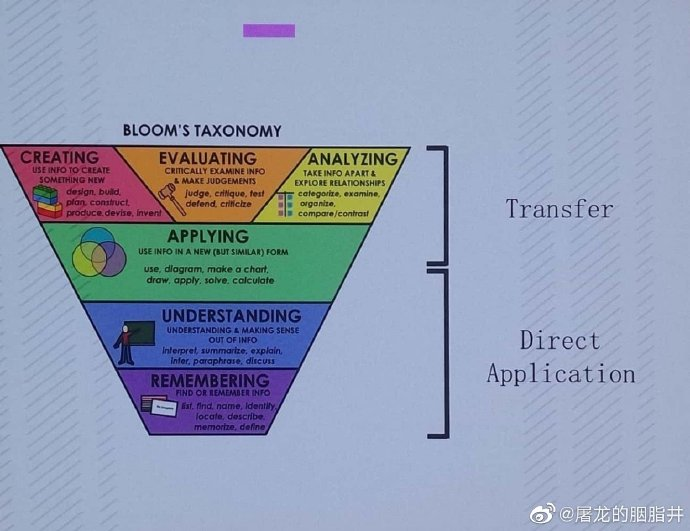
        <figcaption>Bloom 学习分类模型</figcaption>
    </figure>

最底层的是记忆，其次理解，其次是应用，最上层是创造、评估和分析

La Fin
: 法语，表示结束

> 我所有作品都是对《2001：太空漫游》的拙劣模仿。 by 刘慈欣

> 礁石暗流，永远埋在通往荣耀的路上

极限生存

> 宽容所体现出来的退让是有目的有计划的，主动权掌握在自己手中

> 允许异见，就是战略储备

    <figure align='center'>
        
        <figcaption>https://pixabay.com/photos/popeye-village-malta-architecture-4158038/</figcaption>
    </figure>

## 20190522

vscode 脑图/折叠树

妙到颠毫
: 极言其“顶级而无可比拟”的意思

出匣自鸣

群己权界论

imho
: in my humble opinion

## 20190524

> （二十岁后我）不安于当前事务，却倾心于现世光色，对于一切成例于观念皆十分怀疑，却常常为人生远景而凝眸。——沈从文《从文自传》 ​​​​

> 慷慨歌燕市，从容作楚囚。引刀成一快，不负少年头

> 徐霞客「达人所之未达，探人所之未知」





> 今日不知明日事，愁什么！
> 人世难逢开口笑，苦什么！
> 人争闲气一场空，恼什么！
> 恶人自有恶人磨，憎什么！

    <figure align='center'>
        
        <figcaption>靠天吃饭</figcaption>
    </figure>

> 刚不可久，柔不可守

## 20190525

> 浩浩乎，平沙无垠，夐不见人。河水萦带，群山纠纷。黯兮惨悴，风悲日曛。蓬断草枯，凛若霜晨。鸟飞不下，兽铤亡群。亭长告余曰：“此古战场也，常覆三军。往往鬼哭，天阴则闻。

有人借用来形容面试的惨烈。

XX 之道，不破不立

## 20190527

> 玄不救非，氪不改命

## 20190528





> 云对雨，雪对风，晚照对晴空。来鸿对去燕，宿鸟对鸣虫。三尺剑，六钧弓，岭北对江东。人间清暑殿，天上广寒宫。两岸晓烟杨柳绿，一园春雨杏花红。两鬓风霜，途次早行之客；一蓑烟雨，溪边晚钓之翁

> 女子眉纤，额下现一弯新月；男儿气壮，胸中吐万丈长虹。
> 茶对酒，赋对诗，燕子对莺儿。栽花对种竹，落絮对游丝。
> 四目颉，一足夔，鸲鹆对鹭鸶。
> 秋望佳人，目送楼头千里雁；早行远客，梦惊枕上五更鸡。

> 城对市，巷对街，破屋对空阶。桃枝对桂叶，砌蚓对墙蜗。梅可望，橘堪怀，季路对高柴。花藏沽酒市，竹映读书斋。
> 离对坎（kǎn），震对乾，一日对千年，尧（yáo）天对舜日，蜀水对秦川...梦里荣华，飘忽枕中之客；壶中日月，安闲市上之仙。

## 20190529





## 20190601

> 历史很有用处，它能训练你用长时间的眼光来看问题。
> 但我们也可以说，历史没有什么用处，因为我们永远生活在历史的一个片段里。这个片段就是我们的全部。

> 有的时候，我们一天又一天的过日子，就会产生幻觉，以为明天会跟今天一样，后天会跟明天一样。历史巨变只是写在历史书上，跟我们没有多大关系。
> 直到历史的冰面就在我们眼前炸开巨大的裂痕。



## 20190602



> I always believe that to be the best, you have to smell like the best, dress like the best, act like the best. When you throw your trash in the garbage can, it has to be better than anybody else who ever threw trash in the garbage can.

## 20190604

> Code isn’t just meant to be executed. Code is also a means of communication across a team, a way to describe to others the solution to a problem. Readable code is not a nice-to-have, it is a fundamental part of what writing code is about. This involves factoring code clearly, picking self-explanatory variable names, and inserting comments to describe anything that’s implicit.

> Ask not what your pull request can do for your next promotion, ask what your pull request can do for your users and your community. Avoid “conspicuous contribution” at all cost. Let no feature be added if it isn’t clearly helping with the purpose of your product.

> Taste applies to code, too. Taste is a constraint-satisfaction process regularized by a desire for simplicity. Keep a bias toward simplicity

> It’s okay to say no — just because someone asks for a feature doesn’t mean you should do it. Every feature has a cost that goes beyond the initial implementation: maintenance cost, documentation cost, and cognitive cost for your users. Always ask: Should we really do this? Often, the answer is simply no.

> When you say yes to a request for supporting a new use case, remember that literally adding what the user requested is often not the optimal choice. Users are focused on their own specific use case, and you must counter this with a holistic and principled vision of the whole project. Often, the right answer is to extend an existing feature.

> Invest in continuous integration and aim for full unit test coverage. Make sure you are in an environment where you can code with confidence; if that isn’t the case, start by focusing on building the right infrastructure.

> It’s okay not to plan everything in advance. Try things and see how they turn out. Revert incorrect choices early. Make sure you create an environment where that is possible.

> Good software makes hard things easy. Just because a problem looks difficult at first doesn’t mean the solution will have to be complex or hard to use. Too often, engineers go with reflex solutions that introduce undesirable complexity (Let’s use ML! Let’s build an app! Let’s add blockchain!) in situations where a far easier, though maybe less obvious, alternative is available. Before you write any code, make sure your solution of choice cannot be made any simpler. Approach everything from first principles.

> Avoid implicit rules. Implicit rules that you find yourself developing should always be made explicit and shared with others or automated. Whenever you find yourself coming up with a recurring, quasi-algorithmic workflow, you should seek to formalize it into a documented process, so that other team members will benefit from the experience. In addition, you should seek to automate in software any part of such a workflow that can be automated (e.g., correctness checks).

> Simple things should be simple, complex things should be possible.

## 20190606

> 美国人总是认为，全世界的人本性对正义的态度都一样，那些和美国对民主和自由看法不一的人，都是只是因为受了一时的蒙蔽才会站在美国的对立面。仿佛你要是把一个外国领导人带到美国来，带着他亲眼看看美国普通中产阶级的生活，他就会衷心赞赏美国价值观了似的。这让我想起来我的一个美国朋友，他坚信世界上没有英国口音这回事，英国口音都是英国人故意装出来气美国人的。如果你半夜潜入一个英国人家里，在他完全没有防备的时候把他忽然叫醒，他就会像个正常人一样好好说话了

## 20190608

## 20190610

> 顺势而举易为力，背时而动难为功

## 20190611

> 喜欢这事很男女有别，它往往让女孩变得勇敢，而让男孩别的胆怯。

## 20190611

> 春日春风有时好，春日春风有时恶
> 不得春风花不开，花开又被风吹落
> 从来天道岂痴聋，好丑难逃久照中
> 说好劝人归善道，算来修德积阴功

## 20190613

> 看不到行业更加厉害的人的存在，看不到滚滚前进的时代车轮，很容易让自己蜜汁自信

[雄文： 技术性短视](https://zhuanlan.zhihu.com/p/45126058)

> 任何时候都要担当，并往前再多想一步

> 皮实一点，帮团队承担更多

> 一力降十会

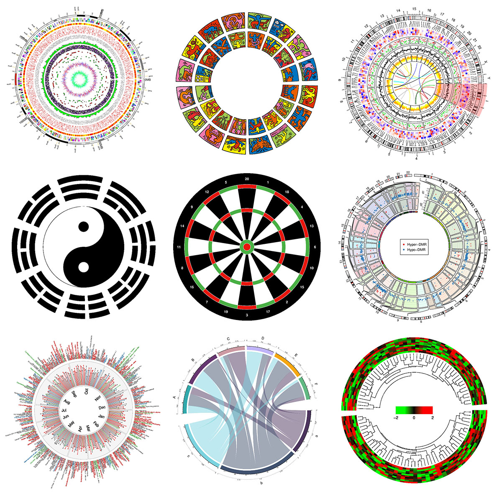

精致的利己主义者和常青藤的绵羊

## 20190615

    <figure align='center'>
        
        <figcaption>马背上的Godiva夫人</figcaption>
    </figure>

考文垂市的城市名片

> 如果你在当月最热闹的集市日里，赤身裸体地穿过考文垂市最繁华的街道，那我就给你心爱的人民减税

有一名叫汤姆的裁缝在窗后偷窥，结果被雷电击瞎了双眼。这也是英语中偷窥狂（Peeping Tom）一词的由来

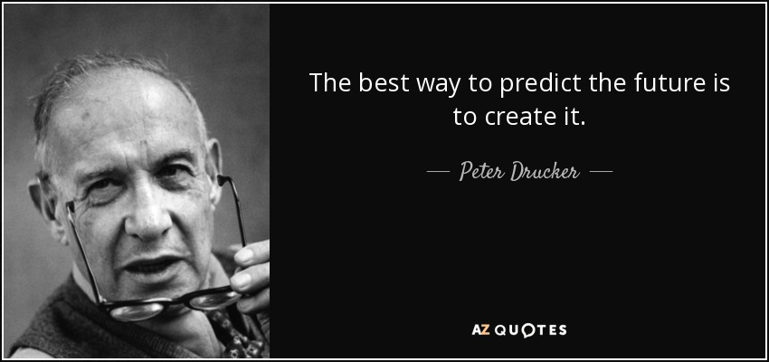

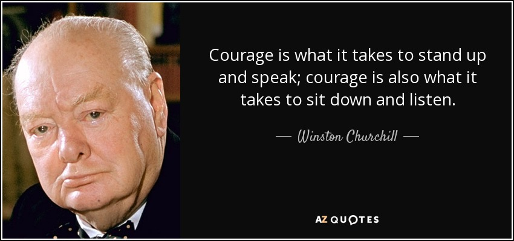

## 20190615

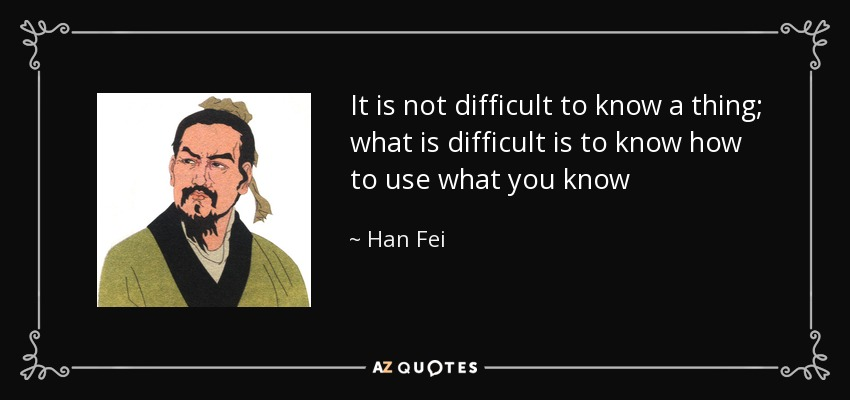

> 很长一段时间，我的生活看似马上就要开始了。但是总有一些障碍阻挡着，有些事得先解决，有些工作还有待完成，时间貌似不够用，还有一笔债务要去付清，然后生活就会开始。最后我终于明白，这些障碍，正是我的生活。

> 叔叔一直对水生说：“水生，吃饭不要吃全饱，留个三成饥，穿衣不要穿全暖，留个三分寒。这点饥寒就是你的家底，以后你饿了就不会觉得太饿，冷了就不会觉得太冷。”水生后来到工厂里，听到到师傅说的，老工人待在厂里很健康，退休就会生癌。他想，工厂里的这点毒，也是家底。

> 活到三十岁，人就会荒凉起来

> 他行走天涯，逐渐了解汽船的忧郁，在帐篷中清冷地醒过来的滋味

> 一位画家在一个画廊卖画。 一天他问画廊老板画卖得怎样。 “有一个好消息也有一个坏消息，” 老板答道， “好消息是有位客人问我你的画在你死后会不会升值， 我说会， 于是他把你的所有画都买了。” “这太好了！” 画家兴奋地说， “那坏消息呢？” “那位客人是你的医生” 老板答

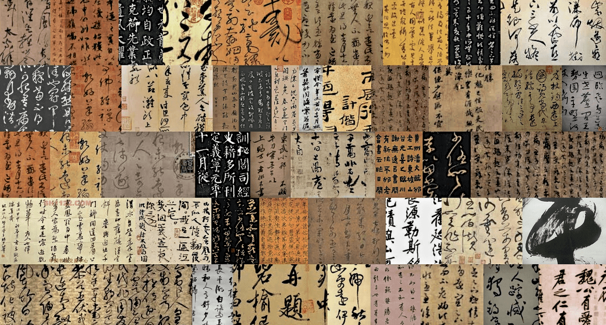

YoY(Year-on-year percentage)

> 要跳出舒适区。勤奋本来就是舒适区的一种

## 20190618

出差到上海。

> 绩效使能

OKR VS. KPI
前者是目标管理方法，后者是绩效管理方法

> 你傻呀，我自己开保时捷，不就看不见保时捷了吗？
> --- 北野武

北野武 真的很有意思

> 虽然辛苦，我还是会选择那种滚烫得人生

## 20190620

## 20190621

拉斯普廷

## 20190622

> 简约不是少，而是没有多余

> 一个莫斯科市民的鹦鹉丢了。这是只会骂人的鹦鹉，要是落到克格勃的手里可糟了。这人便在报纸上发表了一篇声明：“本人遗失鹦鹉一只，另外，本人不同意它的政治观点。”

> 傅里叶级数和傅里叶变换，表明时域的信号可以分解为不同频率的正弦波的叠加。而如果我们把两个没有公共频率成分的信号相加，一同发送。在接收端接收到之后，用滤波器把两个信号分开，就可以还原出发送的两个信号。这就是通信过程的实质。

> 形势比人强。

> 结硬寨，打呆仗

> 人生发财靠康波。

康波
: 康德拉季耶夫长波周期的缩写，一般认为长达 50-60 年

> 历史不会重复自己，但会压着同样的韵脚

> 没有成功的企业，只有时代的企业
> by 张瑞敏

> Justice delayed is justice denied

## 20190623

形容人大腿，特别粗的那种： 拔一根腿毛下来都能把你勒死

> 千里烟波浔阳江，多少尸骨暗中藏
> 路遇不平停车驻，弃了篷篙换青衫
> 庶民行恶为斗米，庙堂只念头顶冠
> 王侯不问百姓苦，唯我匹夫叹兴旺

## 20190625

2018 年诺贝尔生理学和医学奖授予日本免疫学家**本庶佑**和美国免疫学家詹姆斯·艾利森

> 研究者最大的乐趣，打个比喻来说，就是发现其他所有人都视而不见的小涌泉，把它培养成小河，再拓宽成大河。或者说，就像是闯入深山，在无路处开出一条路，第一个在那里搭起了一根独木桥，而绝不是把别人已经搭好的独木桥改建为钢筋水泥筑成的大桥

## 20190626

> 可以说，物质欲望带来的满足感仅建立在其未得到满足的阶段，一旦这种欲望得到了实现，那么在这一瞬间，满足感就会马上消失，人们就被这种极端讽刺的机制玩弄于股掌之中。

> 从古到今，想做名士，不必有奇才，只须三样：常无事，痛饮酒，熟读《离骚》

## 20190628

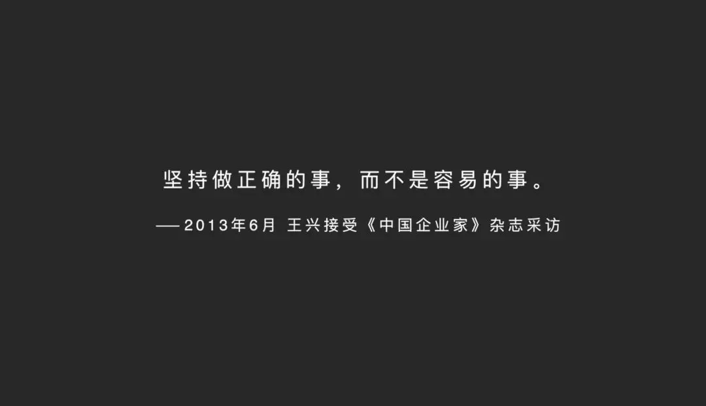

> 成功不必在我，而功力必不唐捐

## 20190629

叉手礼

> 得亏你妈当年把你生在了北京。
> 要是把你生在上海，
> 今天都不知道把你往哪个垃圾桶里放

## 20190630

> 重复是有力量的

## 20190702

成事借事修人

深淘滩，低作堰

## 20190706

## 20190707

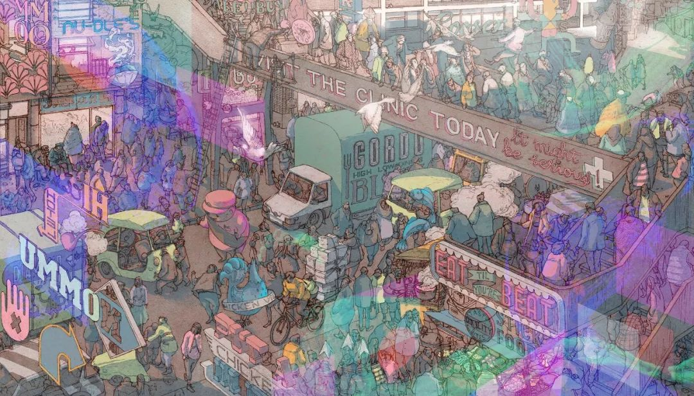

## 20190708

> 另外一点是模型的成熟和开源，这对于深度学习阶段尤其重要，因为在统计学习阶段模型也是开放的，但是这个阶段算法的核心不在模型，而在模型里使用的特征，特征工程是当时的核心。到了深度学习，情况发生了改变，因为深度学习的核心就是模型，模型能够抽取特征，能够很快地在分类、推荐、预测得到应用。

## 20190711

瑞思拜 网络流行词，是 respect 音译，是尊重的意思

## 20190712

> 连雨不知春去，一晴方觉夏深

## 20190718

NeuralLink 马斯克的脑机接口公司

## 20190721

> 对于数论学家来讲，有两个宇宙，在第一个宇宙里，不存在朗道-西格尔零点，但在第二个宇宙里，有此零点.
> 我们的困惑是，并不知道我们到底生活在哪个宇宙里面。 - 张益唐

## 20190722

> 战场上活下来的，不是枪法最好的人

> 抛开那些外部条件，我们的核心优势是什么？

> 不要只盯着眼前的一地鸡毛

> 心善刀快

## 20190725

> 你问我有哪些进步？我开始成为我自己的朋友。——阿兰·德波顿 ​​​​

## 20190727

[两页证明解决困扰 30 年的问题](https://www.quantamagazine.org/mathematician-solves-computer-science-conjecture-in-two-pages-20190725/)

对一个输入为一串 01 的逻辑函数，对其中一位做多少位扰动，输出就会发生变化？

idempotent
: 幂等的

## 20190731

`Living Proof` ： 即使对知名的数学家，数学也并非那么简单。
在数学方面有所成功需要具备的特质： **embrace the struggle**

数学的一个特点： 在理解之路上会特别痛苦，但是当你理解了之后，结论如此自然，以至于不能理解之前为何会经历如此之大的困难。

没有天生的数学人

> There are no `math people`. mathematical thinking is a fundamental part of every human’s intellectual capacity. The people we label `good at math` are simply those who have taken the time and trouble to engage the struggle more deeply than others.

> Belonging is a fundamental human need. The mathematical community has neglected that need too often, for too long, for too many people

`I'm on the struggle bus today`

## 20190802

> 读 喉，舌，齿，唇的位置，汉语真博大精深。

top-down 的思维有时候是看不到那些不存在的机会的

## 20190803

> 张家长，李家短，仨蛤蟆五只眼

毕飞宇，被誉为“写女性心理最好的男作家”

> 骆驼见了柳，蒙古人见了酒

拔丝羊尾

## 20190804

[辉格](https://tcya.xyz/2017/08/05/whig.html)

[乳房之谜](https://headsalon.org/archives/5073.html)

黄章晋：辉格式“民科”，让我对他黑转粉

野生学者

请回答：为什么非洲大草原的野生动物没有被人吃光？

1. 畜牧业的发展是家畜挤占野生动物生态位的过程，畜牧业在欧亚大陆首先出现，时间更长
2. 非洲畜牧者没有马，徒步游牧，畜牧规模有限

> 不管是什么专业，不管是建筑、IT、计算机、法律，在我看来只要受过严格的大学教育再读三年研究生，搞一个和你读的专业没有关系的领域，我不认为是民。，因为他们在四年或者七年中找到了基本认识事物的方法。他用眼镜，我用工具，你不会拿一双筷子去砍树——“民科”经常是会拿一双筷子去砍树——如果不知道矩是砍树最好的工具，至少会拿一个铁片。所以有没有受过这个教育非常重要。

夜露死苦： 请多关照

通常称为物质的原子只不过仅仅占宇宙整体的 4.4%
原子以外，宇宙剩下的 95%是什么呢？
22%是被称为暗物质的谜一样的物质，质量约为具有目前所能够观测到的普通物质质量的 5 倍，它们也是宇宙形成的源头。即，宇宙大爆炸后形成暗物质，暗物质彼此聚集，其引力将普通的原子拽入其中，从而形成恒星，进而成长为星系。恒星是生命之源，所以，如果没有形成恒星的暗物质，我们就都不会存在。
暗物质是不会与普通的物质发生反应的
73%是“暗能量”

在宇宙之中，恒星与星系也只仅仅占 0.5%

## 20190807

- 如果在规则下能够赢，那么美国就会强调规则。
- 如果规则有一些空子可以钻，来带来竞争优势，美国就会钻空子。在本书中介绍的就是美国利用《反海外腐败法》来打压国外的公司。
- 如果规则没有空子可以钻，那美国就会宣布退出这个规则。最近川普退出了很多规则，比如退出了军事上的《中导条约》。去年，美国还退出了《伊朗核协议》、联合国人权理事会、联合国教科文组织。美国还威胁退出 WTO。

**长臂管辖**

**辩诉交易**

## 20190808

> Never go to sea with two chonometers; take one or three.

## 20190812

[人性化机器智能](https://hmi.anu.edu.au/)

## 20190813

> 凡人做一事，便须全副精神注在此一事，首尾不懈，不可见异思迁，做这样，想那样，坐这山，望那山。人而无恒，终身一无所成。

## 20190815

> 我的和蔼可亲，彬彬有礼，并不是为对方着想，而是守护自己的铠甲。 ——山本文绪 ​​​​

## 20190817

> 高而不危，满而不溢。骄淫矜侉，将由恶终。
> 太强必折，太张必缺。山峭者崩，泽满者溢

## 20190818

> “输在起跑线上”的恐惧，让中国父母的脑子里充满了“学区房”，“排名”，“升学率”之类的概念，却没有人真的理解“教育”到底是什么。他们没有明白，小孩子的教育最重要的不是所谓“知识”。他们不理解小学，中学学到的那些东西是多么的肤浅，各种奇技淫巧而已。上了大学那些东西基本上全部要被抛弃，从头来一遍。 - 王垠

## 20190826

> 哪有什么所谓错过的机会，那本来就不是你的机会

[我和父亲相依为命的时光](https://www.douban.com/note/699073452/)
好喜欢这种平淡的文风

> 让 80%的人做到最优秀的那个人的 80%

## 20190827

> 伸手摘星，即使徒劳无功，亦不至一手污泥

> 战略竞争力量不应过多消耗在非战略目标上的

## 20190904

IQR = Q3 − Q1

## 20190908

绵羊与山羊虽然同称为羊，但他们是同科而不同属的动物，绵羊和山羊之间不能交配产羔(绵羊有 27 对染色体，山羊有 30 对染色体)

## 20190911

2018 年，互联网流量，人类真实流量占比 60%左右，剩下的 40%中，恶意机器流量和真实机器流量各占一半。

## 20191012

> I don't know where the limits are, but i would like to go there - 基普乔格 (男子马拉松首次进入 2 小时)

## 20191019

> 年收入增长率 + 营业利润率 应该等于 40％

## 20191020

> 但凡要饭的，没有要早饭的，因为他要是能早起，就不至于要饭

第一次看到一个词叫「宽油」

> 耶稣说：“你们要走窄门。”他告诉我们，“因为引到灭亡，那门是宽的， 路是大的，去的人也多。引到永生，那门是窄的，路是小的， 找着的人也少。”

## 20191021

上帝视角 数据迷雾 行动罗盘 价值天平

## 20191023

> 威仪共秉周家礼，学问同遵孔氏书

倒霉的墨西哥，离上帝太远，离美国太近

## 20191024

凡第二次犯错者，必有第三次

## 20190125

严格的基于本体论的分类，例如： 女装下分裤子、连衣裙，然后再往下分；但其实很难做到不重不漏。因为事物往往存在多面性。另外一种分类的思路： 按照场景自动分（连分类的文本描述都自动生成）

从 query 中挑选一个最合适的作为该分类的描述，如何挑选？

## 20191028

不要将新事物和重要的事物混为一谈

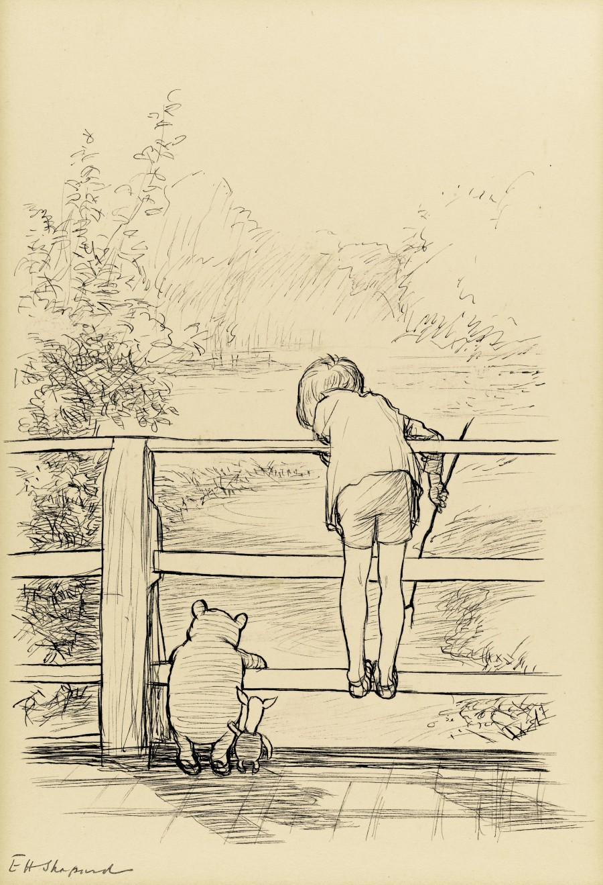

## 20191030

    全局意味着要有整体思维，从团队、从整条生产链路来思考。

    现在市面上很多媒体，过分强调个人或单个环节，导致人们普遍过分关注局部，而忽略了整体。

    比如有很多开发技术方面的“练级攻略”，给人一种错觉，似乎掌握了这些技术，就能横扫江湖，走向巅峰。但其实开发只是软件工程的一个环节罢了，如果不能掌握整体，在局部再登峰造极，也会有捉襟见肘的时候。

    再比如某些教程，说是“教你从0到1开发一个APP”，但其实也只是聚焦在开发领域，也只是能在自己的机器上构建一个APP，安装在自己手机里而已。真正要上线到生产，让别人也能安装使用，同时保持后续的更新迭代，前前后后还有很多内容要涉及，并不是学了教程，开发好了，就完事了。

    使用全局的思维来看待这些事情，这样才能看得更清楚、更透彻。

[年中杂想](https://segmentfault.com/a/1190000019576620)

DevOps（研发运维一体化）

## 20191031

Root Cause Analysis

根因分析

用户隐式反馈中的 _选择偏差_（selection bias），具体来说比如用户点击观看视频仅仅是因为它位置比较靠前，而非用户真正喜欢。因此用当前系统收集到的数据训练出来的模型会引发 bias，从而形成一个反馈循环，越来越偏

Google 2019 视频推荐论文：
将需要学习的多目标分为参与度和满意度两类， 学习 engagement 的 main tower；以及学习 selection bias 的 shallow tower

## 20191104

具有百折不挠精神，该攻下来的山头不管怎样都能攻下来。

> 平时则放荡冶游，考试则熟读讲义，不问学问之有无，惟争分数之多寡；试验既终，书籍束之高阁，毫不过问，敷衍三四年，潦草塞责，文凭到手，即可借此活动于社会，岂非与求学初衷大相背驰乎？光阴虚度，学问毫无，是自误也。
> --- 蔡元培

> 什么是基本功？不是那些高大上、新潮的技术、框架，而是我们每天要做的很基础的事情。比如：快捷键是否熟悉，测试习惯好不好，代码干不干净，打字速度有多快等等，这些问题是真正影响开发效率的，甚至影响着整个项目成败的。

## 20191105

surplus 剩余

## 20191109

走出半生，归来全熟

## 20191113

> 今天的现实社会，一切观点都渐渐要通过娱乐的方式出现和传播才有效果，这不仅仅是一种技术手段，它已经成了一种文化，甚至是这个时代的精神产物

> 凤凰网财经的一篇关于扇贝跑路的文章，文中提到：根据中国现行的《证券法》，对于财务造假的上市公司——例如三年来通过各种造假手段虚增利润 119 亿的康德新，法律规定的最高罚款额度是 60 万元

## 20191114

偶然发现 `Narrowest-over-threshold detection of multiple change points and change-point-like features` 这篇论文中引用了我在 14 年帮邹老师的论文写得 R 包 nmcdr, 论文中有我的网名 lancezhange，哈哈哈

然而遗憾的是，这个包已经不能在 CRAN 上下载了，`Archived on 2017-04-24 as check errors were not corrected despite reminders.` 真是惭愧。 我做事真是有头无尾的居多。

## 20191117

> 知识既传播了真理也传播了谬误，历史学科尤其如此。应该关注孩子是否习惯在事实不全面的情况下悬置判断，是否学会了寻找全面对称的信息，是否能做到观点之前有事实、观点与观点之间有逻辑

## 20191120

> 狂者进取，狷者有所不为也

## 20191123

黎巴嫩首都贝鲁特，环卫工人罢工，垃圾无人清理

[特别炫酷的 3d 网站](https://bruno-simon.com/)

> 做你自己，因为别人都有人做了

[一个很帅的粒子图](http://shrekshao.github.io/)

## 20191124

Coattail effect
裙摆效应、燕尾服效应

jumping on the bandwagon 跳上花车（享受音乐而不用走路），比喻搭便车

## 20191129

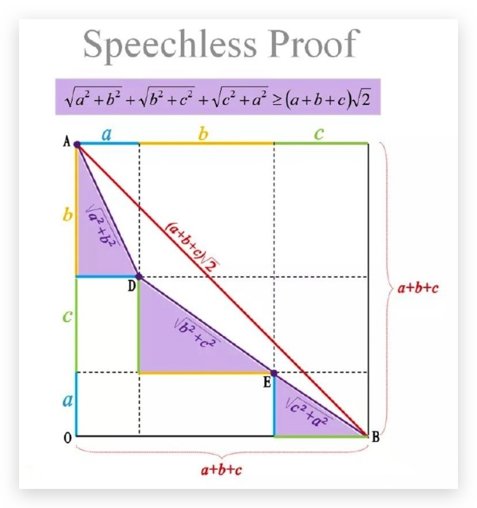

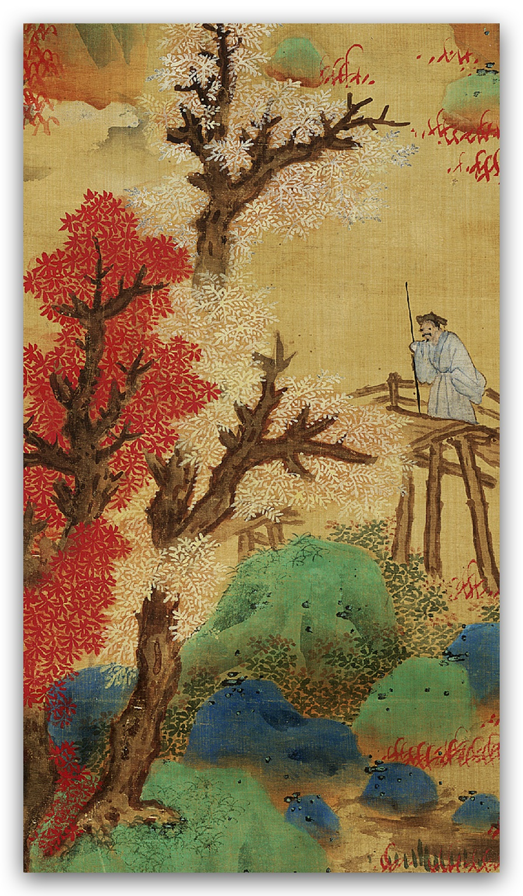

## 20191130

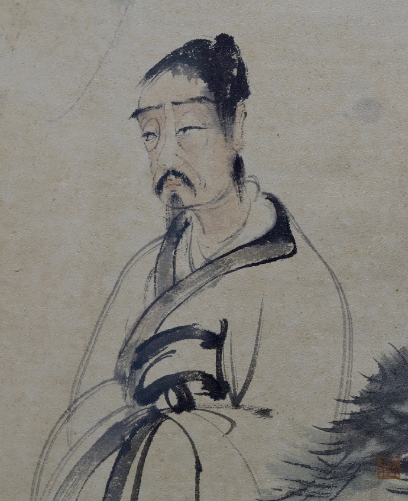

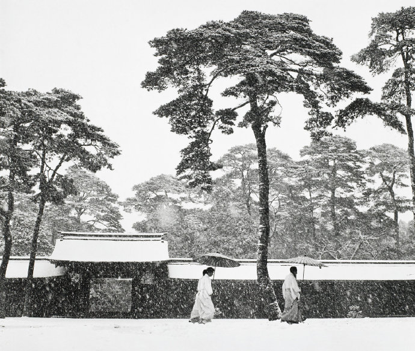

## 20191201

> 扩大自己的眼界，开放自己的内心

> If not now，when? If notme, who? （此时此刻，非我莫属）

> 今天最好的表现是明天最低的要求

## 20191202

混合精度计算

## 20191204

> 大象踩你一脚，你可以踩回去。

## 20191207

> 莫思身外无穷事，且尽生前有限杯

## 20191208

> 为什么那么多有钱人宁愿花上万养宠物，而不愿意资助山区孩子上学?

你跟你周边的人与事融合为难解难分的命运
有些事情只可感召无可谴责

> 得之偶然间，失之亦草草
> 顾我行囊中，何物随人老

> 我深切体会，语言的粗糙、劣化，最终将导致生活各个方面的粗糙和劣化，文学正是对此趋势的一种抵抗，哪怕是反熵、是抵挡太平洋的堤坝，也得有人去做。同时，我们做出版，不能总是靠利用人性的弱点去发大财，而是要去认识、弥补和克服这些人性的弱点，这才是我们的天职所在。我们或许是夕阳产业的弱势群体，但同时也是文化的守护者和创造者。据说，维特根斯坦晚年，常面对墙壁朗读一本小说里这样一段话：落日的余晖照耀着他那仍然坚定而安详的脸庞，它似乎要证明，直到最后他都做得对，他像一位英雄一样地守住了阵地。

> 我不能再劝自己说还没有准备好动笔，因为如果说到现在我都还不能就对自己而言很重要的事情下定决心的话，将来我会这样做的可能性也不大。我很高兴最终能将长时间在意识的不同层面中漂浮的所有这些想法收集起来。它们一旦写成，我也就结束了和它们的纠葛；我的思绪可以自由地装载其他事物。

> 文章做到极处，无有他奇，只是恰好；人品做到极处，无有他异，只是本然

## 20191209

培养辩论能力，取代‘忍吵闹’

> 辩论确实是现代文明社会最重要的技能。不会辩论，导致在意见分歧初期（最佳切入时机）因自卑畏惧而沉默；然后在后期完全被动时，引发激愤开始反击（此时情绪表露而看起来像“吵”）；最后完全输掉后，又坚持不接受结果（看起来就是“闹”）

## 20191216

边界感强，俗称：有分寸

## 20191217

ACNet:Strengthening the Kernel Skeletons for Powerful CNN via Asymmetric ConvolutionBlocks
提出了非对称卷积块(ACB)，它是用三个并行的 d\*d, 1\*d, d\*1 核来代替原始的 d\*d 核, 将每个方形卷积核替换为 ACB 模块

3x3 卷积+1x3 卷积+3x1 卷积==没有推理开销，却能提升性能

## 20191221

> 在民法慈母般的目光中，每一位公民都是整个国家 - 孟德斯鸠

> 已讶衾枕冷，复见窗户明。
> 夜深知雪重，时闻折竹声。

    --- 白居易《夜雪》

> 醉后不知天在水，满船清梦压星河

唐珙(字温如)

> 从童年起，我便独自一人
> 照顾着
> 历代的星辰

> 在白天我什么都不是，在夜晚才成为我自己 - 佩索阿

当代人的孤独

> 凌晨三点
> 手机剩下百分之五的电
> 我等自己和手机一起
> 自动关机

郭永章，民间坠子大师。

## 20191224

> 使人有面前之誉，不若使人无背后之毁。
> 使人有乍交之欢，不若使人无久处之厌。

## 20191227

> 水来，我在水中等你，火来，我在灰烬中等你

把一首
在抽屉里锁了三十年的情诗
投入火中

字
被烧得吱吱大叫
灰烬一言不发
它相信
总有一天
那人将在风中读到

- 洛夫 《诗的葬礼》

## 20191228

最近，民航医院的医生被患者家属割喉。

这个事件的可怕在于，它甚至不是医患的激烈冲突，没有一般冲突之前的争执、口角、推搡等，而是在平静的交谈过程中即被割喉。是为谋杀。此为其一。

其二在于周边人的冷漠。
昨日早上，路遇有一女士骑着电摩在路上摔倒，我从远处看见，旁边路过的众人（都是如我一般上班的年轻人）毫无反应，最后还是我跑过去将其车扶起。

网络上群情激奋，但我的朋友圈倒没有几人转发（不意味着不关注）。妻子因为是医务工作者，因此，她的朋友圈里有关这个事件的消息几乎是刷屏的。

前些日子因便血去中日医院，一个年龄比我大不了几岁的女医生为我指诊。生平第一次，我害羞难当。从此对医生更觉尊敬，也因此，更觉杀医者的残暴禽兽。

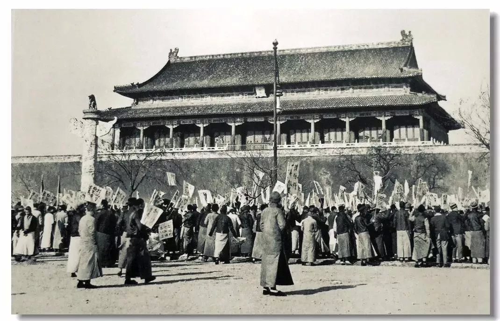

> 如果每天早上醒来之后所做的第一件事是吃掉一只青蛙的话，接下来的一天当中，还有什么比这个更糟呢

> 看人要往人皮底下看一层。比如吻技好的人不一定经验丰富，有可能是天赋。但能做出【她的吻技好】这个判断的人，肯定经验丰富。读一个人，不要读他的表面行为，要学会读他的底层逻辑。

> 如果你看到一条蛇，不要打电话给管理委员会，不要打电话给朋友，不要组建一个团队，不要召开会议，你要做的就是杀死蛇

> 急事慢做，手紧心松。

## 20191229

篾片
: 豪门富家帮闲的清客

风流云散怪现状收场。

> 老天爷，你耳又聋来眼又花，
> 你看不见人，听不进话。
> 杀人放火者享着荣华，
> 吃素念经的活活饿杀。
> 老天爷，你不会做天，
> 你塌了吧！你塌了吧！

> 偶遇的饭局，无论别人怎么邀请，都不要去。

> 彼时我已陡然开悟，明白人生和世事大抵如此，靠近了，都不壮观。

## 20191231

> 孤独和抑郁的关系就好像游泳和溺水
