[TOC]

## 20200101

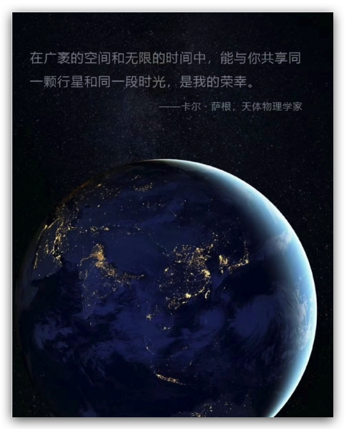

## 20200103

> 很长一段时间，我的生活看似马上就要开始了。但是总有一些障碍阻挡着，有些事得先解决，有些工作还有待完成，时间貌似不够用，还有一笔债务要去付清，然后生活就会开始。最后我终于明白，这些障碍，正是我的生活。

> 我想，文学能让我们意识到自己的匮乏，还有生活中那些已经削弱我们并正在让我们气喘吁吁的东西。文学能够让我们明白，像一个人一样活着并非易事

> 不要认为新闻正在远离我们。传送媒介从纸张变成电脑，记者被重新命名为内容提供者。受欢迎的出版物会流行，真人秀会兴旺，但是好奇心、充满活力的研究、敏锐的分析和雅致的文风永远不会过时。如果说有什么区别，那就是它们越稀有，这些特性越弥足珍惜

> 我目送出租车消失。我回到台阶上，走进浴室，把床铺整个弄乱重新铺。其中一个枕头上有一根浅黑色长发。我的胃里好象沉着一块重重的铅。法国人有一句话形容那种感觉--那些杂种们对任何事都有个说法，而且永远是对的。告别就是死亡一点点

> 我在想，要是有人对我说，这生活，连同它的爱、它对真理和幸福的渴望与追求，还有这夜间的闪光和远方哗哗的流水声，都是没有意思，没有意义的。不管是谁这么说，我永远都不会相信。

> 我的确成了一个猎人，尽管是不同意义上的猎人：我狩猎的目标是整个看不见的世界，而且我倾尽一生，在词语里试图捕捉这个世界，用词语击中它

> 我们写作，是为了品尝生活两次

## 20200104

> 艺术之所以存在，就是为使人恢复对生活的感觉，就是使人感受事物，使石头显出石头的质感

> 花半秒钟就看透事物本质的人和花一辈子都看不清的人，注定是截然不同的命运。

发现有一些句子结尾是一个`(雾)`，原来是误的含义。

弄瓦之喜，辉增彩悦

抱看玉骨亭亭。精神秋水分明。自是人间英物，不须更试啼声。

> 记当初归我，似德耀、嫁梁鸿。
> 算三十年间，艰难历遍，甘苦相同。
> 新来有孙可抱，也添些、喜色到眉峰。
> 今日又逢生日，不妨樽酒从容
> 老翁。
> 只是一村农。
> 欠你孺人封。
> 幸儿渐知耕，妇能知织，莫问穷通。
> 君看世间富贵，比浮云、缥缈过晴空。
> 何似大家清健，玉林岁岁春风。

天仙送子喜弄瓦，羡尔明珠掌上光

喜得宁馨，彩褓凝祥！

> 诗是一种韵律和韵律之间的吻合，外部的韵律，和你内心的韵律，在某一个平凡的瞬间，严丝合缝地扣了起来，就像左手和右手握到了一起

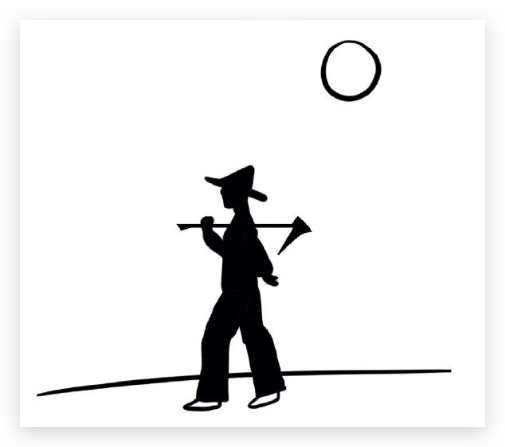

唱见： 翻唱歌手

## 20200106

> 我要做远方的忠诚的儿子和物质的短暂情人

请示工作说方案；布置工作说标准；汇报工作说结果；总结工作说流程；回顾工作说感受

## 20200115

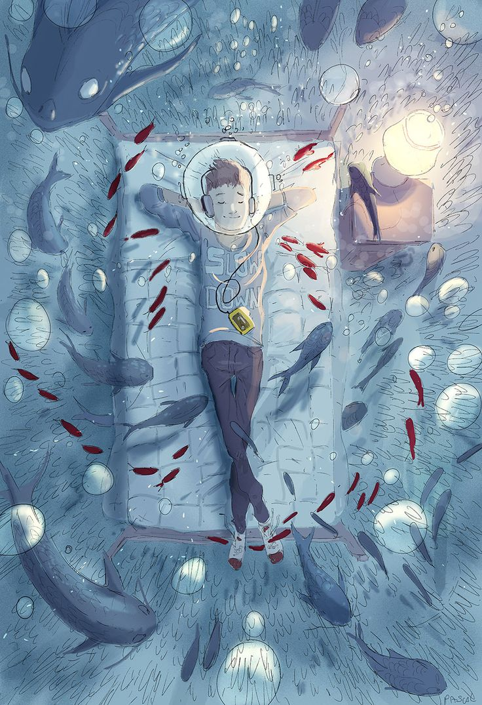

## 20200118

> 速胜论和投降论都是一伙人，又没脑子又没勇气

## 20200119

> 未来汽车产业的核心价值将不再是发动机、车身、底盘，而是电池、芯片、车载系统、数据

## 20200120

> 他们分手了。葛利高里的嘴唇上留下了她的嘴唇的诱人的气味，像是冬天的风，又像是从遥远的草原上吹来的，几乎闻不出的，被五月的雨淋过的干草气味。
> М. А. 肖洛霍夫《静静的顿河》
> 金人丨译

## 20200122

> 对任何系统，都要经历这三个阶段，解释、预测、控制

## 20200128

R.I.P : Rest in Peace

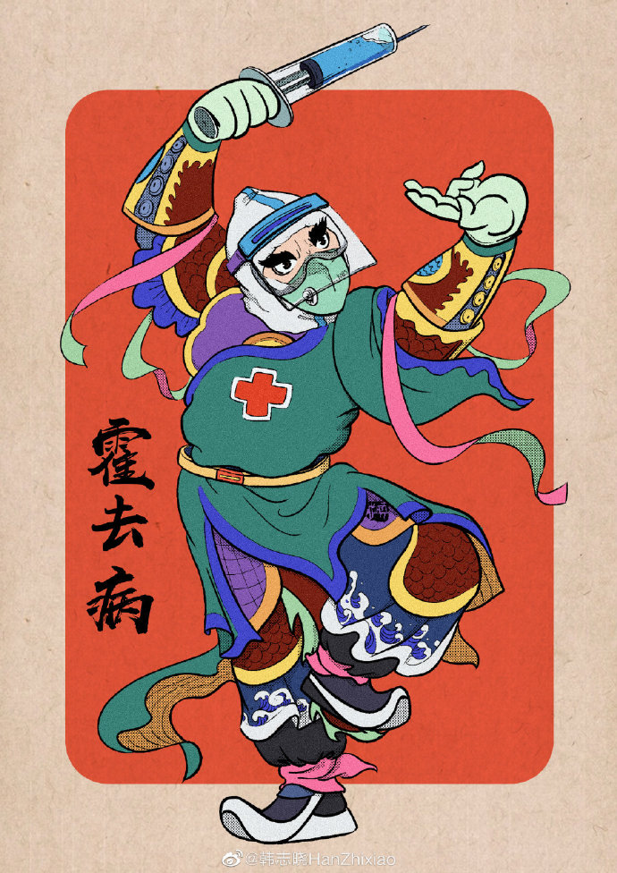

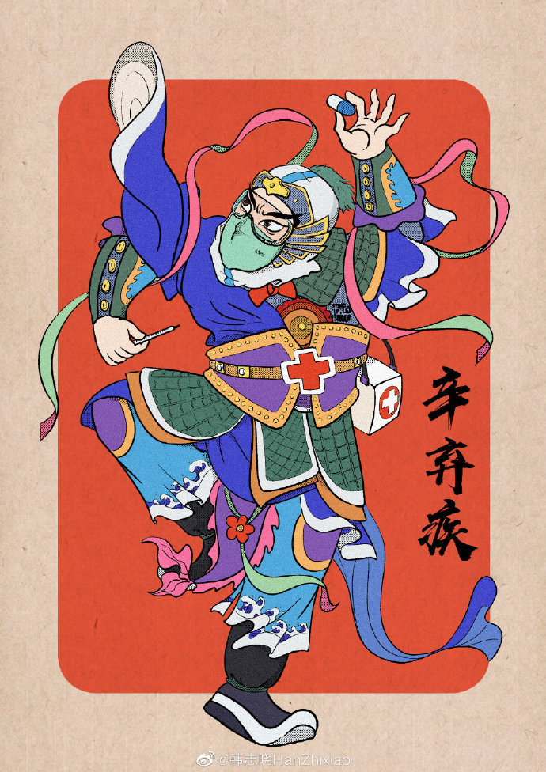

## 20200129

> 人在爱欲之中，独生独死，独去独来，苦乐自当，无有代者。

## 20200130

> 灾难并不是死了两万人这样一件事，而是死了一个人这件事，发生了两万次

> 山川异域，风月同天，寄诸佛子，共结来缘

## 20200201

> 我们紧闭着双眼，
> 饮啜人生的酒盏，
> 却用自己的泪水，
> 沾湿了它的金边；
>
> 待到蒙眼的遮带，
> 临终前落下眼帘，
> 诱惑过我们的一切，
> 随遮带消逝如烟；
>
> 这时我们才看清；
> 金盏本是空空，
> 它盛过美酒——幻想，
> 但不归我们享用！
>
> М. Ю. 莱蒙托夫《人生的酒盏》
> 顾蕴璞丨译

## 20200203

> 「创造美好」比「维持现状」困难一百倍，比「混日子」困难一万倍。

> 政府请客，企业买单。

> 救民先救官，官都救不了，还救什么民？ - 和珅（电视剧版）

> 不管你内心有多少愤怒和呐喊，但在投资这个战场，一定要有长期乐观主义精神，并且避免犯下面三个错误：把节奏问题当结构问题、把周期问题当趋势问题、把局部问题当普遍问题。避不开这三点，市场的大部分丰厚回报就会与你无关。高瓴张磊讲的一句话我特别赞同：“在中国做投资，不适合意志薄弱的人。”

> 远离哪些小肚鸡肠计较算计的人，人一辈子时间和精力都有限，做有意义的事

## 20200204

今日立春

> 他强由他强，清风拂山岗；他横由他横，明月照大江

## 20200205

其实在现代医学的关照下，霍乱的病死率只有 1%，但为何还作为甲类传染病（甲类中还有一个是鼠疫，其他没了）呢？
一个可能的原因： 水是霍乱最重要的传播途径，通过污染水网和饮用水，霍乱弧菌能实现极为迅速的传播，进而造成对公共和社会资源的挤兑。

> 在短期内迅速出现成千上万的的病患，短时间内对医疗物资、清洁水源以及医疗人员、救治场所等救援力量的需求，出现爆炸式增长，基本上都会直接瘫痪这个地区的应急能力。
> 在前现代社会比如古代印度，这完全无解，随之而来的就是社会秩序的崩溃，造成更多的死亡。即使现代社会也需要从外地调集极大力量的资源。

## 20200206

正月十三了，后天周六，上元节

> Now this is not the end. It is not even the beginning of the end. But it is, perhaps, the end of the beginning

> 多数人为了逃避真正的思考是愿意做任何事情的

> 严谨的逻辑，敏锐的洞察，丰富的经验，对经济、商业、人性的深刻全面的理解

淝水之战
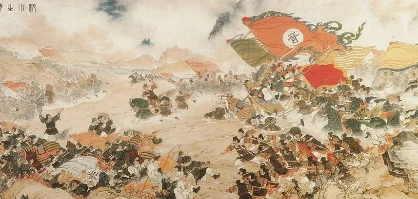

[Visualizing 150000 butterflies from the Natural History Museum](https://marian42.de/article/butterflies/)
太喜欢动手能力这么强悍的人了！

## 20200207

> 直如弦，死道边。
> 曲如钩，反封侯。

> 村上春树：“在一堵坚硬的高墙和一只撞向它的蛋之间，我会永远站在蛋这一边。”

## 20200209

流感和感冒完全是两个事情。

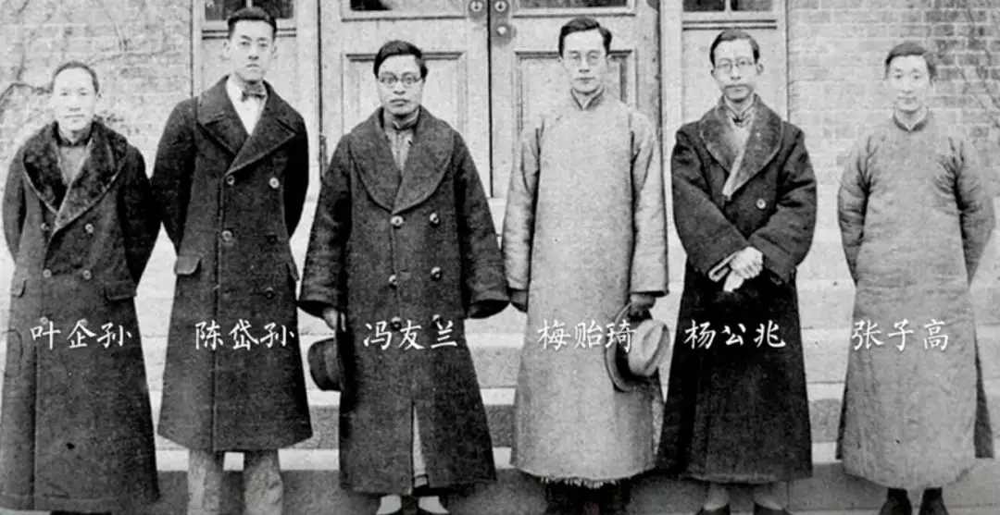

    <figure align='center'>
        
        <figcaption>中田英寿</figcaption>
    </figure>

> 如果你不了解，你就不会欣赏它们

> 二十年前，如果一个人红到极致，那么他的脸会被印到脸盆上。二十年后，爆红的标志变得简单，三个字，上春晚。

快 30 岁的时候，我迫切地想知道人生当中还有什么新鲜的东西。

> “废土”是一种隐喻: 当政权已经崩溃,军队已被打散,法律已成废纸,信仰已被颠覆……我们可以说,人间已为“废土”。废土世界是摧毁一切旧标准的地狱,没有人在意善恶的区别,没有人理会对错的意义……在废土的世界,只有生存才是真理。一切都仿佛回到了蛮荒时代,为了生存!

## 20200210

> 村骗乡、乡骗县、一直骗到国务院。国务院下文件，一层一层往下念，念完文件进饭店，文件根本不兑现

盎司既是重量单位又是容量单位。
1 盎司大约是 28 克。国际金价大约在 1600 美元一盎司的水平。

In the not-so-distant past 在并不遥远的过去

> A 股在政府换届时期上涨概率 100%

2003 年，市场上“号令武林”的龙头就是长安汽车、上海汽车。

## 20200211

> 我说另请高明吧，我也不是谦虚

乐播投屏

> 时代的一粒灰，落在个人头上，就是一座山

> 这一切里面并不存在英雄主义，这只是诚实的问题。与鼠疫斗争的唯一方式，只能是诚实

## 20200212

> 价格是传递信息的工具

下楼去小区门口拿买的菜，媳妇叮嘱了我好几句

<table>
    <tr>
        <td >
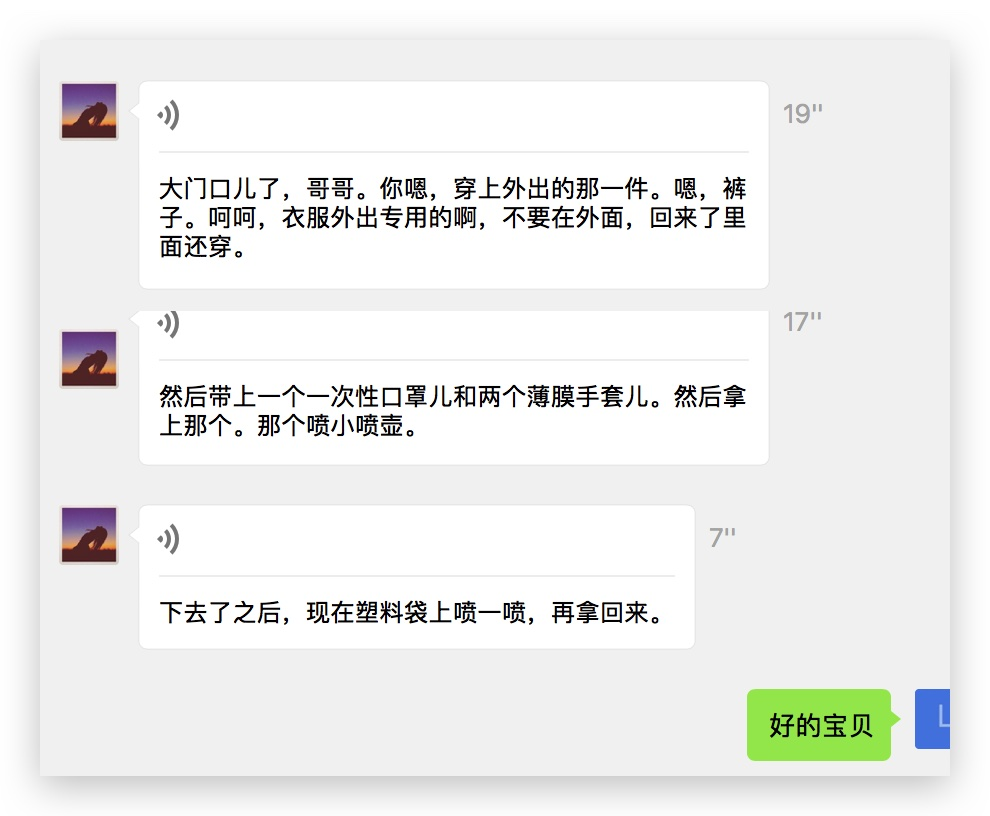
</td>
        <td >
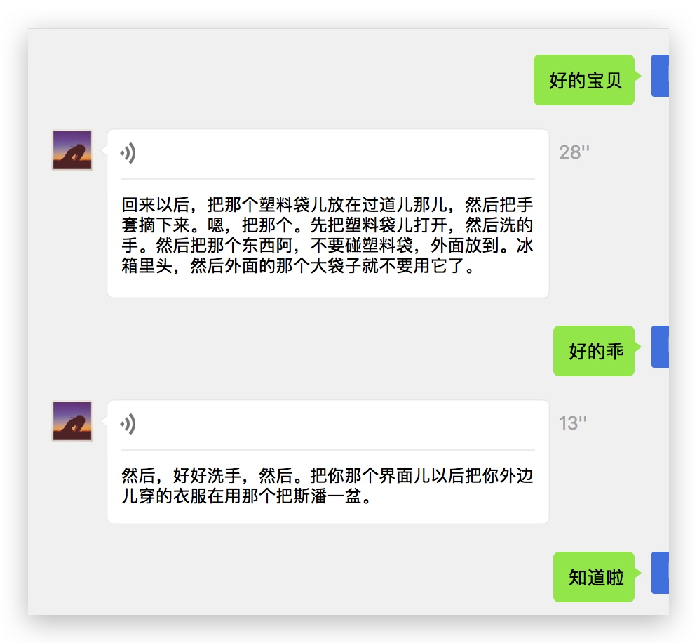
</td>
        <td >
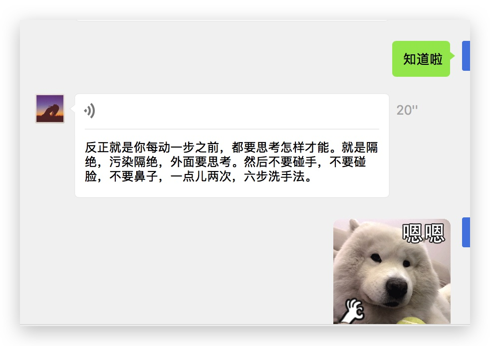
</td>
    </tr>
</table>

## 20200213

看到网友 VicodinXYZ（张潇雨） 感兴趣的四个主题： 美元的终结、身体的重构、组织的颠覆和娱乐的蜕变，不明觉厉。

> 有些鸟注定是不会被关在笼子里的，因为它们的每一片羽毛都闪烁着自由的光辉

> 朝为田舍郎，暮登天子堂；将相本无种，男儿当自强

## 20200214

    <figure align='center'>
        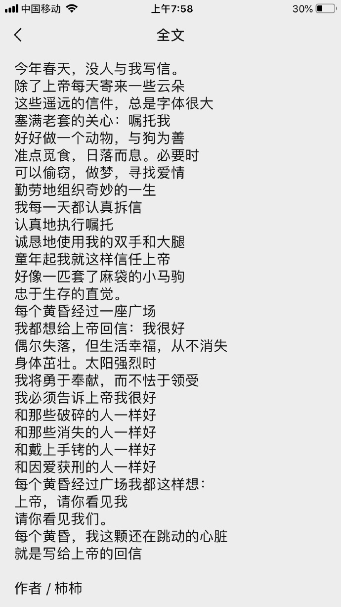
    </figure>

## 20200215

> 战士战死了的时候，苍蝇们所首先发见的是他的缺点和伤痕，嘬着，营营地叫着，以为得意，以为比死了的战士更英雄。但是战士已经战死了，不再来挥去他们。的确，谁也没有发见过苍蝇们的缺点和创伤。然而，有缺点的战士终竟是战士，完美的苍蝇也终竟不过是苍蝇。——鲁迅

## 20200216

流行病学，病毒学，医学

## 20200217

湖北电影制片厂影视部主任，从 1 月 27 日到 2 月 14 日，父、母、自己和姐姐相继感染新冠病亡。

常凯的遗言：

> 除夕之夜，遵从政令，撤单豪华酒店年夜宴。自己勉为其难将就掌勺，双亲高堂及内人欢聚一堂，其乐融触。
>
> 殊不知，噩梦降临，大年初一，老爷子发烧咳嗽，呼吸困难，送至多家医院就治，均告无床位接收，多方求助，也还是一床难求。
>
> 失望之及，回家自救，床前尽孝，寥寥数日，回天乏术，老父含恨撒手人寰，多重打击之下，慈母身心疲惫，免疫力尽失，亦遭烈性感染，随老父而去。
>
> 床前服侍双亲数日，无情冠状病毒也吞噬了爱妻和我的躯体。辗转诸家医院哀求哭拜，怎奈位卑言轻，床位难觅，直至病入膏肓，错失医治良机，奄奄气息之中，广告亲朋好友及远在英伦吾儿：我一生为子尽孝，为父尽责，为夫爱妻，为人尽诚！
>
> 永别了！我爱的人和爱我的人

公共舆论的集体警觉

大战、大灾、大疫

> 寒梅不解江城悲，枝上纷纷空自堆。若得明年能复见，看花丛里竟无谁。

> 体会到了能力的边界

## 20200218

> 我从不拒绝演出这样的戏，但总希望剧情合理一些——我觉得这样的要求并不过分

特斯拉-反员工手册-员工手册

> 我们是特斯拉，我们正在改变世界。我们愿意重新思考一切。
>
> 我们是一家高科技公司，与其他高科技公司迥异；我们也是一家汽车公司，与其他汽车公司迥异。
>
> 我们与众不同，我们长于如此。与众不同让我们去做没人能做的事，做别人告诉我们不可能的事。
>
> 如果你在寻找一本传统员工手册，里面充满了条条框框，你会发现没有一条政策或规则告诉你底线在哪里--它们会告诉你你在被解雇之前可维持的最差绩效是什么，那不是我们。
>
> 我们更愿意以极高的标准聘请享受每天都把自己推向最高水平的顶级人才。我们希望周围的人都自我驱动去做正确的事，正直行事，无论是否有人在场。
>
> 这是你吗？如果是，我们很高兴你能来，我们期待着一起创造杰出的成就；如果这不是你，你去其他地方会更成功。我们无意显得苛刻，这就是真相。

## 20200221

> 这个不是至善之策，但是没有比这个更善之策的时候，这就是可取之策，现实之策，应当是当为的办法

## 20200224

> 专注于学习和创造，而不是娱乐和消遣

> 每个人都必须做出牺牲，但你要选择牺牲什么

## 20200225

> Change is the only constant in life

## 20200226

> 倘能常常不想起世间一切的关系而在这世界里做人，其人生一定更多欢慰。
> 对于世间的麦浪，不要想起是面包的原料；
> 对于盘中的橘子，不要想起是解渴的水果；
> 对于路上的乞丐，不要想起是讨钱的穷人；
> 对于目前的风景，不要想起是某村某镇的郊野。
> by 丰子恺

有网友歪楼了哈哈

> 对于花呗的账单，不要想起是自己的欠款

## 20200228

> 美国的流感化与中国的 SARS 化

☛ 提示

## 20200301

> 有些数学家是鸟，其他的则是青蛙。鸟翱翔在高高的天空，俯瞰延伸至遥远地平线广袤的数学远景 ... 笛卡尔是只鸟，培根是只青蛙 ... 杨振宁对物理学的伟大贡献，是一只鸟的贡献，它高高地飞翔在诸多小问题构成的热带雨林之上

何军权，无臂蛙王。

潘德明，徒步环球第一人。

> 任何可以把事情搞得更复杂的东西，我会去做 by 特朗普

> 先帝创业未半而花光预算……

## 20200302

弗里曼·戴森---从未获得博士学位，他觉得自己是一个永恒的研究生，所以他有可以对一切事物感兴趣的许可证。
同时他拒绝任何有组织的宗教，或任何试图遏制他对“上帝”和“无限”进行理解的事物。

生物学是 21 世纪的科学，这句话是戴森说的。

> 有些数学家是鸟，其他的则是青蛙。鸟翱翔在高高的天空，俯瞰延伸至遥远地平线的广袤的数学远景。他们喜欢那些统一我们思想、并将不同领域的诸多问题整合起来的概念。青蛙生活在天空下的泥地里，只看到周围生长的花儿。他们乐于探索特定问题的细节，一次只解决一个问题。我碰巧是一只青蛙，但我的许多最好朋友都是鸟。这就是我今晚演讲的主题。数学既需要鸟也需要青蛙。数学丰富又美丽，因为鸟赋予它辽阔壮观的远景，青蛙则澄清了它错综复杂的细节。数学既是伟大的艺术，也是重要的科学，因为它将普遍的概念与深邃的结构融合在一起。如果声称鸟比青蛙更好，因为它们看得更遥远，或者青蛙比鸟更好，因为它们更加深刻，那么这些都是愚蠢的见解。数学的世界既辽阔又深刻，我们需要鸟们和青蛙们协同努力来探索。

内卷化 (involution)
: 指一种社会或文化模式在某一发展阶段达到一种确定的形式后，便停滞不前或无法转化为另一种高级模式的现象。

## 20200303

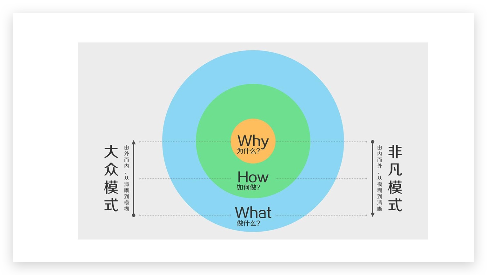

## 20200304

Now everyone **pays lip service to** iteration, thanks to the MVP movement.

这些年央行的资产有 8 成是外汇。

## 20200305

CAP
: 公司事务平台

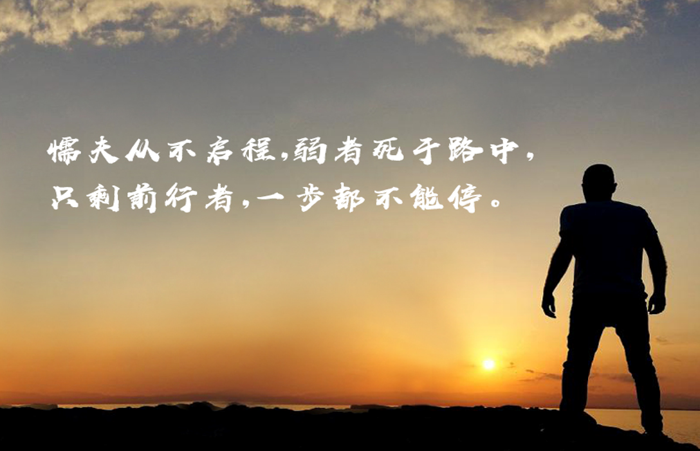

时至惊蛰 ，春雷始鸣、蛰虫惊出，气温回暖、雨水增多，这是万物生长的好时节。

内温性
: 是指一种生物可以保持其身体新陈代谢有利的温度,并且主要依靠自身产生的热量维持体温,而不是主要依靠环境的热量来维持，典型的代表是大部分哺乳动物和鸟类。

外温性
: 是指一种生物主要依靠外部热源的热量来调节体温，它们的体温因此也多随着环境温度变化，蜥蜴、鳄鱼和大部分龟鳖类都是外温性生物。

## 20200306

> 从黎明到黄昏，阳光充足，胜过一切过去的诗 ——海子

> 一滴汗珠万粒粮，万粒汗珠谷满仓

## 20200307

我们仍未知道那天所看见的花的名字。

## 20200308

2014 年 3 月 8 日，凌晨 0 时 41 分，马来西亚航空 MH370 航班从吉隆坡国际机场起飞，目的地北京。
至今，整整六年，未抵达……
239 名乘员，154 位同胞，
我们没有忘记……

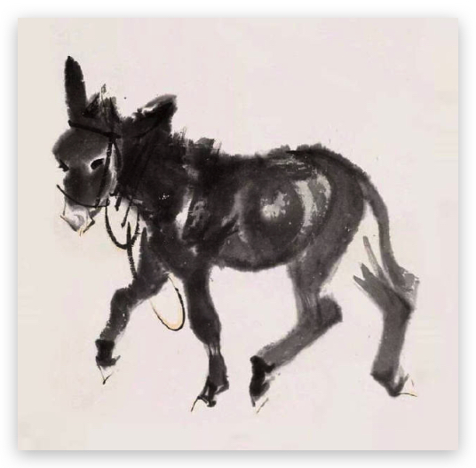

了解了一下美国宪政。

众议院
: 美国众议院现共 435 席，基于各州的人口划分选区，并定期参照人口普查结果重划选区，鉴于很多州实在人口稀少，甚至未达到推举 1 名众议员的选民基数，法律依然保障至少每州有 1 名代表，如地理位置不佳的阿拉斯加州或者小州佛蒙特州，以符合众议院之名。众议院议员任期为 2 年。众议员天生就是人民的喉舌，所以任期很短，以便最大程度与选区民意一致。

参议院
: 美国参议院现共 100 席，每州均分 2 席。参议院议员任期为 6 年。

众议院是税案的发源地，因为美国建国者认为税收与民众的切身利益相关，因此只有众议院能够首倡税案（就是加、减税的事只能由众议院发起，参议院不能首先提出）

参议院的学院派特质，加之议员的任期颇有保障，自身机构稳定（每 2 年仅重新选举三分之一的席位），所以应对狂民情绪的时候就是众议院的橡皮檫了。（或者说众议院是油门，参议院是刹车）

与少数服从多数的原则略有不同，出于对联邦内各州的礼遇，参议员能够充分保障其发言权，就是参议员想不吃饭不停地说也是可以的，无论是否有听众。很多任命和立法仍然需要 60 票的程序性支持。

参议院也拥有众议院不具备的某些权力，其中最重要的一项可能体现在美国联邦最高法院大法官的任命上，总统拥有提名权，而参议院可以选择接受或拒绝。

> 所有众议员都觉得自己有一天会成为参议员，所有参议员都觉得自己有一天会成为总统。

1942 年，英国将新加坡让给了日本人，二战后才重新管辖。
1959 年，借着世界民族解放的东风，新加坡第一次从英属直辖殖民地，独立成为新加坡自治邦。
1965 年，新马分离法案（The Agreement to Separate Singapore from Malaysia）。由于该法案从宪制层面保障了新加坡的主权独立，当地人也普遍称呼它为：新加坡建国法案。新加坡正式成为独立国家。

在新加坡历史上，能够配享“国父”这个称号并得到官方承认的，一共有 5 位，排名如下：
李光耀、吴庆瑞（后来被誉为新加坡发展之父）、拉惹勒南、杜进才（设计国旗的那位萌萌哒老爷子）和林金山。

巫统
: 马来民族统一机构

## 20200309

精灵 (sptites)

美股暴跌！

## 20200310

股票回购是美国牛市的重要推动力。

10 年期美国国债收益率低于 1%，真的是历史上首次！

> 宇宙间几乎所有重要的变化，都可以总结成一句话：Gradually, then Suddenly。

## 20200311

学到一个新词： 激越

> 我们是同一片海中的波涛，同一棵树上的叶子，同一座花园中的花朵

## 20200313

> 江南无所有，聊赠一枝春

> 丈夫非无泪，不洒离别间。 ​​​​

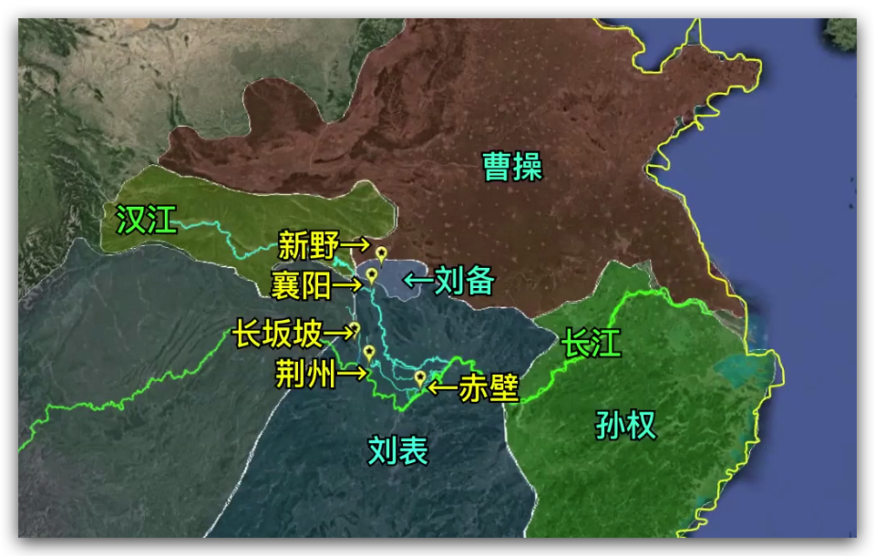

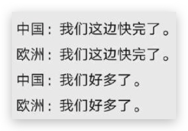

三国演义这老换演员真的是，别的倒也能忍，但庞统这前后反差有点大吧！

## 20200314

酷盖
: 英文 coolguy。coolguy 就是代表着“健康、自信、时髦、乐观、执着”的男性人群。

奶盖
: 酷盖的延伸用法，指可爱 guy

糊了
: 原先指帖子沉了不火的意思，也只明星遭遇了某些事件而受到唾弃

zqsg
: 真情实感

KY
: 没眼力见、不会按照当时的气氛和对方的脸色做出合适的反应。类似于现在的铁憨憨~

基操勿 6
: 基本操作勿要扣 666 大家都坐下，意思为让大家不要大惊小怪。

扩列
: 请求扩充好友列表，等同于交新朋友的意思

连睡
: 即“连麦睡觉”

## 20200315

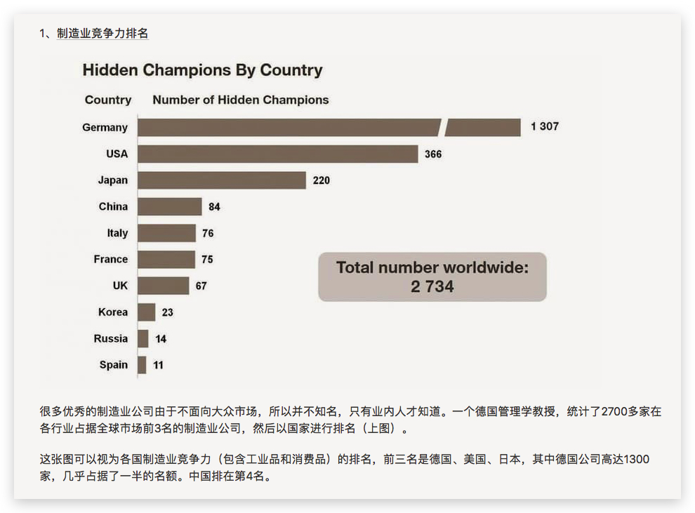

> 诵其诗，读其书，不知其人，可乎？——是以论其世也

## 20200316

> After me，the deluge（我死之后，哪管洪水滔天） ​​​​

## 20200317

> 陈真，你闯祸了！你打了日本人，这下日本人有理由开战了！

> 中国人民与日本人民是一致的，只有一个敌人，就是日本帝国主义和中国民族败类。 - 毛

> 上帝:“兹事体大，请来面谈。”

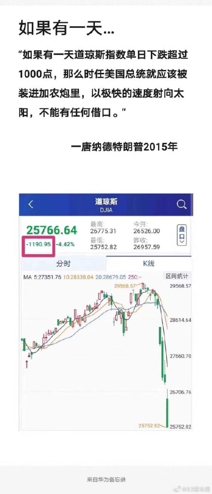

`Its first observation is a bleak one. This is that racism, or at least xenophobia, is a deeply ingrained human characteristic`

shell 中的 url，其实按住 cmd 加点击即可打开，不用费劲拷贝！

> 狮子搏象兔，皆用全力

> 你得先知道是什么，然后再问为什么，不要轻易有知道怎么办的幻觉。

## 20200318

> 宽宏坚毅

> 吴地悬壶尽入楚，从此白衣做战袍

## 20200319

读同事代码的总结：

1. 参数配置需要分域，不然，例如有个 steps 参数，后续各个流程各取所需，如果都叫 steps，不就可能歧义了么
2. 不带有任何私有变量的类是不必要的，充其量就是帮助函数。
3. spark 参数不必在帮助函数中构造，全局传入即可。否则，如我用不到 hive 和 spark，但因机器没装 spark，也跑不了代码。
4.

## 20200321

才发现我的代码库在 16 年被爱可可老师翻过牌子哈哈

    <figure>
        
        <figcaption align='center'>https://weibo.com/1402400261/EbhxqaRXg?ref=collection&type;=comment&type=comment</figcaption>
    </figure>

终于把 vuepress 文档书弄好了，github page 加 travis cl ，简直完美！

媳妇又给我起了个名字，叫‘巧克力蛋糕’，我说为啥，因为我长得黑吗，媳妇说，‘因为又黑又甜’，哈哈哈。

- [x] 完成对 github 博客加上 Travis CL 持续集成，这样以后更新只需 git 上传代码即可。
- [x] 完成 vuerepss 文档书，也集成了 Tracis CL.

## 20200322

西雅图，以美洲印第安人部落酋长命名，微软和亚马逊的全球总部，出了两任世界首富，诞生了世界上第一家星巴克，也是全球最大飞机制造商波音的故乡。

万事鸡虫

> 要看一个行业的发展状况，除了严谨的统计数据，只要再看看这个行业的龙头企业境地如何便可略知端倪

> 国家繁荣为什么需要制造业？其重要性，不仅来自于对国家 GDP 贡献的那一行数字，它还是技术创新的源泉，经济增长的源动力，甚至跟国家安全唇齿相依。

渐进式网络应用程序（英语：Progressive Web Apps，简称：PWA）

优雅、简明、通彻

> 去爱，就是去记住；去记住，就是训练自己用一种怀旧的温情拥抱每个稍纵即逝的细节

> 我告诉你：我现在有种无上的快乐。我的快乐是种挑战。……一个一个世纪会滚滚而逝，学校里的男孩会对着我们这些沧桑巨变直打哈欠；一切都会过去的，但我的快乐，亲爱的，我的快乐会留存，留在街灯潮湿的倒影中，留在小心拐进运河黑水的石阶上，留在起舞的恋人的笑意中，留在上帝用来慷慨围绕人类寂寞的一切之中。

> 纳博科夫还写过一篇短章叫《柏林向导》（A Guide to Berlin），想象 2020 年会有一个思路刁钻的写作者要描绘百年前的柏林生活，去参观一个电车博物馆，那此时再不足道的细节，比如售票员挎包的颜色，电车行进时独特的声响，在他看来也会变得无比高贵。短篇最后说，这似乎就是文学的意义，把日常物件照在未来那面更和蔼的镜子里，在这些琐细之物周围发现那些本来只能由遥远的后代体会的馥郁和温柔。

> 纳博科夫成年之前，生活在俄国最有钱的人家之一；他爸爸的衬衫都是要送到伦敦去洗的。餐桌上说法语，儿童房说英语，其他地方说俄语。马丁·艾米斯说这家人的才华是如此横溢，任何一个纳博科夫，不管他决定要做什么，只要达不到全国知名都是家门不幸。弗拉基米尔十几岁的时候，叔叔留给了他一百万卢布，他就自费出版诗集，在圣彼得堡俊逸地做着少年诗人。“呼卢百万终不惜”“风光去处满笙歌”。当时圣彼得堡和长安一样，国际化大都市，而且文艺之绚烂，在那个国家彪炳的历史上，都可算是最高峰了。

> 纳博科夫是唯一一个先后逃离斯大林和希特勒的文学大师。 在他的脚后跟上，两大文明世界土崩瓦解

> 当所有选项都被拿走的时候，你依然有无限自由的可能。

> 纳博科夫的文风实在是情爱的一种……他渴望把那种朦胧的精准牢牢抱紧在自己满是毛发的臂膀中。

> 他总觉得自己西班牙语一旦长进，西班牙女友就不会再觉得他有意思了；因为他觉得自己是一首平庸的诗，所谓内涵全是对方因为无法交流自己投射上来的。

> 可我热爱尝试新事物，并且弄明白我有多恨它们。

> 事实上，或许我们生活中很多——甚至大部分——好东西都在于意识到做这件事的理由都是脆弱和暂时的，但还是不管不顾去做了

> 我是那种永远生活在恐惧中的人，怕被别人揭穿自己一点水平也没有。不管我在写什么，我都会觉得这他妈写得真是屎，随时都会有人过来把我电脑砸掉。每个礼拜写完专栏，我妻子都会问我，‘怎么样？’我每次都会说：‘我刚刚写出了人类历史上最烂的一坨屎，我真是个贱货。’ - Charlie Brooker (黑镜的编剧)

约翰·厄普代克（John Updike）
: 被誉为美国“最后一位真正的文人”，‘美国巴尔扎克’，两次获得普利策奖，中产阶级的灵魂画师。

## 20200323

科学研究的品味

对称支配力量

    <figure>
        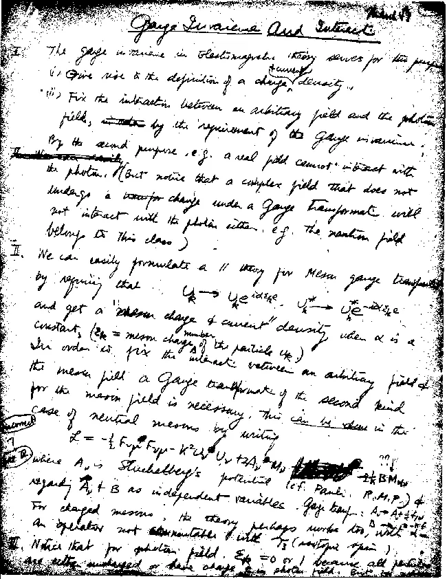
        <figcaption align='center'>1947年杨振宁笔记中的一页</figcaption>
    </figure>

区分两类作家：一类取悦读者，一类挑战读者。

> 按照我们当时的理论，应该存在一种有电荷但是没有质量的粒子，而这样的粒子无论如何是不可能存在的！---这个理论如此漂亮。我们能不能在其中包含尚未解决的问题的情况下，就把它发表呢？我们为这个问题纠结了很久，最后还是决定发表，因为它真的是非常非常漂亮。而且，场论也还没有得到数学上的精确描述。场论的发展困难重重，但是这并没有阻止它在重整化方案中获得神奇的成功。所以，场论有可能在将来解决我们遇到的问题。

有电荷无质量粒子的问题后来由对称性破缺这个新概念的引入而解决的。

> 当我认识到规范场理论的方程其实是数学中的一个理论，也就是纤维丛理论方程的一个特例，我感到非常的吃惊

> 一摇篮在深渊上方摇着，而常识告诉我们，我们的生存只不过是两个永恒的黑暗之间瞬息即逝的一线光明。尽管这两者是同卵双生，但是人在看他出生前的深渊时总是比看他要去的前方的那个（以每小时大约四千五百次心跳的速度）深渊要平静得多 --- 弗拉基米尔·纳博科夫

苗炜回忆说，他在三十多岁的时候读这本书(纳博科夫的《说吧，记忆》)，“读了一两段就放在那儿不敢看了，心跳倍儿快。”就像是一个男孩见到美女，偷偷看一眼，又低下头不敢看一样，“他写得太好了，像一个人唱歌，起的调门特高，就开始担心他能维系这个调门唱下去吗？”

陈以侃也有这种感觉，纳博科夫的作品每个句子都非常使劲，“感觉每个句子都要读两遍，才能知道他的劲用在哪儿。”他引用小说家马丁·艾米斯的话说，纳博科夫每句话都那么华丽，其实是一直在想着取悦读者，“到我家来，我把最好的沙发给你坐，最好的红酒给你喝。”

厄普代克：去往平凡生活的更深处

> 遇到困难，要向上提要求，要敢于向上提要求

## 20200324

NCNN

## 20200325

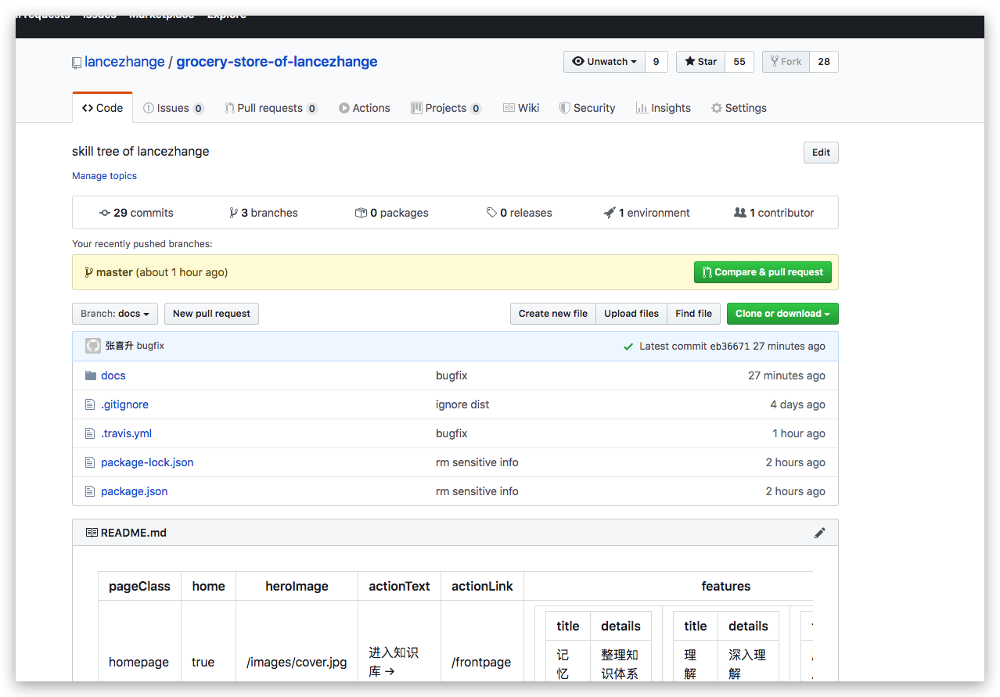

因为敏感信息，暂时先设置为 private，star 和 fork 全丢了。
