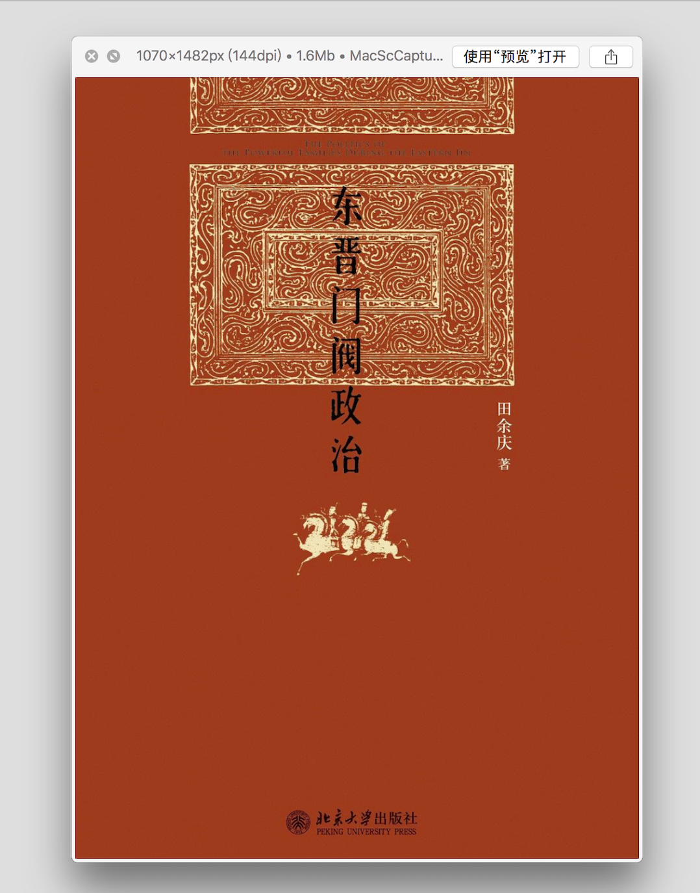
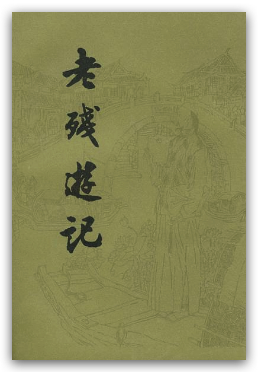
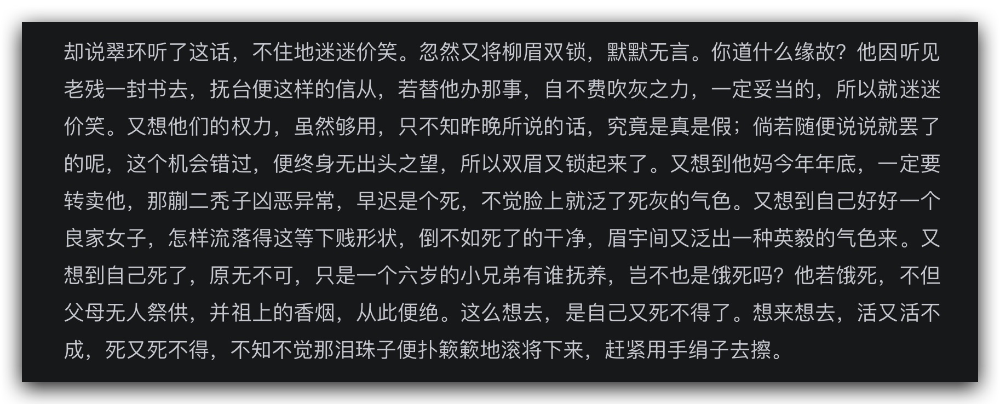
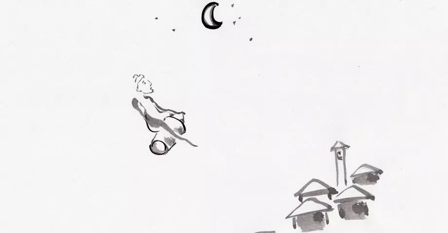

# 阅读 2019

[TOC]

## 金字塔原理 - 思考、写作和解决问题的逻辑

by 巴巴拉-明托

麦肯锡国际管理咨询公司有史以来的第一位女性咨询顾问

what
why
how

> 金字塔原理是一个思考、表达的好工具，但《金字塔原理》不值得花太多时间去读。

结论先行有重点
这个可能和我们一般的思维习惯有所区别。例如，我们一般都是因为什么，所以才怎样。‘小王吃喝嫖赌抽，坑蒙拐骗偷，打瞎子骂哑巴，挖绝后坟敲寡妇门，小王是个坏蛋’

论据支持有层次
强调论据的不重不漏

[网友总结的精华](https://www.jianshu.com/p/e009472dd4a3)

> 第一，概念定义。金字塔原理是一种重点突出、逻辑清晰、层次分明、简单易懂的思考方式、沟通方式、规范动作。第二，基本结构。结论先行，以上统下，归类分组，逻辑递进；先重要后次要，先总结后具体，先框架后细节，先结论后原因，先结果后过程，先论点后论据。第三，操作做法。自上而下表达，自下而上思考，纵向总结概括，横向归类分组，序言讲故事，标题提炼思想精华。

## 东晋门阀政治

    <figure align='center'>
        
        <figcaption>东晋门阀政治</figcaption>
    </figure>

半文言文，读起来特别蕴藉！

王与马共天下

近实
: 接近事实真相

建康
: 南京在六朝时期的名称

## 枪炮、病菌与钢铁-人类社会的命运

by 贾雷德-戴蒙德

造成民族地位差异的原因是什么？

> 不同民族的历史遵循不同的道路前进，其原因是民族环境的差异，而不是民族自身在生物学上的差异

这是环境决定论吗？

## 中国古代的乡里生活

by 雷家宏

- 乡里结构及其行政组织
- 乡间结拜和结社

## 棋王

## 刀锋

> 一把刀的锋刃很不容易越过；因此智者说得救之道是困难的

## 数学悖论

从惊讶到思考——数学悖论奇景
by 《科学美国人》杂志社 马丁·加德纳

这本书在[开放图书-灰狐](https://book.huihoo.com/paradox-box/)上有，链接如上。

**选举悖论**

2/3 的人觉得 A 比 B 好，2/3 的人觉得 B 比 C 好，那我们能说 大部分人会觉得 A 比 C 好吗？
其实是不能的。
考虑 A B C 循环的 3 个人

**轻率的结论**

统计资料表明．大多数汽车事故出在中等速度的行驶中，极少的事故是出在大于 150 公里/小时的行驶速度上的。这是否就意味着高速行驶比较安全？
绝不是这样。统计关系往往不能表明因果关系。由于多数人是以中等速度开车，所以多数事故是出在中等速度的行驶中。

**亨普尔悖论**

1. 乌鸦都是黑的
2. 如果观察到 10 个乌鸦都是黑的，概率是多少，如果是 100 万个，是不是概率大了一点？
3. 乌鸦都是黑的，等价于：不黑的东西都不是乌鸦
4. 很容易找到成千上万不黑的又不是乌鸦的东西。它们是否也证实了定律：“凡是乌鸦都是黑的“
   一条酱紫色的奶牛实际上使“所有乌鸦都是黑色的”概率稍为增大了一点吗？
   一个同样的事实怎么会同时证实“所有乌鸦那是黑的”和“所有乌鸦都是白的”的例证呢？

**检查悖论**

[检查悖论](https://jakevdp.github.io/blog/2018/09/13/waiting-time-paradox/)

## Living Proof

`Living Proof` ： 即使对知名的数学家，数学也并非那么简单。
在数学方面有所成功需要具备的特质： **embrace the struggle**

数学的一个特点： 在理解之路上会特别痛苦，但是当你理解了之后，结论如此自然，以至于不能理解之前为何会经历如此之大的困难。

没有天生的数学人

> There are no `math people`. mathematical thinking is a fundamental part of every human’s intellectual capacity. The people we label `good at math` are simply those who have taken the time and trouble to engage the struggle more deeply than others.

> Belonging is a fundamental human need. The mathematical community has neglected that need too often, for too long, for too many people

`I'm on the struggle bus today`

## 老残游记

很喜欢这半文言！
本卷 20 回，一日读完，酣畅淋漓！
续集九回，还有残卷。

居停: 寄居之家的主人

明湖湖边美人绝调，就是语文课本上学的黑妞白妞了。

肥遁鸣高

清朝第一高手甘凤池

古德： 佛教徒对年高有道的高僧的尊称。

碧霞宫： 即碧霞元君行宫，又名圣母庙，俗称奶奶庙。

澈悟

北拳南革

> 各师傅各传授，各把戏各变手

红尘女子论诗文这段，真是搞笑极了

> 天下大事，坏于奸臣者十之三四，坏于不通世故之君子者，倒有十之六七。

`虽是个进士出身，倒不糊涂`

主敬存诚

写翠环心理状态这段真好！

> 不得已，才请教你这个福尔摩斯呢

`大约总在明年春夏天吧`

这种句式里的总字的用法，非常熨帖婉转。类似的还有：`请老爷示下，还是歇半天，还是怎么样？`，这句里的 _还是_ 一词的用法。此外还有 `究竟也得人家答应，才能算数呢`

`这会子全好了`，现在一般都说 `这会儿全好了`

> 荒村雨露眠宜早，野店风霜起要迟

## 横向领导力

组内的分享用书，不过我发现在这种书上能学习到的东西着实有限，因为都是道理，而我们‘道理都懂’。所以领导力这种东西，还得是在切实的工作中不断总结提炼，身体力行，比看书强一百倍。

## 二十年目睹之怪现状

看完老残游记，这本二十年目睹之怪现状自然也不能放过（喜欢听故事的我的心头好，就像看‘传奇故事’一样）。

全书共 108 回。

总督加太子少保衔，称为‘宫保’

总督一般被称为制台，但如果还被授予了兵部尚书兼督查院右都御史，则应该被称为‘部堂’

河运总督和漕运总督，分别称为河台和漕台。

巡抚是仅次于总督的封疆大吏，主管一省的军政、民政。抚台是对巡抚的尊称。如果巡抚被授予了督查院右副都御史，则可以尊称为‘中丞’。

学政是主管一省教育科举的官员，学台是对学政的尊称。

布政使主管一省的财富及人事。藩台是对布政使的尊称。

按察使是省级最高司法长官。臬台是对按察使的尊称。

道员是介于省和府之间的地方长官，道台是对道员的尊称。

美人孕

忆汉月-美人小字

佛头着粪

衡文： 品评文章（引申为主持科举考试）

## 归墟

by 骑桶人

什么叫归墟？ 海中无底之谷。后喻事物的终结、归宿。

为何作者叫骑桶人? 因卡夫卡的一篇同名作品。

