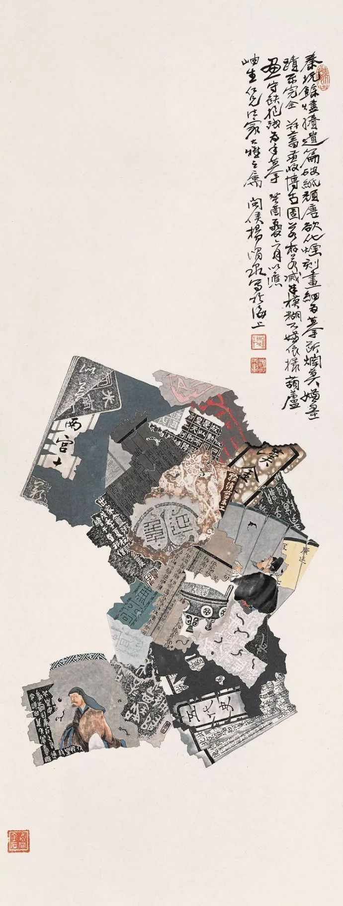
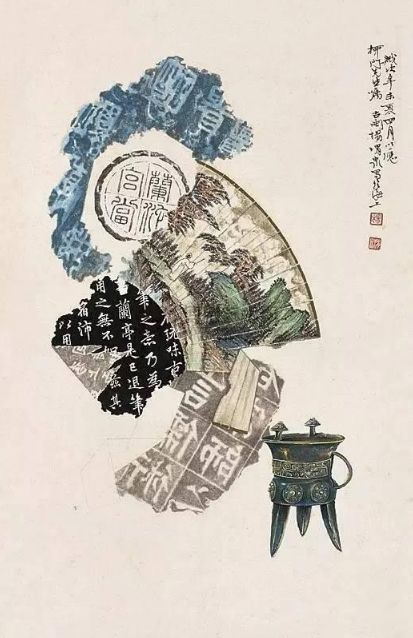
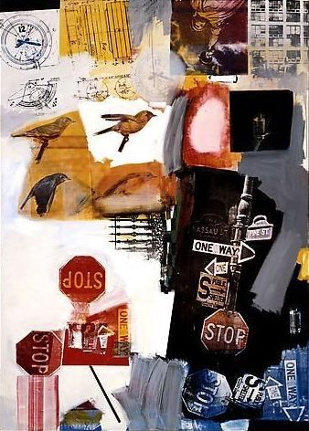
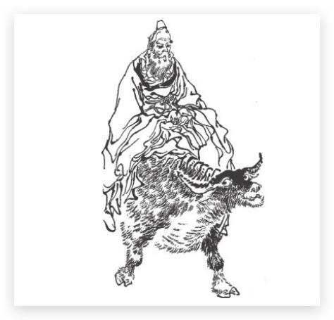
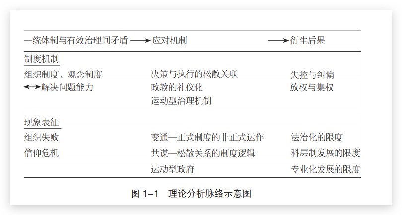
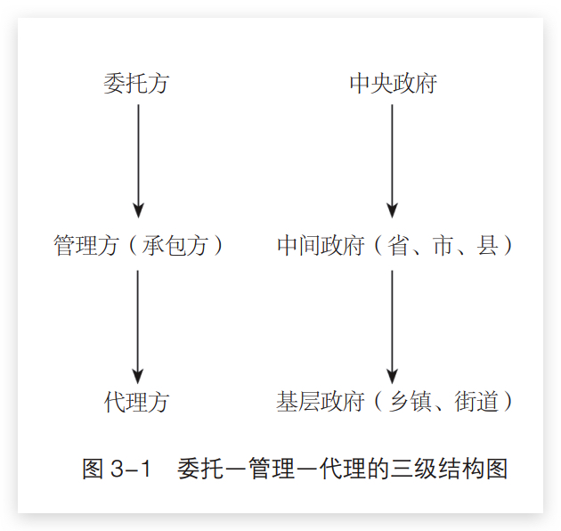
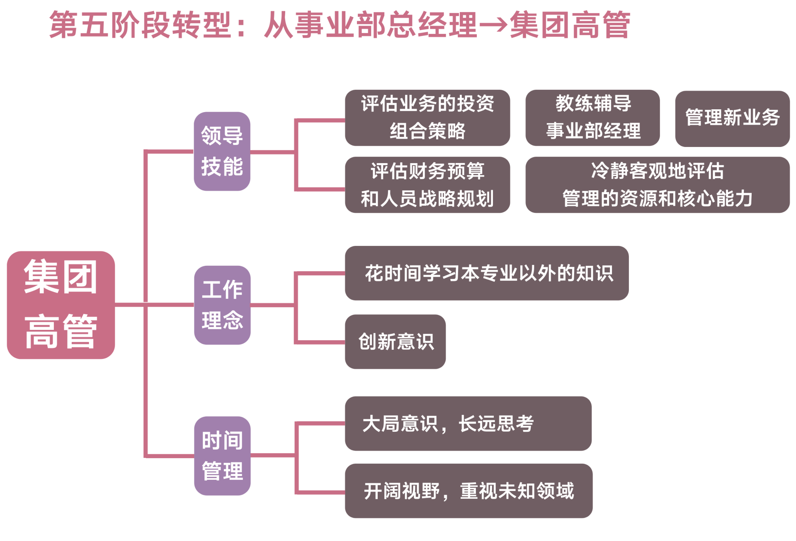

# 阅读 2020 {ignore=true}

[TOC]

## 政治学通识

作者包刚升。

非常好读的一本书。

什么是政治？它和管理和领导力有什么差别？
为什么需要政治，政治被谁需要？作用是什么？
如果政治作为一种个人能力，如何提高它？

政治的重要性，由亚当斯的一句名言反映：

> 为了我们的孩子们能够自由地研究数学与哲学，我必须研究政治与战争

很多经济问题甚至技术问题，其实也是政治问题。例如雾霾的治理。
从大的方面来讲，政治学学习的政府的组成。
不同政府形式和政治体制，其政治逻辑有何不同？例如，总统制、议会制、半总统制的国家，有何区别？

流寇 - 坐寇 - 宪政 - 民主

宪政的简单理解就是“限政”，即限制政治权力

在近代欧洲，为什么是英国与荷兰，而不是法国与西班牙，较早地开始工业革命？

政治： 统治机关之运营。

> 政治两字的意思，浅而言之，政是众人的事，治就是管理，管理众人的事便是政治。有管理众人之事的力量，便是政权，今以人民管理政事，便叫做民权。 - 孙中山

> 政治是以经济为基础的上层建筑，是经济的集中表现，是以政治权力为核心展开的各种社会活动和社会关系的总和。

孔子儒家学派认为政治关乎道德

> 为政以德，譬如北辰，居其所而众星共之。

雅典民主： 直接民主。6 千人公民大会，5 百人议事会，陶片放逐法（对政治危险人物实行流放），出席城邦公共事务的公民有薪水。

为什么说‘政治中为什么没有专制者的位置’？
因为在古希腊人看来，专制肯定不是政治的一种类型，专制根本就不是“政治”——只有城邦公民共同参与公共事务的活动才配得上政治的称谓。

马基雅维利主义： 政治无关道德。

政治学的三个阶段：哲学传统（什么是优良的政体，可以认为是冷启动阶段）、经验传统与哲学传统。

## 箭术与禅心

## 枪炮、病菌与钢铁-人类社会的命运

by 贾雷德-戴蒙德

造成民族地位差异的原因是什么？

> 不同民族的历史遵循不同的道路前进，其原因是民族环境的差异，而不是民族自身在生物学上的差异

这是环境决定论吗？

## 歧路灯

## 末世第十年

- [ ] 哲学与人生 by 傅佩荣
- [ ] 漫长的告别 by 雷蒙德·钱德勒
      菲利普·马洛
      硬汉派

## 中国古代的乡里生活

by 雷家宏

- 乡里结构及其行政组织
- 乡间结拜和结社

## 楼下的房客

## 超越智商：为什么聪明人也会做蠢事

## 从０到１

## 日本史(1600-2000)

by James L.McClain

## 火车上的女孩

## 刺杀骑士团长

村上春树的文字，总给人一种极端个人化的感觉。

_假如表面似乎阴晦，那么就用抹布拂去_

有可能都到月球上去

镜子里的自己，不过是物理性反射罢了

to read: 眼下，是无面委托人

## 蒙田随笔

因为毛姆在《阅读是一座随身携带的避难所》中推荐，所以找来看看。

## 赋能：打造应对不确定性的敏捷团队

by 斯坦利-麦克里斯特尔

做菜园里的园丁，而不是棋盘边的棋手

## 顾准文集

顾准的家庭之悲

极右派

含冤去世

## 叫魂：1768 年中国妖术大恐慌

孔力飞，美国著名汉学家，以研究晚清以来的中国社会史、政治史著称

乾隆三十三年初

> 游方和尚常常被目为乞丐同类，是不折不扣的流民，也非常值得怀疑，徐珂在《清稗类钞》中记载北京人之所以将乞丐称为“叫化子”就是来自于和尚的化缘

## 巨流河

台湾

## 饥饿的盛世

## 学会提问

## 今日简史

> 在一个信息爆炸却多半无用的世界，清晰的见解就成了一种力量。

> 我们对旧故事已经失去信心，但却远未对新故事达成共识

## 马伯庸笑翻中国简史

## 伟大的中国工业革命

## 蛐蛐四爷

## [How to be a Programmer: Community Version](https://braydie.gitbooks.io/how-to-be-a-programmer/content/en/)

[中文版](https://github.com/braydie/HowToBeAProgrammer/tree/master/zh)

## 大唐泥犁狱

泥犁，即地狱

## 锦灰堆：王世襄自选集

「文人废纸篓里的稀罕物」

王世襄，被称为 「京城第一玩家”的收藏大家」

    <figure align='center'>
        
        <figcaption>锦灰堆画作</figcaption>
    </figure>

    <figure align='center'>
        
        <figcaption>西方拼贴艺术</figcaption>
    </figure>

> ……对任何身外之物都抱“由我得之，由我遣之”的态度，只要从它那里获得过知识和欣赏的乐趣，就很满足了。物归其所，问心无愧，便是圆满的结局。 - 《锦灰堆: 王世襄自选集》 ​​​​

### 联邦党人文集

### 夹边沟纪事

by 杨显惠（兰州人）

《定西孤儿院纪事》的姊妹篇，被誉为中国的 "《古拉格群岛》"

## 原则

Ray Dalio

> 一个人真正的成长，就是不断自我进化

> 我们必须渴求真相，要渴求到为了换取真相甚至不惜被羞辱的地步。

拥抱现实并解决它

## 态度改变与社会影响

by 菲利普·津巴多 （斯坦福监狱实验，害羞诊所）

## 定位

## 传奇中的大唐

## 当我们被生活淹没

## 战略级天使

## 四时歌

## 通用设计法则

125 条通用设计法则

有一些是我们比较熟悉的，例如 80/20 法则、对齐、美即适用、魅力偏见。

拟人形。

面积对齐。

娃娃脸偏见

亲近生命效应。

预期效应。

面子主义比例
: 照片中脸部与身体的比例

最弱的一环
: 故意适用一个脆弱环节，当它失灵时，就能保护系统其他元素免于损坏。

视觉空间共振
近处高频爱因斯坦，远处低频梦露，这张图片实在神奇。

恐怖谷。

由上而下光源偏见。

规模缩放谬误。

## 王氏之死-大历史背后的小人物命运

## 心若菩提

曹德旺

## 八月炮火

芭芭拉塔奇曼

## 道德经

道经三十七章， 德经四十四章，合九九八十一章。

文约意丰，字字珠玑

> 道可道 非常道 名可名 非常名。无 名天地之始 有 名万物之母 故常无 欲以观其妙 常有 欲以观其徼 此两者 同出而异名 同谓之玄 玄之又玄 众妙之门

> 天下皆知美之为美 斯恶矣 皆知善之为善 斯不善矣 故有无相生 难易相成 长短相较 高下相倾 音声相和 前后相随 恒也 是以圣人处无为之事 行不言之教 万物作 而弗始 生而弗有 为而弗恃 功成而弗居 夫唯弗居 是以不去

概念是辩证的。

为而弗恃，功成而弗居。事了拂衣去，深藏功与名。

> 不尚贤 使民不争 不贵难得之货 使民不为盗 见可欲 使民心不乱 是以圣人之治 虚其心 实其腹 弱其志 强其骨 常使民无知 无欲 使夫智者不敢为也 为无为 则无不治

> 道冲 而用之或不盈 渊兮 似万物之宗 挫其锐 解其纷 和其光 同其尘 湛兮似或存 吾不知谁之子 象帝之先

> 天地不仁 以万物为刍狗 圣人不仁 以百姓为刍狗 天地之间 其犹橐龠[tuoyue]乎 虚而不屈 动而愈出 多言数穷 不如守中

> 谷神不死 是谓玄牝[pin] 玄牝之门 是谓天地根 绵绵若存 用之不勤

> 天长地久 天地所以能长且久者 以其不自生 故能长生 是以圣人后其身而身先 外其身而身存 非以其无私邪 故能成其私

> chpt8 上善若水 水善利万物而不争 处众人之所恶 故几于道 居善地 心善渊 与善仁 言善信 正善治 事善能 动善时 夫唯不争 故无尤

> chpt9 持而盈之 不如其已 揣[zhui]而锐之 不可长保 金玉满堂 莫之能守 富贵而骄 自遗其咎 功遂身退 天之道也

> chpt10 载营魄抱一 能无离乎 抟气致柔 能如婴儿乎 涤除玄览 能无疵乎 爱民治国 能无为乎 天门开阖 能为雌乎 明白四达 能无知乎 生之畜之 生而不有 为而不恃 长而不宰 是谓玄德

> chpt19 见素抱朴 少私寡欲

> chpt20 曲则全 枉则直 洼则盈 敝则新 少则得 多则惑 是以圣人抱一为天下式 不自见 故明 不自是 故彰 不自伐 故有功 不自矜 故长 夫唯不争 故天下莫能与之争 古之所谓“曲则全”者 岂虚言哉 诚全而归之

> chpt25 域中有四大 而人居其一焉 人法地 地法天 天法道 道法自然

> chpt33 知人者智 自知者明 胜人者有力 自胜者强 知足者富 强行者有志 不失其所者久 死而不亡者寿

> chpt38 大丈夫处其厚 不居其薄 处其实 不居其华

> chpt40 天下万物生于有 有生于无

> chpt41 大器晚成 大音希声 大象无形 道隐无名

> chpt42 道生一 一生二 二生三 三生万物

道不是 0， 0 是无，道是从无中生出的。

> chpt47 不出户 知天下 不窥牖 见天道 其出弥远 其知弥少 是以圣人不行而知 不见而明 不为而成

> chpt48 为学日益 为道日损 损之又损 以至于无为 无为而无不为 取天下常以无事 及其有事 不足以取天下

读完第五十章，感觉读不下去了。读下来发现，核心说的无非还是清心寡欲，急流勇退。

## 国士无双-蒋廷黻回忆录

蒋廷黻(fú ), 字绶章，笔名清泉，南开大学第一任历史系主任。

弃学从政，掌行政院，驻苏驻美驻联合（国）。

生于 1895 年，极具象征意义。那一年为甲午战后第一年，也是《马关条约》签署的年份。

二伯父的重要性。

中国近代史及外交史.

现代化叙事 vs. 革命叙事

## [中国国家治理的制度逻辑-一个组织学研究](https://web.stanford.edu/~xgzhou/zhou_book2017.pdf)

by 周雪光

> 学术研究的意义不在发现和批评荒谬，
> 而在发掘和解释荒谬背后的逻辑。 - 黄仁宇

国家治理的制度逻辑

国家与社会的关系。

两个主要的线索： 一是国与民的关系，一个是中央和地方的关系。

**逻辑思路**

1. 一统体制与有效治理之间的深刻矛盾。（中央与地方关系在集权与放权的抉择.）
2. 应对此矛盾的治理机制，
   1. 决策一统性与执行灵活性之间动态关系
   2. 政治教化的礼仪化
   3. 运动型治理机制。自上而下的运动式治理整顿作为纠偏。
3. 这些治理机制又有什么样的后果。

> 一个国家的运行过程、解决问题的能力与方式、应对危机的抉择、中央与地方政府间关系、国家与社会的关系，都是建立在一系列制度设施之上的。这些稳定的制度安排塑造了解决问题的途径和方式，诱导了相应的微观行为，从而在很大程度上规定了国家治理的轨迹、抉择和后果。我把这一制度安排所导致的因果联系称为国家治理的制度逻辑.

国家治理模式有明显的途径依赖性。

中文中的“国家”概念有着“民族”（nation）与“国家政权”（state）的双重含义。在政治分析中，“民族”与“国家政权”是两个不同的分析概念，各有特定的边界和内涵。在本书中，作者是在“国家政权”这个意义上使用“国家”这一概念的。

国家治理的规模与负荷。

> 可以说，在中国历史上，治理规模一直是困扰执政者的核心问题。不幸的是，历史上有关郡县、封建之争常常蒙上了中央集权与割据政权间利益对立的意识形态色彩，因此打断了有关国家治理规模及其严峻挑战的深入讨论。

这段不是很明白，为甚么打断了？

一统体制的组织基础

1. 官僚制度
2. 观念制度
   - 认同和顺从中央权威（行动上既然已经有所偏离，仪式上自然要乖一点）

> 认认真真走过场，踏踏实实搞形式

看完了第一章导论。导论中已经亮明了观点，后续的章节都是在具体阐述。
读这种偏文科的书，总给我一种感觉： 观点总是和个人的认知相关，如果认同，简直无需证明，如果不认同，证明也没什么用，因为太难证明，不像理工科的用事实说话，这里很难量化或者单一维度变化实验进行分析说明，只能依靠一些逻辑勾连，但逻辑也不等同于事实。

**合法性基础—权威类型—支配形式**

> 任何权利---都有为自己正当性辩护的必要 by 韦伯

1. 传统权威
2. 卡里斯马
3. 法理权威

对应的，三种支配形式：

1. 家长制
2. 卡里斯马制
3. 官僚制

君主官僚制。

行政发包制： 中央政府将政策目标“发包”给直接下级或当地政府。

据说印度也是皇权不下县，皇权只能给老百姓指派到县官，再往下就是老百姓自治。

## 人类群星闪耀时

斯·茨威格（1881—1942）

## 管理百年

1911 年，弗雷德里克·温斯洛·泰勒（Frederick Winslow Taylor 1856—1915，科学管理之父）出版的 **《科学管理原理》** 奠定了管理学理论的基石，标志着管理从 _经验管理_ 步入了*科学管理* 阶段。（但科学管理已经被称为古典管理理论了？）从 1911 到如今 2020，100 余年的发展时间。

管理是一种思想，也是科学！

经验并非无用，事实上，彼得克鲁克就是一位经验主义学派的管理大师。

管理活动包括五项职能，即计划、组织、指挥、协调、控制。

**弗雷德里克·温斯洛·泰勒**

标准化管理。
计件工资制度。

**亨利·劳伦斯·甘特**

**弗兰克·邦克·吉尔布雷思**
（Frank Bunker Gilbreth 1868—1924），科学管理运动创始人之一，出生在美国缅因州费尔菲尔德。1885 年，已经通过麻省理工学院入学考试的吉尔布雷思并未入学，而是选择进入建筑行业，并以砌砖学徒工开始自己的职业生涯。

莉莲·莫勒·吉尔布雷思（Lillian Moller Gilbreth 1878—1972），弗兰克·邦克·吉尔布雷思的夫人，于 1900 年和 1902 年先后在加利福尼亚大学伯克利分校取得文学学士与硕士学位。抚养 12 个孩子之余，1914 年，她出版了《管理心理学》（The Psychology of Management）一书，并在一年后获得布朗大学的心理学博士学位。由于莉莲·莫勒·吉尔布雷思是美国第一位获得心理学博士学位的女性，人们称她为“管理学第一夫人”。于 1921 年成为美国机械工程师协会的第一位女性会员，1935 年成为普渡大学的第一位女性管理学教授。吉尔布雷思夫妇曾先后荣获甘特金质奖章（1943 年）与国际科学管理委员会金质奖章（1954 年），而莉莲也是至今世界上同时获得这两个奖项的唯一女性。在 1938 年评选的“有行使美国总统权力才能”的 12 位妇女中，莉莲·吉尔布雷斯榜上有名。1966 年为表彰她作为一名工程师在公共服务领域里的突出贡献，她被美国政府授予胡佛奖章，她是获此殊荣的第一位女性。

动作研究的目的：消除不必要、无效的动作，从而找出一种最好的操作方法来提高工作效率。

## 领导梯队

第五阶段： 从事业部总经理（Business Manager）到集团高管（Group Manager）

在这个工作范围很大的岗位上，GM 需要注意的是**不能再用专家心态去工作**，而是以更加开放和包容的眼光看待各项工作

 
## 红楼十二层： 周汝昌妙解红楼梦

> 中国有两本天书，前有易，后有红。

观点： 湘云就是脂砚斋。

看官，而不是读者，因为还有一层评判。

> 蓬海三千皆种玉，绛楼十二不飞尘

作者认为红楼梦是一部‘文化小说’，而且是唯一一部能够当得起‘文化小说’称号的，因为书中包含了丰富的中华文化内涵： 民俗、诗词、园林建筑、美食、服装、医药、音律等等。

红楼文化三纲： 玉、红、情。

> 长安春色谁为主，古来尽属红楼女。

> 一日卖了三千假，三年卖不出一个真

爱情小说 vs. 人情小说

泻玉 vs 沁芳

> 不俗即仙骨，多情乃佛心

脂粉英雄

石 → 玉 → 人 到进化论这段彩虹屁过分了，哈哈哈，照这么说，孙悟空从石头而来也是进化论。

## 在别人的句子里

2020 年春天，读自己的 Reeder 上订阅的'文字-单读'，看到一篇文章 「你喜不喜欢纳博科夫？」，读完之后，爱不释手。发现这篇摘自 「在别人的句子里」这本书，自然必须拿来一读。

豆瓣上有人这么评价：

> 朦胧的感想被下了精准定义，真叫人惊喜万分。

深以为然。

也是第一次知道陈以侃这个人（澎湃新闻之前有他写的一篇文章，叫 `搁浅在此刻的僭越者`，之前读过，但并未去关注作者其人）。

 
## toread

- [ ] 科学革命的结构
- [ ] 十七岁的轻骑兵
- [ ] 系统之美
- [ ] 花间一壶酒 by 李零
- [ ] 中国好人 by 刀尔登
- [ ] 西太平洋上的航海者
- [ ] 《镖人》、《黄雀传》
- [ ] 摇摇晃晃的人间
- [ ] 巴黎在燃烧吗
- [ ] 尼尔·盖曼
- [ ] 宫泽贤治
- [ ] 基里尼亚加
- [ ] 集体行动的逻辑
- [ ] 拥抱战败
- [ ] 光荣与梦想
- [ ] 狂热分子
- [ ] 格鲁夫给经理人的第一课
- [ ] 国士无双伍连德
- [ ] Speak, Memory
- [ ]
