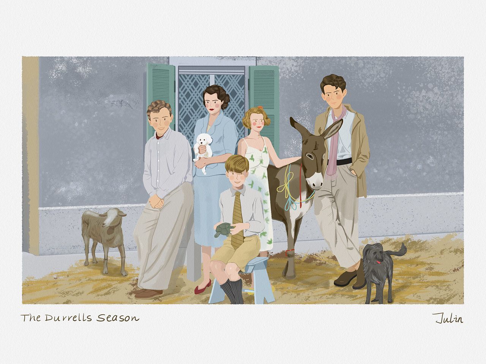
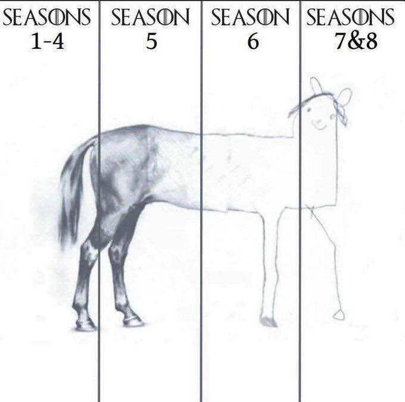

# MOovie 2019

## 影视作品赏析

### 天龙八部

黄日华这一版本真是心头好

### 流浪地球

特效牛逼，台词有些尴尬

### 给爸爸的信

和媳妇一起在家看的，把媳妇看哭了

### 黄飞鸿 92 之龙行天下

李连杰在国外

年轻真好，风华正茂

### 白蛇-缘起

确实不错，给祖国动画长脸

### 芝麻胡同

第一集真好看，相比一下什么新倚天屠龙记啥的真恶心。

毕彦君老爷子的演技真的炸裂！

然而后面这剧情烂尾烂的啊，不忍直视。

### 大黄蜂

媳妇落泪好几回

### 酒店监控

恐怖短片
没看懂

### 德雷尔一家

鲜亮，平淡，优雅，真的好看

[更多这种漫画风格的美图](https://www.zcool.com.cn/work/ZMjc0MDk5ODA=.html)

### 权力的游戏

第八季。

> What do we say to the God of the death?
> Not Today

    <figure align='center'>
        
        <figcaption>权游</figcaption>
    </figure>

### 花木兰

重温经典

### 悬崖上的金鱼姬

08 年的老电影了

### 黄河绝恋

佳作！

### 聊斋

1. 断指神通孙子楚，化身鹦鹉入闺房，感天动地阎王殿，幸运得中状元郎
2.

### 罗曼诺夫后裔

对上门做家政的穆斯林女子说： 带上你的炸弹赶紧走开。或许巴黎欢迎你，但是这个家不欢迎你。
故事情节并无多大惊艳，但是台词和表演极具张力

### 长安十二时辰

开头着实惊艳，可惜有点烂尾

### 狮子王

并没有奇幻森林那般惊艳

### 宰相刘罗锅

堪称剧王！

### 哪吒

好看！

### 大明王朝 1566

神剧。

### 美国工厂

结局很有意味。

### 怪物电力公司

2001 年的老电影了吗，我居然到 2019 年才第一次看。

### 少年的你

相比于媳妇几乎从头到尾流泪，我只在最后陈念去监狱探视小北的时候，小北仰着头眼含热泪的一幕时被深深打动湿了眼眶，易烊千玺的表演的确很好，那表情里，有一种少年的倔强。

### 庆余年

达康书记成了陈萍萍，喜感满满。

少年版范闲演的特别好，手术手套特别薄这段特搞笑。

可否共推牌九？

### 骡子

冬木硬汉的慢热温情

### 真实的谎言

经典重温，爽感爆棚。骑马飙机车这段，真过瘾！

### 国家公敌

很难相信这是 98 年的片子，放在现在也能打。

### 红河谷

很难相信这是 96 年的片子

### 一级恐惧

二刷了，也是 96 年的片，诺顿的处女座。
