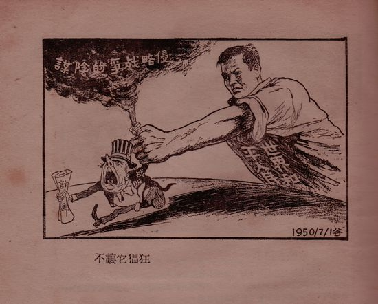
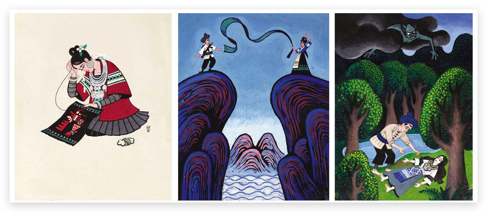

# Movie 2020

[TOC]

## 影视作品赏析

### 爱尔兰人

看不下去。

### 碧血剑

老电影，剧情简单。

### 寻枪

陆川 2002 年的电影，真牛逼

### 大染坊

好剧！

### 新局长到来之前

1956 年的老片子，讽刺喜剧，好玩幽默，清新简单。

饰演牛科长的李景波，演的非常好。

电影背后的故事也令人唏嘘。导演吕班被划为右派与此有关。

上面这幅图丑化人的恶意满满，卑劣异常，作者为米谷。
米谷本人是一个非常优秀的漫画家，生于 1918 年，创作了许多抨击美帝国主义侵略行径的漫画，被称为‘用漫画去战斗的艺术家’，亦有内部讽刺之作。1966 年 wg 中也被下放养猪。
代表作品有连环画《小二黑结婚》、《少年毛泽东》等。

文章的作者许方似乎是一无名之辈，查不到资料，也许是临时的笔名。

### 新中国第一大案

刘青山和张子善贪污大案，两个革命功臣如何被糖衣炮弹腐化。

### 神雕侠侣

回味经典。

### 囧妈

挺好的一部电影。

### 人在囧途

经典。

### 疯狂的石头

宅家，和家人一起看。

### 没有完成的喜剧

韩兰根
殷秀岑

### 只有芸知道

风格平淡隽永

### 追凶者也

张译真是好演员，中国版河正宇。
不过剧中的方言确实是减分项。

### 怦然心动

记不清是第几次看了。

### 烈日灼心

第二次看了。

段奕宏，邓超，郭涛，王砚辉，四大男演员的高光交相辉映。

### 李米的猜想

纯爱。

### 故都春梦

1964 版，剧情非常简单：才子，民女，军阀。

饰演沈凤仙的李丽华，2017 年去世。
饰演范家树的，是关之琳的父亲关山。

### 何以为家

听完了大致梗概，太悲苦，不细看了。

### 人民的民义

看了几集。

### 三国演义

经典重温。

官渡之战，曹操以 7 万军马，大破袁绍 70 万之众，堪称以少胜多经典战役。
获胜的根本，在于曹操知人善任，愿意听取谋士意见，并善于决断，反观袁绍，举棋不定，不听忠言，终领其祸。

战后，搜出不少袁绍处文书，手下人建议曹操严查这些文书，看看是否有曹操处叛贼的书信，曹操却让人将这些文书付诸一炬，因其知当时两军兵力悬殊，若有人有投降之意，也可理解。这自然有装的嫌疑，但至少也收买了那些叛贼的忠心！

媳妇眼尖，看到了摄像师毕福剑的名字！

火烧赤壁后，刘备夺取南郡和荆州，并连下长沙等四郡，遂成三分天下。诺还荆州于孙吴，后又已借荆州为名拒还。孙吴周瑜遂施美人计，孰料赔了夫人又折兵！

刘璋虽暗弱，但最终选择投降以保子民，也算勇武一回。

老将黄忠定军山，刀劈夏侯渊

### 西洋镜

### 雌雄大盗

### 扬子江风云

- [ ] 辉夜姬物语
- [ ] 疯城记
- [ ] 寄生虫
- [ ] 乔乔的异想世界
- [ ] 父母爱情
- [ ] 1917
- [ ] 小井胡同
- [ ] 利剑出鞘
- [ ] 真相捕捉
- [ ] 风中有朵雨做的云
- [ ] 爱、死亡+机器人
- [ ] 中国刑侦第一案
- [ ] 亿万
- [ ] 我们的星球
- [ ] 好莱坞往事
- [ ] 中国 1972
- [ ] 柯达克罗姆胶卷 Kodachrome
- [ ] 切尔诺贝利
- [ ] 沼泽怪物
- [ ] 哈尔的移动城堡
- [ ] 早间新闻
- [ ] 平原上的夏洛克
- [ ] 两个教皇
- [ ] 紫日
- [ ] 红樱桃 (1995)
- [ ] 非常突然
- [ ] 缺席的人
- [ ] 不朽的园丁
- [ ] 火柴人
- [ ] 灯塔
- [ ] 大佛普拉斯
- [ ] 地久天长

* [ ] 悲情城市
* [ ] 南方车站的聚会
* [ ] 婚姻故事
* [ ] 罗小黑战记
* [ ] 误杀
* [ ] 光荣的愤怒
* [ ] 绿皮书
* [ ] 婚姻故事
* [ ] 我们与恶的距离
* [ ] 伦敦生活
* [ ] 好兆头
* [ ] 瓶中信
* [ ] 肤色 Skin
* [ ] 痛苦与荣耀
* [ ] 爱尔兰人
* [ ] 好莱坞往事
* [ ] 小妇人
* [ ] 我叫多麦特
* [ ] 邻里美好的一天
* [ ] 舞女大盗
* [ ] [1994 年香港红磡摇滚演唱会](https://www.bilibili.com/video/av2772845?from=search&seid=17381292959078296004)
