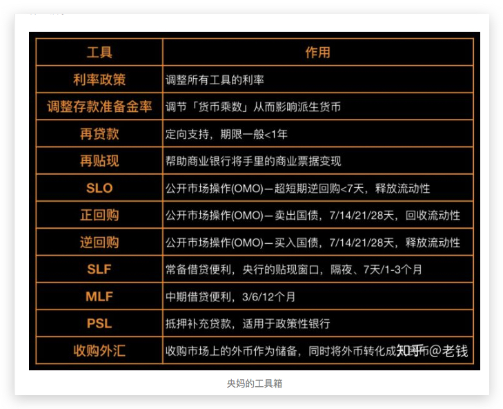

# 投资理财

## 金融知识

利率双轨制
: 政策利率 和 市场利率

市盈率（Price-to-Earning Ratio 简称`PE`）
市盈率代表企业的盈利水平，即在企业业绩没有变化的情况下需要多少年才可以赚回本金，市盈率是投资回报率的倒数，10 倍市盈率即意味着投资 10 年回本，年化收益率 10%。通常来讲，市盈率越低表示企业的估值水平越低，投资风险越小

### 基金定投

基金定投是定期定额投资基金的简称

ETF:

## 生活中的金融知识

1. 一瓶矿泉水为什么标价一块钱，依据是什么？
2.
