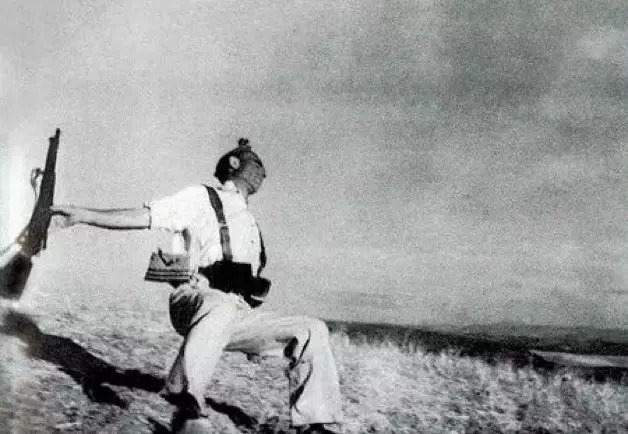

# 摄影 {ignore=true}

[TOC]

> 摄影就是用光的艺术
> 把钱用光的艺术

> 「如果你的照片拍得不够好，那是因为你靠得不够近。」 by 卡帕

## 审美和观察

要自己的照片好看，首先一个人得先从自身的审美和日常生活中观察事物的能力开始培养.

1. 观察事物的外观形态。
2. 观察线条感。
3. 色彩敏感性。

### 主题

### 简洁

## 基础知识

S 快门速度
: 曝光时间

ISO
: 感光度，镜头对光的敏感程度

EV
: 曝光补偿

对焦模式

## 经典构图

所谓构图，就是将画面中的各种图形和色彩元素进行有效的，非常合理化的组合。

对称、中心点、黄金分割点等是最基础的构图。

善于利用框架。

## 手机摄影

### 模式

全景

延时

慢门

有声照片

定时

声控

黑白

HDR
: High-Dynamic Range，用于拍摄对象的最明亮和最暗部分相差较大的时候；一般连拍 3 张，分别是欠曝光、正常曝光和过曝光，然后合成

### 滤镜

### 一些术语

空镜：除了拍摄者本人出现镜头之外的一切，例如：马路，天空，街头等等。

微单：小巧的体积和单反一般的画质

全画幅：

### 工具

佳能 G7X VS. 索尼黑卡

工具的话，先用 IMovie.

final cut pro

### vlog

敢于在公共场合面对镜头，将镜头想象成你的家人和朋友，自然地表达。

### Gallery

    <figure align='center'>
        
        <figcaption>倒下的士兵，罗伯特·卡帕 摄于西班牙内战的战场上</figcaption>
    </figure>

    <figure align='center'>
        
        <figcaption>时代广场的胜利日，阿尔弗雷德·艾森施泰特 摄于宣布终战的纽约</figcaption>
    </figure>

    <figure align='center'>
        
        <figcaption>移民母亲</figcaption>
    </figure>

    <figure align='center'>
        
        <figcaption>中国娃娃</figcaption>
    </figure>

## 后期

裁剪

## 学习材料

- [站酷](https://www.zcool.com.cn/)
